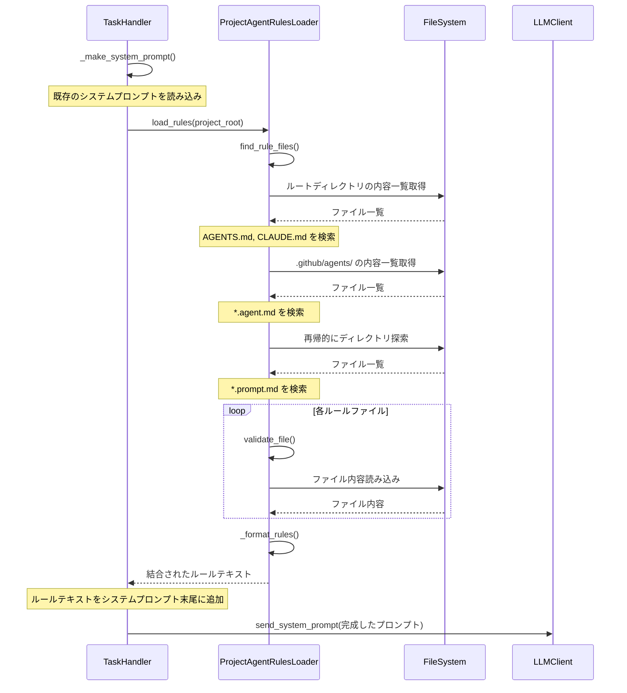

# プロジェクト固有エージェントルール取り込み機能仕様書

## 1. 概要

### 1.1 目的

本仕様書は、プロジェクトディレクトリ内に配置されたLLMエージェント向けのルールファイル（AGENTS.md、CLAUDE.md等）を自動的に検出し、システムプロンプトに取り込む機能を定義します。

### 1.2 背景

多くのAIコーディングエージェント（GitHub Copilot、Claude Code等）では、プロジェクト固有のルールやガイドラインをマークダウンファイルで指定できます。本機能により、coding_agentも同様にプロジェクト固有のルールを認識し、LLMの振る舞いを制御できるようになります。

### 1.3 スコープ

本仕様は以下をカバーします：

- 対象となるルールファイルの種類と配置場所
- ファイルの検索処理の詳細
- マークダウンファイル判定処理
- システムプロンプトへの取り込み方法
- エラーハンドリング
- 設定オプション
- テスト戦略

### 1.4 前提条件

- プロジェクトディレクトリは、タスク処理時にMCPツール経由でアクセス可能な状態であること
- ルールファイルはマークダウン形式（.md拡張子）で記述されていること
- LLMはテキストベースのシステムプロンプトを受け入れ可能であること

## 2. 対象ファイルの定義

### 2.1 対象ファイルの種類と優先順位

以下のファイルを優先順位順に検索し、システムプロンプトに追加します。

| 優先順位 | ファイルパス | 説明 |
|---------|-------------|------|
| 1 | `AGENTS.md` | プロジェクトルート直下のエージェント向け汎用ルールファイル |
| 2 | `CLAUDE.md` | プロジェクトルート直下のClaude特化ルールファイル |

### 2.2 ファイルパターンの詳細

#### 2.2.1 AGENTS.md

- **配置場所**: プロジェクトディレクトリ直下（ルートディレクトリ）
- **ファイル名**: 大文字・小文字を区別せず検索（`AGENTS.md`、`agents.md`、`Agents.md`等）
- **用途**: エージェント全般に適用されるルールを記述
- **例**: コーディングスタイル、コミットメッセージ規約、禁止操作等

#### 2.2.2 CLAUDE.md

- **配置場所**: プロジェクトディレクトリ直下（ルートディレクトリ）
- **ファイル名**: 大文字・小文字を区別せず検索（`CLAUDE.md`、`claude.md`、`Claude.md`等）
- **用途**: Claude（Anthropic社のLLM）特化のルールを記述
- **例**: Claude固有の機能に関する指示、応答形式の指定等

## 3. ファイル検索処理の詳細

### 3.1 検索処理フロー

```
1. プロジェクトディレクトリのパスを取得
   ↓
2. 対象ファイルの存在確認（優先順位順）
   ↓
   2.1. AGENTS.mdの検索（大文字小文字を区別しない）
   2.2. CLAUDE.mdの検索（大文字小文字を区別しない）
   ↓
3. 検出されたファイルの妥当性検証
   ↓
   3.1. ファイルサイズのチェック
   3.2. マークダウン形式の判定
   3.3. 読み取り可能性の確認
   ↓
4. 有効なファイルのリストを作成
   ↓
5. ファイル内容の読み込みと結合
   ↓
6. システムプロンプトへの追加
```

### 3.2 プロジェクトディレクトリの特定

#### 3.2.1 プロジェクトディレクトリの決定方法

タスク処理時に、以下の情報からプロジェクトディレクトリを特定します：

**GitHub/GitLabタスクの場合**:
- リポジトリ情報（owner、repo）から特定
- MCPツールで操作可能なディレクトリをプロジェクトルートとする

### 3.3 ファイル検索の詳細処理

#### 3.3.1 ルートディレクトリ直下のファイル検索（AGENTS.md、CLAUDE.md）

**処理内容**:
1. プロジェクトルートディレクトリの内容一覧を取得
2. ファイル名を小文字に変換して比較
3. `agents.md`または`claude.md`と一致するファイルを検出
4. 最初に見つかったファイルを使用（複数存在する場合は大文字小文字の違いによる重複を除外）

**擬似的な処理フロー**:
```
ルートディレクトリの内容一覧を取得
各ファイルについて:
    ファイル名を小文字に変換
    "agents.md"と一致する場合:
        AGENTS.mdとしてリストに追加
    "claude.md"と一致する場合:
        CLAUDE.mdとしてリストに追加
```

### 3.4 検索結果の最大数制限

パフォーマンスとセキュリティのため、検索結果に制限を設けます：

| 項目 | 制限値 | 説明 |
|------|--------|------|
| 単一ファイル最大サイズ | 100KB | 各ファイルのサイズ上限 |
| 合計コンテンツ最大サイズ | 500KB | すべてのルールファイルの合計サイズ上限 |
| 最大検索深度 | 10 | ディレクトリ再帰検索の深さ上限 |

制限を超えた場合の処理：
1. ファイル数が上限を超えた場合：パス順で最初のN個のみを使用
2. ファイルサイズが上限を超えた場合：該当ファイルをスキップしてログに記録
3. 合計サイズが上限を超えた場合：上限に達した時点で追加を停止

## 4. マークダウン形式の判定処理

### 4.1 マークダウンファイル判定の基準

ファイルがマークダウン形式であるかを判定する条件：

1. **拡張子による判定**（必須）:
   - ファイル拡張子が`.md`であること
   - 大文字小文字を区別しない（`.MD`、`.Md`も可）

2. **内容による判定**:
   - ファイルがテキストファイルであること（バイナリでないこと）
   - UTF-8またはASCIIでエンコードされていること

### 4.2 マークダウン形式検証の詳細処理

**処理内容**:
1. ファイル拡張子の確認
2. ファイルのエンコーディング検出
3. バイナリファイルでないことの確認
4. 読み取りテスト

**擬似的な処理フロー**:
```
ファイル拡張子を取得
拡張子を小文字に変換
拡張子が".md"でない場合:
    無効として判定、falseを返す

ファイルの先頭1024バイトを読み込み
読み込んだバイトにNULLバイト(0x00)が含まれる場合:
    バイナリファイルと判定、falseを返す

ファイル全体をUTF-8でデコードを試行
デコードに失敗した場合:
    無効なエンコーディングと判定、falseを返す

ファイル内容が空でないことを確認
空の場合:
    空ファイルと判定、falseを返す（または警告付きでtrueを返す）

すべての検証に合格した場合:
    trueを返す
```

## 5. システムプロンプトへの取り込み処理

### 5.1 取り込み処理フロー

```
1. 検索処理で検出されたファイルリストを受け取る
   ↓
2. 各ファイルの内容を読み込む
   ↓
3. ファイル内容を結合してルールテキストを作成
   ↓
4. ルールテキストをフォーマット
   ↓
5. システムプロンプトの末尾に追加
   ↓
6. 結合後のシステムプロンプトをLLMに送信
```

### 5.2 ファイル内容の読み込み処理

**処理内容**:
1. 各ファイルをUTF-8エンコーディングで読み込み
2. 読み込みエラーが発生した場合はスキップしてログに記録
3. ファイル内容の先頭と末尾の空白を除去
4. 空のファイルはスキップ

**擬似的な処理フロー**:
```
読み込み結果リストを初期化

各ファイルパスについて:
    ファイルをUTF-8で読み込みを試行
    読み込みに成功した場合:
        内容の先頭と末尾の空白を除去
        内容が空でない場合:
            ファイルパスと内容のペアをリストに追加
    読み込みに失敗した場合:
        エラーをログに記録
        次のファイルに進む

読み込み結果リストを返す
```

### 5.3 ファイル内容の結合フォーマット

複数のルールファイルを以下のフォーマットで結合します：

```markdown
---

## Project-Specific Agent Rules

The following rules are defined in the project and should be followed:

### From: AGENTS.md

[AGENTS.mdの内容]

### From: CLAUDE.md

[CLAUDE.mdの内容]

---
```

**フォーマット規則**:
1. セクション区切りとして`---`（水平線）を使用
2. 全体の見出しとして「Project-Specific Agent Rules」を付与
3. 各ファイルの内容は「From: [ファイルパス]」の見出しの下に配置
4. ファイルの内容はそのまま（変換なしで）挿入
5. ファイル間は空行で区切る

### 5.4 システムプロンプトへの追加位置

ルールテキストは、既存のシステムプロンプトの**末尾**に追加します：

```
[既存のシステムプロンプト]

[MCPツールの説明]

---

## Project-Specific Agent Rules

[プロジェクト固有ルール]

---
```

**追加位置の理由**:
1. LLMは後から提示された情報をより重視する傾向がある
2. プロジェクト固有ルールは一般的なルールより優先されるべき
3. 既存のシステムプロンプト構造を破壊しない

## 6. 実装アーキテクチャ

### 6.1 クラス設計

#### 6.1.1 ProjectAgentRulesLoader クラス

**ファイル**: `handlers/project_agent_rules_loader.py`（新規作成）

**責務**:
- プロジェクトディレクトリからルールファイルを検索
- ファイルの妥当性検証
- ファイル内容の読み込みと結合

**主要属性**:
```
- project_root: プロジェクトルートディレクトリのパス
- config: 設定情報
- logger: ロガーインスタンス
- max_file_size: 単一ファイルの最大サイズ
- max_total_size: 合計コンテンツの最大サイズ
- max_agent_files: .agent.mdファイルの最大数
- max_prompt_files: .prompt.mdファイルの最大数
```

**主要メソッド**:

**`__init__(project_root, config)`**
- ローダーを初期化
- 設定から制限値を読み込み

**`find_rule_files() -> list[dict]`**
- すべての種類のルールファイルを検索
- 優先順位順にファイルリストを作成
- 各ファイルの情報（パス、種類、サイズ）を辞書で返す

**`validate_file(filepath) -> bool`**
- ファイルがルールファイルとして有効か検証
- マークダウン形式の判定を実行
- サイズ制限のチェックを実行

**`load_rules() -> str`**
- ルールファイルを検索して読み込み
- 内容を結合フォーマットで整形
- 結合されたルールテキストを返す

**`_find_root_files() -> list[str]`**
- AGENTS.mdとCLAUDE.mdを検索
- 検出されたファイルパスのリストを返す

**`_find_agent_files() -> list[str]`**
- .github/agents/*.agent.mdを検索
- 検出されたファイルパスのリストを返す

**`_find_prompt_files() -> list[str]`**
- **/*.prompt.mdを再帰的に検索
- 検出されたファイルパスのリストを返す

**`_is_markdown_file(filepath) -> bool`**
- ファイルがマークダウン形式か判定
- 判定結果をブール値で返す

**`_read_file_content(filepath) -> str`**
- ファイル内容をUTF-8で読み込み
- 読み込んだ内容を文字列で返す

**`_format_rules(files_content) -> str`**
- 複数ファイルの内容を結合フォーマットで整形
- 整形されたルールテキストを返す

### 6.2 TaskHandlerへの統合

**ファイル**: `handlers/task_handler.py`（既存ファイルを修正）

**変更箇所**:

1. **_make_system_prompt メソッドの修正**:
   - ProjectAgentRulesLoaderを使用してルールを読み込み
   - ルールテキストをシステムプロンプトの末尾に追加

**修正後の処理フロー**:
```
1. 既存のシステムプロンプトファイルを読み込み
   （system_prompt.txt または system_prompt_function_call.txt）
   ↓
2. MCPクライアントからシステムプロンプトを取得して結合
   ↓
3. プレースホルダー {mcp_prompt} を置換
   ↓
4. ProjectAgentRulesLoaderでプロジェクトルールを読み込み（新規追加）
   ↓
5. プロジェクトルールをシステムプロンプトの末尾に追加（新規追加）
   ↓
6. 完成したシステムプロンプトを返す
```

### 6.3 処理シーケンス図

**注意**: 以下のMermaid図を表示するには、Mermaidをサポートするマークダウンビューアー（GitHub、GitLab、VS Code等）を使用してください。



## 7. 設定オプション

### 7.1 config.yaml への追加設定

```yaml
# プロジェクト固有エージェントルールの設定
project_agent_rules:
  # 機能の有効/無効（デフォルト: true）
  enabled: true
  
  # 検索対象の設定（すべてデフォルト: true）
  search:
    # ルートファイル検索の有効/無効（AGENTS.md, CLAUDE.md）（デフォルト: true）
    root_files: true
    
    # .github/agents/*.agent.md 検索の有効/無効（デフォルト: true）
    agent_files: true
    
    # **/*.prompt.md 検索の有効/無効（デフォルト: true）
    prompt_files: true
    
    # 大文字小文字を区別しない検索（デフォルト: true）
    case_insensitive: true
  
  # 制限設定（すべてデフォルト値あり）
  limits:
    # 単一ファイルの最大サイズ（バイト）（デフォルト: 102400）
    max_file_size: 102400  # 100KB
    
    # 合計コンテンツの最大サイズ（バイト）（デフォルト: 512000）
    max_total_size: 512000  # 500KB
    
    # .agent.md ファイルの最大数（デフォルト: 10）
    max_agent_files: 10
    
    # .prompt.md ファイルの最大数（デフォルト: 50）
    max_prompt_files: 50
    
    # ディレクトリ検索の最大深度（デフォルト: 10）
    max_depth: 10
```

### 7.2 環境変数による設定上書き

以下の環境変数で設定を上書き可能：

| 環境変数 | 説明 | 例 |
|----------|------|-----|
| `PROJECT_AGENT_RULES_ENABLED` | 機能の有効/無効 | `true` / `false` |
| `PROJECT_AGENT_RULES_MAX_FILE_SIZE` | 単一ファイルの最大サイズ（バイト） | `102400` |
| `PROJECT_AGENT_RULES_MAX_TOTAL_SIZE` | 合計最大サイズ（バイト） | `512000` |

## 8. エラーハンドリング

### 8.1 エラーの種類と対処方法

#### 8.1.1 ファイル検索エラー

| エラー状況 | 対処方法 | ログレベル |
|-----------|----------|-----------|
| プロジェクトディレクトリが存在しない | ルール読み込みをスキップ、警告ログを記録 | WARNING |
| ディレクトリへのアクセス権限がない | 該当ディレクトリをスキップ、警告ログを記録 | WARNING |
| 検索中に予期しないエラー発生 | ルール読み込みをスキップ、エラーログを記録 | ERROR |

#### 8.1.2 ファイル読み込みエラー

| エラー状況 | 対処方法 | ログレベル |
|-----------|----------|-----------|
| ファイルが存在しない | 該当ファイルをスキップ | DEBUG |
| ファイルへのアクセス権限がない | 該当ファイルをスキップ、警告ログを記録 | WARNING |
| エンコーディングエラー（UTF-8以外） | 該当ファイルをスキップ、警告ログを記録 | WARNING |
| ファイルサイズが上限超過 | 該当ファイルをスキップ、情報ログを記録 | INFO |

#### 8.1.3 処理エラー

| エラー状況 | 対処方法 | ログレベル |
|-----------|----------|-----------|
| 合計サイズが上限超過 | 上限に達した時点で追加を停止、情報ログを記録 | INFO |
| メモリ不足 | ルール読み込みを中断、エラーログを記録 | ERROR |

### 8.2 エラー時の動作原則

1. **ルール読み込みの失敗はタスク処理を中断しない**
   - ルールファイルが見つからない、または読み込めない場合でも、タスク処理は継続
   - エラーをログに記録し、ルールなしでシステムプロンプトを使用

2. **部分的な成功を許容**
   - 一部のファイルが読み込めない場合でも、読み込めたファイルのルールは適用
   - 失敗したファイルの情報をログに記録

3. **セキュリティ優先**
   - 制限を超えるファイルは処理しない
   - 不正な形式のファイルは無視

## 9. テスト戦略

### 9.1 ユニットテスト

#### 9.1.1 ProjectAgentRulesLoader のテスト

**テストファイル**: `tests/unit/test_project_agent_rules_loader.py`

**テストケース**:

1. **ファイル検索のテスト**
   - AGENTS.mdが存在する場合に正しく検出される
   - CLAUDE.mdが存在する場合に正しく検出される
   - 大文字小文字の違いを正しく処理する

2. **マークダウン判定のテスト**
   - .md拡張子のファイルがtrueを返す
   - .txt拡張子のファイルがfalseを返す
   - バイナリファイルがfalseを返す
   - 空ファイルの処理が正しい

3. **内容結合のテスト**
   - 単一ファイルの内容が正しくフォーマットされる
   - 複数ファイルが優先順位順に結合される
   - 空白の除去が正しく行われる

4. **制限のテスト**
   - ファイルサイズ上限のチェックが機能する
   - ファイル数上限のチェックが機能する
   - 合計サイズ上限のチェックが機能する

#### 9.1.2 TaskHandler統合のテスト

**テストファイル**: `tests/unit/test_task_handler_rules.py`

**テストケース**:

1. **システムプロンプト生成のテスト**
   - ルールファイルがない場合、既存のプロンプトのみ返される
   - ルールファイルがある場合、末尾に追加される
   - MCPプロンプトとルールが正しい順序で結合される

2. **機能の有効/無効テスト**
   - enabled=falseの場合、ルール読み込みがスキップされる
   - enabled=trueの場合、ルール読み込みが実行される

### 9.2 インテグレーションテスト

**テストファイル**: `tests/integration/test_project_rules_integration.py`

**テストシナリオ**:

1. **実際のプロジェクト構造でのテスト**
   - テスト用のプロジェクトディレクトリを作成
   - 各種ルールファイルを配置
   - ルールが正しく読み込まれることを確認
   - システムプロンプトに正しく反映されることを確認

2. **エラーケースのテスト**
   - 読み取り権限のないファイルの処理
   - 不正なエンコーディングのファイルの処理
   - サイズ超過ファイルの処理

### 9.3 エンドツーエンドテスト

**テストシナリオ**:

1. **GitHub Issue処理でのルール適用**
   - ルールファイルを含むリポジトリでIssueを作成
   - coding_agentがルールに従った処理を行うことを確認
   - ルール違反の動作が抑制されることを確認

## 10. まとめ

### 10.1 主要な設計ポイント

1. **柔軟なファイル検索**: 複数の配置パターンに対応し、プロジェクトの構造に合わせてルールファイルを配置可能

2. **優先順位付きの結合**: ファイルの種類に応じた優先順位でルールを結合し、重要なルールが優先される

3. **安全性の確保**: サイズ制限、エンコーディング検証により、悪意のあるファイルや巨大ファイルから保護

4. **後方互換性**: 既存のシステムプロンプト構造を変更せず、末尾に追加する形式を採用

5. **設定の柔軟性**: 設定ファイルと環境変数による細かな制御が可能

### 10.2 期待される効果

1. **プロジェクト固有のルール適用**: 各プロジェクトの規約やガイドラインをLLMが認識し、適切な処理を実行

2. **一貫性の向上**: チーム全体で共有されるルールファイルにより、コーディングスタイルやレビュー基準が統一

3. **カスタマイズ性**: プロジェクトやディレクトリごとに異なるルールを適用可能

4. **他ツールとの互換性**: GitHub Copilot、Claude Code等の他のAIツールと同様のルールファイル形式をサポート

### 10.3 今後の拡張可能性

1. **ルールの継承**: 親ディレクトリのルールを子ディレクトリが継承する機能

2. **条件付きルール**: ファイル種類やタスク種類に応じたルールの条件付き適用

3. **ルールのバージョン管理**: ルールファイルのバージョンによる動作の切り替え

4. **WebUIでのルール編集**: 設定画面からのルールファイル編集機能

---

**文書バージョン:** 1.0  
**最終更新日:** 2025-11-25  
**ステータス:** 詳細設計完了
