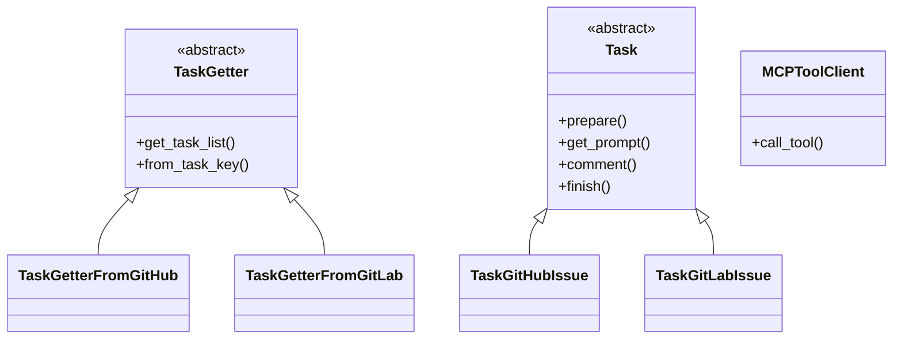

# Coding Agent

GitHub Copilot のようなコーディングエージェントを作成するプロジェクト。GitHub や GitLab の Issue、Pull Request、Merge Request を自動処理し、LLM を使って様々なタスクを実行します。

## 概要

このプロジェクトは、以下の特徴を持つ汎用的な LLM エージェントです：

- **マルチプラットフォーム対応**: GitHub と GitLab の両方をサポート
- **MCP (Model Context Protocol) 統合**: 外部サービスとの連携に MCP サーバーを使用
- **複数 LLM プロバイダ対応**: OpenAI、LM Studio、Ollama をサポート
- **タスクベースワークフロー**: ラベル付きの Issue/PR/MR をタスクとして処理
- **Docker 対応**: コンテナでの実行をサポート
- **キューベース処理**: RabbitMQ を使用したタスクキューイング

## 機能

### コア機能
- ✅ GitHub/GitLab の Issue、PR、MR の自動処理
- ✅ 複数の LLM プロバイダ（OpenAI、LM Studio、Ollama）
- ✅ MCP サーバーを通じた外部ツール連携
- ✅ ラベルベースのタスク管理
- ✅ Docker コンテナでの実行
- ✅ RabbitMQ を使用したキューイング
- ✅ 設定可能なロギングシステム
- 📋 **プランニングプロセス**（仕様策定完了）
  - 目標の理解とタスク分解
  - Chain-of-Thought による思考プロセス
  - 実行結果の監視とリフレクション
  - エラー時の計画修正と自動回復

### プランニングプロセス（新機能）🆕

LLMエージェントが複雑なタスクを効果的に処理するための包括的なプランニング機能の仕様を策定しました。

#### プランニングの5つのフェーズ

1. **目標の理解 (Goal Understanding)**
   - ユーザーの指示や達成すべき目標を正確に理解
   - 成功基準と制約条件の特定

2. **タスクの分解 (Task Decomposition)**
   - Chain-of-Thought (CoT) を使用した段階的思考
   - 複雑な目標を実行可能な小さなサブタスクに分割

3. **行動系列の生成 (Action Sequence Generation)**
   - 実行順序の最適化
   - 使用するツールの選択と計画

4. **実行 (Execution)**
   - 計画に基づいた順次実行
   - 各アクションの結果記録

5. **監視と修正 (Monitoring and Reflection)**
   - 実行結果の評価とフィードバック
   - エラー時の計画修正と再試行
   - 人間のフィードバック統合

詳細は[プランニングプロセス仕様書](PLANNING_SPECIFICATION.md)を参照してください。

### 対応プラットフォーム
- **GitHub**: Issue、Pull Request の処理
- **GitLab**: Issue、Merge Request の処理

### 対応 LLM プロバイダ
- **OpenAI**: GPT-4o など
- **LM Studio**: ローカル LLM サーバー
- **Ollama**: ローカル LLM 実行環境

## 必要要件

### システム要件
- **OS**: macOS、Linux（Docker 使用時は Windows も対応）
- **Python**: 3.13+
- **Node.js**: 18+ （MCP サーバー用）
- **Git**: バージョン管理
- **Docker**: コンテナ実行（オプション）

### 依存関係
- Python パッケージ（`condaenv.yaml` を参照）
- Node.js パッケージ（`package.json` を参照）
- MCP サーバー各種

## インストール

### 1. リポジトリのクローン
```bash
git clone --recursive https://github.com/notfolder/coding_agent.git
cd coding_agent

# または、既にクローン済みの場合
git submodule update --init --recursive
```

### 2. Conda 環境の作成
```bash
conda env create -f condaenv.yaml
conda activate coding-agent
```

### 3. Node.js 依存関係のインストール
```bash
npm install
```

### 4. MCP サーバーのセットアップ

#### ローカル開発環境の場合
GitHub MCP サーバーをビルド：
```bash
cd github-mcp-server/cmd/github-mcp-server
go build -o ../../../github-mcp-server main.go
cd ../../..
```

その後、`config.yaml` の GitHub MCP サーバーのコマンドパスを更新：
```yaml
mcp_servers:
  - mcp_server_name: "github"
    command:
      - "./github-mcp-server"  # ローカルでビルドした実行ファイル
      - "stdio"
```

#### Docker 環境の場合
Docker ビルド時に自動的に `/bin/github-mcp-server` にビルドされるため、追加設定不要。

## 設定

### .env ファイルの作成
メインの設定は環境変数で行います。`.env` ファイルを作成して設定してください：

```bash
# 必須設定
TASK_SOURCE=github                                    # タスクソース: "github" または "gitlab"
GITHUB_PERSONAL_ACCESS_TOKEN=your_github_token_here  # GitHub Personal Access Token
GITLAB_PERSONAL_ACCESS_TOKEN=your_gitlab_token_here  # GitLab Personal Access Token (GitLab使用時)

# LLM プロバイダ設定
LLM_PROVIDER=openai                     # LLMプロバイダ: "openai", "lmstudio", "ollama"
FUNCTION_CALLING=true                   # 関数呼び出し機能の有効/無効

# OpenAI 設定
OPENAI_API_KEY=your_openai_api_key     # OpenAI API キー
OPENAI_BASE_URL=https://api.openai.com/v1  # OpenAI API ベースURL
OPENAI_MODEL=gpt-4o                    # 使用するモデル

# LM Studio 設定 (LM Studio使用時)
LMSTUDIO_BASE_URL=localhost:1234       # LM Studio ベースURL
LMSTUDIO_MODEL=qwen3-30b-a3b-mlx      # 使用するモデル

# Ollama 設定 (Ollama使用時)
OLLAMA_ENDPOINT=http://localhost:11434 # Ollama エンドポイント
OLLAMA_MODEL=qwen3-30b-a3b-mlx        # 使用するモデル

# GitHub/GitLab 設定
GITHUB_BOT_NAME=your_bot_name          # GitHubボット名
GITLAB_BOT_NAME=your_bot_name          # GitLabボット名
GITLAB_API_URL=https://gitlab.com/api/v4  # GitLab API URL

# MCP サーバー設定
GITHUB_MCP_COMMAND="./github-mcp-server.cmd stdio"  # GitHub MCP サーバーコマンド

# RabbitMQ 設定 (オプション)
RABBITMQ_HOST=localhost                # RabbitMQ ホスト
RABBITMQ_PORT=5672                     # RabbitMQ ポート
RABBITMQ_USER=guest                    # RabbitMQ ユーザー
RABBITMQ_PASSWORD=guest                # RabbitMQ パスワード
RABBITMQ_QUEUE=coding_agent_tasks      # RabbitMQ キュー名

# ログ設定
LOGS=./logs/agent.log                  # ログファイルパス
DEBUG=false                            # デバッグモード（true/false）
```

### 設定可能な環境変数一覧

#### 必須環境変数
- `TASK_SOURCE`: タスクソース（"github" または "gitlab"）
- `GITHUB_PERSONAL_ACCESS_TOKEN`: GitHub Personal Access Token
- `GITLAB_PERSONAL_ACCESS_TOKEN`: GitLab Personal Access Token（GitLab使用時）

#### LLM設定
- `LLM_PROVIDER`: LLMプロバイダ（"openai", "lmstudio", "ollama"）
- `FUNCTION_CALLING`: 関数呼び出し機能（true/false、デフォルト: true）

#### OpenAI設定
- `OPENAI_API_KEY`: OpenAI APIキー
- `OPENAI_BASE_URL`: OpenAI APIベースURL（デフォルト: https://api.openai.com/v1）
- `OPENAI_MODEL`: 使用するOpenAIモデル（デフォルト: gpt-4o）

#### LM Studio設定
- `LMSTUDIO_BASE_URL`: LM StudioベースURL（デフォルト: localhost:1234）
- `LMSTUDIO_MODEL`: 使用するLM Studioモデル

#### Ollama設定
- `OLLAMA_ENDPOINT`: Ollamaエンドポイント（デフォルト: http://localhost:11434）
- `OLLAMA_MODEL`: 使用するOllamaモデル

#### プラットフォーム設定
- `GITHUB_BOT_NAME`: GitHubボット名
- `GITLAB_BOT_NAME`: GitLabボット名  
- `GITLAB_API_URL`: GitLab APIURL（デフォルト: https://gitlab.com/api/v4）

#### MCP設定
- `GITHUB_MCP_COMMAND`: GitHub MCPサーバーコマンド

#### RabbitMQ設定（オプション）
- `RABBITMQ_HOST`: RabbitMQホスト
- `RABBITMQ_PORT`: RabbitMQポート
- `RABBITMQ_USER`: RabbitMQユーザー
- `RABBITMQ_PASSWORD`: RabbitMQパスワード
- `RABBITMQ_QUEUE`: RabbitMQキュー名

#### ログ設定
- `LOGS`: ログファイルパス（デフォルト: logs/agent.log）
- `DEBUG`: デバッグモード（true/false、デフォルト: false）

### プラットフォーム別設定ファイル
プロジェクトには複数の設定ファイルが用意されています：

- **config.yaml**: デフォルト設定（Docker環境向け）
- **config_github.yaml**: GitHub専用設定
- **config_gitlab.yaml**: GitLab専用設定

#### 設定ファイルの使用例
```bash
# GitHub設定で実行
python main.py --config config_github.yaml

# GitLab設定で実行  
python main.py --config config_gitlab.yaml
```

## 使用方法

### 基本的な実行
```bash
# Conda 環境で実行
conda activate coding-agent
python main.py

# または run.sh を使用
./run.sh
```

### Docker での実行
```bash
# Docker コンテナでビルド・実行
docker-compose up

# または Docker run スクリプトを使用
./run-docker.sh
```

### タスクの作成
1. GitHub/GitLab で Issue または PR/MR を作成
2. `coding agent` ラベルを付与
3. エージェントが自動的に検知して処理開始

### 処理フロー
1. **タスク検知**: ラベル付きの Issue/PR/MR を検索
2. **ラベル更新**: `coding agent` → `coding agent processing`
3. **LLM 処理**: システムプロンプトに基づいて自動処理
4. **MCP ツール実行**: 必要に応じて外部ツールを呼び出し
5. **完了通知**: 処理完了時にラベルを `coding agent done` に更新

## アーキテクチャ

### クラス構造


### 主要コンポーネント
- **main.py**: エントリーポイント、全体のオーケストレーション
- **handlers/**: タスク処理のコアロジック
- **clients/**: LLM および MCP クライアント
- **config.yaml**: 設定ファイル
- **system_prompt.txt**: LLM 用のシステムプロンプト

## 開発

### 開発環境のセットアップ
1. 上記のインストール手順を実行
2. 開発用設定ファイルを作成
3. ログレベルを DEBUG に設定

### ログの確認
```bash
# ログファイルの確認
tail -f logs/agent.log

# Debug モードでの実行
DEBUG=true python main.py
```

## ディレクトリ構造

```
.
├── main.py                 # メインエントリーポイント
├── config.yaml            # 設定ファイル
├── system_prompt.txt      # システムプロンプト
├── condaenv.yaml          # Conda 環境定義
├── docker-compose.yml     # Docker 構成
├── clients/               # LLM・MCP クライアント
│   ├── lm_client.py
│   ├── mcp_tool_client.py
│   ├── openai_client.py
│   ├── lmstudio_client.py
│   └── ollama_client.py
├── handlers/              # タスク処理ハンドラー
│   ├── task_getter.py
│   ├── task_handler.py
│   ├── task_getter_github.py
│   └── task_getter_gitlab.py
├── github-mcp-server/     # GitHub MCP サーバー
└── docs/                  # ドキュメント
    ├── spec.md
    ├── class_spec.md
    └── *.md
```

## トラブルシューティング

### よくある問題

**1. MCP サーバーが起動しない**
```bash
# GitHub MCP サーバーの再ビルド
cd github-mcp-server/cmd/github-mcp-server
go build -o ../../../github-mcp-server main.go
cd ../../..

# 権限の確認
chmod +x github-mcp-server

# Go のインストール確認
go version
```

**2. 認証エラー**
```bash
# GitHub トークンの確認
echo $GITHUB_TOKEN

# GitLab トークンの確認
echo $GITLAB_TOKEN

# 必要な権限
# GitHub: repo, issues, pull_requests
# GitLab: api, read_api, read_repository, write_repository
```

**3. LLM 接続エラー**
```bash
# OpenAI API キーの確認
echo $OPENAI_API_KEY

# LM Studio の起動確認（LM Studio 使用時）
curl http://localhost:1234/v1/models

# Ollama の起動確認（Ollama 使用時）
curl http://localhost:11434/api/version
```

**4. Python 依存関係エラー**
```bash
# Conda 環境の再作成
conda env remove -n coding-agent
conda env create -f condaenv.yaml
conda activate coding-agent

# 個別パッケージの確認
pip list | grep mcp
```

**5. Node.js MCP サーバーエラー**
```bash
# Node.js パッケージの再インストール
npm install

# GitLab MCP サーバーの確認
npx @zereight/mcp-gitlab --version

# Google Search MCP サーバーの確認
npx @adenot/mcp-google-search --version
```

**6. Docker 関連エラー**
```bash
# Docker コンテナのログ確認
docker-compose logs

# RabbitMQ の状態確認
docker-compose exec rabbitmq rabbitmqctl status

# コンテナの再起動
docker-compose down && docker-compose up --build
```

**7. ラベル設定エラー**
GitHub/GitLab リポジトリに以下のラベルが存在することを確認：
- `coding agent` (初期ラベル)
- `coding agent processing` (処理中ラベル)  
- `coding agent done` (完了ラベル)

**8. ログの確認**
```bash
# ログファイルの確認
tail -f logs/agent.log

# Debug モードでの実行
DEBUG=true python main.py

# 特定コンポーネントのログ
grep "MCP" logs/agent.log
grep "LLM" logs/agent.log
```

## コントリビューション

1. このリポジトリをフォーク
2. 機能ブランチを作成 (`git checkout -b feature/amazing-feature`)
3. 変更をコミット (`git commit -m 'Add amazing feature'`)
4. ブランチにプッシュ (`git push origin feature/amazing-feature`)
5. Pull Request を作成

## ライセンス

このプロジェクトは [ライセンス](LICENSE) の下で公開されています。

## 関連ドキュメント

- [仕様書](spec.md) - 詳細な仕様
- [クラス設計](class_spec.md) - アーキテクチャ詳細
- **[プランニングプロセス仕様書](PLANNING_SPECIFICATION.md) - LLMエージェントのプランニング機能仕様** 🆕
- [GitHub MCP サーバー](github-mcp-server.md) - GitHub 連携
- [GitLab MCP サーバー](gitlab-mcp-server.md) - GitLab 連携
- [OpenAI 設定](openai.md) - OpenAI 設定詳細
- [LM Studio 設定](lmstudio.md) - LM Studio 設定詳細
- [Ollama 設定](ollama.md) - Ollama 設定詳細

## サポート

問題や質問がある場合は、[GitHub Issues](https://github.com/notfolder/coding_agent/issues) で報告してください。