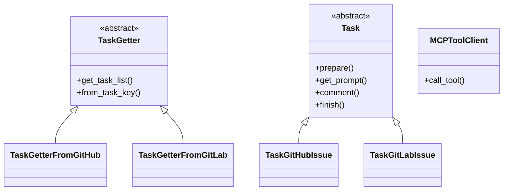

# Coding Agent

GitHub Copilot のようなコーディングエージェントを作成するプロジェクト。GitHub や GitLab の Issue、Pull Request、Merge Request を自動処理し、LLM を使って様々なタスクを実行します。

## 概要

このプロジェクトは、以下の特徴を持つ汎用的な LLM エージェントです：

- **マルチプラットフォーム対応**: GitHub と GitLab の両方をサポート
- **MCP (Model Context Protocol) 統合**: 外部サービスとの連携に MCP サーバーを使用
- **複数 LLM プロバイダ対応**: OpenAI、LM Studio、Ollama をサポート
- **タスクベースワークフロー**: ラベル付きの Issue/PR/MR をタスクとして処理
- **Docker 対応**: コンテナでの実行をサポート
- **キューベース処理**: RabbitMQ を使用したタスクキューイング
- **コンテキスト管理**: 会話履歴の永続化と自動圧縮
- **一時停止・再開機能**: タスク処理の一時停止と状態保存からの再開
- **計画実行モード**: 構造化されたタスク処理のためのPlanning機能
- **継続動作モード**: Docker Composeによる継続的なタスク処理
- **新規コメント検知**: 処理中のユーザーコメントをリアルタイムに検知

## 機能

### コア機能
- ✅ GitHub/GitLab の Issue、PR、MR の自動処理
- ✅ 複数の LLM プロバイダ（OpenAI、LM Studio、Ollama）
- ✅ MCP サーバーを通じた外部ツール連携
- ✅ ラベルベースのタスク管理
- ✅ Docker コンテナでの実行
- ✅ RabbitMQ を使用したキューイング
- ✅ 設定可能なロギングシステム
- ✅ コンテキストファイルによる会話履歴の永続化
- ✅ 自動コンテキスト圧縮（トークン数制御）
- ✅ タスクの一時停止と再開
- ✅ 処理中の新規コメント検知
- ✅ 計画実行モード（Planning）
- ✅ アサイン解除によるタスク停止
- ✅ プロジェクト固有のエージェントルール

### 対応プラットフォーム
- **GitHub**: Issue、Pull Request の処理
- **GitLab**: Issue、Merge Request の処理

### 対応 LLM プロバイダ
- **OpenAI**: GPT-4o など
- **LM Studio**: ローカル LLM サーバー
- **Ollama**: ローカル LLM 実行環境

## 必要要件

### システム要件
- **OS**: macOS、Linux（Docker 使用時は Windows も対応）
- **Python**: 3.13+
- **Node.js**: 18+ （MCP サーバー用）
- **Git**: バージョン管理
- **Docker**: コンテナ実行（オプション）

### 依存関係
- Python パッケージ（`condaenv.yaml` を参照）
- Node.js パッケージ（`package.json` を参照）
- MCP サーバー各種

## インストール

### 1. リポジトリのクローン
```bash
git clone --recursive https://github.com/notfolder/coding_agent.git
cd coding_agent

# または、既にクローン済みの場合
git submodule update --init --recursive
```

### 2. Conda 環境の作成
```bash
conda env create -f condaenv.yaml
conda activate coding-agent
```

### 3. Node.js 依存関係のインストール
```bash
npm install
```

### 4. MCP サーバーのセットアップ

#### ローカル開発環境の場合
GitHub MCP サーバーをビルド：
```bash
cd github-mcp-server/cmd/github-mcp-server
go build -o ../../../github-mcp-server main.go
cd ../../..
```

その後、`config.yaml` の GitHub MCP サーバーのコマンドパスを更新：
```yaml
mcp_servers:
  - mcp_server_name: "github"
    command:
      - "./github-mcp-server"  # ローカルでビルドした実行ファイル
      - "stdio"
```

#### Docker 環境の場合
Docker ビルド時に自動的に `/bin/github-mcp-server` にビルドされるため、追加設定不要。

## 設定

### .env ファイルの作成
メインの設定は環境変数で行います。`.env` ファイルを作成して設定してください：

```bash
# 必須設定
TASK_SOURCE=github                                    # タスクソース: "github" または "gitlab"
GITHUB_PERSONAL_ACCESS_TOKEN=your_github_token_here  # GitHub Personal Access Token
GITLAB_PERSONAL_ACCESS_TOKEN=your_gitlab_token_here  # GitLab Personal Access Token (GitLab使用時)

# LLM プロバイダ設定
LLM_PROVIDER=openai                     # LLMプロバイダ: "openai", "lmstudio", "ollama"
FUNCTION_CALLING=true                   # 関数呼び出し機能の有効/無効

# OpenAI 設定
OPENAI_API_KEY=your_openai_api_key     # OpenAI API キー
OPENAI_BASE_URL=https://api.openai.com/v1  # OpenAI API ベースURL
OPENAI_MODEL=gpt-4o                    # 使用するモデル

# LM Studio 設定 (LM Studio使用時)
LMSTUDIO_BASE_URL=localhost:1234       # LM Studio ベースURL
LMSTUDIO_MODEL=qwen3-30b-a3b-mlx      # 使用するモデル

# Ollama 設定 (Ollama使用時)
OLLAMA_ENDPOINT=http://localhost:11434 # Ollama エンドポイント
OLLAMA_MODEL=qwen3-30b-a3b-mlx        # 使用するモデル

# GitHub/GitLab 設定
GITHUB_BOT_NAME=your_bot_name          # GitHubボット名
GITLAB_BOT_NAME=your_bot_name          # GitLabボット名
GITLAB_API_URL=https://gitlab.com/api/v4  # GitLab API URL

# MCP サーバー設定
GITHUB_MCP_COMMAND="./github-mcp-server.cmd stdio"  # GitHub MCP サーバーコマンド

# RabbitMQ 設定 (オプション)
RABBITMQ_HOST=localhost                # RabbitMQ ホスト
RABBITMQ_PORT=5672                     # RabbitMQ ポート
RABBITMQ_USER=guest                    # RabbitMQ ユーザー
RABBITMQ_PASSWORD=guest                # RabbitMQ パスワード
RABBITMQ_QUEUE=coding_agent_tasks      # RabbitMQ キュー名

# ログ設定
LOGS=./logs/agent.log                  # ログファイルパス
DEBUG=false                            # デバッグモード（true/false）
```

### 設定可能な環境変数一覧

#### 必須環境変数
- `TASK_SOURCE`: タスクソース（"github" または "gitlab"）
- `GITHUB_PERSONAL_ACCESS_TOKEN`: GitHub Personal Access Token
- `GITLAB_PERSONAL_ACCESS_TOKEN`: GitLab Personal Access Token（GitLab使用時）

#### LLM設定
- `LLM_PROVIDER`: LLMプロバイダ（"openai", "lmstudio", "ollama"）
- `FUNCTION_CALLING`: 関数呼び出し機能（true/false、デフォルト: true）

#### OpenAI設定
- `OPENAI_API_KEY`: OpenAI APIキー
- `OPENAI_BASE_URL`: OpenAI APIベースURL（デフォルト: https://api.openai.com/v1）
- `OPENAI_MODEL`: 使用するOpenAIモデル（デフォルト: gpt-4o）

#### LM Studio設定
- `LMSTUDIO_BASE_URL`: LM StudioベースURL（デフォルト: localhost:1234）
- `LMSTUDIO_MODEL`: 使用するLM Studioモデル

#### Ollama設定
- `OLLAMA_ENDPOINT`: Ollamaエンドポイント（デフォルト: http://localhost:11434）
- `OLLAMA_MODEL`: 使用するOllamaモデル

#### プラットフォーム設定
- `GITHUB_BOT_NAME`: GitHubボット名
- `GITLAB_BOT_NAME`: GitLabボット名  
- `GITLAB_API_URL`: GitLab APIURL（デフォルト: https://gitlab.com/api/v4）

#### MCP設定
- `GITHUB_MCP_COMMAND`: GitHub MCPサーバーコマンド

#### RabbitMQ設定（オプション）
- `RABBITMQ_HOST`: RabbitMQホスト
- `RABBITMQ_PORT`: RabbitMQポート
- `RABBITMQ_USER`: RabbitMQユーザー
- `RABBITMQ_PASSWORD`: RabbitMQパスワード
- `RABBITMQ_QUEUE`: RabbitMQキュー名

#### ログ設定
- `LOGS`: ログファイルパス（デフォルト: logs/agent.log）
- `DEBUG`: デバッグモード（true/false、デフォルト: false）

### プラットフォーム別設定ファイル
プロジェクトには複数の設定ファイルが用意されています：

- **config.yaml**: デフォルト設定（Docker環境向け）
- **config_github.yaml**: GitHub専用設定
- **config_gitlab.yaml**: GitLab専用設定

#### 設定ファイルの使用例
```bash
# GitHub設定で実行
python main.py --config config_github.yaml

# GitLab設定で実行  
python main.py --config config_gitlab.yaml
```

## 使用方法

### 基本的な実行
```bash
# Conda 環境で実行
conda activate coding-agent
python main.py

# または run.sh を使用
./run.sh
```

### Docker での実行
```bash
# Docker コンテナでビルド・実行
docker-compose up

# または Docker run スクリプトを使用
./run-docker.sh
```

### タスクの作成
1. GitHub/GitLab で Issue または PR/MR を作成
2. `coding agent` ラベルを付与
3. エージェントが自動的に検知して処理開始

### 処理フロー
1. **タスク検知**: ラベル付きの Issue/PR/MR を検索
2. **ラベル更新**: `coding agent` → `coding agent processing`
3. **LLM 処理**: システムプロンプトに基づいて自動処理
4. **MCP ツール実行**: 必要に応じて外部ツールを呼び出し
5. **完了通知**: 処理完了時にラベルを `coding agent done` に更新

## アーキテクチャ

### クラス構造


### 主要コンポーネント
- **main.py**: エントリーポイント、全体のオーケストレーション
- **handlers/**: タスク処理のコアロジック
- **clients/**: LLM および MCP クライアント
- **config.yaml**: 設定ファイル
- **system_prompt.txt**: LLM 用のシステムプロンプト

## 開発

### 開発環境のセットアップ
1. 上記のインストール手順を実行
2. 開発用設定ファイルを作成
3. ログレベルを DEBUG に設定

### ログの確認
```bash
# ログファイルの確認
tail -f logs/agent.log

# Debug モードでの実行
DEBUG=true python main.py
```

## ディレクトリ構造

```
.
├── main.py                     # メインエントリーポイント
├── config.yaml                 # 設定ファイル
├── system_prompt.txt           # システムプロンプト（通常モード）
├── system_prompt_function_call.txt  # システムプロンプト（関数呼び出しモード）
├── system_prompt_planning.txt  # システムプロンプト（計画実行モード）
├── condaenv.yaml               # Conda 環境定義
├── docker-compose.yml          # Docker 構成
├── SETUP.md                    # セットアップガイド
├── clients/                    # LLM・MCP クライアント
│   ├── llm_base.py             # LLMクライアント基底クラス
│   ├── openai_client.py        # OpenAIクライアント
│   ├── lmstudio_client.py      # LM Studioクライアント
│   ├── ollama_client.py        # Ollamaクライアント
│   ├── mcp_tool_client.py      # MCPツールクライアント
│   ├── github_client.py        # GitHubクライアント
│   └── gitlab_client.py        # GitLabクライアント
├── handlers/                   # タスク処理ハンドラー
│   ├── task.py                 # タスク基底クラス
│   ├── task_key.py             # タスクキークラス
│   ├── task_factory.py         # タスクファクトリー
│   ├── task_getter.py          # タスク取得基底クラス
│   ├── task_getter_github.py   # GitHub用タスク取得
│   ├── task_getter_gitlab.py   # GitLab用タスク取得
│   ├── task_handler.py         # タスクハンドラー
│   ├── planning_coordinator.py # 計画実行コーディネーター
│   ├── planning_history_store.py # 計画履歴ストア
│   └── project_agent_rules_loader.py # プロジェクトルールローダー
├── context_storage/            # コンテキスト管理
│   ├── task_context_manager.py # タスクコンテキストマネージャー
│   ├── message_store.py        # メッセージストア
│   ├── summary_store.py        # 要約ストア
│   ├── tool_store.py           # ツールストア
│   └── context_compressor.py   # コンテキスト圧縮
├── pause_resume_manager.py     # 一時停止・再開マネージャー
├── task_stop_manager.py        # タスク停止マネージャー
├── comment_detection_manager.py # コメント検知マネージャー
├── queueing.py                 # タスクキュー管理
├── filelock_util.py            # ファイルロックユーティリティ
├── github-mcp-server/          # GitHub MCP サーバー（サブモジュール）
├── user_config_api/            # ユーザー設定管理API
│   ├── server.py               # FastAPIサーバー
│   ├── streamlit_app.py        # Streamlit管理画面
│   └── ...
├── tests/                      # テスト
│   ├── unit/                   # ユニットテスト
│   ├── integration/            # 統合テスト
│   └── real_integration/       # 実際の環境でのテスト
└── docs/                       # ドキュメント
    ├── spec_all.md             # 仕様書統合ドキュメント
    ├── spec/                   # 仕様ドキュメント
    ├── external-api/           # 外部API仕様
    └── setup/                  # セットアップ説明
```

## トラブルシューティング

### よくある問題

**1. MCP サーバーが起動しない**
```bash
# GitHub MCP サーバーの再ビルド
cd github-mcp-server/cmd/github-mcp-server
go build -o ../../../github-mcp-server main.go
cd ../../..

# 権限の確認
chmod +x github-mcp-server

# Go のインストール確認
go version
```

**2. 認証エラー**
```bash
# GitHub トークンの確認
echo $GITHUB_TOKEN

# GitLab トークンの確認
echo $GITLAB_TOKEN

# 必要な権限
# GitHub: repo, issues, pull_requests
# GitLab: api, read_api, read_repository, write_repository
```

**3. LLM 接続エラー**
```bash
# OpenAI API キーの確認
echo $OPENAI_API_KEY

# LM Studio の起動確認（LM Studio 使用時）
curl http://localhost:1234/v1/models

# Ollama の起動確認（Ollama 使用時）
curl http://localhost:11434/api/version
```

**4. Python 依存関係エラー**
```bash
# Conda 環境の再作成
conda env remove -n coding-agent
conda env create -f condaenv.yaml
conda activate coding-agent

# 個別パッケージの確認
pip list | grep mcp
```

**5. Node.js MCP サーバーエラー**
```bash
# Node.js パッケージの再インストール
npm install

# GitLab MCP サーバーの確認
npx @zereight/mcp-gitlab --version

# Google Search MCP サーバーの確認
npx @adenot/mcp-google-search --version
```

**6. Docker 関連エラー**
```bash
# Docker コンテナのログ確認
docker-compose logs

# RabbitMQ の状態確認
docker-compose exec rabbitmq rabbitmqctl status

# コンテナの再起動
docker-compose down && docker-compose up --build
```

**7. ラベル設定エラー**
GitHub/GitLab リポジトリに以下のラベルが存在することを確認：
- `coding agent` (初期ラベル)
- `coding agent processing` (処理中ラベル)  
- `coding agent done` (完了ラベル)

**8. ログの確認**
```bash
# ログファイルの確認
tail -f logs/agent.log

# Debug モードでの実行
DEBUG=true python main.py

# 特定コンポーネントのログ
grep "MCP" logs/agent.log
grep "LLM" logs/agent.log
```

## コントリビューション

1. このリポジトリをフォーク
2. 機能ブランチを作成 (`git checkout -b feature/amazing-feature`)
3. 変更をコミット (`git commit -m 'Add amazing feature'`)
4. ブランチにプッシュ (`git push origin feature/amazing-feature`)
5. Pull Request を作成

## ライセンス

このプロジェクトは Creative Commons Attribution 3.0 Unported (CC BY 3.0) の下でライセンスされています。

[](https://creativecommons.org/licenses/by/3.0/)

**SPDX識別子**: CC-BY-3.0

### 概要

CC-BY 3.0 ライセンスでは、以下のことが可能です：
- **共有** — どのような媒体やフォーマットでも資料を複製・再配布できます
- **翻案** — 商用目的を含め、どのような目的でも資料を改変、変形、加工できます

以下の条件に従う必要があります：
- **表示** — 適切なクレジットを表示し、ライセンスへのリンクを提供し、変更があった場合は変更内容を示す必要があります

詳細は [LICENSE](LICENSE) ファイルを参照してください。

### 注意事項

**重要**: このプロジェクトは主にソフトウェアコードで構成されています。Creative Commons ライセンス（CC-BY 3.0）は、通常、文書、画像、その他のクリエイティブ作品に使用されるライセンスであり、ソフトウェアコードには一般的に使用されません。

ソフトウェアプロジェクトには、以下のようなライセンスがより一般的です：
- MIT License
- Apache License 2.0
- BSD License
- GNU General Public License (GPL)

プロジェクトに貢献する前に、このライセンスの選択について理解していることを確認してください。

## 関連ドキュメント

### 仕様書
- [仕様書統合ドキュメント](docs/spec_all.md) - 全機能の概要と仕様へのリンク
- [基本仕様書](docs/spec/spec.md) - プロジェクトの基本仕様
- [クラス設計](docs/spec/class_spec.md) - アーキテクチャ詳細

### 機能別仕様
- [コンテキストファイル化仕様](docs/spec/context_file_spec.md) - 会話履歴の永続化
- [計画実行モード仕様](docs/spec/PLANNING_SPECIFICATION.md) - Planning機能の詳細
- [一時停止・再開仕様](docs/spec/PAUSE_RESUME_SPECIFICATION.md) - タスクの一時停止と再開
- [タスク停止仕様](docs/spec/TASK_STOP_SPECIFICATION.md) - アサイン解除による停止
- [コメント検知仕様](docs/spec/COMMENT_DETECTION_SPECIFICATION.md) - 新規コメントの検知
- [継続動作モード仕様](docs/spec/CONTINUOUS_MODE_SPECIFICATION.md) - Docker継続実行

### セットアップ
- [セットアップガイド](SETUP.md) - インストールと設定の概要
- [一時停止・再開の使い方](docs/setup/PAUSE_RESUME_USAGE.md) - 一時停止機能の使用方法

### 外部API仕様
- [OpenAI API](docs/external-api/openai.md) - OpenAI設定詳細
- [LM Studio API](docs/external-api/lmstudio.md) - LM Studio設定詳細
- [Ollama API](docs/external-api/ollama.md) - Ollama設定詳細
- [GitHub MCP Server](docs/external-api/github-mcp-server.md) - GitHub連携
- [GitLab MCP Server](docs/external-api/gitlab-mcp-server.md) - GitLab連携

## サポート

問題や質問がある場合は、[GitHub Issues](https://github.com/notfolder/coding_agent/issues) で報告してください。

## 移行ノート

### Planning と Context Storage の統合（v1.1.0）

Planning 履歴の保存場所が統合されました：

**変更前:**
```
planning_history/{task_uuid}.jsonl  # 独立したディレクトリ
contexts/running/{task_uuid}/       # 会話履歴のみ
```

**変更後:**
```
contexts/running/{task_uuid}/
├── current.jsonl           # 会話履歴
├── planning/
│   └── {task_uuid}.jsonl  # Planning履歴
└── metadata.json          # タスクメタデータ
```

**移行手順:**
1. 古い `planning_history/` ディレクトリは削除可能です
2. `config.yaml` から `planning.history.directory` 設定が削除されました
3. 既存のタスク実行では自動的に新しい構造が使用されます

**メリット:**
- タスクに関連する全データが1箇所に集約
- `contexts/completed/` への移動時にすべてのデータが一緒に移動
- ディレクトリ構造の一貫性向上
