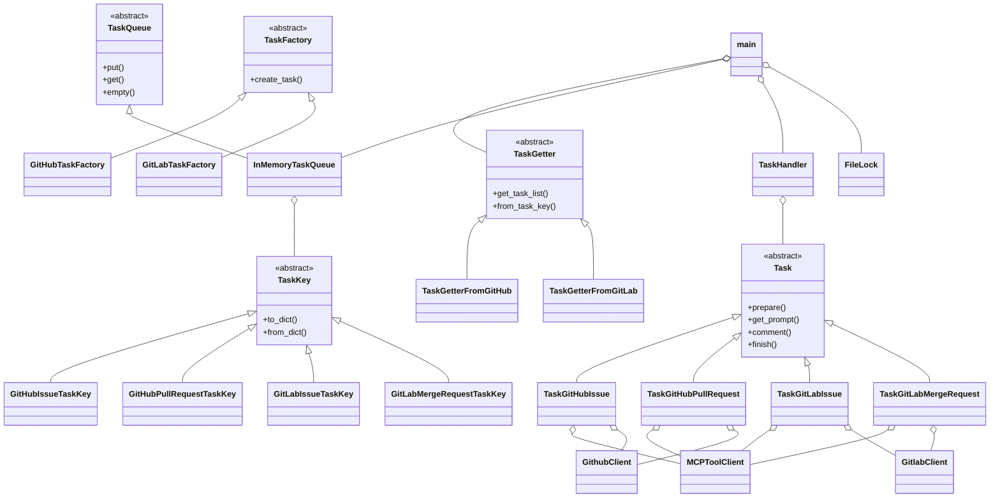

# クラス設計・関係図（coding_agent プロジェクト）

## 概要
本プロジェクトは、GitHub/GitLabのMCPサーバーと連携し、タスク（Issue/PR/MR）をLLMで処理するエージェントです。

---

## クラス一覧・継承/保合/呼び出し関係

### [抽象基底クラス]
- TaskKey (handlers/task_key.py)
    - GitHubIssueTaskKey
    - GitHubPullRequestTaskKey
    - GitLabIssueTaskKey
    - GitLabMergeRequestTaskKey
- Task (handlers/task.py)
    - TaskGitHubIssue (handlers/task_getter_github.py)
    - TaskGitHubPullRequest (handlers/task_getter_github.py)
    - TaskGitLabIssue (handlers/task_getter_gitlab.py)
    - TaskGitLabMergeRequest (handlers/task_getter_gitlab.py)
- TaskGetter (handlers/task_getter.py)
    - TaskGetterFromGitHub (handlers/task_getter_github.py)
    - TaskGetterFromGitLab (handlers/task_getter_gitlab.py)
- TaskFactory (handlers/task_factory.py)
    - GitHubTaskFactory
    - GitLabTaskFactory
- TaskQueue (queueing.py)
    - InMemoryTaskQueue

### [主要クラス]
- TaskHandler (handlers/task_handler.py)
- MCPToolClient (clients/mcp_tool_client.py)
- GithubClient (clients/github_client.py)
- GitlabClient (clients/gitlab_client.py)
- LLMクライアント群 (clients/lm_client.py, openai_client.py, lmstudio_client.py, ollama_client.py)
- FileLock (filelock_util.py)

---

## 保合・呼び出し関係
- main.py
    - TaskGetter.factory で TaskGetterFromGitHub / TaskGetterFromGitLab を生成
    - TaskGetter.get_task_list() で TaskKey のリストを生成
    - TaskKey を InMemoryTaskQueue にput
    - consume_tasks で TaskGetter.from_task_key(dict) で Taskインスタンス復元
    - TaskHandler.handle(task) でタスク処理
- TaskGitHubIssue/TaskGitHubPullRequest
    - MCPToolClient, GithubClient を利用
- TaskGitLabIssue/TaskGitLabMergeRequest
    - MCPToolClient, GitlabClient を利用
- TaskFactory
    - TaskKey から Task を生成（from_task_keyの実装に近い役割）
- InMemoryTaskQueue
    - TaskKey(dict)をput/get
- FileLock
    - プロセス排他制御

---

## Mermaid クラス図

---

## 補足
- LLMクライアント群（OpenAI, LMStudio, Ollama等）はTaskHandler経由で利用される
- main.pyは全体のオーケストレーションを担う
- TaskKey/Task/TaskGetter/TaskFactory/TaskQueueは拡張性を重視し抽象クラス化

