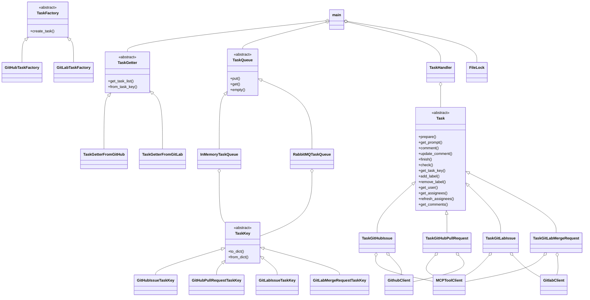

# クラス設計・関係図（coding_agentプロジェクト）

## 1. 概要

本プロジェクトは、GitHub/GitLabのMCPサーバーと連携し、タスク（Issue/PR/MR）をLLMで処理するエージェントです。

---

## 2. クラス一覧

### 2.1 抽象基底クラス

#### TaskKey（handlers/task_key.py）

タスクを一意に識別するためのキークラスです。

**サブクラス:**
- GitHubIssueTaskKey
- GitHubPullRequestTaskKey
- GitLabIssueTaskKey
- GitLabMergeRequestTaskKey

#### Task（handlers/task.py）

タスクを表現する抽象クラスです。

**サブクラス:**
- TaskGitHubIssue（handlers/task_getter_github.py）
- TaskGitHubPullRequest（handlers/task_getter_github.py）
- TaskGitLabIssue（handlers/task_getter_gitlab.py）
- TaskGitLabMergeRequest（handlers/task_getter_gitlab.py）

#### TaskGetter（handlers/task_getter.py）

タスクを取得するための抽象クラスです。

**サブクラス:**
- TaskGetterFromGitHub（handlers/task_getter_github.py）
- TaskGetterFromGitLab（handlers/task_getter_gitlab.py）

#### TaskFactory（handlers/task_factory.py）

タスクオブジェクトを生成するファクトリクラスです。

**サブクラス:**
- GitHubTaskFactory
- GitLabTaskFactory

#### TaskQueue（queueing.py）

タスクキューの抽象クラスです。

**サブクラス:**
- InMemoryTaskQueue
- RabbitMQTaskQueue

---

### 2.2 主要クラス

#### TaskHandler（handlers/task_handler.py）

タスク処理のオーケストレーションを担当するクラスです。LLMクライアントとMCPクライアントを使用してタスクを処理します。

**処理モード選択（handle()メソッド内）:**
1. Planning機能が有効（planning.enabled=true）かつUUIDが存在する場合: _handle_with_planning()を呼び出し
2. Context Storage機能が有効（context_storage.enabled=true）かつUUIDが存在する場合: _handle_with_context_storage()を呼び出し
3. それ以外: _handle_legacy()を呼び出し（従来のインメモリ処理）

**主要メソッド:**
- handle(): タスク処理のエントリーポイント、処理モードを判定して適切なメソッドを呼び出し
- _handle_with_planning(): 計画実行モードでのタスク処理
- _handle_with_context_storage(): ファイルベースコンテキスト管理でのタスク処理
- _handle_legacy(): 従来のインメモリ処理

#### MCPToolClient（clients/mcp_tool_client.py）

MCPサーバーとの通信を担当するクライアントクラスです。設定ファイルで定義されたMCPサーバーを起動し、ツールの呼び出しを処理します。

#### GithubClient（clients/github_client.py）

GitHub API操作のためのクライアントクラスです。TaskGetterFromGitHubおよびGitHubTaskFactoryで使用され、GitHub APIへの直接アクセス（Issue/PR取得、ラベル操作など）を担当します。

#### GitlabClient（clients/gitlab_client.py）

GitLab API操作のためのクライアントクラスです。TaskGetterFromGitLabおよびGitLabTaskFactoryで使用され、GitLab APIへの直接アクセス（Issue/MR取得、ラベル操作など）を担当します。

#### LLMクライアント群

LLMとの通信を担当するクライアントクラス群です。

- LLMClient（clients/llm_base.py）: 抽象基底クラス
- OpenAIClient（clients/openai_client.py）: OpenAI API用
- LMStudioClient（clients/lmstudio_client.py）: LM Studio用
- OllamaClient（clients/ollama_client.py）: Ollama用

#### FileLock（filelock_util.py）

プロセス排他制御のためのファイルロッククラスです。Producerモードで同時に複数のProducerが起動しないよう排他制御を行います。

---

### 2.3 コンテキスト管理クラス

#### TaskContextManager（context_storage/task_context_manager.py）

タスクコンテキスト全体を管理するクラスです。

#### MessageStore（context_storage/message_store.py）

メッセージ履歴を管理するクラスです。

#### SummaryStore（context_storage/summary_store.py）

コンテキスト要約を管理するクラスです。

#### ToolStore（context_storage/tool_store.py）

ツール実行履歴を管理するクラスです。

#### ContextCompressor（context_storage/context_compressor.py）

コンテキスト圧縮を管理するクラスです。

---

### 2.4 追加機能クラス

#### PauseResumeManager（pause_resume_manager.py）

一時停止・再開機能を管理するクラスです。

#### TaskStopManager（task_stop_manager.py）

タスク停止機能を管理するクラスです。

#### CommentDetectionManager（comment_detection_manager.py）

新規コメント検知機能を管理するクラスです。

#### PlanningCoordinator（handlers/planning_coordinator.py）

計画実行モードのコーディネーターです。

#### PlanningHistoryStore（handlers/planning_history_store.py）

計画履歴を保存するストアクラスです。

#### ProjectAgentRulesLoader（handlers/project_agent_rules_loader.py）

プロジェクト固有のエージェントルールをロードするクラスです。

---

## 3. クラス関係

### 3.1 保合・呼び出し関係

#### main.py

- TaskGetter.factoryでTaskGetterFromGitHub/TaskGetterFromGitLabを生成
- TaskGetter.get_task_list()でTaskKeyのリストを生成
- TaskKeyをInMemoryTaskQueueまたはRabbitMQTaskQueueにput
- consume_tasksでTaskGetter.from_task_key(dict)でTaskインスタンスを復元
- TaskHandler.handle(task)でタスク処理

#### GitHub/GitLab Task

- TaskGitHubIssue/TaskGitHubPullRequest: MCPToolClient、GithubClientを利用
- TaskGitLabIssue/TaskGitLabMergeRequest: MCPToolClient、GitlabClientを利用

#### TaskFactory

- TaskKeyからTaskを生成（from_task_keyの実装に近い役割）

#### TaskQueue

- TaskKey（dict）をput/get

#### TaskHandler

- Taskオブジェクトを処理
- LLMClientを使用してLLMと対話
- MCPToolClientを使用してツールを実行
- TaskContextManagerを使用してコンテキストを管理

#### FileLock

- プロセス排他制御

---

## 4. クラス図（Mermaid）

---

## 5. 補足

- LLMクライアント群（OpenAI、LMStudio、Ollama等）はTaskHandler経由で利用される
- main.pyは全体のオーケストレーションを担う
- TaskKey/Task/TaskGetter/TaskFactory/TaskQueueは拡張性を重視し抽象クラス化
- コンテキスト管理クラスはcontext_storageモジュールに集約
- 追加機能（一時停止、停止、コメント検知）は独立したマネージャークラスで管理

---

**文書バージョン:** 2.0  
**最終更新日:** 2024-11-28  
**ステータス:** 実装済み
