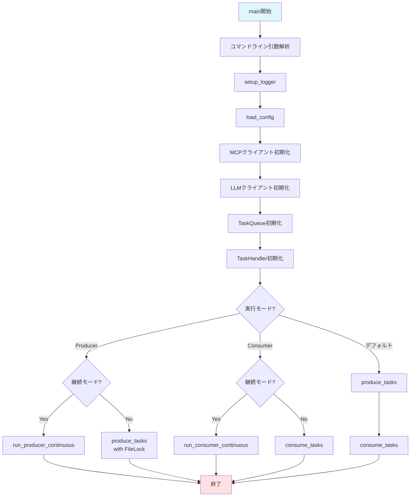
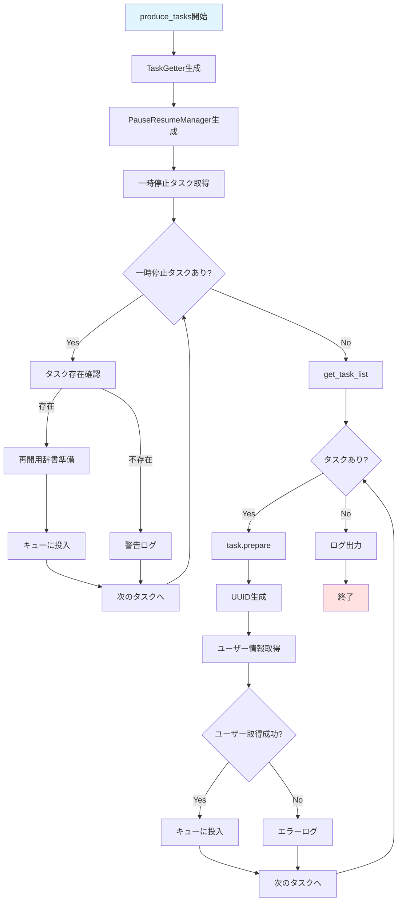
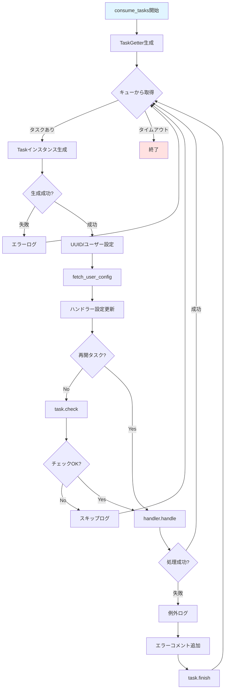
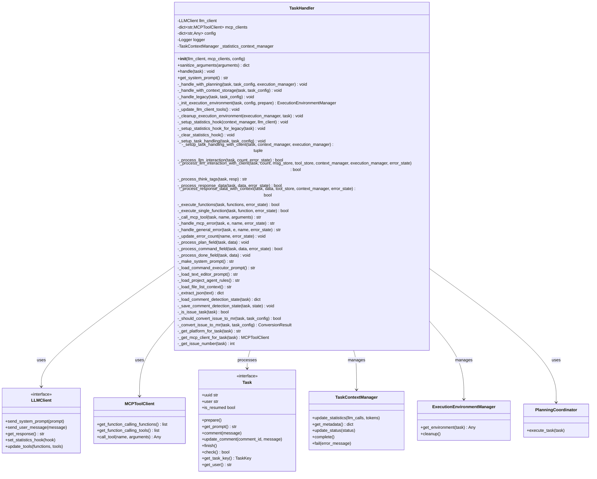
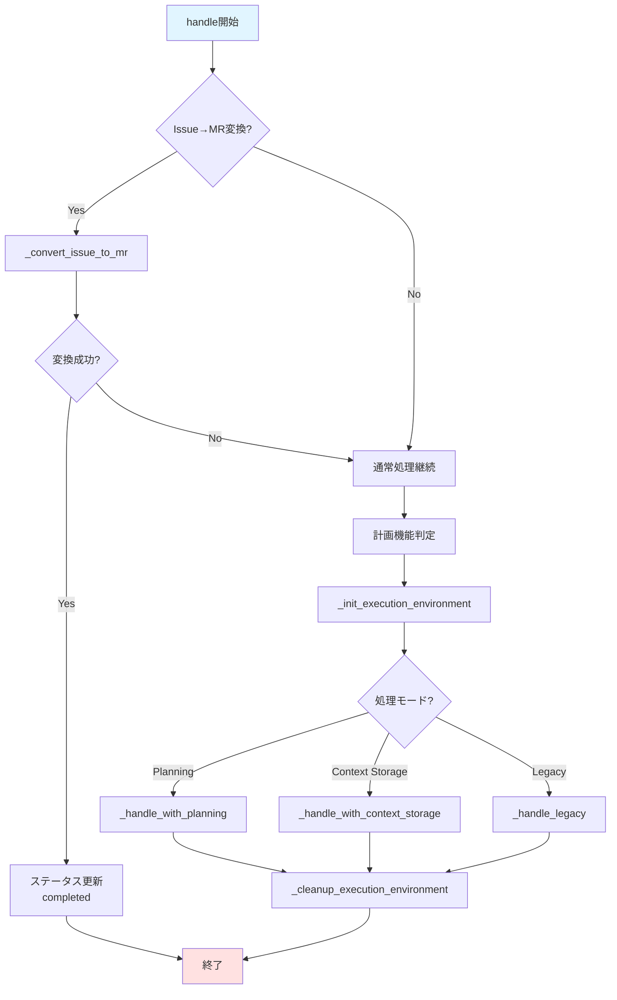
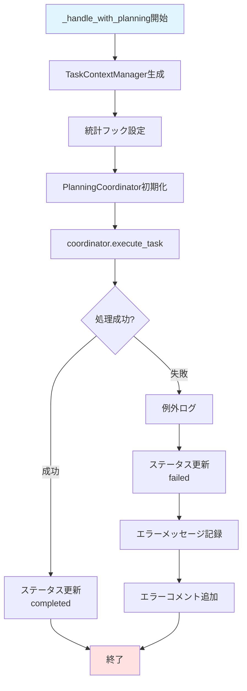
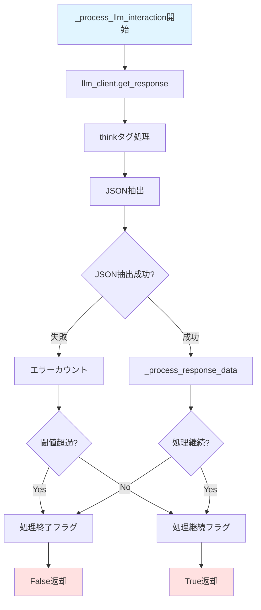
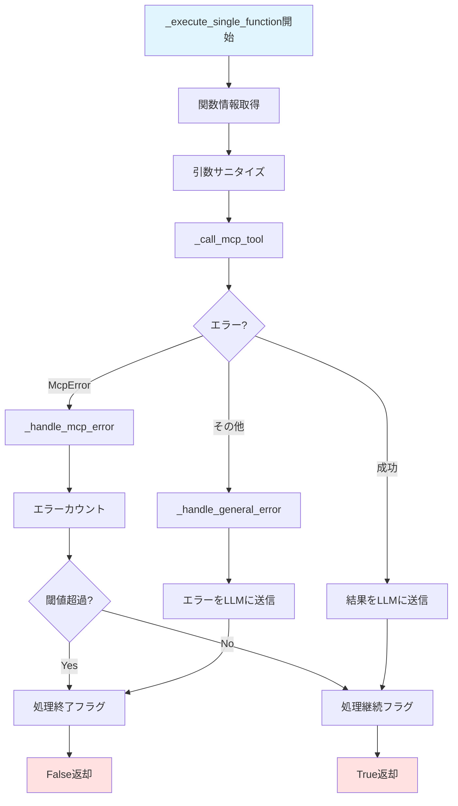
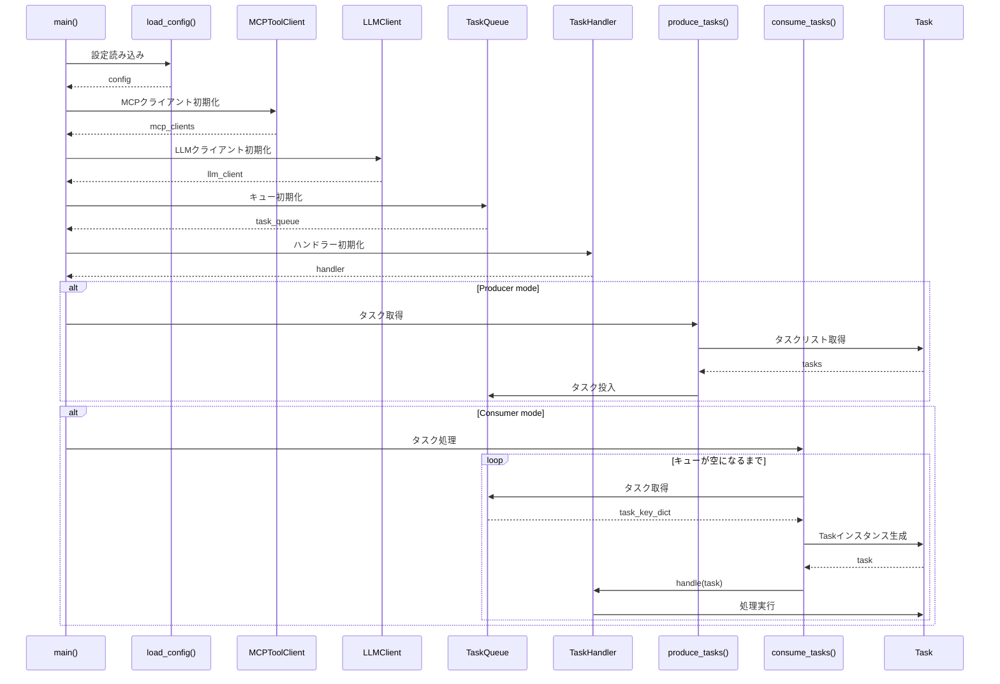
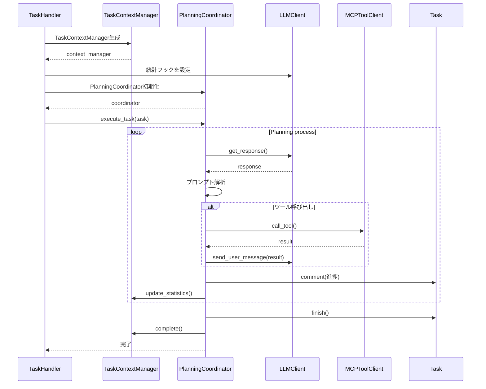

# メインエントリーポイントとタスクハンドラー設計書

## 1. 概要

本ドキュメントは、コーディングエージェントのメインエントリーポイント（`main.py`）とタスク処理の中核を担う`TaskHandler`（`handlers/task_handler.py`）の詳細設計を記述します。

### 1.1 目的

- GitHub/GitLabからタスク（Issue/PR/MR）を取得
- LLMを使用してタスクを自動処理
- Producer/Consumerパターンによる柔軟な実行モード
- 継続動作モードでのバックグラウンド処理

### 1.2 処理対象

- **タスクソース**: GitHub、GitLab
- **タスクタイプ**: Issue、Pull Request、Merge Request
- **処理モード**: 
  - Producer（タスク取得）
  - Consumer（タスク処理）
  - 統合モード（Producer + Consumer）
  - 継続動作モード（Docker Compose用）

---

## 2. main.py - メインエントリーポイント

### 2.1 主要な関数

#### 2.1.1 setup_logger()

**処理内容**:
ログ設定を初期化する関数です。

**詳細処理**:
1. 環境変数`LOGS`からログファイルパスを取得（デフォルト: `logs/agent.log`）
2. 環境変数`DEBUG`に基づいてログレベルを決定
   - `DEBUG=true`: DEBUGレベル
   - それ以外: INFOレベル
3. `logging.conf`ファイルから設定を読み込み、ロガーを初期化

**パラメータ**: なし

**戻り値**: なし

#### 2.1.2 load_config(config_file: str = "config.yaml") -> dict[str, Any]

**処理内容**:
設定ファイルを読み込み、環境変数で上書きする関数です。

**詳細処理**:
1. YAMLファイルから基本設定を読み込み
2. 以下の関数を順次呼び出して環境変数で設定を上書き:
   - `_override_task_source_config()`: タスクソース設定
   - `_override_database_config()`: データベース設定
   - `_override_user_config_api()`: ユーザー設定API設定
   - `_override_github_config()`: GitHub設定
   - `_override_gitlab_config()`: GitLab設定
   - `_override_mcp_config()`: MCPサーバー設定
   - `_override_rabbitmq_config()`: RabbitMQ設定
   - `_override_bot_config()`: ボット名設定
   - `_override_llm_config()`: LLM設定
   - `_override_feature_flags()`: 機能フラグ設定
   - `_override_executor_config()`: 実行環境設定
3. 上書き済みの設定辞書を返す

**パラメータ**:
- `config_file`: 設定ファイルのパス（デフォルト: "config.yaml"）

**戻り値**:
- `dict[str, Any]`: 上書き済みの設定辞書

**例外**:
- `FileNotFoundError`: 設定ファイルが見つからない場合
- `yaml.YAMLError`: YAML解析に失敗した場合

#### 2.1.3 fetch_user_config(task: Any, base_config: dict[str, Any]) -> dict[str, Any]

**処理内容**:
タスクのユーザーに基づいて設定を取得する関数です。

**詳細処理**:
1. `user_config_api.enabled`フラグを確認
2. フラグが`false`の場合、`base_config`をそのまま返す
3. フラグが`true`の場合:
   - タスクからユーザー名を取得（`task.get_user()`）
   - ユーザー名が取得できない場合、警告ログを出力して`base_config`を返す
   - `_fetch_config_from_api()`を呼び出してAPI経由で設定を取得
   - エラー発生時は警告ログを出力して`base_config`を返す

**パラメータ**:
- `task`: タスクオブジェクト
- `base_config`: ベースとなる設定辞書

**戻り値**:
- `dict[str, Any]`: ユーザー設定でマージされた設定辞書

#### 2.1.4 produce_tasks()

**処理内容**:
タスクを取得してキューに追加する関数です。

**詳細処理**:
1. `TaskGetter.factory()`でタスクゲッターインスタンスを生成
2. `PauseResumeManager`を使用して一時停止中のタスクを検出
3. 一時停止タスクごとに:
   - タスクがまだ存在するか確認
   - 存在する場合、再開用のタスク辞書を準備してキューに投入
   - エラー時は例外ログを出力して次のタスクへ
4. `task_getter.get_task_list()`で新規タスクリストを取得
5. 各タスクに対して:
   - `task.prepare()`で準備処理（ラベル付与など）を実行
   - タスクキーを辞書形式に変換
   - UUID v4を生成して追加
   - ユーザー情報を取得して追加
   - ユーザー情報が取得できない場合はエラーログを出力してスキップ
   - タスク辞書をキューに追加
6. 追加したタスク数をログ出力

**パラメータ**:
- `config`: アプリケーション設定辞書
- `mcp_clients`: MCPクライアントの辞書
- `task_source`: タスクソース（"github" または "gitlab"）
- `task_queue`: タスクキューオブジェクト
- `logger`: ログ出力用のロガー

**戻り値**: なし

#### 2.1.5 consume_tasks()

**処理内容**:
キューからタスクを取得して処理する関数です。

**詳細処理**:
1. 設定からMCPクライアント、config、task_sourceを取得
2. `TaskGetter.factory()`でタスクゲッターインスタンスを生成
3. 無限ループで以下を実行:
   - `task_queue.get()`でタスクキーを取得
   - タイムアウトした場合（`None`が返る）はループを終了
   - `task_getter.from_task_key()`でTaskインスタンスを生成
   - タスクが無効な場合はエラーログを出力して次のタスクへ
   - タスクにUUIDとユーザー情報を設定
   - 再開タスクフラグを設定
   - `fetch_user_config()`でユーザー固有の設定を取得
   - ハンドラーの設定を更新
   - 再開タスクでない場合、`task.check()`で状態確認
   - `handler.handle(task)`でタスク処理を実行
   - エラー発生時は例外ログを出力し、タスクにエラーコメントを追加してfinish()

**パラメータ**:
- `task_queue`: タスクキューオブジェクト
- `handler`: タスク処理ハンドラー
- `logger`: ログ出力用のロガー
- `task_config`: タスク設定情報（mcp_clients、config、task_sourceを含む）

**戻り値**: なし

#### 2.1.6 run_producer_continuous()

**処理内容**:
Producer継続動作モードで定期的にタスクを取得する関数です。

**詳細処理**:
1. 設定から継続動作モードの設定を取得
2. ヘルスチェックディレクトリを作成
3. 初回実行遅延設定を確認し、必要に応じて待機
4. 無限ループで以下を実行:
   - 一時停止シグナルの確認（`contexts/pause_signal`の存在確認）
   - シグナルがある場合はループを終了
   - ヘルスチェックファイルを更新
   - `produce_tasks()`を実行
   - エラー発生時は例外ログを出力して次のサイクルへ
   - 設定された間隔（分）だけ待機（一時停止シグナルを定期的にチェック）

**パラメータ**:
- `config`: アプリケーション設定辞書
- `mcp_clients`: MCPクライアントの辞書
- `task_source`: タスクソース
- `task_queue`: タスクキューオブジェクト
- `logger`: ログ出力用のロガー

**戻り値**: なし

#### 2.1.7 run_consumer_continuous()

**処理内容**:
Consumer継続動作モードで継続的にタスクを処理する関数です。

**詳細処理**:
1. 設定から継続動作モードの設定を取得
2. ヘルスチェックディレクトリを作成
3. 最終ヘルスチェック更新時刻を初期化
4. 無限ループで以下を実行:
   - 一時停止シグナルの確認
   - シグナルがある場合はループを終了
   - 定期的にヘルスチェックファイルを更新
   - `task_queue.get()`でタスクキーを取得
   - タスクが取得できた場合:
     - `task_getter.from_task_key()`でTaskインスタンスを生成
     - タスクにUUIDとユーザー情報を設定
     - ユーザー固有の設定を取得
     - `handler.handle(task)`でタスク処理を実行
     - エラー発生時は例外ログを出力してタスクにエラーコメント
     - 最小待機時間が設定されている場合は待機
   - タスクが取得できない場合:
     - 短時間待機して次のサイクルへ

**パラメータ**:
- `task_queue`: タスクキューオブジェクト
- `handler`: タスク処理ハンドラー
- `logger`: ログ出力用のロガー
- `task_config`: タスク設定情報

**戻り値**: なし

#### 2.1.8 main()

**処理内容**:
メインエントリーポイント関数です。

**詳細処理**:
1. コマンドライン引数を解析:
   - `--mode`: producer/consumer モード指定
   - `--continuous`: 継続動作モード有効化
2. 標準出力・標準エラー出力のラインバッファリング設定
3. `setup_logger()`でログ設定を初期化
4. 環境変数`CONFIG_FILE`から設定ファイルパスを取得（デフォルト: "config.yaml"）
5. `load_config()`で設定を読み込み
6. タスクソース設定を取得
7. 継続動作モードの判定（コマンドラインオプション優先）
8. MCPクライアントを初期化:
   - ファンクションコーリング設定を確認
   - 各MCPサーバー設定を処理
   - タスクソースに応じて不要なMCPサーバーを除外
   - MCPクライアントを生成してfunctionsとtoolsを収集
9. `get_llm_client()`でLLMクライアントを初期化
10. タスクキューを初期化（RabbitMQまたはインメモリ）
11. `TaskHandler`を初期化
12. 実行モードに応じて分岐:
    - Producer mode:
      - 継続動作: `run_producer_continuous()`
      - 単発: `produce_tasks()`をFileL ockで排他制御して実行
    - Consumer mode:
      - 継続動作: `run_consumer_continuous()`
      - 単発: `consume_tasks()`
    - デフォルトmode (producer + consumer):
      - `produce_tasks()`を実行
      - `consume_tasks()`を実行

**パラメータ**: なし

**戻り値**: なし

### 2.2 設定上書き関数群

#### _override_task_source_config(config)
環境変数`TASK_SOURCE`でタスクソース設定を上書きします。

#### _override_database_config(config)
環境変数`DATABASE_URL`または個別のデータベース設定で上書きします。
- `DATABASE_HOST`
- `DATABASE_PORT`
- `DATABASE_NAME`
- `DATABASE_USER`
- `DATABASE_PASSWORD`

#### _override_user_config_api(config)
ユーザー設定API関連の環境変数で上書きします。
- `USE_USER_CONFIG_API`
- `USER_CONFIG_API_URL`
- `USER_CONFIG_API_KEY`

#### _override_github_config(config)
GitHub関連の環境変数で上書きします。
- `GITHUB_PERSONAL_ACCESS_TOKEN`
- `GITHUB_API_URL`

#### _override_gitlab_config(config)
GitLab関連の環境変数で上書きします。
- `GITLAB_PERSONAL_ACCESS_TOKEN`
- `GITLAB_API_URL`

#### _override_llm_config(config)
LLM関連の環境変数で上書きします。内部で以下を呼び出し:
- `_override_lmstudio_config()`: LM Studio設定
- `_override_ollama_config()`: Ollama設定
- `_override_openai_config()`: OpenAI設定

#### _override_mcp_config(config)
MCP関連の環境変数で上書きします。
- `GITHUB_MCP_COMMAND`
- 各MCPサーバーの環境変数を動的に上書き

#### _override_rabbitmq_config(config)
RabbitMQ関連の環境変数で上書きします。
- `RABBITMQ_HOST`
- `RABBITMQ_PORT`
- `RABBITMQ_USER`
- `RABBITMQ_PASSWORD`
- `RABBITMQ_QUEUE`

#### _override_feature_flags(config)
機能フラグを環境変数で上書きします。
- `COMMAND_EXECUTOR_ENABLED`
- `TEXT_EDITOR_MCP_ENABLED`
- `ISSUE_TO_MR_ENABLED`
- `PROJECT_AGENT_RULES_ENABLED`

#### _override_executor_config(config)
実行環境関連の環境変数で上書きします。
- `EXECUTOR_DEFAULT_ENVIRONMENT`
- `EXECUTOR_BASE_IMAGE`
- `EXECUTOR_CPU_LIMIT`
- `EXECUTOR_MEMORY_LIMIT`
- `EXECUTOR_TIMEOUT`

#### _override_bot_config(config)
ボット名を環境変数で上書きします。
- `GITHUB_BOT_NAME`
- `GITLAB_BOT_NAME`

### 2.3 処理フロー図







---

## 3. TaskHandler - タスク処理ハンドラー

### 3.1 クラス概要

`TaskHandler`は、LLMクライアントとMCPツールクライアントを統合し、タスクに対する自動化された処理を実行するクラスです。

### 3.2 主要メソッド

#### 3.2.1 __init__(llm_client, mcp_clients, config)

**処理内容**:
TaskHandlerを初期化します。

**詳細処理**:
1. LLMクライアントを保存
2. MCPクライアント辞書を保存
3. アプリケーション設定を保存
4. ロガーを初期化

**パラメータ**:
- `llm_client`: LLMクライアントのインスタンス
- `mcp_clients`: MCPツールクライアントの辞書
- `config`: アプリケーション設定辞書

#### 3.2.2 sanitize_arguments(arguments)

**処理内容**:
引数をサニタイズして辞書形式に変換します。

**詳細処理**:
1. 引数が既にdict型の場合、そのまま返す
2. 引数がstr型の場合:
   - JSONとしてパース
   - パース結果がdict型であることを確認
   - dict型でない場合はValueError
3. その他の型の場合、TypeErrorを発生

**パラメータ**:
- `arguments`: サニタイズ対象の引数（str、dict、またはlist）

**戻り値**:
- `dict[str, Any]`: 辞書形式に変換された引数

**例外**:
- `ValueError`: JSON文字列の解析に失敗した場合
- `TypeError`: サポートされていない型の場合

#### 3.2.3 handle(task)

**処理内容**:
タスクを処理するメインメソッドです。

**詳細処理**:
1. Issue→MR/PR変換のチェック:
   - `_should_convert_issue_to_mr()`で変換条件を確認
   - 条件を満たす場合、`_convert_issue_to_mr()`を実行
   - 変換成功時はタスクステータスを"completed"に更新して終了
   - 変換失敗時は通常処理に進む
2. 計画機能の有効性を判定
3. `_init_execution_environment()`で実行環境を初期化
4. 処理モードを判定:
   - Planning有効かつUUID存在: `_handle_with_planning()`
   - Context Storage有効かつUUID存在: `_handle_with_context_storage()`
   - それ以外: `_handle_legacy()`（Legacy モード）
5. 最終的に実行環境をクリーンアップ

**パラメータ**:
- `task`: 処理対象のTaskオブジェクト

**戻り値**: なし

#### 3.2.4 _handle_with_planning(task, task_config, execution_manager)

**処理内容**:
Planning モードでタスクを処理します。

**詳細処理**:
1. `PlanningCoordinator`をインポート
2. `TaskContextManager`を生成
3. トークン統計記録フックを設定
4. `PlanningCoordinator`を初期化
5. `coordinator.execute_task()`で計画実行を開始
6. 処理完了後、タスクステータスを"completed"に更新
7. エラー発生時:
   - 例外ログを出力
   - タスクステータスを"failed"に更新
   - エラーメッセージを記録
   - タスクにエラーコメントを追加

**パラメータ**:
- `task`: Taskオブジェクト
- `task_config`: タスク設定辞書
- `execution_manager`: 実行環境マネージャー

**戻り値**: なし

#### 3.2.5 _handle_with_context_storage(task, task_config)

**処理内容**:
Context Storage モードでタスクを処理します。

**詳細処理**:
1. `TaskContextManager`を生成
2. トークン統計記録フックを設定
3. LLMクライアントのツール定義を更新
4. `_setup_task_handling_with_client()`でタスク処理セットアップ
5. メッセージとツールストアを取得
6. 最大LLM処理回数のループで以下を実行:
   - `_process_llm_interaction_with_client()`でLLM対話処理
   - 処理継続フラグがFalseの場合はループを終了
7. ループ終了後、タスクステータスを更新
8. エラー発生時:
   - 例外ログを出力
   - タスクステータスを"failed"に更新
   - エラーメッセージを記録
   - タスクにエラーコメントを追加

**パラメータ**:
- `task`: Taskオブジェクト
- `task_config`: タスク設定辞書

**戻り値**: なし

#### 3.2.6 _handle_legacy(task, task_config)

**処理内容**:
Legacy モード（従来のインメモリ処理）でタスクを処理します。

**詳細処理**:
1. `_setup_task_handling()`でタスク処理セットアップ
2. エラーカウンター辞書を初期化
3. 最大LLM処理回数のループで以下を実行:
   - `_process_llm_interaction()`でLLM対話処理
   - 処理継続フラグがFalseの場合はループを終了
4. ループ終了後、`task.finish()`を呼び出し

**パラメータ**:
- `task`: Taskオブジェクト
- `task_config`: タスク設定辞書

**戻り値**: なし

#### 3.2.7 _init_execution_environment(task, config, prepare)

**処理内容**:
実行環境を初期化します。

**詳細処理**:
1. Command Executor機能の有効性を確認
2. 無効の場合はNoneを返す
3. 有効の場合:
   - `ExecutionEnvironmentManager`をインポート
   - マネージャーを生成
   - タスクに基づいて実行環境を取得
   - `prepare=True`の場合、環境を準備
   - 実行環境のMCPラッパーをmcp_clientsに登録
   - マネージャーを返す

**パラメータ**:
- `task`: Taskオブジェクト
- `config`: 設定辞書
- `prepare`: 環境準備フラグ（デフォルト: False）

**戻り値**:
- `ExecutionEnvironmentManager`または`None`

#### 3.2.8 _update_llm_client_tools()

**処理内容**:
LLMクライアントのツール定義を更新します。

**詳細処理**:
1. ファンクションコーリングが有効か確認
2. 無効の場合は何もしない
3. 有効の場合:
   - 全MCPクライアントからfunctionsとtoolsを収集
   - `llm_client.update_tools()`で更新

**パラメータ**: なし

**戻り値**: なし

#### 3.2.9 _cleanup_execution_environment(execution_manager, task)

**処理内容**:
実行環境をクリーンアップします。

**詳細処理**:
1. execution_managerがNoneの場合は何もしない
2. それ以外の場合:
   - `execution_manager.cleanup()`を呼び出し
   - エラー発生時は警告ログを出力
   - mcp_clientsから実行環境ラッパーを削除

**パラメータ**:
- `execution_manager`: 実行環境マネージャー
- `task`: Taskオブジェクト

**戻り値**: なし

#### 3.2.10 _process_llm_interaction(task, count, error_state)

**処理内容**:
LLMとの対話処理を実行します（Legacy モード用）。

**詳細処理**:
1. `llm_client.get_response()`でLLM応答を取得
2. `<think>`タグを処理
3. JSON部分を抽出
4. 応答データを処理:
   - `plan`フィールド: `_process_plan_field()`
   - `command`フィールド: `_process_command_field()`
   - `done`フィールド: `_process_done_field()`
5. エラー発生時:
   - JSONパースエラー: エラーカウント、閾値超過で処理終了
   - その他のエラー: 例外ログを出力、処理終了フラグを返す

**パラメータ**:
- `task`: Taskオブジェクト
- `count`: 現在のループカウント
- `error_state`: エラー状態辞書

**戻り値**:
- `bool`: 処理継続フラグ（True=継続、False=終了）

#### 3.2.11 _execute_functions(task, functions, error_state)

**処理内容**:
関数リストを実行します。

**詳細処理**:
1. 各関数に対して`_execute_single_function()`を呼び出し
2. いずれかの関数で処理終了フラグが返された場合、Falseを返す
3. 全関数の実行が完了した場合、Trueを返す

**パラメータ**:
- `task`: Taskオブジェクト
- `functions`: 関数リスト
- `error_state`: エラー状態辞書

**戻り値**:
- `bool`: 処理継続フラグ

#### 3.2.12 _execute_single_function(task, function, error_state)

**処理内容**:
単一の関数を実行します。

**詳細処理**:
1. 関数から名前と引数を取得
2. 引数をサニタイズ
3. `_call_mcp_tool()`でMCPツールを呼び出し
4. MCPエラー発生時:
   - `_handle_mcp_error()`でエラー処理
   - エラーメッセージをLLMに送信
   - エラーカウント、閾値超過で処理終了フラグを返す
5. その他のエラー発生時:
   - `_handle_general_error()`でエラー処理
   - エラーメッセージをLLMに送信
   - 処理終了フラグを返す

**パラメータ**:
- `task`: Taskオブジェクト
- `function`: 関数辞書
- `error_state`: エラー状態辞書

**戻り値**:
- `bool`: 処理継続フラグ

#### 3.2.13 _call_mcp_tool(task, name, arguments)

**処理内容**:
MCPツールを呼び出します。

**詳細処理**:
1. ツール名を`/`で分割してサーバー名とツール名を取得
2. MCPクライアントを検索
3. クライアントが見つからない場合、KeyErrorを発生
4. `mcp_client.call_tool()`でツールを呼び出し
5. 結果を取得
6. 結果が辞書で`output`キーを持つ場合、output値を返す
7. それ以外の場合、結果をJSON文字列に変換して返す

**パラメータ**:
- `task`: Taskオブジェクト
- `name`: ツール名（"サーバー名/ツール名"形式）
- `arguments`: ツール引数辞書

**戻り値**:
- `str`: ツール実行結果

**例外**:
- `KeyError`: MCPクライアントが見つからない場合
- `McpError`: MCPツール呼び出しエラー

#### 3.2.14 get_system_prompt()

**処理内容**:
システムプロンプトを取得します。

**詳細処理**:
1. `_make_system_prompt()`を呼び出してプロンプト文字列を生成
2. 生成されたプロンプトを返す

**パラメータ**: なし

**戻り値**:
- `str`: システムプロンプト文字列

#### 3.2.15 _make_system_prompt()

**処理内容**:
システムプロンプトを生成します。

**詳細処理**:
1. ベースとなるシステムプロンプトファイルを読み込み
2. MCPクライアントからツール情報を収集してプロンプトに統合
3. Command Executor機能が有効な場合、プロンプトを読み込んで追加
4. Text Editor MCP機能が有効な場合、プロンプトを読み込んで追加
5. プロジェクトエージェントルールを読み込んで追加
6. プロジェクトファイル一覧を読み込んで追加
7. 完成したプロンプト文字列を返す

**パラメータ**: なし

**戻り値**:
- `str`: システムプロンプト文字列

#### 3.2.16 _extract_json(text)

**処理内容**:
テキストからJSON部分を抽出してパースします。

**詳細処理**:
1. テキストから最初の`{`と最後の`}`の位置を検索
2. 見つかった場合、その範囲を抽出してJSONとしてパース
3. 見つからない場合、ValueError を発生
4. JSONパースエラーの場合、エラー情報を含む例外を発生

**パラメータ**:
- `text`: JSON部分を含むテキスト

**戻り値**:
- `dict[str, Any]`: パースされたJSON辞書

**例外**:
- `ValueError`: JSONが見つからない場合またはパースエラー

#### 3.2.17 _should_convert_issue_to_mr(task, task_config)

**処理内容**:
IssueをMR/PRに変換すべきかどうかを判定します。

**詳細処理**:
1. Issue→MR変換機能が有効か確認
2. タスクがIssueタイプか確認（`_is_issue_task()`）
3. 両方の条件を満たす場合、Trueを返す

**パラメータ**:
- `task`: Taskオブジェクト
- `task_config`: タスク設定辞書

**戻り値**:
- `bool`: 変換すべきかどうか

#### 3.2.18 _convert_issue_to_mr(task, task_config)

**処理内容**:
IssueをMR/PRに変換します。

**詳細処理**:
1. `IssueToMRConverter`をインポート
2. プラットフォームを取得（GitHubまたはGitLab）
3. MCPクライアントを取得
4. コンバーターを初期化
5. `converter.convert()`でIssueをMR/PRに変換
6. 変換結果を返す
7. エラー発生時は例外ログを出力してNoneを返す

**パラメータ**:
- `task`: Taskオブジェクト
- `task_config`: タスク設定辞書

**戻り値**:
- `ConversionResult`または`None`: 変換結果

### 3.3 統計記録フック関連メソッド

#### _setup_statistics_hook(context_manager, llm_client)

**処理内容**:
全モード共通のトークン統計記録フックを設定します。

**詳細処理**:
1. context_managerまたはllm_clientがNoneの場合は何もしない
2. 統計記録フック関数を定義:
   - `context_manager.update_statistics()`を呼び出し
   - エラー発生時は警告ログを出力（処理は継続）
3. `llm_client.set_statistics_hook()`でフックを設定
4. フック設定失敗時は警告ログを出力

#### _setup_statistics_hook_for_legacy(task)

**処理内容**:
Legacy モード用のトークン統計記録フックを設定します。

**詳細処理**:
1. タスクにUUIDがない場合は何もしない
2. `TaskContextManager`を生成
3. `_setup_statistics_hook()`でフックを設定
4. インスタンスを`_statistics_context_manager`に保存

#### _clear_statistics_hook()

**処理内容**:
トークン統計記録フックをクリアします。

**詳細処理**:
1. `_statistics_context_manager`が存在する場合、Noneに設定
2. `llm_client.set_statistics_hook(None)`でフックをクリア

### 3.4 クラス図



### 3.5 処理フロー図

#### handle()メソッドのフロー



#### _handle_with_planning()のフロー



#### _process_llm_interaction()のフロー



#### _execute_single_function()のフロー



---

## 4. 統合処理フロー

### 4.1 全体フロー



### 4.2 タスク処理フロー（Planning モード）



---

## 5. エラーハンドリング

### 5.1 エラー種別と対応

#### JSONパースエラー
- **発生条件**: LLM応答からJSON抽出に失敗
- **対応**: エラーカウント、最大5回までリトライ
- **処理**: 閾値超過で処理終了

#### MCPツールエラー
- **発生条件**: MCPツール呼び出しに失敗（McpError）
- **対応**: エラーカウント、最大3回までリトライ
- **処理**: エラーメッセージをLLMに送信、閾値超過で処理終了

#### 一般エラー
- **発生条件**: その他の予期しないエラー
- **対応**: エラーメッセージをLLMに送信
- **処理**: 処理終了

#### タスク処理エラー
- **発生条件**: handle()内で例外発生
- **対応**: 例外ログ出力、タスクにエラーコメント追加
- **処理**: task.finish()で完了

### 5.2 エラーカウント管理

エラーカウントは`error_state`辞書で管理:
```python
error_state = {
    "json_parse_errors": 0,        # JSONパースエラー回数
    "consecutive_tool_errors": {}  # ツール別連続エラー回数
}
```

---

## 6. 設定と環境変数

### 6.1 主要な設定項目

#### タスクソース
- `task_source`: "github" または "gitlab"
- 環境変数: `TASK_SOURCE`

#### LLM設定
- `llm.provider`: "openai", "ollama", "lmstudio"
- `llm.function_calling`: true/false
- 環境変数: `LLM_PROVIDER`, `OPENAI_API_KEY`, etc.

#### Planning設定
- `planning.enabled`: true/false
- `planning.max_subtasks`: 最大サブタスク数
- `planning.progress_comment.enabled`: 進捗コメント機能

#### Context Storage設定
- `context_storage.enabled`: true/false
- `context_storage.base_dir`: コンテキスト保存ディレクトリ

#### Command Executor設定
- `command_executor.enabled`: true/false
- `command_executor.environments`: 利用可能な実行環境

#### Issue→MR変換設定
- `issue_to_mr_conversion.enabled`: true/false
- `issue_to_mr_conversion.auto_draft`: ドラフト状態で作成

#### User Config API設定
- `user_config_api.enabled`: true/false
- `user_config_api.url`: APIのURL
- `user_config_api.api_key`: APIキー

### 6.2 必須環境変数

以下の環境変数は必須または重要：

- `TASK_SOURCE`: タスクソース（github/gitlab）
- `GITHUB_PERSONAL_ACCESS_TOKEN`: GitHub APIトークン（GitHub使用時）
- `GITLAB_PERSONAL_ACCESS_TOKEN`: GitLab APIトークン（GitLab使用時）
- `OPENAI_API_KEY`: OpenAI APIキー（OpenAI使用時）
- `LOGS`: ログファイルパス
- `DEBUG`: デバッグモードフラグ

---

## 7. 継続動作モード

### 7.1 Producer継続動作

**動作**:
- 設定された間隔（分）で定期的にタスクを取得
- 一時停止シグナル（`contexts/pause_signal`）でループ終了
- ヘルスチェックファイルを定期更新

**設定**:
```yaml
continuous:
  enabled: true
  producer:
    interval_minutes: 1
    delay_first_run: false
```

### 7.2 Consumer継続動作

**動作**:
- キューを監視してタスクを継続的に処理
- 一時停止シグナルでループ終了
- ヘルスチェックファイルを定期更新
- 最小待機時間の設定可能

**設定**:
```yaml
continuous:
  enabled: true
  consumer:
    queue_timeout_seconds: 30
    min_interval_seconds: 0
```

---

## 8. 一時停止・再開機能

### 8.1 一時停止

**方法**:
```bash
touch contexts/pause_signal
```

**処理**:
- Producer/Consumerが次のチェックポイントでシグナルを検出
- 現在の状態を保存
- タスクに一時停止ラベルを付与
- プロセスを終了

### 8.2 再開

**方法**:
```bash
rm contexts/pause_signal
docker-compose up -d
```

**処理**:
- `produce_tasks()`で一時停止タスクを検出
- 再開用のタスク辞書を準備
- キューに再投入
- Consumerが処理を再開

---

## 9. まとめ

### 9.1 main.pyの責務

- アプリケーションの初期化
- 設定の読み込みと環境変数による上書き
- MCPクライアントとLLMクライアントの初期化
- Producer/Consumerモードの制御
- 継続動作モードの管理

### 9.2 TaskHandlerの責務

- タスク処理の実行
- LLMとMCPツールの統合
- Processing モードの選択と実行
- エラーハンドリング
- 統計記録とコンテキスト管理
- Issue→MR/PR変換
- 実行環境の管理

### 9.3 処理モード

1. **Planning モード**: プランニング機能を使用した高度な処理
2. **Context Storage モード**: ファイルベースのコンテキスト管理
3. **Legacy モード**: 従来のインメモリ処理

---

**文書バージョン:** 1.0  
**最終更新日:** 2024-12-07  
**ステータス:** 設計書
