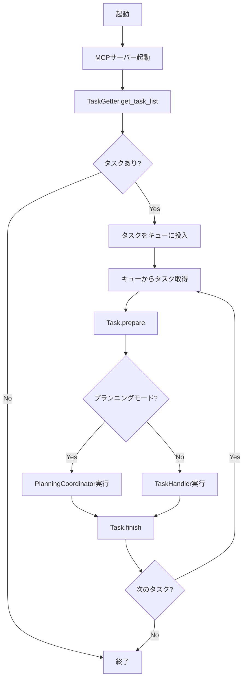

# コーディングエージェント 統合仕様書

本ドキュメントは、コーディングエージェント（coding_agent）プロジェクトの全体仕様を統合したものです。各機能の詳細については、それぞれの個別仕様書を参照してください。

---

## 1. プロジェクト概要

### 1.1 目的

GitHub Copilot Coding Agentのようなコーディングエージェントを作成します。GitHubおよびGitLabにラベル付けされたIssue、Pull Request、Merge Requestをタスクとして処理し、LLM（大規模言語モデル）を活用して自動的にコード変更や対応を行います。

### 1.2 対応プラットフォーム

- **GitHub**: Issue、Pull Requestの処理
- **GitLab**: Issue、Merge Requestの処理

### 1.3 主要機能

- **タスク取得**: GitHub/GitLabから特定ラベルが付与されたIssue/PR/MRをタスクとして取得
- **LLM対話**: OpenAI、Ollama、LM Studio等のLLMプロバイダーと連携
- **MCP連携**: Model Context Protocol（MCP）サーバーを通じてGitHub/GitLabの操作を実行
- **プランニングモード**: タスクを段階的に分解し、計画的に実行
- **コンテキスト管理**: 会話履歴の管理と自動圧縮
- **一時停止・再開**: タスク処理の一時停止と状態保存からの再開
- **タスク停止**: アサイン解除によるタスクの停止
- **継続動作モード**: Docker Composeによる継続的なタスク処理
- **ユーザー設定管理**: ユーザーごとのLLM設定の管理
- **Issue→MR/PR変換**: Issueで依頼された内容を自動的にMR/PRとして作成
- **実行環境管理**: 複数言語対応のDocker実行環境でコマンドを実行
- **テキストエディタ連携**: ファイル編集をtext-editor MCPで行い、gitで管理

---

## 2. 動作環境

### 2.1 システム要件

- **OS**: macOS、Linux（Docker使用時はWindowsも対応）
- **言語**: Python 3.13以上
- **起動方法**: Docker Compose（継続動作）またはcron（定期実行）

### 2.2 依存関係

- Python標準ロガーを使用
- ログはファイルにのみ出力し、デイリーでローテーションして圧縮
- MCPサーバーはDockerでstdioモードで起動
- PostgreSQL: タスク情報の永続化
- RabbitMQ: タスクキュー管理（オプション）

---

## 3. システムアーキテクチャ

### 3.1 全体構成

本システムは以下のコンポーネントで構成されています：

- **main.py**: メインエントリーポイント、Producer/Consumerモードの制御
- **TaskGetter**: GitHub/GitLabからタスクを取得する抽象クラスと具象クラス
- **Task**: タスクを表現する抽象クラスと具象クラス（Issue/PR/MR対応）
- **TaskHandler**: タスク処理のオーケストレーション
- **PlanningCoordinator**: プランニングモードでのタスク実行制御
- **LLMClient**: 各LLMプロバイダーへのインターフェース
- **MCPToolClient**: MCPサーバーとの通信クライアント
- **TaskQueue**: タスクキュー管理（インメモリまたはRabbitMQ）
- **TaskContextManager**: タスクのコンテキスト管理とデータベース操作
- **ExecutionEnvironmentManager**: Docker実行環境の管理

### 3.2 処理フロー

---

## 4. 設定管理

### 4.1 設定ファイル（config.yaml）

すべての設定項目は`config.yaml`に定義します。主要な設定項目：

- **task_source**: タスクソース（github/gitlab）
- **llm**: LLMプロバイダー設定（openai/ollama/lmstudio）
- **mcp_servers**: MCPサーバーの定義
- **database**: PostgreSQL接続設定
- **github/gitlab**: プラットフォーム固有の設定
- **planning**: プランニング機能の設定
- **context_storage**: コンテキスト管理の設定
- **pause_resume**: 一時停止・再開機能の設定
- **rabbitmq**: メッセージキューの設定
- **command_executor**: コマンド実行環境の設定
- **text_editor_mcp**: テキストエディタMCPの設定

### 4.2 環境変数による上書き

主要な設定項目は環境変数で上書き可能です：

- **TASK_SOURCE**: タスクソース
- **GITHUB_PERSONAL_ACCESS_TOKEN**: GitHub APIトークン
- **GITLAB_PERSONAL_ACCESS_TOKEN**: GitLab APIトークン
- **OPENAI_API_KEY**: OpenAI APIキー
- **DATABASE_URL**: データベース接続URL
- **USE_USER_CONFIG_API**: ユーザー設定API使用フラグ
- **USER_CONFIG_API_URL**: ユーザー設定APIURL
- **USER_CONFIG_API_KEY**: ユーザー設定APIキー

---

## 5. LLMプロバイダー

### 5.1 対応プロバイダー

設定ファイルの`llm.provider`で使用するプロバイダーを指定します：

- **openai**: OpenAI API（またはOpenAI互換API）
- **ollama**: Ollama ローカルLLM
- **lmstudio**: LM Studio ローカルLLMサーバー

### 5.2 LLMクライアント

LLMClient抽象クラスを定義し、以下のメソッドを実装：

- **send_system_prompt**: システムプロンプトを送信
- **send_user_message**: ユーザーメッセージを送信
- **get_response**: LLMからの応答を取得

---

## 6. MCPサーバー連携

### 6.1 MCPサーバーの種類

- **github**: GitHub操作用MCPサーバー
- **gitlab**: GitLab操作用MCPサーバー
- **command-executor**: コマンド実行用MCPサーバー
- **text-editor**: ファイル編集用MCPサーバー

### 6.2 MCPToolClient

MCPサーバーとの通信を担当するクライアント：

- 設定ファイルから複数のMCPサーバーを起動
- LLMからのツール呼び出しを適切なMCPサーバーに転送
- ツール実行結果をLLMに返却

---

## 7. タスク処理

### 7.1 タスク取得

TaskGetterクラスがGitHub/GitLabから以下の条件でタスクを取得：

- 指定されたラベル（デフォルト: "coding agent"）が付与されている
- 処理中ラベルが付与されていない
- オープン状態のIssue/PR/MR

### 7.2 タスク準備

Task.prepare()で以下を実行：

- タスクラベルを削除
- 処理中ラベルを付与
- タスク情報をデータベースに登録

### 7.3 タスク実行

#### 通常モード
TaskHandlerがLLMと対話しながらタスクを実行

#### プランニングモード
PlanningCoordinatorが以下のフェーズで実行：

1. **計画前情報収集フェーズ**: 依頼内容を理解し、必要な情報を収集
2. **計画フェーズ**: タスクを段階的に分解し、実行計画を作成
3. **実行フェーズ**: 計画に従ってアクションを実行
4. **リフレクションフェーズ**: 実行結果を振り返り、問題を検出
5. **検証フェーズ**: タスク完了後の検証と追加作業の実行
6. **再計画フェーズ**: 必要に応じて計画を修正

### 7.4 タスク終了

Task.finish()で以下を実行：

- 処理中ラベルを削除
- 完了ラベルを付与
- タスクステータスを更新

---

## 8. コンテキスト管理

### 8.1 コンテキストストレージ

タスクのコンテキストを`contexts/`ディレクトリに保存：

- **running/{uuid}/**: 実行中のタスク
- **completed/{uuid}/**: 完了したタスク
- **paused/{uuid}/**: 一時停止中のタスク

各タスクディレクトリには以下を保存：

- **metadata.json**: タスクのメタデータ
- **messages.jsonl**: 会話履歴
- **summaries.jsonl**: 圧縮された要約
- **planning/**: プランニング情報

### 8.2 コンテキスト圧縮

会話履歴が閾値を超えた場合、古いメッセージを要約して圧縮：

- LLMに要約を依頼
- 古いメッセージを削除
- 要約を履歴の先頭に追加

### 8.3 コンテキスト引き継ぎ

同一Issue/MR/PRの過去のコンテキストを引き継いで処理の継続性を向上：

- 過去の計画、検証結果、リフレクションを参照
- 成功パターンを再利用
- 有効期限内のコンテキストのみを引き継ぎ

---

## 9. データベース

### 9.1 タスク情報DB

PostgreSQLにタスク情報を永続化：

- **tasks**テーブル: タスクの状態、統計情報、メタデータを保存
- TaskDBManagerクラスでデータベース操作を抽象化
- SQLAlchemy ORMを使用

### 9.2 ユーザー設定DB

ユーザー設定APIで使用（user_config_api/）：

- **users**テーブル: ユーザー情報
- **user_configs**テーブル: ユーザーごとのLLM設定
- AES-256-GCMで機密情報を暗号化

---

## 10. 一時停止・再開

### 10.1 一時停止

`contexts/pause_signal`ファイルを作成すると、次のチェックポイントでタスクを一時停止：

- 現在の状態を保存
- タスクに一時停止ラベルを付与
- プロセスを終了

### 10.2 再開

次回Producer実行時に一時停止タスクをキューに再投入：

- 保存された状態を復元
- 処理を継続

---

## 11. タスク停止

### 11.1 停止条件

タスクの担当者（assignee）が解除された場合、タスクを停止：

- 処理を中断
- 停止ラベルを付与
- コンテキストを保存

---

## 12. Issue→MR/PR変換

### 12.1 自動変換

Issueで依頼された内容を自動的にMR/PRとして作成：

- Issueの内容からブランチを作成
- MR/PRを作成（ドラフト状態）
- Issueのコメントを転記
- 処理をMR/PRで継続

---

## 13. 実行環境管理

### 13.1 Docker実行環境

Command Executor MCPを使用してDocker環境でコマンドを実行：

- 複数言語対応（Python、Node.js、Java、Go等）
- プロジェクトをクローン
- 依存関係を自動インストール
- コマンドを実行してフィードバックを取得

### 13.2 環境選択

プランニングフェーズでLLMがプロジェクトに適した実行環境を選択：

- プロジェクトファイルを分析
- 必要な言語・ツールを判定
- 適切な環境イメージを選択

---

## 14. テキストエディタ連携

### 14.1 Text Editor MCP

ファイル操作をtext-editor MCPで実行：

- ファイルの表示（view）
- ファイルの新規作成（create）
- 文字列置換による編集（str_replace）
- 行挿入（insert）
- 編集の取り消し（undo_edit）

### 14.2 Gitワークフロー

ファイル変更後はgitコマンドで管理：

- `git status`で変更確認
- `git add`でステージング
- `git commit`でコミット
- `git push`でプッシュ

---

## 15. 継続動作モード

### 15.1 Docker Compose構成

Producer、Consumerをそれぞれ別のコンテナとして実行：

- **Producer**: 定期的にタスクを取得してキューに投入
- **Consumer**: キューからタスクを取得して処理
- **RabbitMQ**: タスクキューとして動作
- **PostgreSQL**: タスク情報を永続化

### 15.2 ヘルスチェック

各コンテナのヘルスチェック機能：

- 定期的にステータスファイルを更新
- 異常検知時に再起動

---

## 16. ユーザー設定API

### 16.1 概要

ユーザーごとの設定をAPIで管理：

- FastAPIでREST API提供
- StreamlitでWeb管理画面提供
- Active Directory認証

### 16.2 主要機能

- ユーザー管理（追加、編集、削除）
- LLM設定管理（プロバイダー、モデル、APIキー等）
- システムプロンプトのカスタマイズ
- トークン使用量の追跡と表示

---

## 17. 進捗管理

### 17.1 進捗コメント

タスク実行中の進捗を1つのコメントに集約：

- タスク開始時に進捗コメントを作成
- フェーズ変更、アクション実行時にコメントを更新
- タイムライン形式で経過を記録

### 17.2 チェックリスト

計画をMarkdownチェックリストとして表示：

- 各アクションの実行状態を視覚化
- 完了したアクションにチェックマーク
- 進捗率を表示

---

## 18. エラーハンドリング

### 18.1 再試行ポリシー

一時的なエラーに対して自動リトライ：

- HTTP 5xxエラー: 3回リトライ
- ツール実行エラー: 設定に応じてリトライ

### 18.2 エラー通知

失敗時の通知：

- ログに詳細を出力
- Issue/MRにエラーコメントを追加
- エラーメッセージをデータベースに記録

---

## 19. セキュリティ

### 19.1 機密情報管理

- APIキー、トークンは環境変数で管理
- データベースの機密情報はAES-256-GCMで暗号化
- 設定ファイルに機密情報を含めない

### 19.2 アクセス制御

- ユーザー設定APIはBearer認証
- Active Directoryと連携した認証
- 最小権限の原則に従ったトークン管理

---

## 20. 関連ドキュメント

### 20.1 個別設計書

- [クラス設計](spec/CLASS_SPEC.md)
- [コンテキストファイル化仕様](spec/CONTEXT_FILE_SPEC.md)
- [プランニング仕様](spec/PLANNING_SPECIFICATION.md)
- [一時停止・再開仕様](spec/PAUSE_RESUME_SPECIFICATION.md)
- [再計画仕様](spec/REPLANNING_SPECIFICATION.md)
- [Issue→MR変換仕様](spec/ISSUE_TO_MR_CONVERSION_SPECIFICATION.md)
- [コマンド実行環境仕様](spec/COMMAND_EXECUTOR_MCP_SPECIFICATION.md)
- [テキストエディタMCP仕様](spec/TEXT_EDITOR_MCP_SPECIFICATION.md)
- [ユーザー設定Web仕様](spec/USER_CONFIG_WEB_SPECIFICATION.md)
- [進捗コメント更新仕様](spec/PROGRESS_COMMENT_UPDATE_SPEC.md)
- [コメント検出仕様](spec/COMMENT_DETECTION_SPECIFICATION.md)
- [タスク停止仕様](spec/TASK_STOP_SPECIFICATION.md)
- [トークン使用量追跡仕様](spec/TOKEN_USAGE_TRACKING_SPECIFICATION.md)
- [DB分離設計](spec/DB_SEPARATION_SPECIFICATION.md)
- [継続動作モード仕様](spec/CONTINUOUS_MODE_SPECIFICATION.md)
- [複数言語環境仕様](spec/MULTI_LANGUAGE_ENVIRONMENT_SPECIFICATION.md)
- [プロジェクトエージェントルール仕様](spec/PROJECT_AGENT_RULES_SPECIFICATION.md)
- [コンテキスト引き継ぎ仕様](spec/CONTEXT_INHERITANCE_SPECIFICATION.md)
- [計画前情報収集仕様](spec/PRE_PLANNING_INFORMATION_GATHERING_SPECIFICATION.md)
- [プロジェクトファイル一覧仕様](spec/PROJECT_FILE_LIST_CONTEXT_SPECIFICATION.md)
- [計画実行フェーズ環境設定仕様](spec/ENVIRONMENT_SETUP_IN_PLANNING_SPECIFICATION.md)

### 20.2 セットアップガイド

- [セットアップガイド](../SETUP.md)
- [ユーザー設定APIセットアップ](../USER_CONFIG_SETUP.md)
- [一時停止・再開の使い方](setup/PAUSE_RESUME_USAGE.md)

---

**文書バージョン:** 3.0  
**最終更新日:** 2024-12-07  
**ステータス:** 統合版
