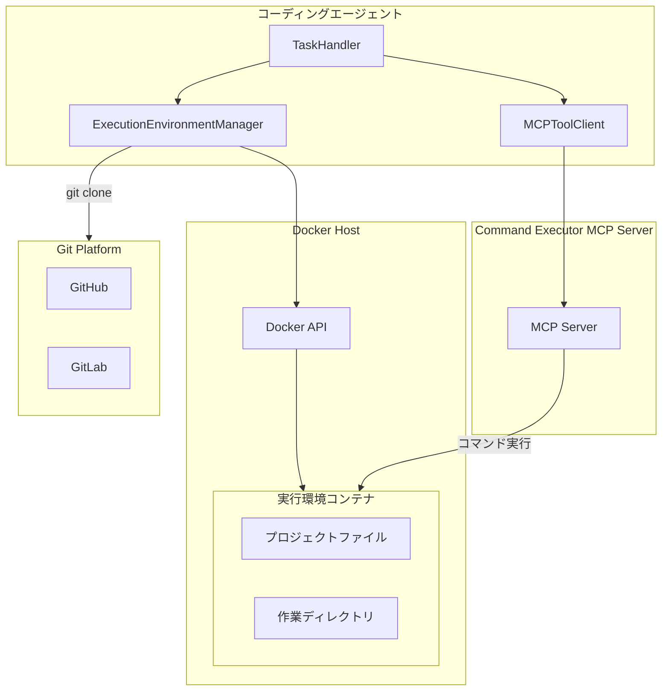
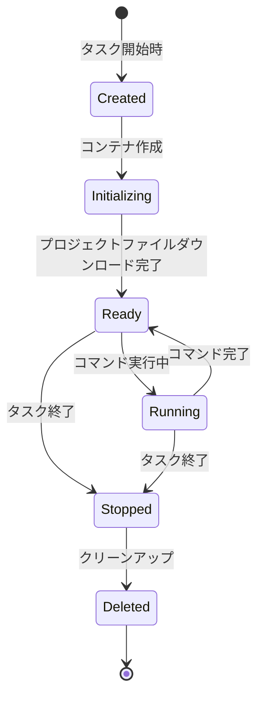
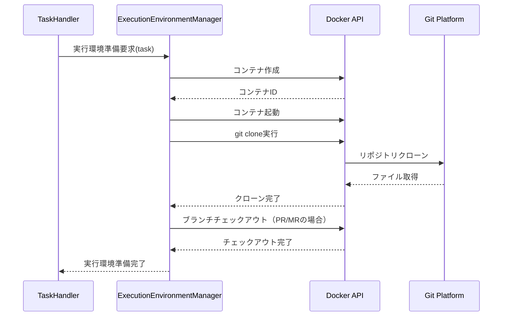
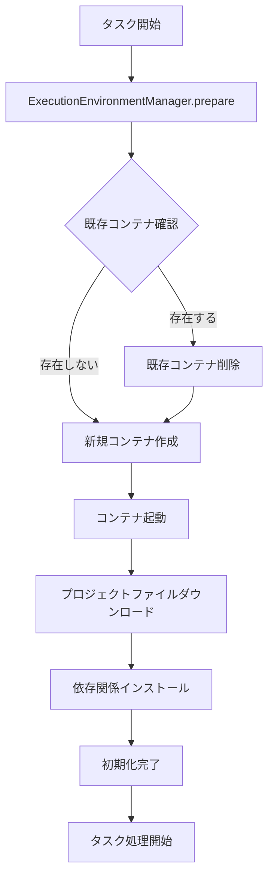
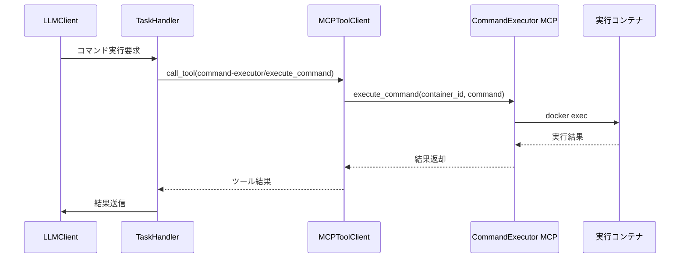
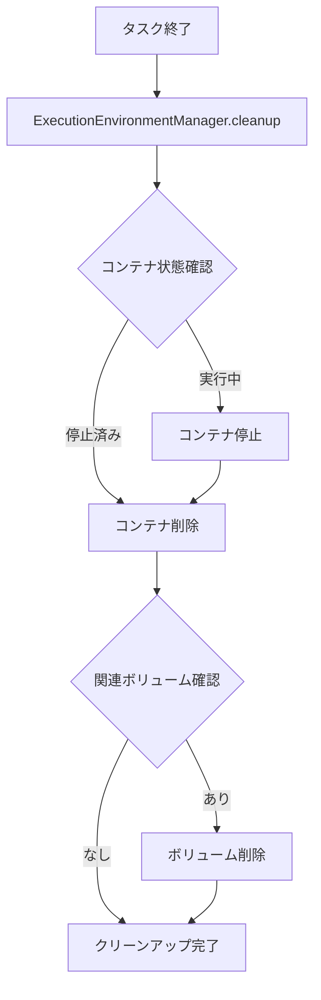
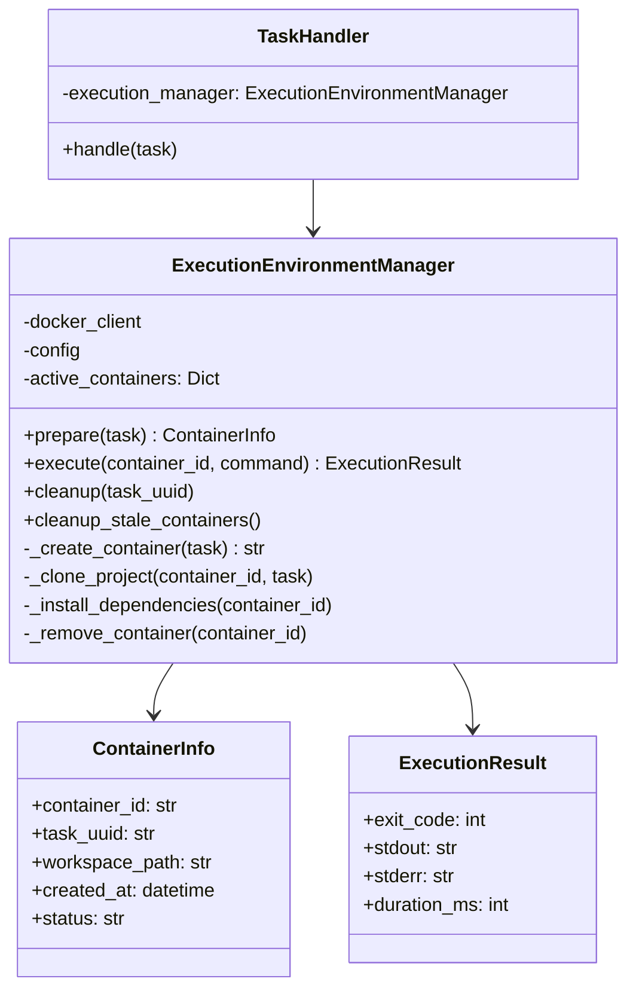
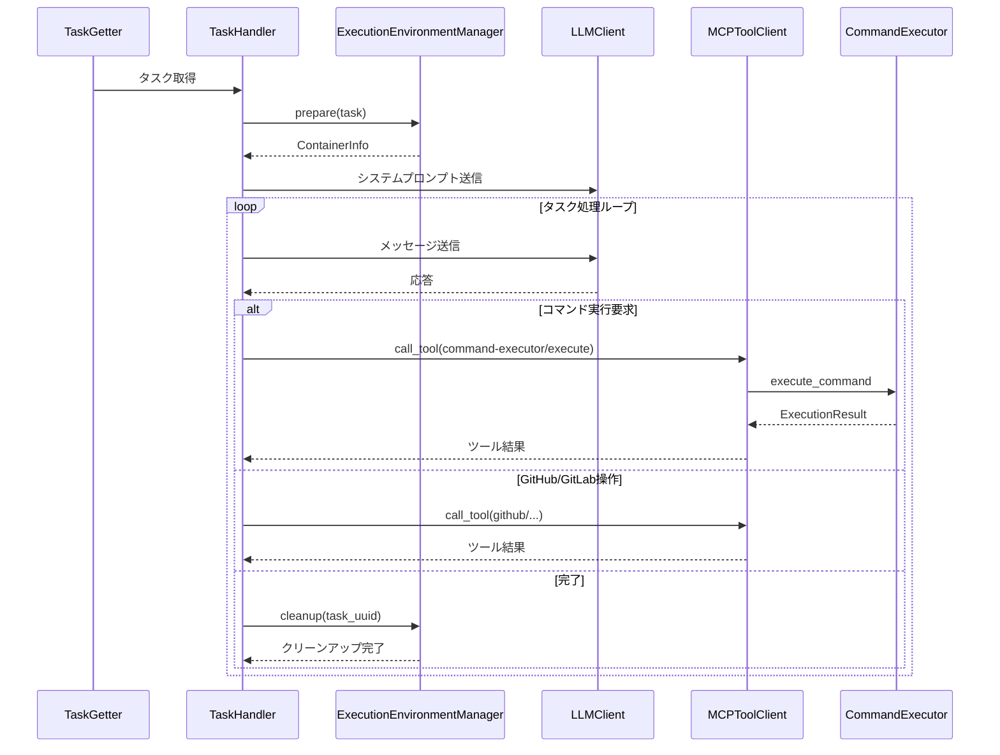

# Command Executor MCP Server連携仕様書

## 1. 概要

### 1.1 目的

本仕様書は、コーディングエージェントからCommand Executor MCP Serverを使用してコマンド実行を行うための詳細設計を定義します。Command Executor MCP Serverは、MCPプロトコル経由でOSコマンドを安全に実行するためのサーバーです。

### 1.2 背景

コーディングエージェントがGitHub/GitLabのIssueやPull Request/Merge Requestを処理する際、以下のようなコマンド実行が必要になるケースがあります：

- ビルドコマンドの実行（npm build、make、go build等）
- テストコマンドの実行（npm test、pytest、go test等）
- リンターやフォーマッターの実行（eslint、black、gofmt等）
- その他のプロジェクト固有のスクリプト実行

これらのコマンド実行を安全かつ分離された環境で行うため、Dockerコンテナを使用した実行環境を設計します。

### 1.3 要求事項

- Command Executor MCP Serverを使用してコマンド実行をサポートする
- 実行環境はDockerで独立してタスク毎に初期化される
- 実行環境にはあらかじめプロジェクトファイルをダウンロードしておく
- タスク終了時に実行環境を削除する

### 1.4 参照ドキュメント

- [Command Executor MCP Server（外部）](https://zenn.dev/sunwood_ai_labs/articles/command-executor-mcp-server-v0-1-0-release)
- [基本仕様](spec.md)
- [継続動作モード仕様](CONTINUOUS_MODE_SPECIFICATION.md)

---

## 2. システムアーキテクチャ

### 2.1 全体構成図



### 2.2 主要コンポーネント

#### ExecutionEnvironmentManager

実行環境の生成、管理、削除を担当するコンポーネントです。

**責務:**
- タスク毎のDockerコンテナの生成
- プロジェクトファイルのダウンロードとマウント
- コンテナの状態監視
- タスク終了時のコンテナ削除

#### Command Executor MCP Server

MCPプロトコルを通じてOSコマンドを実行するサーバーです。

**責務:**
- コーディングエージェントからのコマンド実行要求の受信
- 指定されたDockerコンテナ内でのコマンド実行
- 実行結果の返却

---

## 3. Docker実行環境の設計

### 3.1 コンテナライフサイクル



### 3.2 コンテナの命名規則

コンテナ名は以下の形式で生成します：

```
coding-agent-exec-{task_uuid}
```

- `task_uuid`: タスクに割り当てられた一意のUUID

この命名規則により、タスクとコンテナの紐付けを明確にし、クリーンアップ時の特定を容易にします。

### 3.3 ベースイメージの設定

実行環境のベースイメージは設定ファイルで指定可能とします。デフォルトでは汎用的な開発環境イメージを使用します。

**デフォルトイメージ:**
- Node.js、Python、Go、Java等の主要言語のランタイムを含む
- Git、curl、wget等の基本ツールを含む
- 非rootユーザーで実行

**カスタムイメージ:**
- プロジェクト毎にカスタムイメージを指定可能
- プロジェクトルートの設定ファイルで上書き可能

### 3.4 リソース制限

セキュリティとリソース管理のため、以下の制限を適用します。

**CPU制限:**
- デフォルト: 2コア相当
- 設定ファイルで変更可能

**メモリ制限:**
- デフォルト: 4GB
- 設定ファイルで変更可能

**ディスク制限:**
- 作業ディレクトリのサイズ上限を設定
- デフォルト: 10GB

**実行時間制限:**
- 単一コマンドの最大実行時間
- デフォルト: 30分

### 3.5 ネットワーク設定

**デフォルト設定:**
- 外部ネットワークへのアクセスを許可（パッケージインストール等のため）
- ホストネットワークへのアクセスは制限

**セキュリティ設定:**
- 特定ドメインへのアクセスのみ許可するホワイトリスト方式をオプションで提供
- DNS解決は許可

---

## 4. プロジェクトファイルのダウンロード仕様

### 4.1 ダウンロードフロー



### 4.2 クローン対象の決定

タスクの種類に応じて適切なブランチをクローンします。

**Issueの場合:**
- デフォルトブランチをクローン

**Pull Request/Merge Requestの場合:**
- PRソースブランチをクローン
- マージ先ブランチとの差分を確認可能な状態にする

### 4.3 認証情報の取り扱い

プライベートリポジトリへのアクセスには認証が必要です。

**GitHub:**
- 環境変数`GITHUB_PERSONAL_ACCESS_TOKEN`を使用
- git cloneのURL形式で認証情報を付与

**GitLab:**
- 環境変数`GITLAB_PERSONAL_ACCESS_TOKEN`を使用
- git cloneのURL形式で認証情報を付与

**セキュリティ考慮:**
- 認証情報はコンテナ内に永続化しない
- クローン完了後に認証情報をクリア
- ログに認証情報を出力しない

### 4.4 浅いクローン（Shallow Clone）

大規模リポジトリでの効率化のため、浅いクローンをデフォルトで使用します。

**デフォルト設定:**
- depth: 1（最新コミットのみ）

**フルクローン:**
- 設定でフルクローンを指定可能
- 履歴が必要な操作（blame、log等）の場合に使用

---

## 5. タスク毎の環境初期化仕様

### 5.1 初期化フロー



### 5.2 クリーン環境の保証

各タスクは完全にクリーンな環境で開始されることを保証します。

**初期化時の処理:**
1. 同一task_uuidのコンテナが存在する場合は削除
2. 新規コンテナを作成
3. プロジェクトファイルを新規にクローン
4. 必要に応じて依存関係をインストール

**前タスクの影響排除:**
- ファイルシステムの状態は引き継がない
- 環境変数は引き継がない
- プロセス状態は引き継がない

### 5.3 依存関係の自動インストール

プロジェクトの種類を自動検出し、依存関係をインストールします。

**検出対象:**
- package.json: `npm install` または `yarn install`
- requirements.txt: `pip install -r requirements.txt`
- condaenv.yaml / environment.yml: `mamba env create -f condaenv.yaml`（miniforge/mambaforge使用）
- go.mod: `go mod download`
- pom.xml: `mvn dependency:resolve`
- Gemfile: `bundle install`

**Conda環境について:**
- ベースイメージにminiforgeをプリインストール
- condaenv.yaml または environment.yml が存在する場合、自動的にconda環境を作成
- mambaを使用して高速な依存関係解決を実現

**自動インストールの有効/無効:**
- 設定ファイルで制御可能
- デフォルト: 有効

### 5.4 作業ディレクトリの構成

コンテナ内の作業ディレクトリは以下の構成とします。

```
/workspace/
├── project/          # クローンされたプロジェクトファイル
└── tmp/              # 一時ファイル用
```

- `/workspace/project/`: プロジェクトファイルの配置場所
- `/workspace/tmp/`: 一時ファイルの配置場所

---

## 6. コマンド実行仕様

### 6.1 Command Executor MCP Serverとの連携

コーディングエージェントはMCPプロトコルを通じてCommand Executor MCP Serverにコマンド実行を依頼します。

**MCPツール呼び出し形式:**
- ツール名: `command-executor/execute_command`
- コンテナ指定: ExecutionEnvironmentManagerから取得したコンテナIDを使用

### 6.2 コマンド実行フロー



### 6.3 許可コマンドリスト

実行環境で許可されるコマンドを以下に明示します。セキュリティと実用性のバランスを考慮して選定しています。

#### 6.3.1 ビルド・パッケージ管理コマンド

| コマンド | 説明 | 用途例 |
|---------|------|-------|
| npm | Node.jsパッケージマネージャー | `npm install`, `npm run build`, `npm test` |
| yarn | Node.jsパッケージマネージャー | `yarn install`, `yarn build`, `yarn test` |
| pnpm | Node.jsパッケージマネージャー | `pnpm install`, `pnpm build` |
| pip | Pythonパッケージマネージャー | `pip install`, `pip list` |
| pip3 | Python3パッケージマネージャー | `pip3 install -r requirements.txt` |
| conda | Conda環境・パッケージマネージャー | `conda activate`, `conda install`, `conda env create` |
| mamba | 高速Condaパッケージマネージャー | `mamba install`, `mamba env create -f condaenv.yaml` |
| python | Pythonインタープリター | `python setup.py`, `python -m pytest` |
| python3 | Python3インタープリター | `python3 -m venv`, `python3 script.py` |
| go | Go言語ツールチェーン | `go build`, `go test`, `go mod download` |
| cargo | Rustパッケージマネージャー | `cargo build`, `cargo test` |
| maven / mvn | Javaビルドツール | `mvn install`, `mvn test` |
| gradle | Javaビルドツール | `gradle build`, `gradle test` |
| make | ビルド自動化ツール | `make`, `make install`, `make test` |
| cmake | ビルドシステムジェネレーター | `cmake .`, `cmake --build .` |
| bundle | Rubyパッケージマネージャー | `bundle install`, `bundle exec` |
| gem | Rubyパッケージマネージャー | `gem install` |
| composer | PHPパッケージマネージャー | `composer install`, `composer update` |
| dotnet | .NETツールチェーン | `dotnet build`, `dotnet test` |

#### 6.3.2 テスト実行コマンド

| コマンド | 説明 | 用途例 |
|---------|------|-------|
| pytest | Pythonテストフレームワーク | `pytest`, `pytest -v`, `pytest tests/` |
| jest | JavaScriptテストフレームワーク | `jest`, `jest --coverage` |
| mocha | JavaScriptテストフレームワーク | `mocha`, `mocha tests/` |
| rspec | Rubyテストフレームワーク | `rspec`, `rspec spec/` |
| phpunit | PHPテストフレームワーク | `phpunit`, `phpunit tests/` |
| go test | Goテストコマンド | `go test ./...`, `go test -v` |
| cargo test | Rustテストコマンド | `cargo test`, `cargo test --all` |
| dotnet test | .NETテストコマンド | `dotnet test` |

#### 6.3.3 リンター・フォーマッターコマンド

| コマンド | 説明 | 用途例 |
|---------|------|-------|
| eslint | JavaScriptリンター | `eslint .`, `eslint --fix .` |
| prettier | コードフォーマッター | `prettier --check .`, `prettier --write .` |
| black | Pythonフォーマッター | `black .`, `black --check .` |
| flake8 | Pythonリンター | `flake8`, `flake8 src/` |
| pylint | Pythonリンター | `pylint src/` |
| mypy | Python型チェッカー | `mypy src/` |
| rubocop | Rubyリンター | `rubocop`, `rubocop -a` |
| gofmt | Goフォーマッター | `gofmt -w .` |
| golint | Goリンター | `golint ./...` |
| rustfmt | Rustフォーマッター | `rustfmt --check .` |
| clippy | Rustリンター | `cargo clippy` |
| tsc | TypeScriptコンパイラ | `tsc --noEmit`, `tsc` |

#### 6.3.4 ファイル操作・検索コマンド

| コマンド | 説明 | 用途例 |
|---------|------|-------|
| ls | ファイル一覧表示 | `ls -la`, `ls -R` |
| cat | ファイル内容表示 | `cat file.txt` |
| head | ファイル先頭表示 | `head -n 50 file.txt` |
| tail | ファイル末尾表示 | `tail -n 50 file.txt` |
| grep | テキスト検索 | `grep -r "pattern" .`, `grep -rn "function" src/` |
| find | ファイル検索 | `find . -name "*.py"`, `find . -type f` |
| wc | 行数・文字数カウント | `wc -l file.txt` |
| diff | ファイル差分表示 | `diff file1.txt file2.txt` |
| tree | ディレクトリ構造表示 | `tree`, `tree -L 2` |
| file | ファイルタイプ判定 | `file filename` |
| stat | ファイル情報表示 | `stat filename` |

#### 6.3.5 バージョン管理コマンド

| コマンド | 説明 | 用途例 |
|---------|------|-------|
| git status | リポジトリ状態確認 | `git status` |
| git diff | 差分表示 | `git diff`, `git diff HEAD~1` |
| git log | コミット履歴表示 | `git log --oneline -10` |
| git branch | ブランチ一覧・操作 | `git branch`, `git branch -a` |
| git show | コミット内容表示 | `git show HEAD` |
| git blame | 行ごとの変更者表示 | `git blame file.txt` |

#### 6.3.6 その他のユーティリティコマンド

| コマンド | 説明 | 用途例 |
|---------|------|-------|
| echo | テキスト出力 | `echo "text"` |
| pwd | カレントディレクトリ表示 | `pwd` |
| cd | ディレクトリ移動 | `cd src/` |
| mkdir | ディレクトリ作成 | `mkdir -p dir/subdir` |
| rm | ファイル削除（単一ファイル） | `rm file.txt` |
| cp | ファイルコピー | `cp src.txt dst.txt` |
| mv | ファイル移動・リネーム | `mv old.txt new.txt` |
| touch | ファイル作成・更新 | `touch newfile.txt` |
| chmod | 権限変更 | `chmod +x script.sh` |
| env | 環境変数表示 | `env` |
| which | コマンドパス表示 | `which python` |
| curl | HTTP通信（読み取り専用） | `curl -s https://api.example.com` |
| wget | ファイルダウンロード | `wget https://example.com/file` |
| tar | アーカイブ操作 | `tar -xzf archive.tar.gz` |
| unzip | ZIP解凍 | `unzip archive.zip` |
| jq | JSON処理 | `cat data.json` パイプ `jq '.key'` |
| sed | テキスト置換（標準出力） | `sed 's/old/new/g' file.txt` |
| awk | テキスト処理 | `awk '{print $1}' file.txt` |
| sort | ソート | `sort file.txt` |
| uniq | 重複除去 | `uniq file.txt` |
| xargs | 引数展開 | `find . -name "*.txt"` パイプ `xargs grep "pattern"` |

#### 6.3.7 禁止コマンドリスト

以下のコマンドはセキュリティ上の理由から実行を禁止します。

| コマンド | 禁止理由 |
|---------|---------|
| sudo | 特権昇格の防止 |
| su | ユーザー切り替えの防止 |
| rm -rf | 再帰的強制削除による誤削除の防止 |
| chmod 777 | 過剰な権限付与の防止 |
| chown | 所有者変更の防止 |
| mount / umount | ファイルシステム操作の防止 |
| iptables / ip6tables | ネットワーク設定変更の防止 |
| systemctl / service | サービス制御の防止 |
| kill / killall | プロセス強制終了の防止（自身のプロセス以外） |
| reboot / shutdown | システム制御の防止 |
| dd | 低レベルディスク操作の防止 |
| mkfs | ファイルシステム作成の防止 |
| fdisk / parted | パーティション操作の防止 |
| nc / netcat | 任意ネットワーク接続の防止 |
| nmap | ネットワークスキャンの防止 |
| ssh | リモート接続の防止 |
| scp / rsync | リモートファイル転送の防止（外部への） |

#### 6.3.8 コマンド許可リストの設定

設定ファイルでコマンド許可リストをカスタマイズできます。

```yaml
command_executor:
  # 許可コマンドの設定
  allowed_commands:
    # デフォルト許可リストを使用するか
    use_default: true
    
    # 追加で許可するコマンド
    additional:
      - "custom-build-tool"
      - "project-specific-script"
    
    # デフォルトから除外するコマンド
    exclude:
      - "curl"
      - "wget"
    
    # 完全カスタムリスト（use_default: falseの場合に使用）
    custom_list:
      - "npm"
      - "python"
      - "grep"
```

### 6.4 実行結果の取得

コマンド実行結果は以下の情報を含みます。

**返却される情報:**
- exit_code: コマンドの終了コード
- stdout: 標準出力の内容
- stderr: 標準エラー出力の内容
- duration: 実行時間（ミリ秒）

**出力の制限:**
- stdout/stderrの最大サイズを制限
- デフォルト: 各1MB
- 超過した場合は末尾を切り詰め

### 6.5 システムプロンプト拡張仕様

LLMがCommand Executor MCP Serverの機能を適切に活用できるよう、システムプロンプトに以下の情報を追加します。

#### 6.5.1 追加するプロンプト内容

システムプロンプトに以下の文言を追加します：

```
## Command Execution Feature

You can execute commands in an isolated Docker execution environment with project source code through the `command-executor` MCP server.

**Execution Environment Information:**
- Working directory: `/workspace/project/` (where project files are cloned)
- Dependencies: Automatically installed

### Available Commands

The following commands are available for execution:

{allowed_commands_list}

### Key Features

**Test Execution:**
- Run the project's test suite to verify code changes work correctly
- Examples: `npm test`, `pytest`, `go test ./...`, `cargo test`

**Code Search:**
- Use `grep` command to recursively search for code patterns across the entire project
- Example: `grep -rn "function_name" src/` to find function usage locations
- Example: `grep -r "import.*module" --include="*.py"` to search Python import statements

**Build/Compile:**
- Execute project build commands to check for compilation errors
- Examples: `npm run build`, `make`, `go build`, `cargo build`

**Linter/Formatter:**
- Perform code quality checks and format verification
- Examples: `eslint .`, `black --check .`, `flake8`

**File Operations:**
- Use `ls`, `cat`, `head`, `tail`, `find`, `tree` to check file structure and code contents
- Example: `find . -name "*.ts" -type f` to search for TypeScript files
- Example: `tree -L 2` to display directory structure

### Usage Notes

- Project source code is cloned to `/workspace/project/` in the execution environment
- Dependencies are automatically installed
- Check command execution results (stdout/stderr) and determine the next action
- Long-running commands may timeout

### Recommended Usage

1. **Before code changes**: Search the codebase with `grep` to understand the impact scope of changes
2. **After code changes**: Run tests to verify the correctness of changes
3. **Before creating pull request**: Run linters to verify code quality
```

#### 6.5.2 許可コマンドリストの埋め込み

システムプロンプト内の `{allowed_commands_list}` プレースホルダーは、セクション6.3で定義された許可コマンドリストの内容で動的に置き換えられます。

**置き換え内容:**
- ビルド・パッケージ管理コマンド（npm, yarn, pip, conda, mamba, go, cargo等）
- テスト実行コマンド（pytest, jest, go test等）
- リンター・フォーマッターコマンド（eslint, black, flake8等）
- ファイル操作・検索コマンド（grep, find, ls, cat等）
- バージョン管理コマンド（git status, git diff等）
- その他ユーティリティコマンド

**生成形式例:**
```
Build/Package Management: npm, yarn, pnpm, pip, pip3, conda, mamba, python, python3, go, cargo, maven, gradle, make, cmake, bundle, gem, composer, dotnet
Test Execution: pytest, jest, mocha, rspec, phpunit, go test, cargo test, dotnet test
Linter/Formatter: eslint, prettier, black, flake8, pylint, mypy, rubocop, gofmt, golint, rustfmt, clippy, tsc
File Operations: ls, cat, head, tail, grep, find, wc, diff, tree, file, stat
Version Control: git status, git diff, git log, git branch, git show, git blame
Utilities: echo, pwd, cd, mkdir, rm, cp, mv, touch, chmod, env, which, curl, wget, tar, unzip, jq, sed, awk, sort, uniq, xargs
```

#### 6.5.3 プロンプト挿入位置

システムプロンプトの以下の位置に挿入します：

- MCPサーバー一覧（Available MCP Tools）セクションの直後
- Behavior Rulesセクションの直前

#### 6.5.4 動的プロンプト生成

Command Executor機能が有効な場合のみ、上記プロンプトをシステムプロンプトに追加します。

**条件:**
- `command_executor.enabled` が `true` の場合に追加
- `false` の場合はプロンプトに含めない

**プロンプトテンプレートファイル:**
- ファイル名: `system_prompt_command_executor.txt`
- 配置場所: プロジェクトルート

---

## 7. 実行環境の削除仕様

### 7.1 削除トリガー

実行環境は以下のタイミングで削除されます。

**正常終了時:**
- タスク処理が正常に完了した場合
- LLMがdone: trueを返却した場合

**異常終了時:**
- エラーによりタスクが中断された場合
- 最大処理数超過でタスクが終了した場合

**一時停止時:**
- タスクが一時停止された場合
- 再開時に新規コンテナを作成

**タスク停止時:**
- アサイン解除によりタスクが停止された場合

### 7.2 削除フロー



### 7.3 クリーンアップ処理

**コンテナ削除:**
1. コンテナが実行中の場合は停止（graceful shutdown）
2. 停止猶予時間（デフォルト: 10秒）経過後に強制停止
3. コンテナを削除

**ボリューム削除:**
- コンテナに関連付けられたボリュームを削除
- 匿名ボリュームも含めて削除

**ネットワーク削除:**
- タスク専用のネットワークが作成されていた場合は削除

### 7.4 残存リソースの定期クリーンアップ

異常終了等で削除されなかったリソースを定期的にクリーンアップします。

**クリーンアップ対象:**
- 命名規則に合致するコンテナ（coding-agent-exec-*）
- 作成から一定時間経過したもの（デフォルト: 24時間）

**実行タイミング:**
- Producer起動時
- 設定した間隔での定期実行

---

## 8. エラーハンドリング

### 8.1 エラー種別と対応

#### コンテナ作成エラー

**原因:**
- Docker APIへの接続失敗
- リソース不足
- イメージの取得失敗

**対応:**
1. エラーログを記録
2. Issue/MRにエラーコメントを投稿
3. タスクをエラー状態で終了

#### プロジェクトクローンエラー

**原因:**
- 認証エラー
- ネットワークエラー
- リポジトリが存在しない

**対応:**
1. エラーログを記録
2. 作成したコンテナを削除
3. Issue/MRにエラーコメントを投稿
4. タスクをエラー状態で終了

#### コマンド実行エラー

**原因:**
- コマンドが存在しない
- 権限不足
- タイムアウト

**対応:**
1. エラー内容をLLMに通知
2. LLMが代替手段を検討
3. 必要に応じてリフレクション実行

#### コンテナ削除エラー

**原因:**
- Docker APIへの接続失敗
- コンテナがビジー状態

**対応:**
1. 警告ログを記録
2. 削除をリトライ（最大3回）
3. 失敗した場合は残存リソースとして記録

### 8.2 タイムアウト処理

**コマンド実行タイムアウト:**
- 設定された最大実行時間を超過した場合
- コマンドを強制終了
- タイムアウトエラーをLLMに通知

**コンテナ操作タイムアウト:**
- Docker API呼び出しのタイムアウト
- デフォルト: 60秒
- タイムアウト時はリトライ後にエラー

---

## 9. セキュリティ考慮事項

### 9.1 コンテナ分離

**名前空間の分離:**
- 各タスクは独立したコンテナで実行
- プロセス、ネットワーク、ファイルシステムが分離

**権限の最小化:**
- コンテナは非特権モードで実行
- rootユーザーでの実行を禁止

### 9.2 認証情報の保護

**一時的な使用:**
- 認証情報はクローン時のみ使用
- コンテナ内に永続化しない

**ログ出力の制御:**
- 認証情報をログに出力しない
- URLはサニタイズして出力

### 9.3 リソース制限

**DoS攻撃の防止:**
- CPU、メモリ、ディスクの使用量を制限
- コマンド実行時間を制限

**フォークボムの防止:**
- プロセス数の上限を設定

### 9.4 ネットワークセキュリティ

**アウトバウンド通信の制御:**
- 必要なドメインのみアクセス許可（オプション）
- 内部ネットワークへのアクセス制限

---

## 10. 設定ファイル仕様

### 10.1 config.yamlへの追加設定

```yaml
# Command Executor MCP Server連携設定
command_executor:
  # 機能の有効/無効（デフォルト: false）
  enabled: false
  
  # MCP Server設定
  mcp_server:
    # サーバー名
    name: "command-executor"
    # コマンド
    command:
      - "npx"
      - "@sunwood-ai-labs/command-executor-mcp-server"
  
  # Docker実行環境設定
  docker:
    # ベースイメージ
    base_image: "coding-agent-executor:latest"
    
    # リソース制限
    resources:
      # CPU制限（コア数）
      cpu_limit: 2
      # メモリ制限
      memory_limit: "4g"
      # ディスク制限
      disk_limit: "10g"
    
    # ネットワーク設定
    network:
      # 外部ネットワークアクセスの許可
      external_access: true
      # ホワイトリストモード（external_accessがtrueの場合のみ有効）
      whitelist_mode: false
      # 許可ドメインリスト
      allowed_domains: []
  
  # プロジェクトクローン設定
  clone:
    # 浅いクローンの使用
    shallow: true
    # 浅いクローンの深さ
    depth: 1
    # 依存関係の自動インストール
    auto_install_deps: true
  
  # コマンド実行設定
  execution:
    # コマンド実行の最大時間（秒）
    timeout_seconds: 1800
    # 出力の最大サイズ（バイト）
    max_output_size: 1048576
  
  # クリーンアップ設定
  cleanup:
    # 残存リソースのクリーンアップ間隔（時間）
    interval_hours: 24
    # 残存とみなす経過時間（時間）
    stale_threshold_hours: 24
```

### 10.2 環境変数

| 環境変数名 | 説明 | デフォルト値 |
|-----------|------|-------------|
| COMMAND_EXECUTOR_ENABLED | 機能の有効/無効 | false |
| DOCKER_HOST | Docker APIエンドポイント | unix:///var/run/docker.sock |
| EXECUTOR_BASE_IMAGE | ベースイメージ | coding-agent-executor:latest |
| EXECUTOR_CPU_LIMIT | CPU制限 | 2 |
| EXECUTOR_MEMORY_LIMIT | メモリ制限 | 4g |
| EXECUTOR_TIMEOUT | コマンドタイムアウト | 1800 |

---

## 11. クラス設計

### 11.1 クラス図



### 11.2 クラスの責務

#### ExecutionEnvironmentManager

タスク毎の実行環境を管理するクラスです。

**メソッド:**
- `prepare(task)`: タスク用のコンテナを作成し、プロジェクトをクローン
- `execute(container_id, command)`: 指定コンテナでコマンドを実行
- `cleanup(task_uuid)`: タスク終了時にコンテナを削除
- `cleanup_stale_containers()`: 残存コンテナの定期クリーンアップ

#### ContainerInfo

コンテナの情報を保持するデータクラスです。

**属性:**
- `container_id`: DockerコンテナID
- `task_uuid`: 関連するタスクのUUID
- `workspace_path`: コンテナ内の作業ディレクトリパス
- `created_at`: コンテナ作成日時
- `status`: コンテナの状態

#### ExecutionResult

コマンド実行結果を保持するデータクラスです。

**属性:**
- `exit_code`: コマンドの終了コード
- `stdout`: 標準出力
- `stderr`: 標準エラー出力
- `duration_ms`: 実行時間（ミリ秒）

---

## 12. 処理シーケンス

### 12.1 タスク処理全体フロー



---

## 13. 運用ガイドライン

### 13.1 前提条件

**Docker環境:**
- Docker Engine 20.10以上
- Docker API経由でのアクセスが可能

**ベースイメージ:**
- 事前にベースイメージをビルドして配置

### 13.2 監視項目

**リソース監視:**
- コンテナのCPU/メモリ使用量
- ディスク使用量
- 残存コンテナ数

**エラー監視:**
- コンテナ作成失敗
- クローン失敗
- コマンドタイムアウト

### 13.3 トラブルシューティング

**コンテナが残存する場合:**
- 手動での削除コマンドを実行
- クリーンアップ間隔の見直し

**クローンが失敗する場合:**
- 認証情報の確認
- ネットワーク接続の確認
- リポジトリURLの確認

**コマンドがタイムアウトする場合:**
- タイムアウト値の見直し
- コマンドの最適化
- リソース制限の見直し

---

## 14. 今後の拡張

### 14.1 検討中の機能

**キャッシュ機能:**
- 依存関係のキャッシュ
- ビルド成果物のキャッシュ

**並列実行:**
- 複数コマンドの並列実行
- 複数コンテナの同時管理

**カスタム環境:**
- プロジェクト毎のカスタムDockerfile
- 環境変数のカスタマイズ

### 14.2 制限事項

**現バージョンでの制限:**
- GUIアプリケーションの実行は非対応
- GPUの使用は非対応
- Windows/macOS固有のコマンドは非対応

---

## 15. 関連ドキュメント

- [基本仕様](spec.md)
- [クラス設計](class_spec.md)
- [継続動作モード仕様](CONTINUOUS_MODE_SPECIFICATION.md)
- [プロジェクトエージェントルール仕様](PROJECT_AGENT_RULES_SPECIFICATION.md)

---

**文書バージョン:** 1.0  
**最終更新日:** 2024-11-28  
**ステータス:** 設計中
