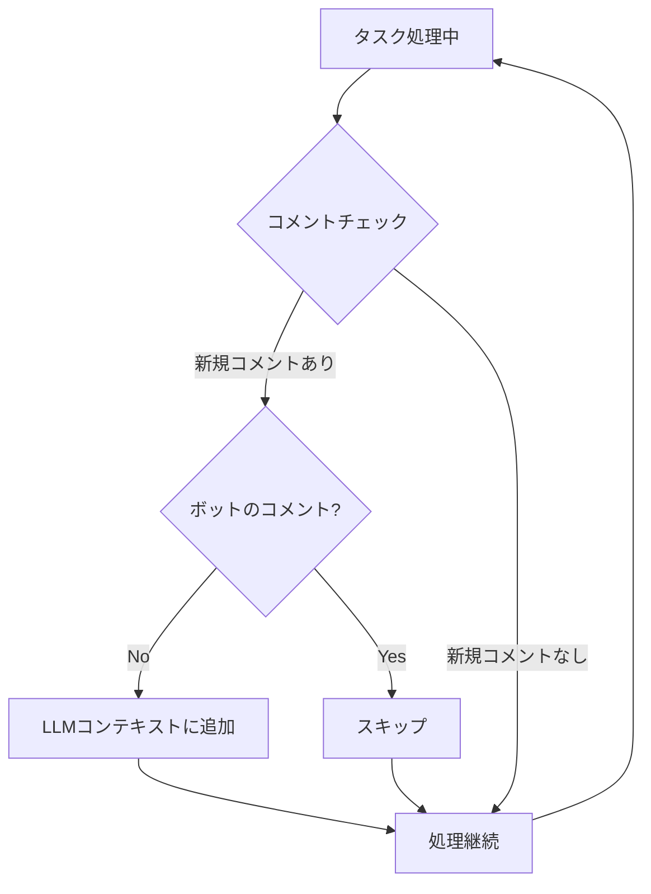
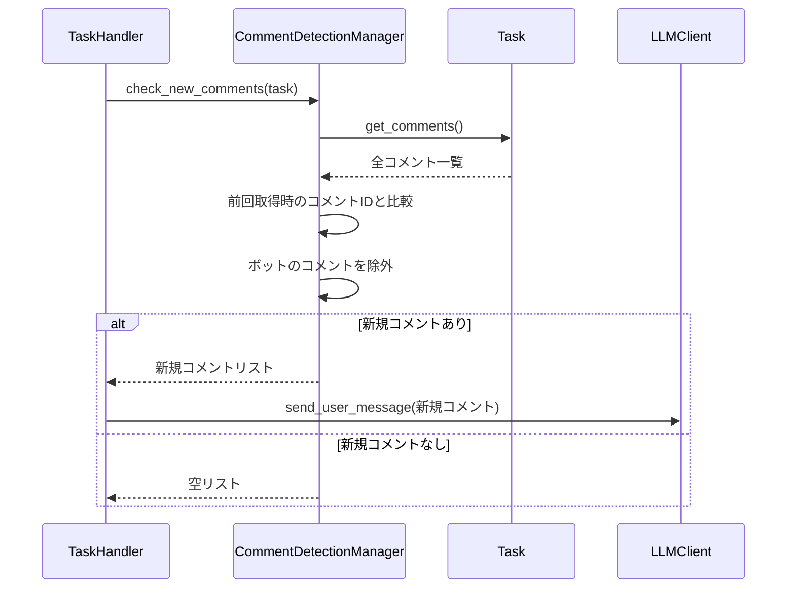

# 新規コメント検知機能仕様書

## 1. 概要

### 1.1 目的

タスク処理中に追加されたユーザーコメントを検知し、LLMコンテキストに反映する機能を設計します。これにより、ユーザーからのフィードバックや追加指示をリアルタイムに処理に反映できます。

### 1.2 要求事項

- 処理中にIssue/PR/MRに追加されたコメントを検知できること
- ボット自身のコメントは検知対象から除外すること
- 検知したコメントをLLMコンテキストに追加すること
- 一時停止チェックと同じタイミングでコメントチェックを実行すること

---

## 2. 処理フロー

### 2.1 全体フロー図

### 2.2 コメントチェックのタイミング

- LLM応答を取得した後、次のアクション実行前
- ツール実行完了後、LLMへの結果送信前
- 処理ループの各イテレーション開始時
- 一時停止チェックと同じタイミング

---

## 3. 新規コメント検知

### 3.1 検知方法

### 3.2 差分検知の方法

1. 現在のコメント一覧を取得
2. 前回チェック時のコメントIDリストと比較
3. 前回に存在しなかったコメントを新規コメントとして特定
4. 前回のコメントIDリストを更新

### 3.3 ボット除外

config.yamlで設定されたbot_name（GitHub）またはbot_name（GitLab）とコメント投稿者を比較してボットを識別し、除外します。

---

## 4. LLMコンテキストへの追加

### 4.1 追加フォーマット

新規コメントは以下の形式でLLMに送信されます：

- 追加指示であることを示すヘッダー
- コメント投稿者名
- コメント内容
- 処理継続の指示

### 4.2 複数コメントの処理

複数の新規コメントがある場合は、投稿順（古い順）に連結して1つのメッセージとしてLLMに送信します。

---

## 5. 設定オプション

### 5.1 config.yamlの設定項目

comment_detectionセクションで以下を設定します：

- **enabled**: コメント検知機能の有効/無効（デフォルト: true）
- **check_interval**: コメントチェック間隔（LLMループN回ごと、デフォルト: 1）

---

## 6. CommentDetectionManagerクラス

### 6.1 責務

- コメント一覧の取得
- 新規コメントの検知
- ボットコメントの除外
- コメントIDの管理

### 6.2 主要メソッド

- **check_new_comments**: 新規コメントを検知し、ボットを除外したリストを返す
- **format_comments_for_llm**: 新規コメントをLLM送信用にフォーマット

### 6.3 状態管理

- **last_comment_ids**: 前回チェック時のコメントIDリスト
- タスクごとにインスタンスを生成し、状態を管理

---

## 7. GitHub/GitLab連携

### 7.1 GitHub

GitHub APIを使用してIssue/PRのコメントを取得します。

**取得対象:**
- Issueコメント
- PRレビューコメント（オプション）

### 7.2 GitLab

GitLab APIを使用してIssue/MRのコメント（ノート）を取得します。

**取得対象:**
- Issueノート
- MRノート

---

## 8. エラーハンドリング

### 8.1 コメント取得エラー

- **API通信エラー**: ログ出力後、処理を継続（コメント検知をスキップ）
- **パースエラー**: ログ出力後、処理を継続

### 8.2 LLMコンテキスト追加エラー

- **追加失敗**: ログ出力後、処理を継続

---

## 9. 関連ドキュメント

- [一時停止・再開機能仕様](PAUSE_RESUME_SPECIFICATION.md)
- [タスク停止機能仕様](TASK_STOP_SPECIFICATION.md)

---

**文書バージョン:** 2.0  
**最終更新日:** 2024-11-28  
**ステータス:** 実装済み
