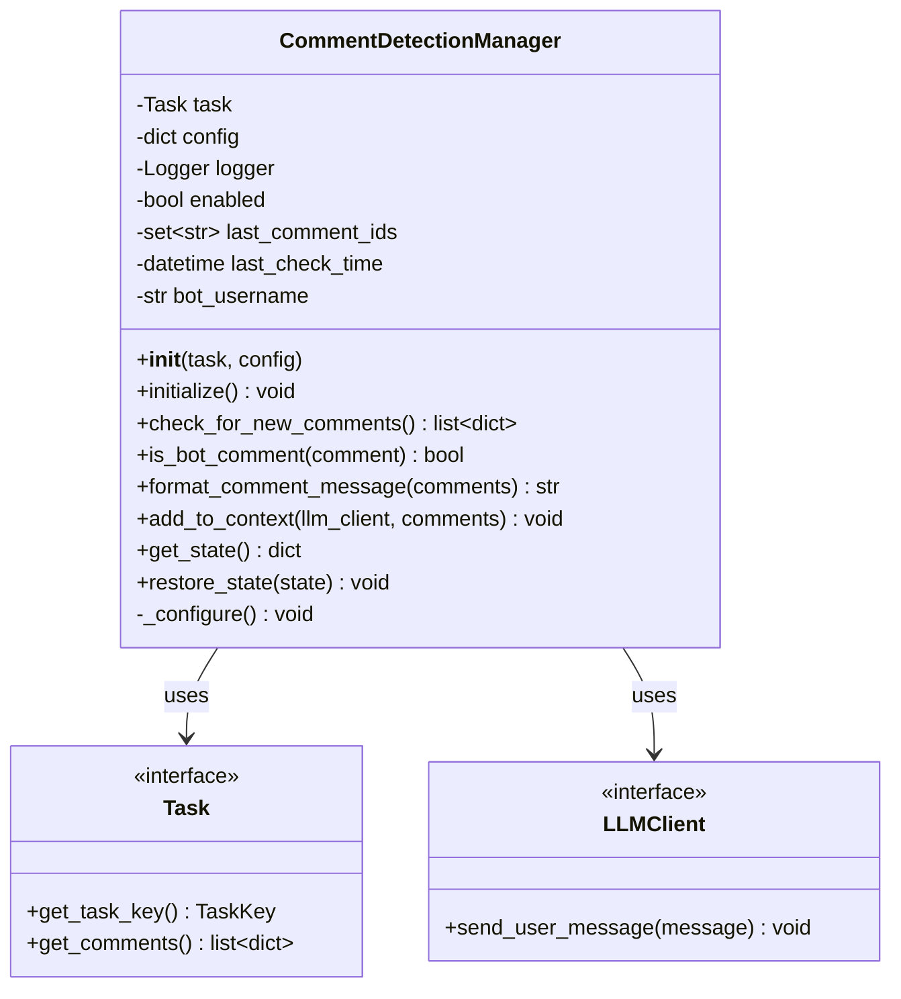
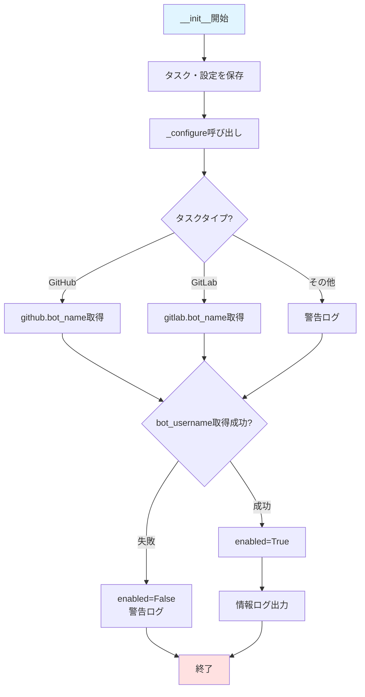
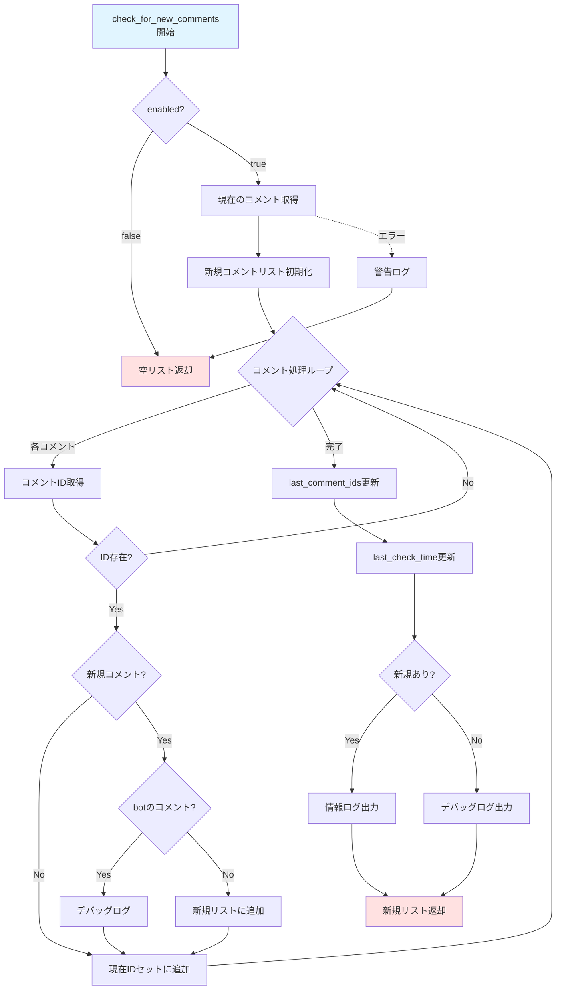
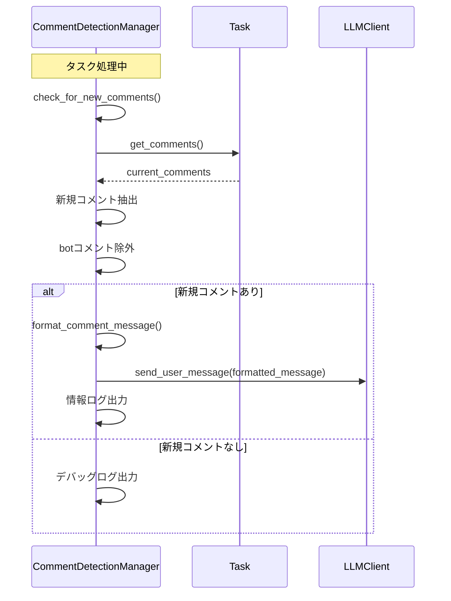

# 新規コメント検知機能 詳細設計書

## 1. 概要

### 1.1 目的

タスク処理中にIssue/PR/MRに追加されたユーザーコメントを検知し、LLMコンテキストに反映する機能を提供します。これにより、ユーザーからのフィードバックや追加指示をリアルタイムに処理に反映できます。

### 1.2 主要機能

- 処理中に追加されたコメントの自動検知
- ボット自身のコメントの除外
- 検知したコメントのLLMコンテキストへの自動追加
- 一時停止・再開時の状態永続化

### 1.3 対応プラットフォーム

- **GitHub**: Issue、Pull Request
- **GitLab**: Issue、Merge Request

---

## 2. CommentDetectionManager クラス

### 2.1 クラス概要

`CommentDetectionManager`は、Issue/MRの新規コメント検出を管理するクラスです。タスク処理中に定期的に呼び出され、新規ユーザーコメントを検出してLLMコンテキストに追加します。

**ファイル**: `comment_detection_manager.py`

### 2.2 クラス属性

| 属性名 | 型 | 説明 |
|--------|-----|------|
| task | Task | 処理対象のタスクオブジェクト |
| config | dict[str, Any] | アプリケーション設定辞書 |
| logger | Logger | ログ出力用のロガー |
| enabled | bool | コメント検出機能の有効/無効フラグ |
| last_comment_ids | set[str] | 前回までのコメントIDセット |
| last_check_time | datetime \| None | 前回チェック時刻 |
| bot_username | str \| None | bot自身のユーザー名（除外用） |

### 2.3 メソッド一覧

#### 2.3.1 __init__(task, config)

**処理内容**:
CommentDetectionManagerを初期化します。

**詳細処理**:
1. タスクオブジェクトを保存
2. 設定辞書を保存
3. ロガーを初期化
4. 有効/無効フラグを`False`で初期化
5. コメントIDセットを空で初期化
6. チェック時刻を`None`で初期化
7. bot_usernameを`None`で初期化
8. `_configure()`を呼び出して設定を読み込み

**パラメータ**:
- `task`: 処理対象のTaskオブジェクト
- `config`: アプリケーション設定辞書

**戻り値**: なし

#### 2.3.2 _configure()

**処理内容**:
設定からbot_usernameを取得し、機能の有効/無効を決定します。

**詳細処理**:
1. タスクキーを取得
2. タスクタイプを取得（"type"フィールド）
3. タスクタイプに応じてbot_usernameを取得:
   - GitHub (`"github"`で始まる): `config["github"]["bot_name"]`
   - GitLab (`"gitlab"`で始まる): `config["gitlab"]["bot_name"]`
   - その他: 警告ログを出力、`None`を設定
4. bot_usernameが取得できない場合:
   - 警告ログを出力
   - `enabled`を`False`に設定
5. bot_usernameが取得できた場合:
   - `enabled`を`True`に設定
   - 情報ログを出力（bot_usernameを含む）

**パラメータ**: なし

**戻り値**: なし

#### 2.3.3 initialize()

**処理内容**:
現在のコメント一覧を取得してlast_comment_idsを初期化します。タスク開始時に呼び出されます。

**詳細処理**:
1. `enabled`が`False`の場合、デバッグログを出力して終了
2. `task.get_comments()`で現在のコメント一覧を取得
3. 各コメントからIDを取得し、文字列として`last_comment_ids`セットに追加
4. 現在時刻を`last_check_time`に記録（UTC）
5. 情報ログを出力（記録したコメント数を含む）
6. エラー発生時は警告ログを出力して処理を継続

**パラメータ**: なし

**戻り値**: なし

**例外処理**:
- すべての例外をキャッチし、警告ログを出力
- エラーでも処理は継続（機能を無効化しない）

#### 2.3.4 check_for_new_comments()

**処理内容**:
新規コメントを検出します。

**詳細処理**:
1. `enabled`が`False`の場合、空リストを返す
2. `task.get_comments()`で現在のコメント一覧を取得
3. 新規コメントリストを初期化
4. 現在のIDセットを初期化
5. 各コメントに対して:
   - コメントIDを取得（`None`の場合はスキップ）
   - 文字列に変換して現在IDセットに追加
   - `last_comment_ids`にIDが存在しない場合:
     - `is_bot_comment()`でbot自身のコメントか確認
     - botのコメントでない場合、新規コメントリストに追加
     - botのコメントの場合、デバッグログを出力
6. `last_comment_ids`を現在のIDセットで更新
7. 現在時刻を`last_check_time`に記録
8. 新規コメントがある場合、情報ログを出力
9. 新規コメントがない場合、デバッグログを出力
10. 新規コメントリストを返す
11. エラー発生時は警告ログを出力し、空リストを返す

**パラメータ**: なし

**戻り値**:
- `list[dict[str, Any]]`: 新規コメントのリスト（空の場合は新規なし）

**例外処理**:
- すべての例外をキャッチし、警告ログを出力
- エラー時は空リストを返して処理を継続

#### 2.3.5 is_bot_comment(comment)

**処理内容**:
コメントがbot自身によるものか判定します。

**詳細処理**:
1. `bot_username`が`None`の場合、`False`を返す
2. コメントから"author"フィールドを取得
3. authorが`bot_username`と一致するか比較
4. 一致する場合`True`、しない場合`False`を返す

**パラメータ**:
- `comment`: コメント情報の辞書

**戻り値**:
- `bool`: botのコメントの場合`True`

#### 2.3.6 format_comment_message(comments)

**処理内容**:
検出したコメントをLLMメッセージ形式に整形します。

**詳細処理**:
1. コメントリストが空の場合、空文字列を返す
2. コメントが1件の場合:
   - authorとbodyを取得
   - `[New Comment from @{author}]:\n{body}`形式で返す
3. コメントが複数件の場合:
   - `[New Comments Detected]:`で開始
   - 各コメントに対して:
     - `Comment {番号} from @{author} ({timestamp}):`
     - コメント本文
     - 空行
   - 改行で結合して返す

**パラメータ**:
- `comments`: コメントリスト

**戻り値**:
- `str`: 整形されたメッセージ文字列

#### 2.3.7 add_to_context(llm_client, comments)

**処理内容**:
検出したコメントをLLMコンテキストに追加します。

**詳細処理**:
1. コメントリストが空の場合、何もせず終了
2. `format_comment_message()`でメッセージを整形
3. `llm_client.send_user_message()`でLLMコンテキストに追加
4. 情報ログを出力（追加したコメント数を含む）
5. エラー発生時は警告ログを出力

**パラメータ**:
- `llm_client`: LLMクライアントインスタンス
- `comments`: 追加するコメントのリスト

**戻り値**: なし

**例外処理**:
- すべての例外をキャッチし、警告ログを出力
- エラーでも処理は継続

#### 2.3.8 get_state()

**処理内容**:
一時停止時の状態永続化用に現在の状態を取得します。

**詳細処理**:
1. 状態辞書を作成:
   - `last_comment_ids`: セットをリストに変換
   - `last_check_timestamp`: datetimeをISO形式文字列に変換（`None`の場合は`None`）
2. 状態辞書を返す

**パラメータ**: なし

**戻り値**:
- `dict[str, Any]`: 状態辞書

#### 2.3.9 restore_state(state)

**処理内容**:
再開時の状態復元を行います。

**詳細処理**:
1. stateが空の場合、デバッグログを出力して終了
2. `last_comment_ids`を復元:
   - state["last_comment_ids"]をリストで取得
   - セットに変換して`last_comment_ids`に設定
3. `last_check_time`を復元:
   - state["last_check_timestamp"]を取得
   - ISO形式文字列からdatetimeに変換
   - `last_check_time`に設定
4. 情報ログを出力（復元したコメントID数を含む）
5. エラー発生時:
   - 警告ログを出力
   - `initialize()`を呼び出して新規初期化

**パラメータ**:
- `state`: `get_state()`と同じ構造の状態辞書

**戻り値**: なし

**例外処理**:
- すべての例外をキャッチし、警告ログを出力
- 復元失敗時は新規初期化を実行

### 2.4 クラス図



### 2.5 処理フロー図

#### 初期化フロー



#### コメント検出フロー



#### コンテキスト追加フロー



---

## 3. 使用方法

### 3.1 初期化

```python
# TaskHandlerまたはPlanningCoordinator内で初期化
comment_manager = CommentDetectionManager(task, config)
comment_manager.initialize()
```

### 3.2 定期的なチェック

```python
# LLM処理ループ内で定期的に呼び出し
new_comments = comment_manager.check_for_new_comments()
if new_comments:
    comment_manager.add_to_context(llm_client, new_comments)
```

### 3.3 一時停止・再開

```python
# 一時停止時の状態保存
state = comment_manager.get_state()
# ... 状態をファイルに保存 ...

# 再開時の状態復元
# ... ファイルから状態を読み込み ...
comment_manager.restore_state(state)
```

---

## 4. 設定

### 4.1 必要な設定項目

#### GitHub使用時

```yaml
github:
  bot_name: "your-bot-username"
```

#### GitLab使用時

```yaml
gitlab:
  bot_name: "your-bot-username"
```

### 4.2 bot_name の取得方法

- **GitHub**: ボットとして使用しているアカウントのユーザー名
- **GitLab**: ボットとして使用しているアカウントのユーザー名

bot_nameが設定されていない場合、機能は自動的に無効化されます。

---

## 5. チェックタイミング

CommentDetectionManagerは以下のタイミングで呼び出されます：

### 5.1 Planning モード（PlanningCoordinator）

- 各フェーズの実行前
- ツール実行完了後
- LLM応答取得後
- 一時停止チェックと同じタイミング

### 5.2 Context Storage / Legacy モード（TaskHandler）

- LLM応答取得後
- ツール実行完了後
- 処理ループの各イテレーション

---

## 6. エラーハンドリング

### 6.1 エラー時の動作

すべてのメソッドでエラーが発生した場合：

1. **警告ログを出力**
2. **処理を継続**（タスク全体を失敗させない）
3. **デフォルト値を返す**（空リスト、False等）

### 6.2 復元失敗時の動作

`restore_state()`でエラーが発生した場合：

1. 警告ログを出力
2. `initialize()`を呼び出して新規初期化
3. 現在のコメント一覧から開始

---

## 7. ログ出力

### 7.1 ログレベル

- **INFO**: 機能の有効化、新規コメント検出、状態復元成功
- **DEBUG**: コメントチェック結果（新規なし）、botコメント除外
- **WARNING**: 設定エラー、コメント取得エラー、復元失敗

### 7.2 ログ例

```
INFO - コメント検出機能を有効化しました (bot_username=my-bot)
INFO - コメント検出を初期化しました: 5件のコメントを記録
INFO - 新規コメントを検出しました: 2件 (Task: abc-123)
INFO - 新規コメントをコンテキストに追加しました: 2件 (Task: abc-123)
DEBUG - bot自身のコメントを除外しました: id=12345
WARNING - bot_usernameが設定されていません。コメント検出機能を無効化します。
```

---

## 8. テスト

### 8.1 ユニットテスト

テストファイル: `tests/unit/test_comment_detection_manager.py`

### 8.2 テストケース

- コメント検出機能の初期化
- 新規コメントの検出
- botコメントの除外
- メッセージの整形
- 状態の保存と復元
- エラー時の挙動

---

## 9. まとめ

### 9.1 主要な特徴

- **自動検出**: 定期的な呼び出しで新規コメントを自動検出
- **bot除外**: 自身のコメントは自動的に除外
- **LLM連携**: 検出したコメントを自動的にLLMコンテキストに追加
- **状態管理**: 一時停止・再開時の状態を完全に保持
- **エラー耐性**: エラーが発生してもタスク処理を継続

### 9.2 制約事項

- bot_nameが設定されていない場合は機能が無効化される
- コメント取得エラー時は空リストを返して処理を継続
- すべてのコメントIDを文字列として管理

---

**文書バージョン:** 1.0  
**最終更新日:** 2024-12-07  
**ステータス:** 設計書
