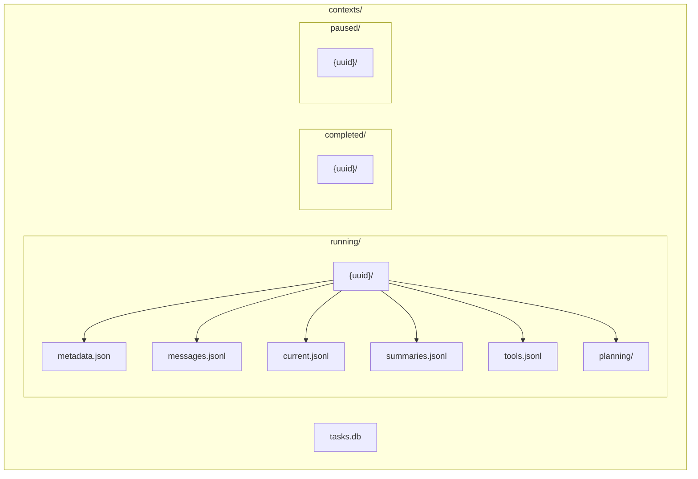
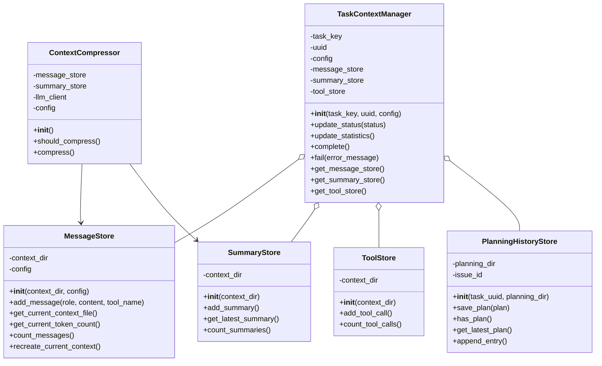
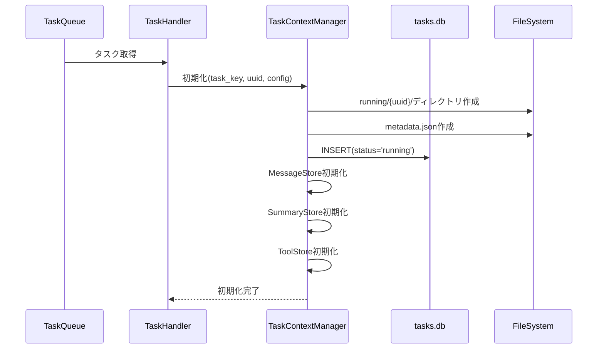
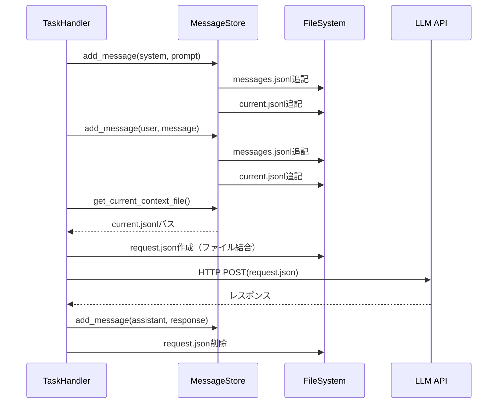
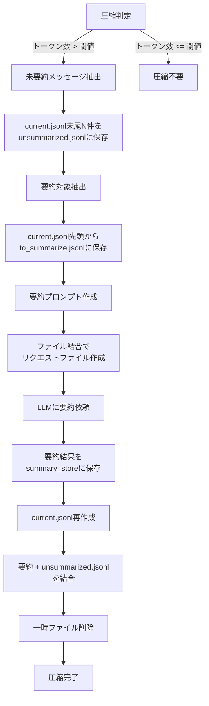

# コンテキストファイル化による省メモリ化仕様

## 1. 概要

### 1.1 目的

コーディングエージェントがコードや仕様を読み込みながら処理を行う際、すべてのコンテキスト（会話履歴、システムプロンプト、ツール実行結果など）をメモリ上に保持すると、大量のメモリを消費します。本仕様では、完全ファイルベースでコンテキストを管理することで省メモリ化を実現し、1タスク＝1プロセスの前提でシンプルな実装を行います。

### 1.2 設計前提

- **1タスク＝1プロセス**: 同一タスクに複数プロセスが同時アクセスしない
- **SQLiteでタスク状態管理**: ルートディレクトリに全タスクの状態をデータベース化
- **UUID単位のディレクトリ**: 各タスクは独立したディレクトリで管理（UUIDはキュー投入時に付与）
- **running/completed分離**: 実行状態による物理的分離
- **完全ファイルベース処理**: メモリキャッシュなし、ファイル結合でLLMリクエスト
- **ファイルベースLLMリクエスト**: すべてのLLMClientでrequest.jsonを使用

### 1.3 期待される効果

- **メモリ削減**: 95〜99%のメモリ使用量削減（コンテキストをメモリに載せない）
- **永続性**: プロセス終了後もコンテキストが保持される
- **デバッグ性**: 人間が直接ファイルを確認可能
- **シンプルさ**: ロック不要、メモリ管理不要で実装が容易

---

## 2. ディレクトリ構造

### 2.1 全体構成図

### 2.2 全体構成

contextsディレクトリ配下に以下の構造でファイルを管理します：

#### ルートレベル

- **tasks.db**: 全タスクの状態管理データベース（SQLite）

#### runningディレクトリ

実行中タスクのコンテキストを保存します。各タスクはUUID単位のサブディレクトリで管理されます。

#### completedディレクトリ

完了済みタスクのコンテキストを保存します。構造はrunningと同じです。

#### pausedディレクトリ

一時停止中タスクのコンテキストを保存します。構造はrunningと同じです。

### 2.3 タスクディレクトリの内容

各タスクのディレクトリには以下のファイルが含まれます：

- **metadata.json**: タスクメタデータ（静的）
- **messages.jsonl**: 全メッセージ履歴（保管用）
- **current.jsonl**: 現在のコンテキスト（LLM用、OpenAI形式）
- **unsummarized.jsonl**: 未要約メッセージ（圧縮時に保持）
- **summaries.jsonl**: コンテキスト要約履歴
- **tools.jsonl**: ツール実行履歴
- **request.json**: LLMリクエスト一時ファイル
- **planning/**: Planning履歴（Planning有効時）

---

## 3. tasks.db（SQLite）

### 3.1 目的

- 全タスクの状態を一元管理
- タスク検索・集計を高速化
- 実行中タスクの監視

### 3.2 tasksテーブル

tasksテーブルには以下のカラムがあります：

- **uuid**: タスクUUID（主キー）
- **task_source**: タスクソース（githubまたはgitlab）
- **owner**: リポジトリオーナー
- **repo**: リポジトリ名
- **task_type**: タスクタイプ（issueまたはpull_request）
- **task_id**: タスクID（Issue番号等）
- **status**: ステータス（running、completed、failedのいずれか）
- **created_at**: 作成日時（ISO 8601形式）
- **started_at**: 開始日時
- **completed_at**: 完了日時
- **process_id**: プロセスID
- **hostname**: 実行ホスト名
- **llm_provider**: LLMプロバイダー
- **model**: モデル名
- **context_length**: コンテキスト長
- **llm_call_count**: LLM呼び出し回数（デフォルト0）
- **tool_call_count**: ツール呼び出し回数（デフォルト0）
- **total_tokens**: 総トークン数（デフォルト0）
- **compression_count**: 圧縮回数（デフォルト0）
- **error_message**: エラーメッセージ（失敗時）
- **user**: ユーザー名

### 3.3 更新タイミング

- **タスク開始時**: INSERT（status='running'）
- **LLM呼び出し後**: UPDATE（llm_call_count、total_tokens等）
- **ツール実行後**: UPDATE（tool_call_count）
- **圧縮実行後**: UPDATE（compression_count）
- **タスク完了時**: UPDATE（status='completed'、completed_at）
- **エラー発生時**: UPDATE（status='failed'、error_message）

---

## 4. ファイル仕様

### 4.1 metadata.json

タスクの基本情報を記録する静的ファイルです。タスク開始時に一度だけ作成します。

#### 内容

- uuid: タスクUUID
- task_key: タスクキー情報（task_source、owner、repo、task_type、task_id）
- created_at: 作成日時
- process_id: プロセスID
- hostname: ホスト名
- config: 設定情報（llm_provider、model、context_length、compression_threshold）
- user: ユーザー名

### 4.2 messages.jsonl

全メッセージ履歴をJSONLines形式で記録します。1行1メッセージです。保管・監査用に使用します。

#### フィールド

- **seq**: シーケンス番号（1から開始）
- **role**: メッセージの役割（system、user、assistant、tool）
- **content**: メッセージ内容
- **timestamp**: 作成日時（ISO 8601形式）
- **tokens**: 推定トークン数（4文字＝1トークン）
- **tool_name**: ツール名（role="tool"の場合）

### 4.3 current.jsonl

現在のコンテキストをOpenAI API互換形式で記録します。LLMリクエストで使用します。

#### 目的

- LLM呼び出し時のコンテキストとして直接使用
- 要約後は新しく作り直される
- メモリに載せずにファイルとして処理
- OpenAI API形式で保存（変換不要でリクエスト可能）

#### フィールド

- **role**: メッセージの役割（system、user、assistant、tool）
- **content**: メッセージ内容
- **tool_name**: ツール名（role="tool"の場合のみ）

seq、timestamp、tokensフィールドは含みません（OpenAI APIに送信不要なため）。

#### 更新タイミング

- タスク開始時: システムプロンプトで初期化
- メッセージ追加時: 1行追記
- 圧縮実行時: 新規作成（要約を最初の行として記録）

### 4.4 unsummarized.jsonl

未要約メッセージをOpenAI API互換形式で記録します。圧縮時に保持するメッセージです。

#### 目的

- 圧縮時に最新N件のメッセージを要約対象から除外
- 除外したメッセージを一時保管
- 圧縮後、要約と結合してcurrent.jsonlを再構築

### 4.5 summaries.jsonl

コンテキスト要約の履歴を記録します。

#### フィールド

- **id**: 要約ID（1から開始）
- **start_seq**: 要約対象開始シーケンス
- **end_seq**: 要約対象終了シーケンス
- **summary**: 要約テキスト
- **original_tokens**: 元のトークン数
- **summary_tokens**: 要約後のトークン数
- **ratio**: 圧縮率（summary_tokens/original_tokens）
- **timestamp**: 要約作成日時

### 4.6 tools.jsonl

ツール実行履歴を記録します。

#### フィールド

- **seq**: 実行シーケンス番号
- **tool**: ツール名
- **args**: 引数
- **result**: 実行結果（成功時）
- **status**: successまたはerror
- **error**: エラーメッセージ（失敗時）
- **duration_ms**: 実行時間（ミリ秒）
- **timestamp**: 実行日時

### 4.7 request.json

LLM APIへのリクエストを一時的に保存するファイルです。全LLMClientで使用します。LLMClientの種類によってフォーマットが異なります。

---

## 5. クラス設計

### 5.1 クラス図

### 5.2 TaskContextManagerクラス

タスクコンテキスト全体を管理する新規クラスです。

#### 責務

- キューから受け取ったUUIDでディレクトリ作成
- tasks.dbへのタスク登録・更新
- MessageStore、SummaryStore、ToolStore、PlanningHistoryStoreの統合管理
- planningサブディレクトリの作成
- タスク完了時のディレクトリ移動

#### 主要メソッド

- **__init__**: タスクキー、UUID、設定を受け取り初期化、is_resumedフラグで再開タスクかを判定
- **update_status**: tasks.dbのstatusを更新
- **update_statistics**: tasks.dbの統計カウンターを更新
- **complete**: タスク完了処理（ステータス更新とディレクトリ移動）
- **fail**: タスク失敗処理（エラー記録とディレクトリ移動）
- **get_message_store**: MessageStoreインスタンスを返す
- **get_summary_store**: SummaryStoreインスタンスを返す
- **get_tool_store**: ToolStoreインスタンスを返す
- **get_planning_store**: PlanningHistoryStoreインスタンスを返す

### 5.3 MessageStoreクラス

メッセージ履歴を管理する新規クラスです。完全ファイルベース、メモリキャッシュなしで実装します。

#### 責務

- messages.jsonlへの追記（全履歴保管）
- current.jsonlのメンテナンス（LLM用現在コンテキスト）
- トークン数の計算（ファイル読み捨てでカウント）
- current.jsonlファイルパスの提供

#### 主要メソッド

- **__init__**: コンテキストディレクトリと設定を受け取り初期化
- **add_message**: 新しいメッセージを追加
- **get_current_context_file**: current.jsonlのファイルパスを返す
- **get_current_token_count**: current.jsonlのトークン数を計算
- **count_messages**: 総メッセージ数を返す
- **recreate_current_context**: 要約後にcurrent.jsonlを新規作成

### 5.3 SummaryStoreクラス

コンテキスト要約を管理する新規クラスです。

#### 責務

- summaries.jsonlへの読み書き
- 最新の要約の取得
- 要約の作成と保存

### 5.4 ToolStoreクラス

ツール実行履歴を管理する新規クラスです。

#### 責務

- tools.jsonlへの読み書き
- ツール実行記録の保存

### 5.5 ContextCompressorクラス

コンテキスト圧縮を管理する新規クラスです。完全ファイルベース処理で実装します。

#### 責務

- コンテキスト長の監視
- 圧縮トリガーの判定
- LLMによる要約の実行（ファイル結合で処理）

---

## 6. 処理フロー

### 6.1 タスク開始フロー図

### 6.2 タスク開始フロー

1. タスク一覧を取得し、各タスクオブジェクト生成時にUUIDを生成
2. タスクをキューに投入
3. キューからタスクを取得し、TaskContextManagerを初期化
4. running/{uuid}/ディレクトリ作成、metadata.json作成
5. tasks.dbにINSERT
6. MessageStore、SummaryStore、ToolStoreを初期化

### 6.3 LLM呼び出しフロー図

### 6.4 LLM呼び出しフロー

1. システムプロンプトを送信（messages.jsonlとcurrent.jsonlに追記）
2. ユーザーメッセージを送信（messages.jsonlとcurrent.jsonlに追記）
3. request.jsonを作成（ファイル結合、メモリ不使用）
4. request.jsonをHTTP POST送信
5. レスポンスをパースし、message_store.add_messageで追加
6. request.json削除
7. 統計更新
8. 圧縮判定と実行

### 6.3 ツール実行フロー

1. ツール実行
2. tool_store.add_tool_callで実行記録
3. 統計更新
4. 結果をLLMに送信（message_store.add_messageで追加）

### 6.4 タスク完了フロー

**正常完了時:**
- context_manager.complete()を呼び出し
- tasks.dbを更新（status='completed'、completed_at=now）
- ディレクトリを移動（running/{uuid}/ → completed/{uuid}/）

**エラー時:**
- context_manager.fail(error_message)を呼び出し
- tasks.dbを更新（status='failed'、error_message=msg）
- ディレクトリを移動（running/{uuid}/ → completed/{uuid}/）

---

## 7. コンテキスト圧縮

### 7.1 圧縮トリガー条件

current.jsonlのトークン数がcontext_length × compression_thresholdを超えた場合に圧縮を実行します。

### 7.2 圧縮処理フロー図

### 7.3 圧縮処理

1. **未要約メッセージの抽出**: current.jsonlの末尾N件（keep_recent_messages）を読み取り、unsummarized.jsonlに保存
2. **要約対象メッセージの抽出**: current.jsonlの先頭から（全体 − N）件を読み取り、to_summarize.jsonlに保存
3. **要約プロンプトファイル作成**: config.yamlのsummary_promptをsummary_prompt.txtに書き込み
4. **ファイル結合でリクエストファイル作成**: summary_prompt.txt + to_summarize.jsonl → summary_request.txt
5. **LLMに要約依頼**: summary = llm_client.get_summary(summary_request.txt)
6. **要約結果の記録**: summary_storeに保存、messages.jsonlにも追記
7. **current.jsonl再作成**: 要約を最初の行として記録、unsummarized.jsonlの内容を結合
8. **一時ファイル削除**: summary_prompt.txt、formatted_messages.txt、summary_request.txt、unsummarized.jsonl、to_summarize.jsonlを削除

メモリ削減効果: コンテキスト全体をメモリに載せない（ファイル結合のみ）

---

## 8. 設定ファイル

### 8.1 config.yamlへの追加

context_storageセクションで以下を設定します：

- **enabled**: コンテキストファイル化を有効化（デフォルト: true）
- **base_dir**: ベースディレクトリ（デフォルト: contexts）
- **compression_threshold**: 圧縮開始閾値（デフォルト: 0.7、70%）
- **keep_recent_messages**: 圧縮時に保持する最新メッセージ数（デフォルト: 5）
- **cleanup_days**: 完了タスクのクリーンアップ日数（デフォルト: 30）
- **summary_prompt**: 要約プロンプト

llmセクションのcontext_lengthでモデルのコンテキスト長を設定します。

---

## 9. デバッグとモニタリング

### 9.1 タスク状態確認

SQLiteクエリまたはファイル確認でタスク状態を確認できます。

### 9.2 統計情報

tasks.dbから以下の統計を取得できます：

- タスク数（ステータス別）
- 平均実行時間
- トークン使用量

---

## 10. エラーハンドリング

### 10.1 タスク処理中のエラー

例外発生時はcontext_manager.fail(str(e))を呼び出してエラーを記録します。

### 10.2 ファイルI/Oエラー

- ディレクトリ作成失敗: 例外を上位に伝播
- JSONLines書き込み失敗: 例外を上位に伝播
- 読み込み失敗: 空のリストを返す、またはデフォルト値

### 10.3 SQLiteエラー

- 接続失敗: 例外を上位に伝播
- INSERT/UPDATE失敗: リトライ（最大3回）
- テーブル不存在: 自動作成

---

## 11. まとめ

### 主要な設計決定

1. **1タスク＝1プロセス**: ロック不要でシンプル
2. **SQLiteで状態管理**: 全タスクを一元管理
3. **UUID単位のディレクトリ**: 完全な分離
4. **JSONLines**: 人間が読める、追記型で高速
5. **running/completed分離**: 状態による物理的分離
6. **完全ファイルベース**: メモリキャッシュなし、ファイル結合で処理
7. **current.jsonl**: LLM用現在コンテキストファイル（OpenAI形式）
8. **ファイルベースLLMリクエスト**: 全LLMClientでrequest.json使用
9. **要約もファイルベース**: ファイル結合でメモリ消費なし
10. **config.yaml設定**: 要約プロンプト、クリーンアップ日数

---

**文書バージョン:** 5.0  
**最終更新日:** 2024-11-28  
**ステータス:** 実装済み
