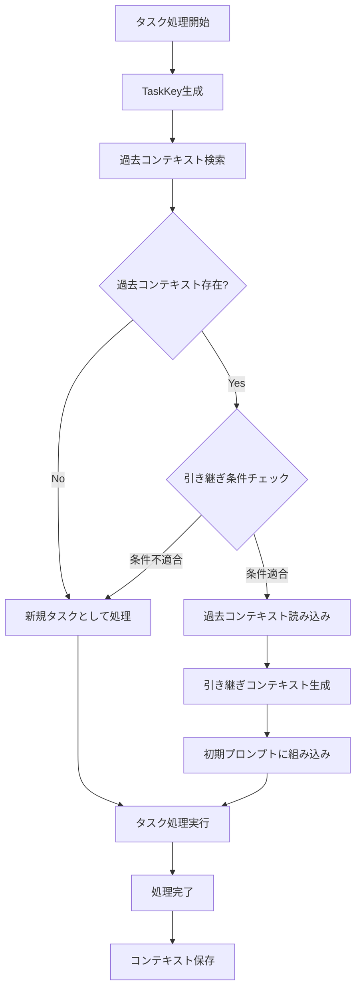
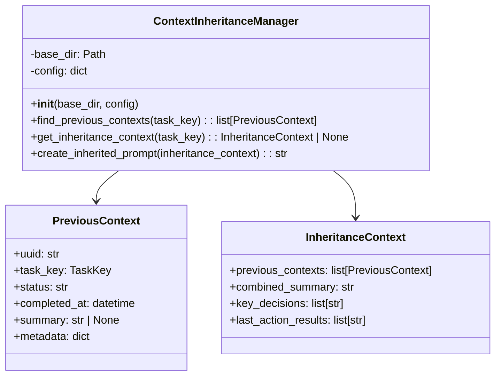
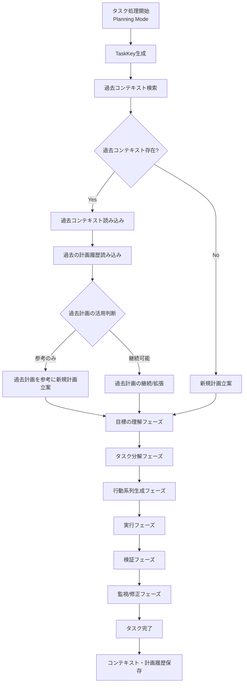

# 同一Issue/MR/PRの過去コンテキスト引き継ぎ機能 詳細設計書

## 1. 概要

### 1.1 目的

同一のIssue、Merge Request（MR）、Pull Request（PR）に対して、過去にコーディングエージェントが処理を行った際のコンテキスト（会話履歴、要約、ツール実行履歴、計画履歴など）を引き継ぎ、処理の継続性と効率性を向上させる機能を提供します。

本機能は、通常モードと計画実行モード（Planning Mode）の両方で動作します。

### 1.2 背景

現在のコーディングエージェントは、タスクごとに新しいUUIDを生成し、独立したコンテキストで処理を開始します。しかし、同一のIssue/MR/PRに対して再度処理が発生した場合（例：追加のコメント対応、再処理の要求など）、過去の処理内容を把握していないため、非効率な処理が発生する可能性があります。

特に計画実行モードでは、過去の計画・実行履歴を参照することで、より効果的な計画立案と実行が可能になります。

### 1.3 期待される効果

- **処理の効率化**: 過去の会話履歴や実行結果を参照することで、重複作業を削減
- **文脈の継続性**: 過去の議論や決定事項を踏まえた一貫性のある応答
- **品質の向上**: 過去の試行錯誤や学習内容を活用した処理品質の向上
- **ユーザー体験の向上**: 「以前話した内容」を理解しているエージェントとしての振る舞い
- **計画の継続性**: 過去の計画と実行結果を参照した、より効果的な計画立案（Planning Mode）

---

## 2. 機能要件

### 2.1 コンテキスト引き継ぎの条件

以下の条件を満たす場合に、過去のコンテキストを引き継ぎます：

1. **同一タスクキーの存在**: 処理対象のTaskKey（Issue/MR/PR）と同一のTaskKeyを持つ過去のコンテキストが存在すること
2. **有効期限内**: 過去のコンテキストが設定された有効期限内であること
3. **完了済みまたは停止済み**: 過去のコンテキストが正常完了（completed）または停止済み（stopped）の状態であること

### 2.2 引き継ぎ対象データ

以下のデータを引き継ぎ対象とします：

| データ | 説明 | 引き継ぎ方法 | 対象モード |
|--------|------|-------------|-----------|
| 要約履歴（summaries.jsonl） | 過去の会話の要約 | 初期コンテキストに組み込み | 通常/Planning |
| 計画履歴（planning/） | 過去の実行計画と結果 | 参考情報として提供 | 通常/Planning |
| メタデータ（metadata.json） | 過去の処理設定情報 | 参考情報として提供 | 通常/Planning |
| ツール実行履歴（tools.jsonl） | 過去のツール実行記録 | 参考情報として提供 | 通常/Planning |
| 検証結果（verification） | 過去の検証フェーズ結果 | 参考情報として提供 | Planning |
| リフレクション履歴（reflection） | 過去の振り返り結果 | 参考情報として提供 | Planning |
| 再計画判断（replan_decision） | 過去の再計画判断 | 参考情報として提供 | Planning |

**注意**: 現在のコンテキスト（current.jsonl）および全メッセージ履歴（messages.jsonl）は、トークン制限の観点から直接引き継ぎません。代わりに要約を使用します。

### 2.3 引き継ぎ除外条件

以下の条件に該当する場合、コンテキストを引き継ぎません：

1. **失敗したタスク**: status="failed"のコンテキストは引き継ぎ対象外（設定で変更可能）
2. **一時停止中のタスク**: status="paused"のコンテキストは引き継ぎ対象外（別途リジューム機能を使用）
3. **有効期限切れ**: 設定された保持期間を超えたコンテキスト
4. **ユーザー明示的拒否**: ユーザーがコメントで引き継ぎを拒否した場合

---

## 3. システム設計

### 3.1 全体フロー図



### 3.2 コンポーネント構成

#### 3.2.1 新規クラス: ContextInheritanceManager

過去コンテキストの検索と引き継ぎを管理する新しいクラスを追加します。



### 3.3 データベース拡張

#### 3.3.1 tasksテーブルの拡張

tasks.dbのtasksテーブルに以下のカラムを追加します：

| カラム名 | 型 | 説明 |
|---------|-----|------|
| task_key_hash | TEXT | TaskKeyのハッシュ値（検索用インデックス） |
| inherited_from_uuid | TEXT | 引き継ぎ元のUUID（引き継ぎがある場合） |
| inheritance_depth | INTEGER | 引き継ぎの深さ（何世代目か） |

#### 3.3.2 インデックス追加

task_key_hashカラムにインデックスを作成し、同一TaskKeyの過去コンテキスト検索を高速化します。

---

## 4. 詳細設計

### 4.1 過去コンテキスト検索処理

#### 4.1.1 処理フロー

1. **TaskKeyのハッシュ化**: TaskKeyオブジェクトからハッシュ値を生成
2. **データベース検索**: task_key_hashをキーにtasksテーブルを検索
3. **フィルタリング**: 有効期限、ステータス等の条件でフィルタリング
4. **ソート**: completed_atの降順でソート（最新のものを優先）

#### 4.1.2 TaskKeyハッシュ生成ロジック

TaskKeyの各フィールドを連結してSHA-256ハッシュを生成します。
既存のTaskKeyクラスのtype名に合わせて一貫性のある形式を使用します：

- GitHub Issue: `github_issue:{owner}:{repo}:{number}`
- GitHub PR: `github_pull_request:{owner}:{repo}:{number}`
- GitLab Issue: `gitlab_issue:{project_id}:{issue_iid}`
- GitLab MR: `gitlab_merge_request:{project_id}:{mr_iid}`

**注意**: これらの形式はTaskKey.to_dict()のtype値と一致させています。

### 4.2 引き継ぎコンテキスト生成処理

#### 4.2.1 処理フロー

1. **要約の収集**: 過去コンテキストのsummaries.jsonlから最新の要約を取得
2. **計画履歴の収集**: planning/ディレクトリから実行計画と結果を取得
3. **重要決定事項の抽出**: 要約から重要な決定事項を抽出
4. **統合要約の生成**: 複数の過去コンテキストがある場合、統合した要約を生成

#### 4.2.2 トークン制限への対応

引き継ぎコンテキストのトークン数が設定値を超える場合、以下の優先順位で削減します：

1. 古い要約を優先的に除外
2. 詳細な計画履歴を概要に置き換え
3. ツール実行履歴を省略

### 4.3 初期プロンプトへの組み込み

#### 4.3.1 組み込み形式

引き継ぎコンテキストは、システムプロンプトの末尾に以下の形式で追加します：

```
## 過去の処理コンテキスト

このIssue/MR/PRは以前にも処理されています。以下は過去の処理内容の要約です。

### 過去の処理回数
{処理回数}回

### 最新の処理日時
{最新処理日時}

### 過去の処理要約
{統合要約テキスト}

### 主要な決定事項
{重要決定事項のリスト}

### 前回の処理結果
{前回の最終アクションと結果}

---
上記の過去のコンテキストを考慮して、現在の要求に対応してください。
```

### 4.4 コンテキスト保存処理の拡張

#### 4.4.1 metadata.jsonの拡張

metadata.jsonに以下の情報を追加します：

- inherited_from_uuid: 引き継ぎ元UUID
- inheritance_depth: 引き継ぎの深さ
- task_key_hash: TaskKeyハッシュ値

#### 4.4.2 タスク完了時の処理

タスク完了時に、次回の引き継ぎのために以下の処理を実行します：

1. 最終要約の生成（未生成の場合）
2. 重要決定事項のマーキング
3. task_key_hashの保存

---

## 5. 設定オプション

### 5.1 config.yamlへの追加設定

context_inheritanceセクションで以下を設定します：

| 設定項目 | 型 | デフォルト値 | 説明 |
|---------|-----|-------------|------|
| enabled | boolean | true | 引き継ぎ機能の有効/無効 |
| max_inheritance_depth | integer | 5 | 最大引き継ぎ世代数（推奨: 3〜5） |
| context_expiry_days | integer | 90 | 引き継ぎ可能なコンテキストの有効期限（日数） |
| max_inherited_tokens | integer | 8000 | 引き継ぎコンテキストの最大トークン数（注1） |
| include_failed_contexts | boolean | false | 失敗したコンテキストを引き継ぎ対象に含めるか |
| summary_priority | string | "latest" | 複数要約がある場合の優先順位（latest/merged） |

**注1**: max_inherited_tokensは、使用するLLMモデルのコンテキストウィンドウサイズに応じて調整することを推奨します。一般的なモデルでは、コンテキストウィンドウの5〜10%程度（例：128Kモデルで8000〜12800トークン）が適切です。

### 5.2 設定例

```yaml
context_inheritance:
  enabled: true
  max_inheritance_depth: 5
  context_expiry_days: 90
  max_inherited_tokens: 8000
  include_failed_contexts: false
  summary_priority: "merged"
```

---

## 6. ユーザーインターフェース

### 6.1 コメントによる制御

ユーザーは以下のコメントコマンドで引き継ぎ動作を制御できます：

| コマンド | 説明 |
|---------|------|
| `/no-inherit` | 今回の処理で過去コンテキストを引き継がない |
| `/fresh-start` | 過去コンテキストを完全に無視して新規処理を開始 |
| `/show-history` | 過去の処理履歴をコメントで表示 |

### 6.2 処理開始時の通知

過去コンテキストを引き継いだ場合、処理開始時に以下の形式で通知コメントを追加します：

```
📋 **過去のコンテキストを引き継ぎました**

- 引き継ぎ元: #{過去のコンテキストUUID（短縮形）}
- 前回処理日時: {日時}
- 引き継ぎ内容: 要約、計画履歴

過去の処理内容を考慮して、現在の要求に対応します。
```

---

## 7. エラーハンドリング

### 7.1 過去コンテキスト読み込みエラー

| エラー種別 | 対応 |
|-----------|------|
| ファイル破損 | 該当コンテキストをスキップし、次の候補を使用 |
| ディレクトリ不存在 | データベースから該当レコードを削除 |
| パース失敗 | ログ出力後、該当コンテキストをスキップ |

### 7.2 引き継ぎコンテキスト生成エラー

| エラー種別 | 対応 |
|-----------|------|
| トークン数超過 | 優先度に基づいて内容を削減 |
| 要約未生成 | 新規タスクとして処理（引き継ぎなし） |

### 7.3 データベースエラー

| エラー種別 | 対応 |
|-----------|------|
| 接続失敗 | リトライ（最大3回）後、新規タスクとして処理 |
| クエリエラー | ログ出力後、新規タスクとして処理 |

---

## 8. セキュリティとプライバシー

### 8.1 アクセス制御

- 過去コンテキストへのアクセスは、同一TaskKeyに対してのみ許可
- 異なるIssue/MR/PR間でのコンテキスト共有は行わない
- ユーザー情報は引き継ぎコンテキストから除外

### 8.2 データ保持

- 有効期限を過ぎたコンテキストは自動的にクリーンアップ対象
- 機密情報を含む可能性のあるツール実行結果は、引き継ぎ時にサニタイズ

---

## 9. パフォーマンス考慮事項

### 9.1 検索最適化

- task_key_hashインデックスによる高速検索
- データベースクエリの結果キャッシュ（プロセス内）

### 9.2 メモリ使用量

- 引き継ぎコンテキストはファイルベースで処理
- 大量の過去コンテキストがある場合もメモリ圧迫を回避

### 9.3 処理時間

- 過去コンテキスト検索は非同期で実行可能
- 引き継ぎコンテキスト生成の並列化

---

## 10. テスト要件

### 10.1 単体テスト

- ContextInheritanceManagerの各メソッド
- TaskKeyハッシュ生成ロジック
- 引き継ぎコンテキスト生成ロジック
- トークン制限処理

### 10.2 統合テスト

- 同一Issueに対する複数回処理のシナリオ
- 有効期限切れコンテキストの除外
- コメントコマンドによる制御

### 10.3 エンドツーエンドテスト

- GitHub Issue処理の連続実行
- GitLab MR処理の連続実行
- 引き継ぎコンテキストを含むLLM応答の検証

---

## 11. 移行とバージョニング

### 11.1 既存データの移行

既存のcompletedディレクトリ内のコンテキストに対して、以下の処理を実行します：

1. metadata.jsonからTaskKeyを読み取り
2. task_key_hashを生成
3. tasks.dbにtask_key_hashカラムを追加（ALTER TABLE）
4. 既存レコードのtask_key_hashを更新

### 11.2 後方互換性

- task_key_hashが未設定のコンテキストは、引き継ぎ検索の対象外
- 新規処理からは自動的にtask_key_hashが設定される

---

## 12. 監視とログ

### 12.1 ログ出力項目

| ログレベル | 出力内容 |
|-----------|---------|
| INFO | 引き継ぎコンテキストの検出・使用 |
| DEBUG | 検索クエリ、フィルタリング結果 |
| WARNING | 読み込みエラー、スキップしたコンテキスト |
| ERROR | データベースエラー、重大な処理失敗 |

### 12.2 メトリクス

- 引き継ぎ発生率
- 引き継ぎコンテキストのトークン数分布
- 引き継ぎ深度の分布

---

## 13. 計画実行モード（Planning Mode）との統合

### 13.1 概要

計画実行モードでは、過去のコンテキストに加えて、計画・実行・検証・振り返りの履歴を引き継ぐことで、より効果的なタスク処理を実現します。

### 13.2 Planning Mode専用の引き継ぎデータ

通常モードの引き継ぎデータに加え、以下のPlanning Mode専用データを引き継ぎます：

| データ種別 | ファイル/場所 | 説明 |
|-----------|-------------|------|
| 計画（plan） | planning/{uuid}.jsonl | 過去の実行計画 |
| 修正計画（revision） | planning/{uuid}.jsonl | 計画の修正履歴 |
| リフレクション（reflection） | planning/{uuid}.jsonl | 振り返り結果 |
| 検証結果（verification） | planning/{uuid}.jsonl | 検証フェーズの結果 |
| 再計画判断（replan_decision） | planning/{uuid}.jsonl | 再計画の判断履歴 |

### 13.3 Planning Modeでのフロー図



### 13.4 計画フェーズでの引き継ぎ

#### 13.4.1 目標の理解フェーズ

過去のコンテキストを以下の形式でLLMに提供します：

```
## Previous Planning Context

This Issue/MR/PR has been processed before. Below is the context from previous processing:

### Previous Processing Count
{processing_count} time(s)

### Previous Plans
{previous_plans_summary}

### Previous Execution Results
{previous_execution_results}

### Previous Verification Results
{previous_verification_summary}

### Key Learnings from Previous Processing
{key_learnings}

---
Consider the above context when understanding the current goal.
```

#### 13.4.2 タスク分解フェーズ

過去の計画を参照して、以下を考慮したタスク分解を行います：

1. **過去の成功パターン**: 過去の計画で成功したアプローチを優先
2. **過去の失敗パターン**: 過去に失敗したアプローチを回避
3. **依存関係の継承**: 過去の計画で明らかになった依存関係を考慮
4. **推定複雑度の調整**: 過去の実行結果に基づいて複雑度を調整

#### 13.4.3 行動系列生成フェーズ

過去の実行履歴を参照して、以下を考慮したアクション計画を生成します：

1. **成功したツール使用パターンの継承**
2. **失敗したアクションの代替手段検討**
3. **エラー回復戦略の強化**

### 13.5 実行フェーズでの引き継ぎ

#### 13.5.1 実行時の参照情報

実行フェーズでは、各アクション実行前に以下の過去情報を参照可能とします：

- 同様のアクションの過去実行結果
- 関連するツールの過去使用状況
- 過去の実行で発生したエラーと対処法

#### 13.5.2 リフレクション時の参照

リフレクションフェーズでは、過去の振り返り結果を参照して評価の精度を向上します：

- 過去の計画修正理由
- 過去の問題特定パターン
- 成功した修正アプローチ

### 13.6 検証フェーズでの引き継ぎ

#### 13.6.1 検証基準の継承

過去の検証結果から、以下を継承します：

- 検出されたプレースホルダパターン
- 成功基準の達成判定基準
- 追加作業の特定パターン

#### 13.6.2 検証結果の累積

検証結果は累積的に管理し、同一Issue/MR/PRに対する検証の一貫性を保ちます。

### 13.7 PlanningCoordinatorとの統合

#### 13.7.1 PlanningCoordinatorの拡張

PlanningCoordinatorクラスに以下のメソッドを追加します：

| メソッド | 説明 |
|---------|------|
| `_load_inherited_planning_context()` | 過去の計画コンテキストを読み込み |
| `_build_planning_prompt_with_inheritance()` | 引き継ぎ情報を含む計画プロンプトを構築 |
| `_evaluate_previous_plan_applicability()` | 過去計画の適用可能性を評価 |
| `_merge_with_previous_learnings()` | 過去の学習内容を現在の計画にマージ |

#### 13.7.2 PlanningHistoryStoreとの連携

既存のPlanningHistoryStore.get_past_executions_for_issue()メソッドを活用して、同一Issue/MRの過去の計画履歴を取得します。

### 13.8 Planning Mode専用の初期プロンプト拡張

Planning Modeで引き継ぎが発生した場合、以下の追加情報をシステムプロンプトに含めます：

```
## Previous Planning History

### Previous Plan Summary
**Goal**: {previous_main_objective}
**Subtasks**: {previous_subtask_count} tasks planned
**Completion Status**: {completion_percentage}%

### Execution History
**Successful Actions**: {successful_action_count}
**Failed Actions**: {failed_action_count}
**Key Failures**: {key_failure_summary}

### Verification History
**Verification Rounds**: {verification_round_count}
**Issues Found**: {issues_found_summary}
**Resolved Issues**: {resolved_issues_summary}

### Recommendations for Current Processing
Based on previous processing:
{recommendations_list}

---
Use the above planning history to inform your current planning decisions.
```

### 13.9 Planning Mode設定オプション

context_inheritanceセクションに以下のPlanning Mode専用設定を追加します：

| 設定項目 | 型 | デフォルト値 | 説明 |
|---------|-----|-------------|------|
| planning.inherit_plans | boolean | true | 過去の計画を引き継ぐか |
| planning.inherit_verifications | boolean | true | 過去の検証結果を引き継ぐか |
| planning.inherit_reflections | boolean | true | 過去のリフレクションを引き継ぐか |
| planning.max_previous_plans | integer | 3 | 参照する過去計画の最大数（注2） |
| planning.reuse_successful_patterns | boolean | true | 成功パターンを再利用するか |

**注2**: max_previous_plansは、max_inheritance_depthとは独立した設定です。max_inheritance_depthは引き継ぎの「世代数」（同一タスクの処理回数の連鎖）を制限し、max_previous_plansは「参照する計画数」（最新N件の計画を参照）を制限します。トークン制限の観点から、max_previous_plansはmax_inheritance_depthより小さい値を推奨します。

### 13.10 設定例（Planning Mode込み）

```yaml
context_inheritance:
  enabled: true
  max_inheritance_depth: 5
  context_expiry_days: 90
  max_inherited_tokens: 8000
  include_failed_contexts: false
  summary_priority: "merged"
  planning:
    inherit_plans: true
    inherit_verifications: true
    inherit_reflections: true
    max_previous_plans: 3
    reuse_successful_patterns: true
```

---

## 14. 関連ドキュメント

- [コンテキストファイル化仕様](context_file_spec.md)
- [コンテキストストレージ実装仕様](CONTEXT_STORAGE_IMPLEMENTATION.md)
- [一時停止・再開機能仕様](PAUSE_RESUME_SPECIFICATION.md)
- [計画実行モード仕様](PLANNING_SPECIFICATION.md)
- [再計画仕様](REPLANNING_SPECIFICATION.md)

---

**文書バージョン:** 1.0  
**最終更新日:** 2024-11-29  
**ステータス:** 設計中
