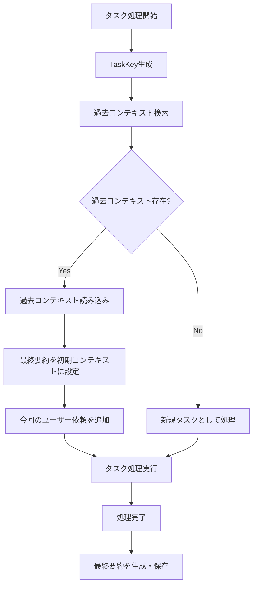
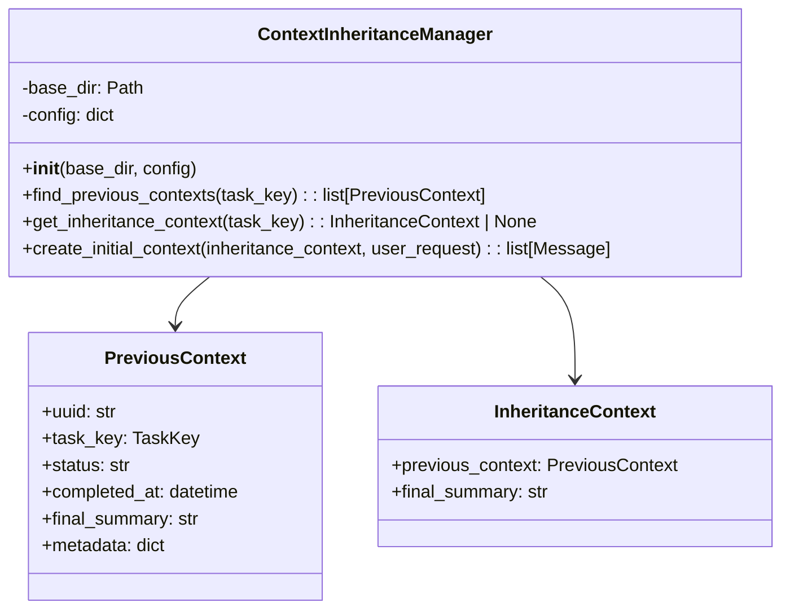
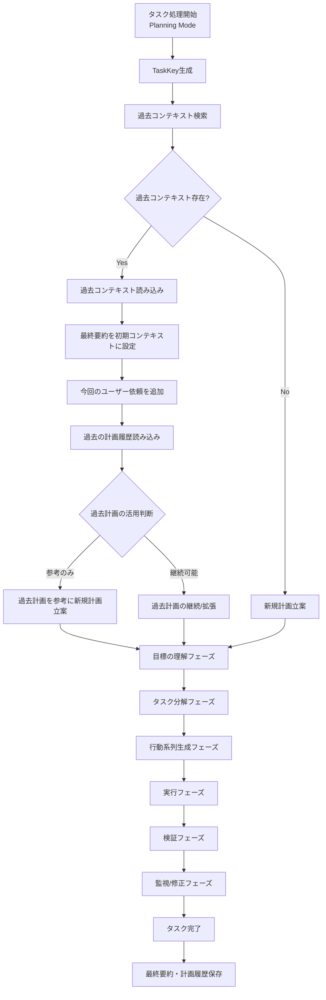

# 同一Issue/MR/PRの過去コンテキスト引き継ぎ機能 詳細設計書

## 1. 概要

### 1.1 目的

同一のIssue、Merge Request（MR）、Pull Request（PR）に対して、過去にコーディングエージェントが処理を行った際の最終要約を引き継ぎ、処理の継続性と効率性を向上させる機能を提供します。

本機能は、通常モードと計画実行モード（Planning Mode）の両方で動作します。

### 1.2 背景

現在のコーディングエージェントは、タスクごとに新しいUUIDを生成し、独立したコンテキストで処理を開始します。しかし、同一のIssue/MR/PRに対して再度処理が発生した場合（例：追加のコメント対応、再処理の要求など）、過去の処理内容を把握していないため、非効率な処理が発生する可能性があります。

特に計画実行モードでは、過去の計画・実行履歴を参照することで、より効果的な計画立案と実行が可能になります。

### 1.3 期待される効果

- **処理の効率化**: 過去の会話履歴や実行結果を参照することで、重複作業を削減
- **文脈の継続性**: 過去の議論や決定事項を踏まえた一貫性のある応答
- **品質の向上**: 過去の試行錯誤や学習内容を活用した処理品質の向上
- **ユーザー体験の向上**: 「以前話した内容」を理解しているエージェントとしての振る舞い
- **計画の継続性**: 過去の計画と実行結果を参照した、より効果的な計画立案（Planning Mode）

---

## 2. 機能要件

### 2.1 コンテキスト引き継ぎの条件

同一のTaskKey（Issue/MR/PR）を持つ過去のコンテキストが存在する場合、以下の条件を満たせば引き継ぎを行います：

1. **ステータスが完了または停止**: status="completed"またはstatus="stopped"であること
   - `completed`: タスクが正常に完了した場合
   - `stopped`: ユーザーが明示的にタスクを停止した場合
2. **有効期限内**: 設定されたcontext_expiry_days以内であること（デフォルト: 90日）

### 2.2 引き継ぎ対象データ

以下のデータを引き継ぎ対象とします：

| データ | 説明 | 引き継ぎ方法 | 対象モード |
|--------|------|-------------|-----------|
| 最終要約（summaries.jsonl） | 過去の会話の最終要約 | 初期コンテキストに組み込み | 通常/Planning |
| 計画履歴（planning/） | 過去の実行計画と結果 | 参考情報として提供 | 通常/Planning |
| メタデータ（metadata.json） | 過去の処理設定情報 | 参考情報として提供 | 通常/Planning |
| ツール実行履歴（tools.jsonl） | 過去のツール実行記録 | 参考情報として提供 | 通常/Planning |
| 検証結果（verification） | 過去の検証フェーズ結果 | 参考情報として提供 | Planning |
| リフレクション履歴（reflection） | 過去の振り返り結果 | 参考情報として提供 | Planning |
| 再計画判断（replan_decision） | 過去の再計画判断 | 参考情報として提供 | Planning |

**前提条件**: 本機能では、タスク完了時に必ず最終要約を生成・保存します。引き継ぎは最終要約が存在することを前提とします。

**注意**: 
- 現在のコンテキスト（current.jsonl）および全メッセージ履歴（messages.jsonl）は、トークン制限の観点から直接引き継ぎません。代わりに最終要約を使用します。
- 「参考情報として提供」はLLMが必要に応じて参照可能という意味で、初期コンテキストには最終要約のみが含まれます。

### 2.3 引き継ぎ除外条件

以下の条件に該当する場合、コンテキストを引き継ぎません：

1. **失敗したタスク**: status="failed"のコンテキストは引き継ぎ対象外
2. **一時停止中のタスク**: status="paused"のコンテキストは引き継ぎ対象外（別途リジューム機能を使用）
3. **有効期限切れ**: context_expiry_daysを超えた古いコンテキスト

### 2.4 タスクステータスの定義

| ステータス | 説明 | 引き継ぎ | 最終要約 |
|-----------|------|---------|----------|
| running | 実行中 | - | - |
| completed | 正常完了 | ○ | 作成 |
| stopped | ユーザーによる明示的な停止 | ○ | 作成 |
| failed | エラーによる失敗 | × | 作成 |
| paused | 一時停止（リジューム可能） | × | - |

---

## 3. システム設計

### 3.1 全体フロー図



### 3.2 コンポーネント構成

#### 3.2.1 新規クラス: ContextInheritanceManager

過去コンテキストの検索と引き継ぎを管理する新しいクラスを追加します。



---

## 4. 詳細設計

### 4.1 過去コンテキスト検索処理

#### 4.1.1 処理フロー

1. **TaskKeyで検索**: TaskKeyの各フィールド（task_source、owner、repo、task_type、task_id）を使用してtasksテーブルを検索
2. **フィルタリング**: status="completed"またはstatus="stopped"のレコードのみを対象、かつ有効期限内
3. **ソート**: completed_atの降順でソート（最新のものを優先）
4. **選択**: 最新の1件のみを使用

#### 4.1.2 検索クエリ例

tasksテーブルの既存カラムを使用して検索します。以下はクエリの概念例です：

```sql
SELECT * FROM tasks
WHERE task_source = ? 
  AND owner = ?
  AND repo = ?
  AND task_type = ?
  AND task_id = ?
  AND status IN ('completed', 'stopped')
  AND completed_at >= datetime('now', '-' || ? || ' days')
ORDER BY completed_at DESC
LIMIT 1
```

#### 4.1.3 検索対象フィールド

- task_source: タスクソース（github/gitlab）
- owner: リポジトリオーナー
- repo: リポジトリ名
- task_type: タスクタイプ（issue/pull_request/merge_request）
- task_id: タスクID（Issue番号等）

### 4.2 引き継ぎコンテキスト生成処理

#### 4.2.1 処理フロー

1. **最終要約の取得**: 過去コンテキストのsummaries.jsonlから最終要約を取得
2. **初期コンテキストの構築**: 最終要約を最初のコンテキストとして設定

#### 4.2.2 トークン制限への対応

引き継ぎコンテキストのトークン数が設定値を超える場合、以下の優先順位で削減します：

1. 古い要約を優先的に除外
2. 詳細な計画履歴を概要に置き換え
3. ツール実行履歴を省略

### 4.3 初期コンテキストへの組み込み

#### 4.3.1 組み込み形式

引き継ぎコンテキストは、**コンテキストの最初**に以下の順序で追加します：

1. **前回の最終要約**（assistantロールとして）
2. **今回のユーザー依頼**（userロールとして）

これにより、LLMは前回の処理内容を把握した上で、今回の要求に対応できます。

**注意**: 前回の最終要約はassistantロールで追加されますが、これは引き継ぎ情報であり現在の会話の応答ではありません。要約テキストには「前回の処理要約:」などのプレフィックスを付けて区別します。

#### 4.3.2 コンテキスト構造

```
[コンテキスト開始]
├── 前回の最終要約（assistant）
│   └── "前回の処理要約: " + 前回処理の要約テキスト
└── 今回のユーザー依頼（user）
    └── Issue/MR/PRの内容 + 新規コメント
```

### 4.4 タスク完了時の処理

#### 4.4.1 最終要約の生成

タスク完了時に、次回の引き継ぎのために必ず最終要約を生成・保存します：

1. 現在のコンテキストから最終要約を生成
2. summaries.jsonlに保存
3. これにより、次回同一タスクが処理される際に引き継ぎが可能になる

---

## 5. 設定オプション

### 5.1 config.yamlへの追加設定

context_inheritanceセクションで以下を設定します：

| 設定項目 | 型 | デフォルト値 | 説明 |
|---------|-----|-------------|------|
| enabled | boolean | true | 引き継ぎ機能の有効/無効 |
| max_inherited_tokens | integer | 8000 | 引き継ぎコンテキストの最大トークン数（注1） |

**注1**: max_inherited_tokensは、使用するLLMモデルのコンテキストウィンドウサイズに応じて調整することを推奨します。一般的なモデルでは、コンテキストウィンドウの5〜10%程度（例：128Kモデルで8000〜12800トークン）が適切です。

### 5.2 設定例

```yaml
context_inheritance:
  enabled: true
  context_expiry_days: 90
  max_inherited_tokens: 8000
```

---

## 6. 処理開始時の通知

過去コンテキストを引き継いだ場合、処理開始時に以下の形式で通知コメントを追加します：

```
📋 **過去のコンテキストを引き継ぎました**

- 引き継ぎ元: #{過去のコンテキストUUID（短縮形）}
- 前回処理日時: {日時}
- 引き継ぎ内容: 最終要約

過去の処理内容を考慮して、現在の要求に対応します。
```

---

## 7. エラーハンドリング

### 7.1 過去コンテキスト読み込みエラー

| エラー種別 | 対応 |
|-----------|------|
| ファイル破損 | 該当コンテキストをスキップし、新規タスクとして処理 |
| ディレクトリ不存在 | 新規タスクとして処理 |
| パース失敗 | ログ出力後、新規タスクとして処理 |

### 7.2 引き継ぎコンテキスト生成エラー

| エラー種別 | 対応 |
|-----------|------|
| トークン数超過 | 優先度に基づいて内容を削減 |
| 最終要約未生成 | 新規タスクとして処理（引き継ぎなし） |

### 7.3 データベースエラー

| エラー種別 | 対応 |
|-----------|------|
| 接続失敗 | リトライ（最大3回）後、新規タスクとして処理 |
| クエリエラー | ログ出力後、新規タスクとして処理 |

---

## 8. セキュリティとプライバシー

### 8.1 アクセス制御

- 過去コンテキストへのアクセスは、同一TaskKeyに対してのみ許可
- 異なるIssue/MR/PR間でのコンテキスト共有は行わない
- ユーザー情報は引き継ぎコンテキストから除外

### 8.2 データ保持

- 有効期限を過ぎたコンテキストは自動的にクリーンアップ対象
- 機密情報を含む可能性のあるツール実行結果は、引き継ぎ時にサニタイズ

---

## 9. 監視とログ

### 9.1 ログ出力項目

| ログレベル | 出力内容 |
|-----------|---------|
| INFO | 引き継ぎコンテキストの検出・使用 |
| DEBUG | 検索クエリ、フィルタリング結果 |
| WARNING | 読み込みエラー、スキップしたコンテキスト |
| ERROR | データベースエラー、重大な処理失敗 |

---

## 10. 計画実行モード（Planning Mode）との統合

### 10.1 概要

計画実行モードでは、過去のコンテキストに加えて、計画・実行・検証・振り返りの履歴を引き継ぐことで、より効果的なタスク処理を実現します。

### 10.2 Planning Mode専用の引き継ぎデータ

通常モードの引き継ぎデータに加え、以下のPlanning Mode専用データを引き継ぎます：

| データ種別 | ファイル/場所 | 説明 |
|-----------|-------------|------|
| 計画（plan） | planning/{uuid}.jsonl | 過去の実行計画 |
| 修正計画（revision） | planning/{uuid}.jsonl | 計画の修正履歴 |
| リフレクション（reflection） | planning/{uuid}.jsonl | 振り返り結果 |
| 検証結果（verification） | planning/{uuid}.jsonl | 検証フェーズの結果 |
| 再計画判断（replan_decision） | planning/{uuid}.jsonl | 再計画の判断履歴 |

### 10.3 Planning Modeでのフロー図



### 10.4 計画フェーズでの引き継ぎ

#### 10.4.1 目標の理解フェーズ

過去のコンテキストはコンテキストの最初に含まれているため、LLMは自然に過去の処理内容を把握した上で目標を理解します。

#### 10.4.2 タスク分解フェーズ

過去の計画を参照して、以下を考慮したタスク分解を行います：

1. **過去の成功パターン**: 過去の計画で成功したアプローチを優先
2. **過去の失敗パターン**: 過去に失敗したアプローチを回避
3. **依存関係の継承**: 過去の計画で明らかになった依存関係を考慮
4. **推定複雑度の調整**: 過去の実行結果に基づいて複雑度を調整

#### 10.4.3 行動系列生成フェーズ

過去の実行履歴を参照して、以下を考慮したアクション計画を生成します：

1. **成功したツール使用パターンの継承**
2. **失敗したアクションの代替手段検討**
3. **エラー回復戦略の強化**

### 10.5 実行フェーズでの引き継ぎ

#### 10.5.1 実行時の参照情報

実行フェーズでは、各アクション実行前に以下の過去情報を参照可能とします：

- 同様のアクションの過去実行結果
- 関連するツールの過去使用状況
- 過去の実行で発生したエラーと対処法

#### 10.5.2 リフレクション時の参照

リフレクションフェーズでは、過去の振り返り結果を参照して評価の精度を向上します：

- 過去の計画修正理由
- 過去の問題特定パターン
- 成功した修正アプローチ

### 10.6 検証フェーズでの引き継ぎ

#### 10.6.1 検証基準の継承

過去の検証結果から、以下を継承します：

- 検出されたプレースホルダパターン
- 成功基準の達成判定基準
- 追加作業の特定パターン

#### 10.6.2 検証結果の累積

検証結果は累積的に管理し、同一Issue/MR/PRに対する検証の一貫性を保ちます。

### 10.7 PlanningCoordinatorとの統合

#### 10.7.1 PlanningCoordinatorの拡張

PlanningCoordinatorクラスに以下のメソッドを追加します：

| メソッド | 説明 |
|---------|------|
| `_load_inherited_planning_context()` | 過去の計画コンテキストを読み込み |
| `_build_initial_context_with_inheritance()` | 引き継ぎ情報を含む初期コンテキストを構築 |
| `_evaluate_previous_plan_applicability()` | 過去計画の適用可能性を評価 |
| `_merge_with_previous_learnings()` | 過去の学習内容を現在の計画にマージ |

#### 10.7.2 PlanningHistoryStoreとの連携

既存のPlanningHistoryStore.get_past_executions_for_issue()メソッドを活用して、同一Issue/MRの過去の計画履歴を取得します。

### 10.8 Planning Mode専用の初期コンテキスト

Planning Modeで引き継ぎが発生した場合、以下の構造で初期コンテキストを構築します：

```
[コンテキスト開始]
├── 前回の最終要約（assistant）
│   ├── 前回処理の要約テキスト
│   ├── Previous Plan Summary
│   │   └── Goal, Subtasks, Completion Status
│   ├── Execution History
│   │   └── Successful/Failed Actions, Key Failures
│   ├── Verification History
│   │   └── Verification Rounds, Issues Found/Resolved
│   └── Recommendations for Current Processing
└── 今回のユーザー依頼（user）
    └── Issue/MR/PRの内容 + 新規コメント
```

### 10.9 Planning Mode設定オプション

context_inheritanceセクションに以下のPlanning Mode専用設定を追加します：

| 設定項目 | 型 | デフォルト値 | 説明 |
|---------|-----|-------------|------|
| planning.inherit_plans | boolean | true | 過去の計画を引き継ぐか |
| planning.inherit_verifications | boolean | true | 過去の検証結果を引き継ぐか |
| planning.inherit_reflections | boolean | true | 過去のリフレクションを引き継ぐか |
| planning.max_previous_plans | integer | 3 | 参照する過去計画の最大数 |
| planning.reuse_successful_patterns | boolean | true | 成功パターンを再利用するか |

### 10.10 設定例（Planning Mode込み）

```yaml
context_inheritance:
  enabled: true
  context_expiry_days: 90
  max_inherited_tokens: 8000
  planning:
    inherit_plans: true
    inherit_verifications: true
    inherit_reflections: true
    max_previous_plans: 3
    reuse_successful_patterns: true
```

---

## 11. 関連ドキュメント

- [コンテキストファイル化仕様](context_file_spec.md)
- [コンテキストストレージ実装仕様](CONTEXT_STORAGE_IMPLEMENTATION.md)
- [一時停止・再開機能仕様](PAUSE_RESUME_SPECIFICATION.md)
- [計画実行モード仕様](PLANNING_SPECIFICATION.md)
- [再計画仕様](REPLANNING_SPECIFICATION.md)

---

**文書バージョン:** 2.0  
**最終更新日:** 2024-11-29  
**ステータス:** 設計中
