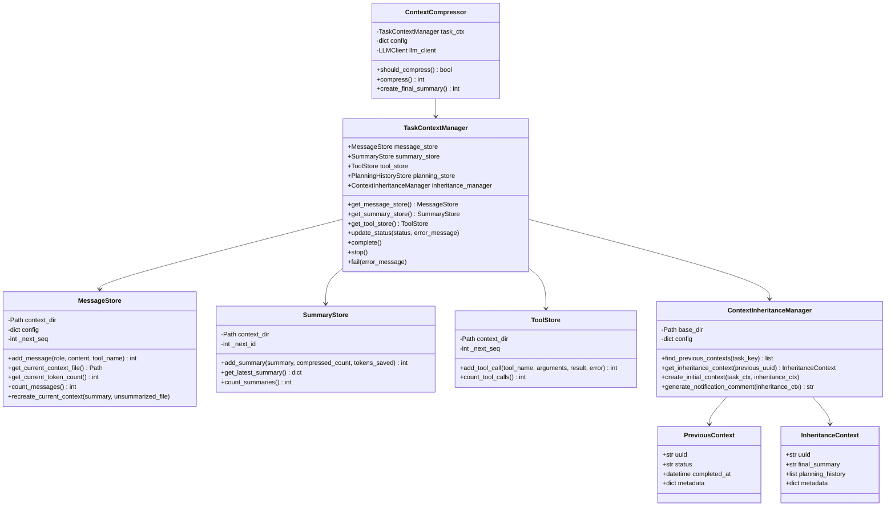
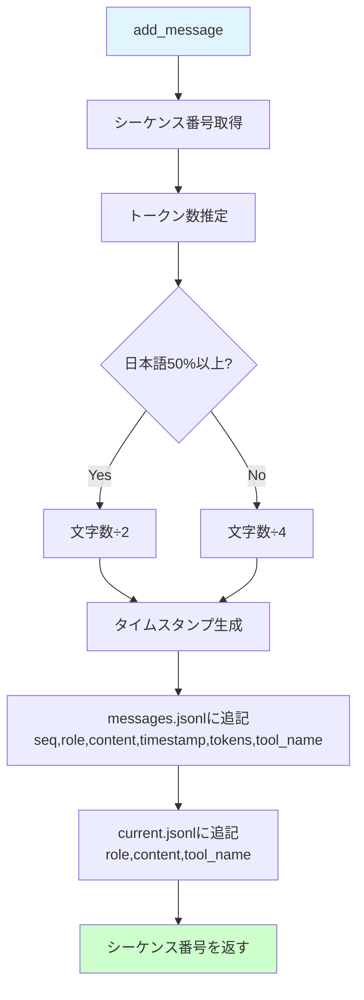
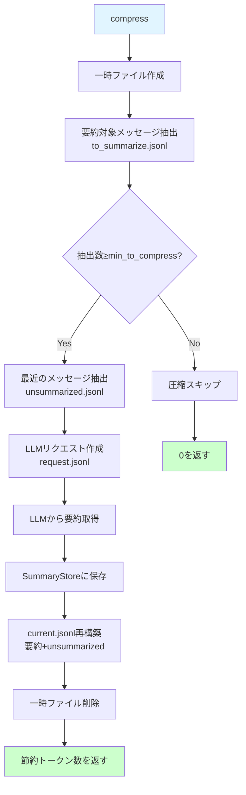
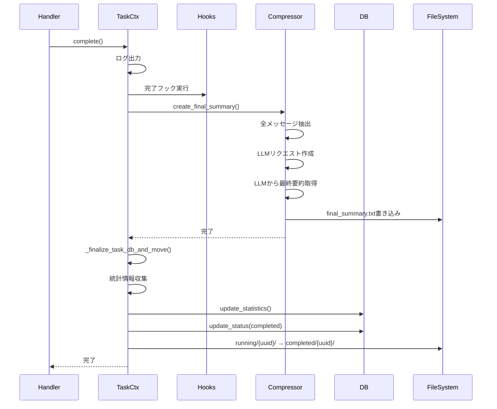
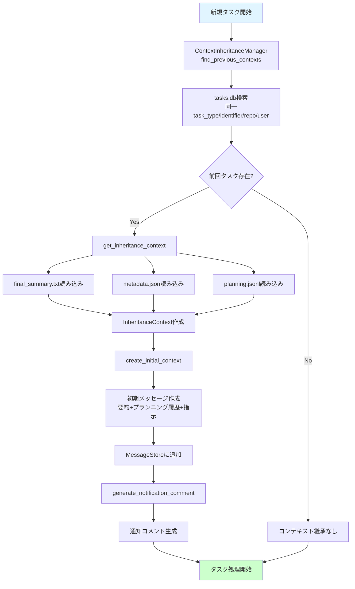

# コンテキストストレージ実装 詳細設計書

## 1. 概要

### 1.1 目的

コンテキストストレージシステムは、タスク実行中の全ての情報（メッセージ、要約、ツール呼び出し、プランニング履歴）を永続化し、タスクの中断・再開、コンテキスト継承を実現します。

### 1.2 主要機能

- **タスクコンテキスト管理**: タスク単位でのコンテキスト情報の一元管理
- **メッセージストレージ**: LLMとのやり取りの完全な履歴保存
- **コンテキスト圧縮**: トークン制限対応のための自動圧縮・要約
- **コンテキスト継承**: 前回タスクからのコンテキスト引き継ぎ
- **ツール呼び出し記録**: 実行された全ツール呼び出しの記録
- **プランニング履歴**: タスク計画の変遷記録

### 1.3 ディレクトリ構造

```
contexts/
├── running/           # 実行中タスク
│   └── {uuid}/
│       ├── metadata.json
│       ├── messages.jsonl
│       ├── current.jsonl
│       ├── summaries.jsonl
│       ├── tools.jsonl
│       └── planning.jsonl
├── completed/         # 完了タスク
│   └── {uuid}/
│       ├── metadata.json
│       ├── messages.jsonl
│       ├── final_summary.txt
│       ├── summaries.jsonl
│       ├── tools.jsonl
│       └── planning.jsonl
├── paused/           # 一時停止タスク
│   └── {uuid}/
│       └── (running/と同じ構造)
└── tasks.db          # タスク管理データベース
```

---

## 2. クラス設計

### 2.1 全体構成図



---

## 3. TaskContextManager クラス

**ファイル**: `context_storage/task_context_manager.py`

### 3.1 初期化処理

**メソッド**: `__init__(base_dir, task_key, config, llm_client=None)`

**処理内容**:
1. 基本パラメータを保存:
   - `base_dir`: コンテキストベースディレクトリ
   - `task_key`: タスクキー情報
   - `uuid`: タスクUUID（task_keyから取得）
   - `config`: アプリケーション設定
2. コンテキストディレクトリの決定:
   - `is_resumed`フラグに基づき、pausedまたはrunningディレクトリを選択
   - ディレクトリパス: `{base_dir}/running/{uuid}/` または `{base_dir}/paused/{uuid}/`
3. コンテキストディレクトリを作成（存在しない場合）
4. サブストアの初期化:
   - `MessageStore`: メッセージ管理
   - `SummaryStore`: 要約管理
   - `ToolStore`: ツール呼び出し記録
   - `PlanningHistoryStore`: プランニング履歴
5. タスクDB登録/更新:
   - 新規タスク: INSERT
   - 再開タスク: UPDATE（statusをrunningに変更）
6. メタデータファイル作成（新規タスクの場合）
7. コンテキスト継承の初期化（必要な場合）
8. completion/stopフックの初期化（空辞書）

**パラメータ**:
- `base_dir`: コンテキストベースディレクトリ（Path）
- `task_key`: TaskKeyインスタンス
- `config`: アプリケーション設定辞書
- `llm_client`: LLMクライアント（オプション、コンテキスト継承用）

### 3.2 get_message_store()

**処理内容**:
MessageStoreインスタンスを返します。

**戻り値**: MessageStoreインスタンス

### 3.3 get_summary_store()

**処理内容**:
SummaryStoreインスタンスを返します。

**戻り値**: SummaryStoreインスタンス

### 3.4 get_tool_store()

**処理内容**:
ToolStoreインスタンスを返します。

**戻り値**: ToolStoreインスタンス

### 3.5 get_planning_store()

**処理内容**:
PlanningHistoryStoreインスタンスを返します。

**戻り値**: PlanningHistoryStoreインスタンス

### 3.6 set_llm_client()

**処理内容**:
LLMクライアントを設定します。コンテキスト圧縮とコンテキスト継承で使用されます。

**パラメータ**:
- `llm_client`: LLMクライアントインスタンス

### 3.7 get_inheritance_context()

**処理内容**:
継承されたコンテキスト情報を取得します。

**戻り値**: InheritanceContextインスタンス（継承がない場合はNone）

### 3.8 has_inheritance_context()

**処理内容**:
コンテキスト継承があるかどうかを判定します。

**戻り値**: bool（True: 継承あり、False: 継承なし）

### 3.9 get_inheritance_notification_comment()

**処理内容**:
コンテキスト継承の通知コメントを取得します。

**戻り値**: str（通知コメント、継承がない場合はNone）

### 3.10 create_initial_context_with_inheritance()

**処理内容**:
継承コンテキストを使用して初期コンテキストを作成します。

**詳細処理**:
1. `ContextInheritanceManager.create_initial_context()`を呼び出し
2. 前回タスクの要約とプランニング履歴から初期メッセージを生成
3. MessageStoreに初期メッセージを追加

**パラメータ**:
- `system_message`: システムメッセージ

### 3.11 update_status()

**処理内容**:
tasks.dbのタスクステータスを更新します。

**詳細処理**:
1. tasks.dbに接続
2. UUIDに基づきステータスを更新
3. error_messageが指定されている場合、error_messageカラムも更新
4. updated_atタイムスタンプを更新

**パラメータ**:
- `status`: ステータス文字列（"running", "completed", "failed", "paused"）
- `error_message`: エラーメッセージ（オプション）

### 3.12 update_statistics()

**処理内容**:
tasks.dbのタスク統計情報を更新します。

**詳細処理**:
1. tasks.dbに接続
2. UUIDに基づき統計情報を更新:
   - `total_messages`: 総メッセージ数
   - `total_summaries`: 総要約数
   - `total_tool_calls`: 総ツール呼び出し数
   - `final_token_count`: 最終トークン数
   - `final_message_count`: 最終メッセージ数
3. updated_atタイムスタンプを更新

**パラメータ**:
- `total_messages`: 総メッセージ数
- `total_summaries`: 総要約数
- `total_tool_calls`: 総ツール呼び出し数
- `final_token_count`: 最終トークン数
- `final_message_count`: 最終メッセージ数

### 3.13 register_completion_hook()

**処理内容**:
タスク完了時に実行されるフック関数を登録します。

**パラメータ**:
- `hook_name`: フック名
- `hook_func`: フック関数

### 3.14 register_stop_hook()

**処理内容**:
タスク停止時に実行されるフック関数を登録します。

**パラメータ**:
- `hook_name`: フック名
- `hook_func`: フック関数

### 3.15 complete()

**処理内容**:
タスクを正常完了として処理します。

**詳細処理**:
1. 情報ログ出力
2. 登録された完了フックを全て実行
3. 最終要約の作成（LLMクライアントが設定されている場合）
4. タスクDB更新とディレクトリ移動:
   - ステータス: "completed"
   - 統計情報の更新
   - running/{uuid}/ → completed/{uuid}/

### 3.16 stop()

**処理内容**:
タスクを一時停止として処理します。

**詳細処理**:
1. 情報ログ出力
2. 登録された停止フックを全て実行
3. タスクDB更新とディレクトリ移動:
   - ステータス: "paused"
   - 統計情報の更新
   - running/{uuid}/ → paused/{uuid}/

### 3.17 fail()

**処理内容**:
タスクを失敗として処理します。

**詳細処理**:
1. エラーログ出力
2. タスクDB更新とディレクトリ移動:
   - ステータス: "failed"
   - error_messageの記録
   - 統計情報の更新
   - running/{uuid}/ → completed/{uuid}/

**パラメータ**:
- `error_message`: エラーメッセージ

### 3.18 _finalize_task_db_and_move()（内部メソッド）

**処理内容**:
タスクDBを更新し、コンテキストディレクトリを移動します。

**詳細処理**:
1. 統計情報を収集:
   - メッセージ数
   - 要約数
   - ツール呼び出し数
   - 最終トークン数
   - 最終メッセージ数
2. `update_statistics()`で統計情報を更新
3. `update_status()`でステータスを更新
4. 移動先ディレクトリを決定:
   - "paused": paused/{uuid}/
   - その他: completed/{uuid}/
5. 移動先の親ディレクトリを作成
6. `shutil.move()`でディレクトリを移動

**パラメータ**:
- `status`: 最終ステータス
- `error_message`: エラーメッセージ（オプション）

### 3.19 _create_final_summary()（内部メソッド）

**処理内容**:
タスク完了時に最終要約を作成します。

**詳細処理**:
1. LLMクライアントの存在確認
2. `ContextCompressor`を初期化
3. `create_final_summary()`を呼び出し
4. 最終要約の作成を試行
5. エラー時は警告ログを出力して継続

### 3.20 _create_metadata()（内部メソッド）

**処理内容**:
metadata.jsonファイルを作成します。

**詳細処理**:
1. メタデータ辞書を作成:
   - `uuid`: タスクUUID
   - `created_at`: 作成日時（ISO形式）
   - `task_type`: タスクタイプ
   - `task_identifier`: タスク識別子
   - `repository`: リポジトリ名
   - `user`: ユーザー名
2. JSON形式でmetadata.jsonに書き込み（インデント2）

### 3.21 _register_or_update_task()（内部メソッド）

**処理内容**:
tasks.dbにタスクを登録または更新します。

**詳細処理**:
1. tasks.dbに接続
2. UUIDでタスクを検索
3. 既存タスクが存在しない場合:
   - INSERTクエリを実行
   - 初期ステータス: "running"
   - メタデータをJSON形式で保存
4. 既存タスクが存在する場合（再開）:
   - UPDATEクエリを実行
   - ステータスを"running"に変更
5. 変更をコミット

---

## 4. MessageStore クラス

**ファイル**: `context_storage/message_store.py`

### 4.1 初期化処理

**メソッド**: `__init__(context_dir, config)`

**処理内容**:
1. パラメータを保存:
   - `context_dir`: コンテキストディレクトリ
   - `config`: アプリケーション設定
2. ファイルパスを設定:
   - `messages_file`: messages.jsonl（全メッセージ履歴）
   - `current_file`: current.jsonl（現在のコンテキスト）
3. `_next_seq`を初期化:
   - messages.jsonlが存在する場合、最大seq + 1
   - 存在しない場合、1

### 4.2 add_message()

**処理内容**:
メッセージを追加します。

**詳細処理**:
1. シーケンス番号を取得（`_get_next_seq()`）
2. トークン数を推定:
   - 文字数を4で割る（英語想定）
   - 日本語文字が50%以上の場合、文字数を2で割る
3. タイムスタンプを生成（ISO形式、UTC）
4. messages.jsonlに追記:
   - seq、role、content、timestamp、tokens、tool_name
5. current.jsonlに追記:
   - role、content、tool_name（OpenAI API互換形式）
6. シーケンス番号を返す

**パラメータ**:
- `role`: メッセージロール（"system", "user", "assistant", "tool"）
- `content`: メッセージ内容
- `tool_name`: ツール名（オプション）

**戻り値**: int（シーケンス番号）

### 4.3 get_current_context_file()

**処理内容**:
現在のコンテキストファイルパスを返します。

**詳細処理**:
1. `unsummarized_file_path`が指定されている場合:
   - そのパスを返す
2. 指定されていない場合:
   - current.jsonlのパスを返す

**パラメータ**:
- `unsummarized_file_path`: 未要約ファイルパス（オプション）

**戻り値**: Path（コンテキストファイルパス）

### 4.4 get_current_token_count()

**処理内容**:
current.jsonlの推定トークン数を計算します。

**詳細処理**:
1. current.jsonlが存在しない場合、0を返す
2. current.jsonlの全行を読み込み
3. 各行のcontentからトークン数を推定:
   - 文字数を4で割る（英語想定）
   - 日本語文字が50%以上の場合、文字数を2で割る
4. 合計トークン数を返す

**戻り値**: int（推定トークン数）

### 4.5 count_messages()

**処理内容**:
messages.jsonlのメッセージ数をカウントします。

**詳細処理**:
1. messages.jsonlが存在しない場合、0を返す
2. ファイルの行数をカウント
3. 行数を返す

**戻り値**: int（メッセージ数）

### 4.6 recreate_current_context()

**処理内容**:
圧縮後のコンテキストを再構築します。

**詳細処理**:
1. current.jsonlを削除（存在する場合）
2. current.jsonlに要約メッセージを書き込み:
   - role: "system"
   - content: summary
3. unsummarized_fileが指定されている場合:
   - unsummarized_fileの内容をcurrent.jsonlに追記
   - unsummarized_fileを削除
4. current.jsonlの行数をカウントして返す

**パラメータ**:
- `summary`: 要約テキスト
- `unsummarized_file`: 未要約ファイルパス（オプション）

**戻り値**: int（再構築後のメッセージ数）

### 4.7 _get_next_seq()（内部メソッド）

**処理内容**:
次のシーケンス番号を取得して、内部カウンターを増加させます。

**戻り値**: int（次のシーケンス番号）

---

## 5. SummaryStore クラス

**ファイル**: `context_storage/summary_store.py`

### 5.1 初期化処理

**メソッド**: `__init__(context_dir)`

**処理内容**:
1. `context_dir`を保存
2. `summaries_file`パスを設定（summaries.jsonl）
3. `_next_id`を初期化:
   - summaries.jsonlが存在する場合、最大id + 1
   - 存在しない場合、1

### 5.2 add_summary()

**処理内容**:
要約を追加します。

**詳細処理**:
1. ID番号を取得（`_get_next_id()`）
2. タイムスタンプを生成（ISO形式、UTC）
3. 要約レコードを作成:
   - id、summary、compressed_message_count、tokens_saved、created_at
4. summaries.jsonlに追記
5. ID番号を返す

**パラメータ**:
- `summary`: 要約テキスト
- `compressed_count`: 圧縮されたメッセージ数
- `tokens_saved`: 節約されたトークン数

**戻り値**: int（ID番号）

### 5.3 get_latest_summary()

**処理内容**:
最新の要約を取得します。

**詳細処理**:
1. summaries.jsonlが存在しない場合、Noneを返す
2. ファイルの全行を読み込み
3. 最後の行をJSONとしてパース
4. 要約レコードを返す

**戻り値**: dict（要約レコード、存在しない場合はNone）

### 5.4 count_summaries()

**処理内容**:
summaries.jsonlの要約数をカウントします。

**詳細処理**:
1. summaries.jsonlが存在しない場合、0を返す
2. ファイルの行数をカウント
3. 行数を返す

**戻り値**: int（要約数）

### 5.5 _get_next_id()（内部メソッド）

**処理内容**:
次のID番号を取得して、内部カウンターを増加させます。

**戻り値**: int（次のID番号）

---

## 6. ToolStore クラス

**ファイル**: `context_storage/tool_store.py`

### 6.1 初期化処理

**メソッド**: `__init__(context_dir)`

**処理内容**:
1. `context_dir`を保存
2. `tools_file`パスを設定（tools.jsonl）
3. `_next_seq`を初期化:
   - tools.jsonlが存在する場合、最大seq + 1
   - 存在しない場合、1

### 6.2 add_tool_call()

**処理内容**:
ツール呼び出しを記録します。

**詳細処理**:
1. シーケンス番号を取得（`_get_next_seq()`）
2. タイムスタンプを生成（ISO形式、UTC）
3. ツール呼び出しレコードを作成:
   - seq、tool_name、arguments、result、error、timestamp
4. tools.jsonlに追記
5. シーケンス番号を返す

**パラメータ**:
- `tool_name`: ツール名
- `arguments`: 引数（dict）
- `result`: 実行結果（オプション）
- `error`: エラー情報（オプション）

**戻り値**: int（シーケンス番号）

### 6.3 count_tool_calls()

**処理内容**:
tools.jsonlのツール呼び出し数をカウントします。

**詳細処理**:
1. tools.jsonlが存在しない場合、0を返す
2. ファイルの行数をカウント
3. 行数を返す

**戻り値**: int（ツール呼び出し数）

### 6.4 _get_next_seq()（内部メソッド）

**処理内容**:
次のシーケンス番号を取得して、内部カウンターを増加させます。

**戻り値**: int（次のシーケンス番号）

---

## 7. ContextCompressor クラス

**ファイル**: `context_storage/context_compressor.py`

### 7.1 初期化処理

**メソッド**: `__init__(task_ctx, config, llm_client)`

**処理内容**:
1. パラメータを保存:
   - `task_ctx`: TaskContextManagerインスタンス
   - `config`: アプリケーション設定
   - `llm_client`: LLMクライアント
2. 圧縮設定を取得:
   - `token_threshold`: 圧縮トリガーのトークン数（デフォルト: 8000）
   - `keep_recent`: 圧縮時に保持する最近のメッセージ数（デフォルト: 10）
   - `min_to_compress`: 圧縮する最小メッセージ数（デフォルト: 5）

### 7.2 should_compress()

**処理内容**:
コンテキスト圧縮が必要かどうかを判定します。

**詳細処理**:
1. 現在のトークン数を取得（`message_store.get_current_token_count()`）
2. トークン数がthresholdを超えているかチェック
3. 結果を返す

**戻り値**: bool（True: 圧縮必要、False: 圧縮不要）

### 7.3 compress()

**処理内容**:
コンテキストを圧縮します。

**詳細処理**:
1. 情報ログ出力（圧縮開始）
2. 一時ファイルを作成:
   - `to_summarize.jsonl`: 要約対象メッセージ
   - `unsummarized.jsonl`: 未要約メッセージ（保持対象）
   - `request.jsonl`: LLMリクエスト
3. 要約対象メッセージを抽出（`_extract_messages_to_summarize()`）
4. 抽出数が`min_to_compress`未満の場合、圧縮をスキップ
5. 最近のメッセージを抽出（`_extract_recent_messages()`）
6. LLMリクエストを作成（`_create_summary_request()`）
7. LLMから要約を取得（`_get_summary_from_llm()`）
8. 要約をSummaryStoreに保存
9. current.jsonlを再構築（`message_store.recreate_current_context()`）
10. 一時ファイルを削除
11. 節約されたトークン数を返す

**戻り値**: int（節約されたトークン数）

### 7.4 create_final_summary()

**処理内容**:
タスク完了時に最終要約を作成します。

**詳細処理**:
1. 情報ログ出力（最終要約作成開始）
2. 一時ファイルを作成:
   - `all_messages.jsonl`: 全メッセージ
   - `request.jsonl`: LLMリクエスト
   - `final_summary.txt`: 最終要約
3. 全メッセージを抽出（`_extract_all_messages()`）
4. 最終要約リクエストを作成（`_create_final_summary_request()`）
5. LLMから要約を取得（`_get_summary_from_llm()`）
6. final_summary.txtに書き込み
7. 一時ファイルを削除
8. 要約文字数を返す

**戻り値**: int（要約文字数）

### 7.5 _extract_all_messages()（内部メソッド）

**処理内容**:
messages.jsonlから全メッセージを抽出してall_messages.jsonlに書き込みます。

**詳細処理**:
1. messages.jsonlを開く
2. 各行をJSONとしてパース
3. OpenAI API形式でall_messages.jsonlに書き込み:
   - role、content、tool_name（存在する場合）
4. メッセージ数を返す

**パラメータ**:
- `output_file`: 出力ファイルパス

**戻り値**: int（メッセージ数）

### 7.6 _create_final_summary_request()（内部メソッド）

**処理内容**:
最終要約用のLLMリクエストを作成します。

**詳細処理**:
1. システムメッセージを作成（`_final_summary_prompt()`）
2. all_messages.jsonlの内容を読み込み
3. システムメッセージと全メッセージを結合
4. request.jsonlに書き込み

**パラメータ**:
- `messages_file`: メッセージファイルパス
- `output_file`: 出力ファイルパス

### 7.7 _final_summary_prompt()（内部メソッド）

**処理内容**:
最終要約用のシステムプロンプトを生成します。

**戻り値**: str（システムプロンプト）

### 7.8 _extract_recent_messages()（内部メソッド）

**処理内容**:
最近のメッセージをunsummarized.jsonlに抽出します。

**詳細処理**:
1. current.jsonlを開く
2. 全行を読み込み
3. 最後の`keep_recent`行を抽出
4. unsummarized.jsonlに書き込み

**パラメータ**:
- `output_file`: 出力ファイルパス

### 7.9 _extract_messages_to_summarize()（内部メソッド）

**処理内容**:
要約対象メッセージをto_summarize.jsonlに抽出します。

**詳細処理**:
1. current.jsonlを開く
2. 全行を読み込み
3. 最近の`keep_recent`行を除外
4. 残りをto_summarize.jsonlに書き込み
5. 抽出されたメッセージ数を返す

**パラメータ**:
- `output_file`: 出力ファイルパス

**戻り値**: int（抽出されたメッセージ数）

### 7.10 _create_summary_request()（内部メソッド）

**処理内容**:
要約用のLLMリクエストを作成します。

**詳細処理**:
1. システムメッセージを作成（`_default_summary_prompt()`）
2. to_summarize.jsonlの内容を読み込み
3. システムメッセージと要約対象メッセージを結合
4. request.jsonlに書き込み

**パラメータ**:
- `to_summarize_file`: 要約対象ファイルパス
- `output_file`: 出力ファイルパス

### 7.11 _get_summary_from_llm()（内部メソッド）

**処理内容**:
LLMから要約を取得します。

**詳細処理**:
1. request.jsonlを読み込み
2. LLMクライアントの`create_chat_completion()`を呼び出し
3. レスポンスから要約テキストを抽出
4. 要約テキストを返す

**パラメータ**:
- `request_file`: リクエストファイルパス

**戻り値**: str（要約テキスト）

### 7.12 _default_summary_prompt()（内部メソッド）

**処理内容**:
デフォルトの要約プロンプトを生成します。

**戻り値**: str（システムプロンプト）

---

## 8. ContextInheritanceManager クラス

**ファイル**: `context_storage/context_inheritance_manager.py`

### 8.1 初期化処理

**メソッド**: `__init__(base_dir, config)`

**処理内容**:
1. パラメータを保存:
   - `base_dir`: コンテキストベースディレクトリ
   - `config`: アプリケーション設定
2. tasks.dbのパスを設定
3. 継承設定を取得:
   - `max_summary_tokens`: 要約の最大トークン数（デフォルト: 4000）

### 8.2 find_previous_contexts()

**処理内容**:
前回のタスクコンテキストを検索します。

**詳細処理**:
1. タスクキーから検索条件を構築:
   - `task_type`: タスクタイプ
   - `task_identifier`: タスク識別子（Issue番号、PR番号等）
   - `repository`: リポジトリ名
   - `user`: ユーザー名
2. tasks.dbから前回タスクを検索:
   - 条件一致
   - ステータス: "completed"または"failed"
   - 降順（completed_at DESC）
3. 検索結果をPreviousContextのリストとして返す

**パラメータ**:
- `task_key`: TaskKeyインスタンス

**戻り値**: list[PreviousContext]（前回タスクのリスト）

### 8.3 get_inheritance_context()

**処理内容**:
指定されたUUIDの継承コンテキストを取得します。

**詳細処理**:
1. tasks.dbから前回タスクを検索
2. タスクが存在しない場合、Noneを返す
3. `_build_previous_context_from_db()`で詳細情報を構築
4. InheritanceContextインスタンスを作成して返す

**パラメータ**:
- `previous_uuid`: 前回タスクのUUID

**戻り値**: InheritanceContext（継承コンテキスト、存在しない場合はNone）

### 8.4 create_initial_context()

**処理内容**:
継承コンテキストから初期コンテキストメッセージを作成します。

**詳細処理**:
1. 最終要約を取得
2. プランニング履歴サマリーを作成（`_build_planning_summary()`）
3. 初期メッセージを構築:
   - 前回タスクの要約
   - プランニング履歴
   - 継続作業の指示
4. MessageStoreに追加
5. 追加されたメッセージのseq番号を返す

**パラメータ**:
- `task_ctx`: TaskContextManagerインスタンス
- `inheritance_ctx`: InheritanceContextインスタンス

**戻り値**: int（追加されたメッセージのseq番号）

### 8.5 generate_notification_comment()

**処理内容**:
継承コンテキストに関する通知コメントを生成します。

**詳細処理**:
1. 通知テンプレートを作成:
   - 前回タスクのUUID
   - 前回タスクのステータス
   - 完了日時
2. フォーマットされた通知コメントを返す

**パラメータ**:
- `inheritance_ctx`: InheritanceContextインスタンス

**戻り値**: str（通知コメント）

### 8.6 _build_previous_context_from_db()（内部メソッド）

**処理内容**:
データベースから前回タスクの詳細情報を構築します。

**詳細処理**:
1. 最終要約を読み込み（`_load_final_summary()`）
2. メタデータを読み込み（`_load_metadata()`）
3. プランニング履歴を読み込み（`_load_planning_history()`）
4. PreviousContextインスタンスを作成して返す

**パラメータ**:
- `uuid`: タスクUUID
- `status`: タスクステータス
- `completed_at`: 完了日時

**戻り値**: PreviousContext

### 8.7 _load_final_summary()（内部メソッド）

**処理内容**:
final_summary.txtを読み込みます。

**詳細処理**:
1. completedディレクトリのfinal_summary.txtを検索
2. ファイルが存在しない場合、Noneを返す
3. ファイル内容を読み込んで返す

**パラメータ**:
- `uuid`: タスクUUID

**戻り値**: str（最終要約、存在しない場合はNone）

### 8.8 _load_metadata()（内部メソッド）

**処理内容**:
metadata.jsonを読み込みます。

**詳細処理**:
1. completedディレクトリのmetadata.jsonを検索
2. ファイルが存在しない場合、空辞書を返す
3. JSONファイルをパースして返す

**パラメータ**:
- `uuid`: タスクUUID

**戻り値**: dict（メタデータ）

### 8.9 _load_planning_history()（内部メソッド）

**処理内容**:
planning.jsonlを読み込みます。

**詳細処理**:
1. completedディレクトリのplanning.jsonlを検索
2. ファイルが存在しない場合、空リストを返す
3. 各行をJSONとしてパースしてリストに追加
4. プランニング履歴リストを返す

**パラメータ**:
- `uuid`: タスクUUID

**戻り値**: list[dict]（プランニング履歴）

### 8.10 _build_planning_summary()（内部メソッド）

**処理内容**:
プランニング履歴からサマリーを作成します。

**詳細処理**:
1. プランニング履歴が空の場合、空文字列を返す
2. 各プランニングエントリーをフォーマット:
   - タイムスタンプ
   - プランタイプ
   - プラン内容
3. フォーマットされたサマリーを返す
4. トークン数制限を超える場合、切り詰め（`_truncate_summary_if_needed()`）

**パラメータ**:
- `planning_history`: プランニング履歴リスト

**戻り値**: str（プランニングサマリー）

### 8.11 _truncate_summary_if_needed()（内部メソッド）

**処理内容**:
サマリーが最大トークン数を超える場合、切り詰めます。

**詳細処理**:
1. トークン数を推定
2. 最大トークン数を超えていない場合、そのまま返す
3. 超えている場合:
   - 最大文字数を計算
   - サマリーを切り詰め
   - 切り詰めメッセージを追加
4. 切り詰められたサマリーを返す

**パラメータ**:
- `summary`: サマリーテキスト

**戻り値**: str（切り詰められたサマリー）

### 8.12 _format_summary_with_prefix()（内部メソッド）

**処理内容**:
サマリーにプレフィックスを付与してフォーマットします。

**パラメータ**:
- `summary`: サマリーテキスト
- `prefix`: プレフィックス

**戻り値**: str（フォーマットされたサマリー）

---

## 9. データクラス

### 9.1 PreviousContext

**ファイル**: `context_storage/context_inheritance_manager.py`

**フィールド**:
- `uuid`: タスクUUID（str）
- `status`: タスクステータス（str）
- `completed_at`: 完了日時（datetime）
- `metadata`: メタデータ（dict）
- `final_summary`: 最終要約（str、オプション）
- `planning_history`: プランニング履歴（list、オプション）

**用途**: 前回タスクの基本情報を保持

### 9.2 InheritanceContext

**ファイル**: `context_storage/context_inheritance_manager.py`

**フィールド**:
- `uuid`: 継承元タスクUUID（str）
- `final_summary`: 最終要約（str）
- `planning_history`: プランニング履歴（list）
- `metadata`: メタデータ（dict）

**用途**: コンテキスト継承時の詳細情報を保持

---

## 10. 処理フロー図

### 10.1 タスク開始時のコンテキスト初期化フロー

```mermaid
flowchart TD
    A[TaskContextManager.__init__] --> B{再開タスク?}
    B -->|Yes| C[paused/{uuid}/を使用]
    B -->|No| D[running/{uuid}/を作成]
    
    C --> E[サブストア初期化]
    D --> E
    
    E --> F[MessageStore]
    E --> G[SummaryStore]
    E --> H[ToolStore]
    E --> I[PlanningHistoryStore]
    
    F --> J{新規タスク?}
    G --> J
    H --> J
    I --> J
    
    J -->|Yes| K[tasks.db INSERT]
    J -->|No| L[tasks.db UPDATE<br/>status=running]
    
    K --> M[metadata.json作成]
    L --> N{コンテキスト継承?}
    M --> N
    
    N -->|Yes| O[ContextInheritanceManager初期化]
    N -->|No| P[完了]
    
    O --> Q[前回タスク検索]
    Q --> R[継承コンテキスト構築]
    R --> P
    
    style A fill:#e1f5ff
    style P fill:#ccffcc
```

### 10.2 メッセージ追加フロー



### 10.3 コンテキスト圧縮フロー



### 10.4 タスク完了フロー



### 10.5 コンテキスト継承フロー



---

## 11. ファイルフォーマット

### 11.1 messages.jsonl

**形式**: JSON Lines（1行1メッセージ）

**フィールド**:
```json
{
  "seq": 1,
  "role": "user",
  "content": "メッセージ内容",
  "timestamp": "2024-12-07T03:00:00+00:00",
  "tokens": 150,
  "tool_name": "function_name"
}
```

### 11.2 current.jsonl

**形式**: JSON Lines（OpenAI API互換）

**フィールド**:
```json
{
  "role": "user",
  "content": "メッセージ内容",
  "tool_name": "function_name"
}
```

### 11.3 summaries.jsonl

**形式**: JSON Lines（1行1要約）

**フィールド**:
```json
{
  "id": 1,
  "summary": "要約テキスト",
  "compressed_message_count": 50,
  "tokens_saved": 5000,
  "created_at": "2024-12-07T03:00:00+00:00"
}
```

### 11.4 tools.jsonl

**形式**: JSON Lines（1行1ツール呼び出し）

**フィールド**:
```json
{
  "seq": 1,
  "tool_name": "function_name",
  "arguments": {"arg1": "value1"},
  "result": "実行結果",
  "error": null,
  "timestamp": "2024-12-07T03:00:00+00:00"
}
```

### 11.5 planning.jsonl

**形式**: JSON Lines（1行1プランニングエントリー）

**フィールド**:
```json
{
  "id": 1,
  "plan_type": "initial",
  "plan_content": "プラン内容",
  "created_at": "2024-12-07T03:00:00+00:00"
}
```

### 11.6 metadata.json

**形式**: JSON

**フィールド**:
```json
{
  "uuid": "task-uuid",
  "created_at": "2024-12-07T03:00:00+00:00",
  "task_type": "github_issue",
  "task_identifier": "123",
  "repository": "owner/repo",
  "user": "username"
}
```

### 11.7 final_summary.txt

**形式**: プレーンテキスト

**内容**: タスク全体の最終要約（LLMにより生成）

---

## 12. データベーススキーマ

### 12.1 tasks テーブル

```sql
CREATE TABLE tasks (
    uuid TEXT PRIMARY KEY,
    status TEXT NOT NULL,
    task_type TEXT NOT NULL,
    task_identifier TEXT,
    repository TEXT,
    user TEXT,
    created_at TEXT NOT NULL,
    updated_at TEXT,
    completed_at TEXT,
    metadata TEXT,
    total_messages INTEGER DEFAULT 0,
    total_summaries INTEGER DEFAULT 0,
    total_tool_calls INTEGER DEFAULT 0,
    final_token_count INTEGER,
    final_message_count INTEGER,
    error_message TEXT
);

CREATE INDEX idx_tasks_status ON tasks(status);
CREATE INDEX idx_tasks_task_type ON tasks(task_type);
CREATE INDEX idx_tasks_repository ON tasks(repository);
CREATE INDEX idx_tasks_user ON tasks(user);
CREATE INDEX idx_tasks_completed_at ON tasks(completed_at);
```

**フィールド説明**:
- `uuid`: タスクの一意識別子
- `status`: タスクステータス（"running", "completed", "failed", "paused"）
- `task_type`: タスクタイプ（"github_issue", "gitlab_mr"等）
- `task_identifier`: タスク識別子（Issue番号、MR番号等）
- `repository`: リポジトリ名（"owner/repo"形式）
- `user`: ユーザー名
- `created_at`: 作成日時（ISO形式）
- `updated_at`: 更新日時（ISO形式）
- `completed_at`: 完了日時（ISO形式）
- `metadata`: メタデータ（JSON形式）
- `total_messages`: 総メッセージ数
- `total_summaries`: 総要約数
- `total_tool_calls`: 総ツール呼び出し数
- `final_token_count`: 最終トークン数
- `final_message_count`: 最終メッセージ数
- `error_message`: エラーメッセージ

---

## 13. 設定項目

### 13.1 config.yaml設定

```yaml
context:
  # コンテキストベースディレクトリ
  base_dir: "contexts"
  
  # コンテキスト圧縮設定
  compression:
    token_threshold: 8000      # 圧縮トリガーのトークン数
    keep_recent: 10            # 圧縮時に保持する最近のメッセージ数
    min_to_compress: 5         # 圧縮する最小メッセージ数
  
  # コンテキスト継承設定
  inheritance:
    enabled: true                    # コンテキスト継承を有効化
    max_summary_tokens: 4000         # 継承要約の最大トークン数
```

---

## 14. 運用ガイドライン

### 14.1 ディレクトリのメンテナンス

**完了タスクのアーカイブ**:
```bash
# 30日以上前の完了タスクを削除
find contexts/completed -type d -name "*-*-*-*-*" -mtime +30 -exec rm -rf {} +
```

**データベースのバキューム**:
```bash
sqlite3 contexts/tasks.db "VACUUM;"
```

### 14.2 トラブルシューティング

**コンテキストが見つからない**:
1. tasks.dbを確認
2. ディレクトリの存在確認
3. ログでUUIDを確認

**圧縮が動作しない**:
1. トークン数を確認（`get_current_token_count()`）
2. `token_threshold`設定を確認
3. LLMクライアントが設定されているか確認

**継承が動作しない**:
1. 前回タスクのステータスを確認（completedまたはfailed）
2. final_summary.txtの存在確認
3. task_type/identifier/repository/userの一致確認

---

## 15. まとめ

### 15.1 主要な特徴

- **完全な履歴保存**: 全メッセージ、要約、ツール呼び出しを永続化
- **自動コンテキスト圧縮**: トークン制限対応のための自動圧縮
- **コンテキスト継承**: 前回タスクからのシームレスな引き継ぎ
- **柔軟な状態管理**: running/completed/paused/failedの状態遷移
- **統計情報記録**: タスクの実行統計を自動収集

### 15.2 制約事項

- SQLiteベース（1タスク1プロセス前提）
- トークン数は推定値（厳密ではない）
- LLMクライアントが必要（圧縮・最終要約用）

---

## 16. 関連ドキュメント

- [CONTEXT_FILE_SPEC.md](CONTEXT_FILE_SPEC.md) - コンテキストファイル化仕様
- [CONTEXT_INHERITANCE_SPECIFICATION.md](CONTEXT_INHERITANCE_SPECIFICATION.md) - コンテキスト継承仕様
- [MAIN_SPEC.md](../MAIN_SPEC.md) - main.pyの詳細設計

---

**文書バージョン:** 2.0  
**最終更新日:** 2024-12-07  
**ステータス:** 実装済み・設計書
