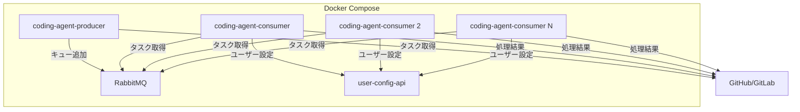
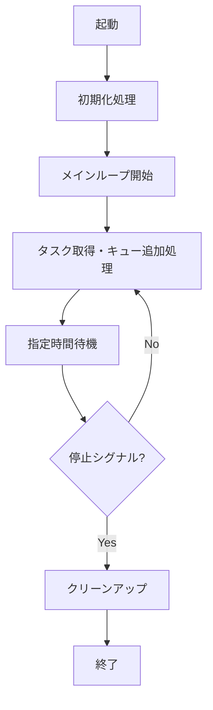
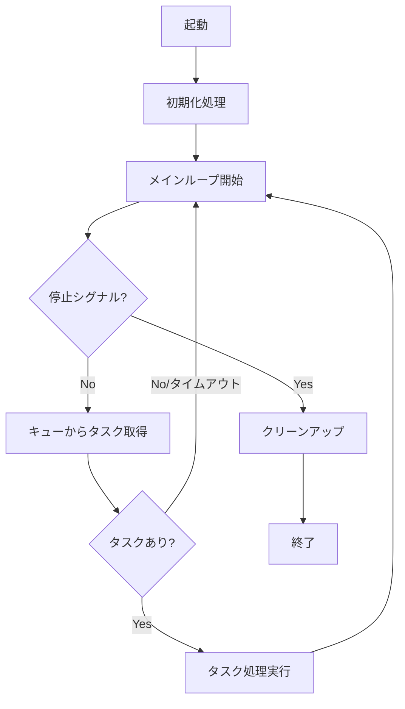

# Docker Compose 継続動作モード仕様書

## 1. 概要

### 1.1 目的

現在のcoding_agentは、cronによる定期実行でproducerとconsumerを動作させています。本仕様では、docker-composeを使用して、producerとconsumerをそれぞれ独立したコンテナとして継続的に動作させるモードを設計します。

### 1.2 背景

- cronベースの実行では、実行間隔の間に発生したタスクの処理に遅延が生じる
- docker-composeによる継続動作により、リアルタイムに近いタスク処理が可能になる
- コンテナ化により、スケーラビリティと運用管理が向上する

### 1.3 要求事項

- producerは設定ファイルで指定された時間（分単位）待機してからループ実行する
- consumerはsleep無しで、処理が終了次第すぐに次のタスクを取得してループ実行する
- 両モードとも、gracefulな停止をサポートする
- 既存のcron実行との互換性を維持する

---

## 2. アーキテクチャ

### 2.1 システム構成図

### 2.2 サービス構成

- **coding-agent-producer**: タスク取得とキュー投入を継続実行
- **coding-agent-consumer**: タスク処理を継続実行（複数インスタンス可）
- **rabbitmq**: メッセージキュー
- **user-config-api**: ユーザー設定API

---

## 3. コマンドラインオプション

### 3.1 新規オプション

main.pyに--continuousオプションを追加します。

- **--continuous**: 継続動作モードを有効化
- **--mode producer --continuous**: producerを継続動作させる
- **--mode consumer --continuous**: consumerを継続動作させる

### 3.2 動作の違い

- **--continuousなし**: 現行通り、処理完了後に終了
- **--continuousあり**: 処理完了後も終了せず、ループを継続

---

## 4. Producer継続動作モード

### 4.1 動作フロー図

### 4.2 待機時間の設定

config.yamlのcontinuous.producer.interval_minutesで待機時間（分）を設定します。デフォルト値は1分です。

### 4.3 待機処理の実装方針

1. 指定分数を秒数に変換
2. 1秒単位でsleepしながら停止シグナルをチェック
3. 停止シグナル検出時は即座にループを終了
4. 待機時間経過後、次のタスク取得処理を実行

---

## 5. Consumer継続動作モード

### 5.1 動作フロー図

### 5.2 キュー取得のタイムアウト設定

config.yamlのcontinuous.consumer.queue_timeout_secondsでキュー取得タイムアウト（秒）を設定します。デフォルト値は30秒です。

### 5.3 sleepなし動作の実装方針

1. キューからのタスク取得時にタイムアウトを設定
2. タスクが存在する場合は即座に処理を開始
3. タイムアウト時はシグナルチェック後、再度キュー取得を試行
4. タスク処理完了後、sleepせずに次のタスク取得へ

---

## 6. Gracefulシャットダウン

### 6.1 停止シグナル

停止ファイル（contexts/pause_signal）の存在をチェックし、ファイルが存在する場合はgracefulシャットダウンを開始します。このファイルは既存の一時停止機能でも使用されており、継続動作モードでは一時停止ではなくプロセス終了として動作します。

### 6.2 シャットダウン時の動作

#### Producerの場合

1. 現在のタスク取得処理を完了
2. 取得したタスクをキューに追加
3. ログに停止メッセージを出力
4. プロセスを終了

#### Consumerの場合

1. 現在処理中のタスクを完了させる
2. タスク完了後、新しいタスクを取得しない
3. ログに停止メッセージを出力
4. プロセスを終了

---

## 7. 設定ファイル

### 7.1 config.yamlへの追加

continuousセクションで以下を設定します：

- **enabled**: 継続動作モードの有効化（デフォルト: false）

#### producer設定

- **interval_minutes**: タスク取得間隔（分、デフォルト: 1）
- **delay_first_run**: 起動時の初回実行を遅延させるか（デフォルト: false）

#### consumer設定

- **queue_timeout_seconds**: キュー取得タイムアウト（秒、デフォルト: 30）
- **min_interval_seconds**: タスク処理間の最小待機時間（秒、デフォルト: 0）

---

## 8. Docker Compose設定

### 8.1 サービス定義

docker-compose.ymlに以下のサービスを追加します：

#### coding-agent-producer

- **イメージ**: プロジェクトのDockerfile
- **コマンド**: python main.py --mode producer --continuous
- **依存関係**: rabbitmq、user-config-api、web（GitLab CE、healthyになるまで待機）
- **再起動ポリシー**: unless-stopped
- **停止猶予時間**: 300秒

#### coding-agent-consumer

- **イメージ**: プロジェクトのDockerfile
- **コマンド**: python main.py --mode consumer --continuous
- **依存関係**: rabbitmq、user-config-api、web（GitLab CE、healthyになるまで待機）
- **再起動ポリシー**: unless-stopped
- **停止猶予時間**: 300秒（タスク処理完了を待つため）

### 8.2 Consumerのスケールアウト

複数のConsumerを起動する場合は、docker-composeコマンドで--scaleオプションを使用するか、docker-compose.override.ymlでreplicasを設定します。

---

## 9. ヘルスチェック

### 9.1 実装方針

1. 定期的にヘルスチェックファイルを更新
2. ヘルスチェックファイルの最終更新時刻を確認
3. 一定時間以上更新がない場合、コンテナを異常と判定

### 9.2 ヘルスチェックファイル

- **Producer**: /app/healthcheck/producer.health
- **Consumer**: /app/healthcheck/consumer.health

---

## 10. 既存機能との互換性

### 10.1 cronベース実行との互換性

- --continuousオプションなしの場合、現行通りの動作を維持
- 設定ファイルのcontinuous.enabledがtrueでも、--continuousオプションがない場合は単発実行
- 既存のcron設定をそのまま使用可能

### 10.2 一時停止・リジューム機能との連携

- 継続動作モードでも、contexts/pause_signalによる停止制御は有効
- シグナル検出時の動作：
  - Producer: タスク取得後、キュー追加前にシグナルチェックし、検出時はプロセスを終了
  - Consumer: タスク処理完了後、次のタスク取得前にシグナルチェックし、検出時はプロセスを終了

### 10.3 ファイルロック機能

- Producerモードでは、既存のFileLock機能を継続して使用
- 複数Producerの同時実行を防止
- Consumerは複数インスタンスの同時実行を許可（RabbitMQによる排他制御）

---

## 11. 運用ガイドライン

### 11.1 起動方法

#### docker-composeでの起動

全サービス起動、Producer/Consumerのみ起動、Consumerのスケールアウトが可能です。

#### 手動起動（デバッグ用）

main.pyを直接実行する場合は--mode producer --continuousまたは--mode consumer --continuousを指定します。

### 11.2 停止方法

docker-composeで停止するか、停止ファイルを作成することで停止できます。

### 11.3 ログ確認

docker-compose logsコマンドまたはログファイル（logs/producer.log、logs/consumer.log）で確認できます。

---

## 12. 関連ドキュメント

- [基本仕様](spec.md)
- [一時停止・再開機能仕様](PAUSE_RESUME_SPECIFICATION.md)
- [コンテキストファイル化仕様](context_file_spec.md)

---

**文書バージョン:** 2.0  
**最終更新日:** 2024-11-28  
**ステータス:** 実装済み
