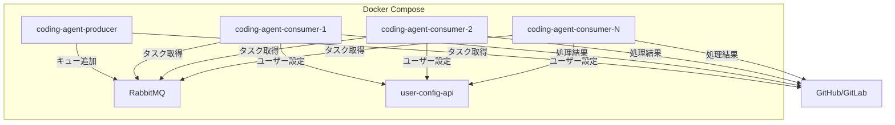
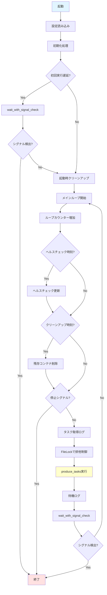
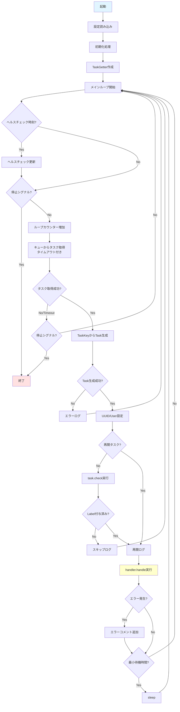
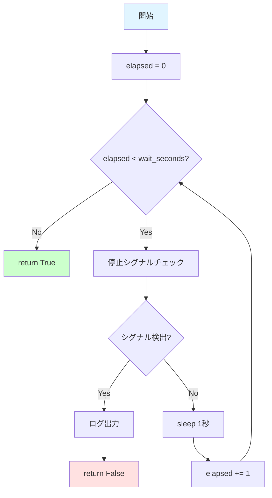
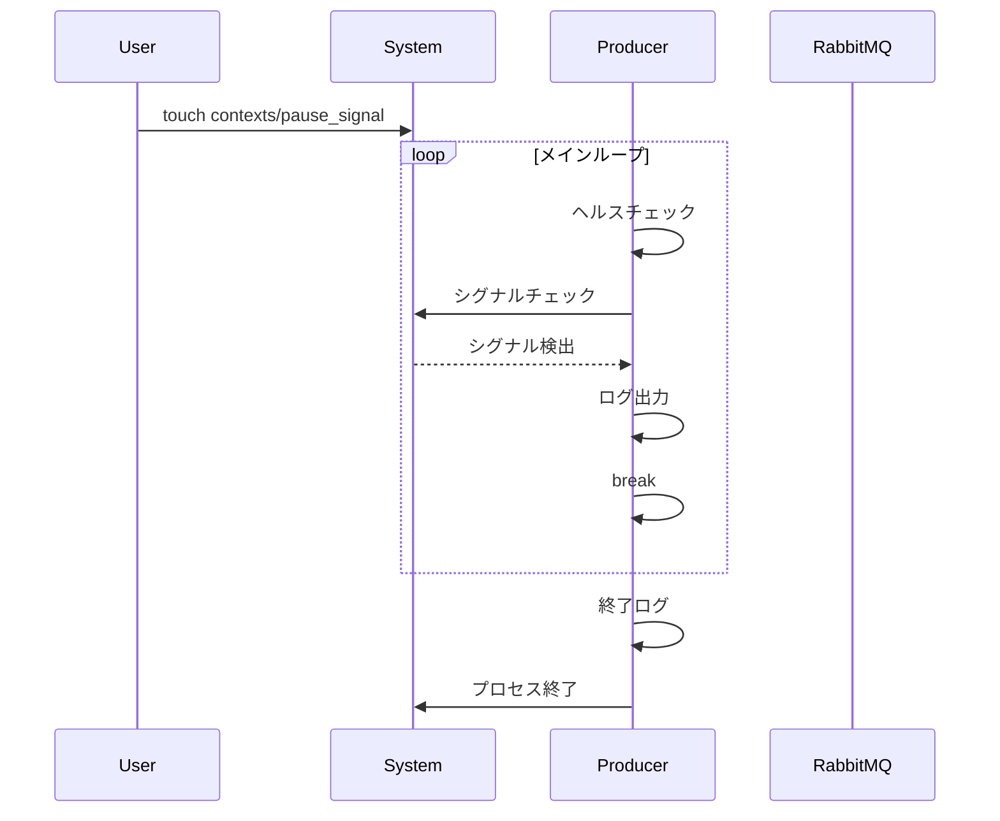
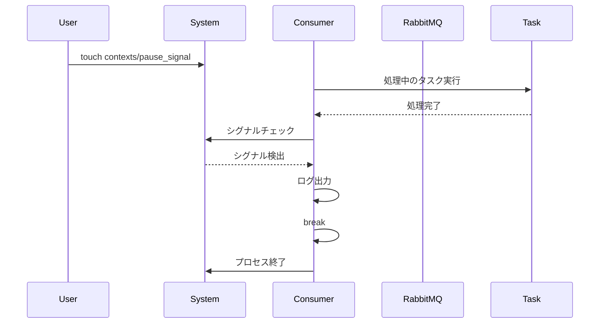

# Docker Compose 継続動作モード 詳細設計書

## 1. 概要

### 1.1 目的

Docker Composeを使用して、ProducerとConsumerをそれぞれ独立したコンテナとして継続的に動作させるモードを提供します。これにより、cronベースの定期実行と比較して、リアルタイムに近いタスク処理が可能になります。

### 1.2 主要機能

- **Producer継続動作**: タスク取得とキュー投入を設定間隔で継続実行
- **Consumer継続動作**: キューからのタスク取得と処理を継続実行
- **Gracefulシャットダウン**: 停止シグナルによる安全な終了
- **ヘルスチェック**: サービスの稼働状態監視
- **スケーラビリティ**: Consumer複数インスタンスによる並列処理

### 1.3 既存機能との互換性

- cronベースの実行との完全な互換性を維持
- `--continuous`オプションなしでは従来通りの単発実行
- 既存の一時停止・再開機能と連携

---

## 2. システムアーキテクチャ

### 2.1 全体構成図



### 2.2 サービス構成

| サービス | 説明 | スケール |
|---------|------|---------|
| coding-agent-producer | タスク取得とキュー投入を継続実行 | 1インスタンス（ファイルロックで制御） |
| coding-agent-consumer | タスク処理を継続実行 | 複数インスタンス可能 |
| rabbitmq | メッセージキュー | 1インスタンス |
| user-config-api | ユーザー設定API | 1インスタンス |

---

## 3. 関数詳細

### 3.1 update_healthcheck_file()

**ファイル**: `main.py`

**処理内容**:
ヘルスチェックファイルを更新します。継続動作モードのサービス監視に使用されます。

**詳細処理**:
1. ヘルスチェックディレクトリを作成（存在しない場合）
2. サービス名に基づくファイル名を生成（`{service_name}.health`）
3. 現在時刻（UTC、ISO形式）をファイルに書き込み

**パラメータ**:
- `healthcheck_dir`: ヘルスチェックディレクトリのPath
- `service_name`: サービス名（"producer" または "consumer"）

**戻り値**: なし

**使用例**:
```python
update_healthcheck_file(Path("healthcheck"), "producer")
# healthcheck/producer.health に "2024-12-07T03:00:00+00:00" を書き込み
```

### 3.2 wait_with_signal_check()

**ファイル**: `main.py`

**処理内容**:
停止シグナルをチェックしながら指定時間待機します。Producer継続動作モードで使用されます。

**詳細処理**:
1. 経過時間カウンターを0で初期化
2. 経過時間が指定時間未満の間ループ:
   - PauseResumeManagerで停止シグナルをチェック
   - シグナル検出時:
     - 情報ログを出力
     - `False`を返して終了
   - 1秒スリープ
   - 経過時間を1秒増加
3. 待機完了時は`True`を返す

**パラメータ**:
- `wait_seconds`: 待機時間（秒）
- `pause_manager`: PauseResumeManagerインスタンス
- `logger`: ロガー

**戻り値**:
- `True`: 待機完了（シグナル未検出）
- `False`: 停止シグナル検出

**特徴**:
- 1秒単位でシグナルチェックを行うため、最大1秒の遅延で停止可能
- 長時間待機中でも即座に停止シグナルに反応

### 3.3 run_producer_continuous()

**ファイル**: `main.py`

**処理内容**:
Producer継続動作モードを実行します。タスク取得を継続的に実行し、指定間隔で待機します。

**詳細処理**:

#### 初期化フェーズ
1. 継続動作モード設定を取得:
   - `interval_minutes`: タスク取得間隔（デフォルト: 1分）
   - `delay_first_run`: 初回実行遅延フラグ（デフォルト: False）
   - 間隔を秒数に変換
2. ヘルスチェック設定を取得:
   - `healthcheck_dir`: ヘルスチェックディレクトリ（デフォルト: "healthcheck"）
   - `healthcheck_interval`: 更新間隔（デフォルト: 60秒）
3. PauseResumeManagerを初期化
4. ExecutionEnvironmentManagerを初期化（コンテナクリーンアップ用）
5. クリーンアップ設定を取得:
   - `interval_hours`: クリーンアップ間隔（デフォルト: 24時間）
6. 起動ログを出力
7. ループカウンターとヘルスチェックタイマーを初期化

#### 初回実行遅延（オプション）
1. `delay_first_run`がTrueの場合:
   - 遅延ログを出力
   - `wait_with_signal_check()`で待機
   - シグナル検出時は終了

#### 起動時クリーンアップ
1. ExecutionEnvironmentManagerが有効な場合:
   - 残存コンテナをクリーンアップ
   - 削除件数をログ出力
   - エラー時は例外ログを出力して継続

#### メインループ
1. ファイルロックパスを作成
2. 無限ループ開始:

**ループ内処理**:
1. ループカウンターを増加
2. ヘルスチェック:
   - 前回更新からの経過時間をチェック
   - 間隔経過時、ヘルスチェックファイルを更新
3. 定期クリーンアップ:
   - ExecutionEnvironmentManager有効かつ間隔経過時
   - 残存コンテナをクリーンアップ
   - 削除件数をログ出力
4. 停止シグナルチェック:
   - シグナル検出時、ループを抜ける
5. タスク取得開始ログを出力
6. タスク取得処理（ファイルロック付き）:
   - `FileLock`でロックを取得
   - `produce_tasks()`を呼び出し
   - エラー時は例外ログを出力して継続
7. 待機ログを出力
8. 指定時間待機:
   - `wait_with_signal_check()`で待機
   - シグナル検出時、ループを抜ける

#### 終了処理
1. 終了ログを出力

**パラメータ**:
- `config`: アプリケーション設定辞書
- `mcp_clients`: MCPクライアントの辞書
- `task_source`: タスクソース
- `task_queue`: タスクキューオブジェクト
- `logger`: ロガー

**戻り値**: なし

**使用される設定**:
```yaml
continuous:
  producer:
    interval_minutes: 1
    delay_first_run: false
  healthcheck:
    dir: "healthcheck"
    update_interval_seconds: 60

command_executor:
  cleanup:
    interval_hours: 24
```

### 3.4 run_consumer_continuous()

**ファイル**: `main.py`

**処理内容**:
Consumer継続動作モードを実行します。キューからタスクを継続的に取得して処理します。

**詳細処理**:

#### 初期化フェーズ
1. task_configから設定を取得:
   - `config`: アプリケーション設定
   - `mcp_clients`: MCPクライアント
   - `task_source`: タスクソース
2. 継続動作モード設定を取得:
   - `queue_timeout`: キュー取得タイムアウト（デフォルト: 30秒）
   - `min_interval`: タスク処理間の最小待機時間（デフォルト: 0秒）
3. ヘルスチェック設定を取得:
   - `healthcheck_dir`: ヘルスチェックディレクトリ
   - `healthcheck_interval`: 更新間隔
4. PauseResumeManagerを初期化
5. TaskGetterを初期化（ファクトリーパターン）
6. 起動ログを出力
7. ループカウンターとヘルスチェックタイマーを初期化

#### メインループ
無限ループで以下を繰り返し:

**ループ内処理**:
1. ヘルスチェック:
   - 前回更新からの経過時間をチェック
   - 間隔経過時、ヘルスチェックファイルを更新
2. 停止シグナルチェック:
   - シグナル検出時、ループを抜ける
3. ループカウンターを増加
4. タスク取得試行ログを出力（デバッグレベル）
5. キューからタスク取得:
   - `task_queue.get_with_signal_check()`を呼び出し
   - タイムアウト、シグナルチェッカー、ポーリング間隔を指定
   - 戻り値がNoneの場合:
     - シグナルチェック→検出時はループを抜ける
     - タイムアウトの場合は継続
6. TaskKeyからTaskインスタンスを生成:
   - `task_getter.from_task_key()`を呼び出し
   - Noneの場合、エラーログを出力して継続
7. タスクにUUID、ユーザー情報を設定
8. タスクの再開フラグを設定
9. タスク状態確認（再開タスクは除く）:
   - `task.check()`でprocessing_labelの確認
   - 未付与の場合、スキップログを出力して継続
   - 再開タスクの場合、再開ログを出力
10. タスク処理実行:
    - `handler.handle(task)`を呼び出し
    - エラー時:
      - 例外ログを出力
      - タスクにエラーコメントを追加
11. 最小待機時間:
    - `min_interval`が0より大きい場合、スリープ

#### 終了処理
1. 終了ログを出力

**パラメータ**:
- `task_queue`: タスクキューオブジェクト
- `handler`: タスク処理ハンドラー
- `logger`: ロガー
- `task_config`: タスク設定情報（config, mcp_clients, task_sourceを含む）

**戻り値**: なし

**使用される設定**:
```yaml
continuous:
  consumer:
    queue_timeout_seconds: 30
    min_interval_seconds: 0
  healthcheck:
    dir: "healthcheck"
    update_interval_seconds: 60
```

**特徴**:
- sleep無し動作（キュータイムアウトで制御）
- 複数インスタンスの同時実行をサポート
- RabbitMQによる排他制御（ファイルロック不要）

---

## 4. 処理フロー図

### 4.1 Producer継続動作フロー



### 4.2 Consumer継続動作フロー



### 4.3 wait_with_signal_check処理フロー



---

## 5. コマンドラインオプション

### 5.1 main()関数での引数解析

**オプション一覧**:

| オプション | 選択肢 | 説明 |
|----------|--------|------|
| `--mode` | producer, consumer | producer: タスク取得のみ, consumer: キュー実行のみ |
| `--continuous` | フラグ | 継続動作モードを有効化（docker-compose用） |

### 5.2 動作の違い

#### --continuousなし（従来の動作）
- Producer: タスク取得→キュー投入→終了
- Consumer: キュー取得→処理→終了

#### --continuousあり（継続動作モード）
- Producer: タスク取得→キュー投入→待機→ループ
- Consumer: キュー取得→処理→ループ（待機なし）

### 5.3 使用例

```bash
# Producer継続動作モード
python main.py --mode producer --continuous

# Consumer継続動作モード
python main.py --mode consumer --continuous

# 従来の単発実行（Producer）
python main.py --mode producer

# 従来の単発実行（Consumer）
python main.py --mode consumer
```

---

## 6. 設定ファイル

### 6.1 config.yaml設定項目

```yaml
continuous:
  # Producer設定
  producer:
    interval_minutes: 1          # タスク取得間隔（分）
    delay_first_run: false       # 起動時の初回実行を遅延

  # Consumer設定
  consumer:
    queue_timeout_seconds: 30    # キュー取得タイムアウト（秒）
    min_interval_seconds: 0      # タスク処理間の最小待機時間（秒）

  # ヘルスチェック設定
  healthcheck:
    dir: "healthcheck"                    # ヘルスチェックディレクトリ
    update_interval_seconds: 60           # 更新間隔（秒）

# Command Executor設定（Producer用）
command_executor:
  cleanup:
    interval_hours: 24           # 残存コンテナクリーンアップ間隔（時間）
```

### 6.2 設定項目の詳細

#### Producer設定

**interval_minutes**:
- タスク取得処理の実行間隔
- デフォルト: 1分
- 推奨値: 1-10分

**delay_first_run**:
- 起動直後の初回実行を遅延するかどうか
- デフォルト: false
- 用途: 他のサービス起動待ち

#### Consumer設定

**queue_timeout_seconds**:
- RabbitMQからのタスク取得タイムアウト
- デフォルト: 30秒
- タイムアウト後は停止シグナルをチェックして継続

**min_interval_seconds**:
- タスク処理間の最小待機時間
- デフォルト: 0秒（待機なし）
- 用途: レート制限、API負荷軽減

#### ヘルスチェック設定

**dir**:
- ヘルスチェックファイル配置ディレクトリ
- デフォルト: "healthcheck"

**update_interval_seconds**:
- ヘルスチェックファイルの更新間隔
- デフォルト: 60秒

---

## 7. Docker Compose設定

### 7.1 サービス定義例

```yaml
services:
  coding-agent-producer:
    build: .
    command: python main.py --mode producer --continuous
    depends_on:
      rabbitmq:
        condition: service_healthy
      user-config-api:
        condition: service_started
    restart: unless-stopped
    stop_grace_period: 300s
    volumes:
      - ./contexts:/app/contexts
      - ./healthcheck:/app/healthcheck

  coding-agent-consumer:
    build: .
    command: python main.py --mode consumer --continuous
    depends_on:
      rabbitmq:
        condition: service_healthy
      user-config-api:
        condition: service_started
    restart: unless-stopped
    stop_grace_period: 300s
    volumes:
      - ./contexts:/app/contexts
      - ./healthcheck:/app/healthcheck
```

### 7.2 Consumerのスケールアウト

```bash
# 3つのConsumerインスタンスを起動
docker-compose up -d --scale coding-agent-consumer=3
```

---

## 8. Gracefulシャットダウン

### 8.1 停止シグナル

**ファイル**: `contexts/pause_signal`

- ファイルの存在をチェック
- ファイルが存在する場合、gracefulシャットダウンを開始
- 既存の一時停止機能と共用（継続動作モードでは終了）

### 8.2 シャットダウンフロー

#### Producerの場合



#### Consumerの場合



### 8.3 stop_grace_period

Docker Composeの`stop_grace_period: 300s`設定により:
- シグナル送信後、最大300秒待機
- 300秒以内に終了しない場合、強制終了
- タスク処理完了を待つため、十分な時間を確保

---

## 9. ヘルスチェック

### 9.1 ヘルスチェックファイル

**ファイル名**:
- Producer: `healthcheck/producer.health`
- Consumer: `healthcheck/consumer.health`

**内容**: ISO形式のUTCタイムスタンプ
```
2024-12-07T03:00:00+00:00
```

### 9.2 更新タイミング

- メインループの各イテレーション開始時
- 前回更新から`update_interval_seconds`経過時のみ更新
- デフォルト: 60秒間隔

### 9.3 監視方法

Docker Composeのヘルスチェック定義例:
```yaml
healthcheck:
  test: ["CMD", "sh", "-c", "test $(( $(date +%s) - $(date -d $(cat /app/healthcheck/producer.health) +%s) )) -lt 120"]
  interval: 30s
  timeout: 10s
  retries: 3
  start_period: 40s
```

---

## 10. 既存機能との互換性

### 10.1 cronベース実行との互換性

| 項目 | cronベース | 継続動作モード |
|-----|-----------|--------------|
| 起動方法 | cron定期実行 | docker-compose |
| 終了条件 | 処理完了後 | 停止シグナル |
| 設定互換性 | 完全互換 | 完全互換 |
| コマンド | --mode producer/consumer | --mode producer/consumer --continuous |

### 10.2 一時停止・リジューム機能との連携

**pause_signal動作の違い**:

| モード | pause_signal検出時の動作 |
|-------|----------------------|
| 単発実行 | タスク一時停止→状態保存→プロセス終了 |
| 継続動作 | ログ出力→プロセス終了（一時停止なし） |

**理由**: 継続動作モードではdocker-composeが再起動を管理するため、一時停止機能は不要

### 10.3 ファイルロック機能

**Producer**:
- ファイルロックを継続使用
- 複数Producerの同時実行を防止
- ロックファイル: `/tmp/produce_tasks.lock`

**Consumer**:
- ファイルロック不要
- RabbitMQが排他制御を提供
- 複数インスタンスの同時実行を推奨

---

## 11. 運用ガイドライン

### 11.1 起動方法

#### 全サービス起動
```bash
docker-compose up -d
```

#### Producer/Consumerのみ起動
```bash
docker-compose up -d coding-agent-producer coding-agent-consumer
```

#### Consumerのスケールアウト
```bash
docker-compose up -d --scale coding-agent-consumer=5
```

### 11.2 停止方法

#### 停止ファイル作成による停止（推奨）
```bash
touch contexts/pause_signal
# サービスがgracefulに終了するまで待機
docker-compose down
```

#### 強制停止
```bash
docker-compose down
# または
docker-compose stop
```

### 11.3 ログ確認

#### リアルタイム監視
```bash
docker-compose logs -f coding-agent-producer
docker-compose logs -f coding-agent-consumer
```

#### ログファイル
- `logs/producer.log`
- `logs/consumer.log`

### 11.4 トラブルシューティング

#### サービスが起動しない
1. ログを確認: `docker-compose logs`
2. 設定ファイルを確認: `config.yaml`
3. 環境変数を確認: `.env`

#### タスクが処理されない
1. Producerログでタスク取得を確認
2. RabbitMQ管理画面でキュー状態を確認
3. Consumerログでタスク処理を確認

#### ヘルスチェック失敗
1. ヘルスチェックファイルの存在確認
2. ファイルのタイムスタンプ確認
3. サービスログでエラー確認

---

## 12. まとめ

### 12.1 主要な特徴

- **リアルタイム処理**: cronと比較して遅延が大幅に削減
- **スケーラビリティ**: Consumer複数インスタンスで並列処理
- **Gracefulシャットダウン**: 停止シグナルによる安全な終了
- **既存互換性**: cronベース実行との完全な互換性
- **監視機能**: ヘルスチェックによる稼働状態監視

### 12.2 推奨設定

**小規模環境**:
- Producer: 1インスタンス
- Consumer: 2-3インスタンス
- interval_minutes: 1-2分

**大規模環境**:
- Producer: 1インスタンス
- Consumer: 5-10インスタンス
- interval_minutes: 1分
- min_interval_seconds: 1-2秒（レート制限）

### 12.3 制約事項

- Producerは常に1インスタンス（ファイルロックで制御）
- 停止シグナルは最大1秒の遅延で反応
- ヘルスチェックは最大60秒間隔で更新

---

## 13. 関連ドキュメント

- [MAIN_SPEC.md](../MAIN_SPEC.md) - main.pyの詳細設計
- [PAUSE_RESUME_SPECIFICATION.md](PAUSE_RESUME_SPECIFICATION.md) - 一時停止・再開機能
- [CONTEXT_FILE_SPEC.md](CONTEXT_FILE_SPEC.md) - コンテキストファイル化仕様

---

**文書バージョン:** 3.0  
**最終更新日:** 2024-12-07  
**ステータス:** 実装済み・設計書
