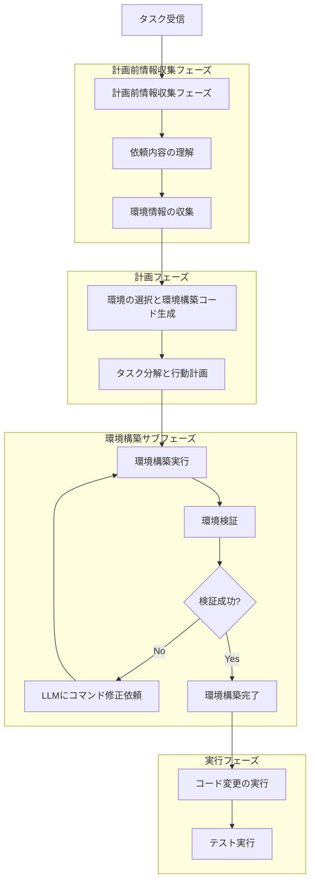
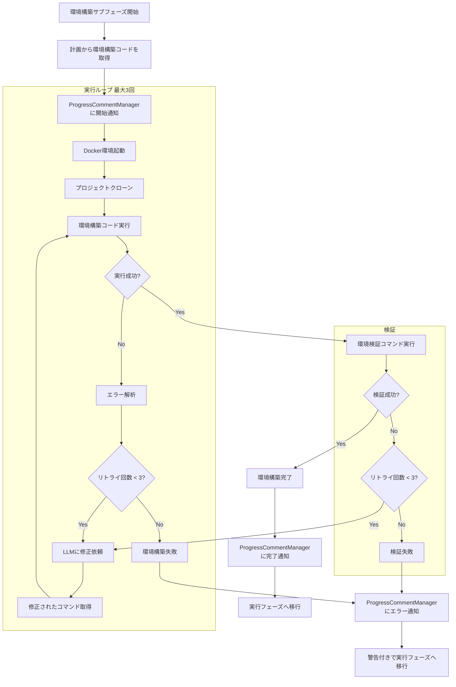

# 計画フェーズでの環境構築仕様書

## 1. 概要

### 1.1 目的

本仕様書は、コーディングエージェントが計画フェーズにおいて環境選択と環境構築を行い、実行フェーズでテストやビルドを実行できるようにする機能の詳細設計を定義します。

### 1.2 背景

現在のシステムでは、計画後にコードを修正する際に、以下の課題があります：

- 環境構築がなされておらず、テストの実行などが失敗する
- 実行フェーズに移行してから環境に関する問題が発覚し、手戻りが発生する
- 依存関係のインストール失敗などにより、コード変更以外の作業に時間を費やす

これらの課題を解決するため、計画フェーズで以下を実施します：

1. プロジェクトに必要な実行環境の選択
2. 環境構築に必要なコードの生成
3. 環境構築の実行と検証

### 1.3 要求事項

本機能の主要な要求事項は以下の通りです：

1. **環境推測**: 要求内容からプロジェクトに必要な実行環境を推測する
2. **環境情報収集**: プロジェクト内の環境構築ファイルの内容を確認する
3. **環境構築コード生成**: 環境構築に必要なスクリプトやコマンドを生成する
4. **環境構築実行**: 生成したコードを実行して環境を構築する
5. **環境検証**: 環境構築が正常に完了したことを確認する
6. **実行フェーズへの移行**: 環境構築完了後に実行フェーズに移行する

### 1.4 参照ドキュメント

- [計画前情報収集フェーズ仕様](PRE_PLANNING_INFORMATION_GATHERING_SPECIFICATION.md)
- [複数言語対応実行環境仕様](MULTI_LANGUAGE_ENVIRONMENT_SPECIFICATION.md)
- [プランニングプロセス仕様](PLANNING_SPECIFICATION.md)
- [Command Executor MCP Server連携仕様](COMMAND_EXECUTOR_MCP_SPECIFICATION.md)

---

## 2. システムアーキテクチャ

### 2.1 全体フロー図



### 2.2 フェーズ構成

#### 2.2.1 既存フェーズ

| フェーズ | 説明 |
|---------|------|
| 計画前情報収集 | 依頼内容の理解、情報収集計画、情報収集実行 |
| 計画 | 目標理解、タスク分解、行動計画生成 |
| 実行 | 計画に基づいたアクション実行 |
| リフレクション | 進捗確認、計画修正 |
| 検証 | タスク完了確認 |

#### 2.2.2 変更内容

**計画フェーズの拡張**
- 環境選択と同時に環境構築コマンドを生成
- 計画JSONに環境構築コマンドを含める

**環境構築サブフェーズの追加**
計画フェーズの後、実行フェーズの前に「環境構築サブフェーズ」を挿入します。

| サブフェーズ | 説明 |
|------------|------|
| 環境構築実行 | 計画フェーズで生成されたコマンドを実行して環境を構築 |
| 環境検証 | 実行したコマンドが正しく実行されたことを確認 |

### 2.3 主要コンポーネント

#### 2.3.1 新規コンポーネント

**EnvironmentSetupManager**
- 環境構築サブフェーズ全体を管理
- 環境構築実行、検証、エラー時の再試行を制御

**EnvironmentAnalyzer**
- プロジェクトの環境情報を分析
- 環境構築ファイルの検出と解析

**EnvironmentVerifier**
- 環境構築の成功を検証
- 実行したコマンドの実行確認

#### 2.3.2 既存コンポーネントの拡張

**PrePlanningManager**
- 環境情報収集機能を追加
- requirements.txt、package.json、Dockerfile等のファイルを検出・読み込み

**PlanningCoordinator**
- 環境構築コード生成機能を追加
- 環境選択と同時に環境構築コマンドを生成
- 環境選択情報と環境構築コマンドを環境構築サブフェーズに引き継ぎ

**ExecutionEnvironmentManager**
- 環境構築コマンドの実行機能を追加（既存）
- 環境構築結果の記録

**ProgressCommentManager**
- 環境構築フェーズの進捗コメントサポートを追加
- 環境構築の開始、進行中、完了、エラーの各状態をIssue/MRにコメント

---

## 3. 計画前情報収集フェーズでの環境情報収集

### 3.1 概要

計画前情報収集フェーズにおいて、環境構築に関する情報を収集します。

### 3.2 収集対象ファイル

以下のファイルを検出し、内容を収集します：

#### 3.2.1 Python関連

| ファイル | 用途 | 優先度 |
|---------|------|-------|
| requirements.txt | pip依存関係定義 | 高 |
| pyproject.toml | プロジェクト設定とビルドシステム | 高 |
| setup.py | パッケージインストール設定 | 中 |
| Pipfile | Pipenv依存関係定義 | 中 |
| poetry.lock | Poetry依存関係ロック | 中 |
| environment.yml / condaenv.yaml | Conda環境定義 | 高（Miniforge選択時） |

#### 3.2.2 Node.js関連

| ファイル | 用途 | 優先度 |
|---------|------|-------|
| package.json | npm依存関係定義とスクリプト | 高 |
| package-lock.json | npm依存関係ロック | 中 |
| yarn.lock | Yarn依存関係ロック | 中 |
| pnpm-lock.yaml | pnpm依存関係ロック | 中 |

#### 3.2.3 Java関連

| ファイル | 用途 | 優先度 |
|---------|------|-------|
| pom.xml | Maven依存関係定義 | 高 |
| build.gradle | Gradle依存関係定義 | 高 |
| build.gradle.kts | Gradle（Kotlin DSL）依存関係定義 | 高 |

#### 3.2.4 Go関連

| ファイル | 用途 | 優先度 |
|---------|------|-------|
| go.mod | Goモジュール定義 | 高 |
| go.sum | Go依存関係チェックサム | 中 |

#### 3.2.5 共通ファイル

| ファイル | 用途 | 優先度 |
|---------|------|-------|
| Dockerfile | Docker環境定義 | 中 |
| docker-compose.yml | Docker Compose設定 | 中 |
| Makefile | ビルドとタスク自動化 | 中 |
| README.md | セットアップ手順の記載 | 低 |

### 3.3 PrePlanningManagerの拡張

#### 3.3.1 環境情報収集処理

依頼内容の理解フェーズで、環境構築ファイルの情報も収集します。

**処理内容**:
1. プロジェクトのファイル一覧からrequirements.txt、package.json等を検出
2. 検出したファイルの内容を読み込み
3. 環境タイプを推測（Python、Node.js、Java、Go、Miniforge）
4. 依存関係リストを抽出
5. セットアップコマンドの候補を生成

**戻り値の形式**:
```
{
    "detected_files": {
        "requirements.txt": "ファイル内容",
        "package.json": "ファイル内容",
        ...
    },
    "environment_type": "python" | "node" | "java" | "go" | "miniforge",
    "dependencies": [パッケージリスト],
    "setup_commands": [推奨コマンドリスト]
}
```

#### 3.3.2 環境情報のLLMへの引き継ぎ

依頼内容の理解プロンプトに環境情報を含めます。

**処理内容**:
- 検出されたファイルとその内容の要約をプロンプトに追加
- LLMが環境を推測できるようにコンテキストを提供

---

## 4. 計画フェーズでの環境選択と環境構築コード生成

### 4.1 概要

計画フェーズにおいて、LLMがプロジェクトに最適な実行環境を選択し、同時に環境構築コマンドを生成します。

### 4.2 環境選択基準

以下の基準に基づいて環境を選択します：

#### 4.2.1 主要言語の判定

| 判定基準 | 選択環境 |
|---------|---------|
| requirements.txt存在 + conda不要 | python |
| condaenv.yaml または environment.yml存在 | miniforge |
| package.json存在 | node |
| pom.xml または build.gradle存在 | java |
| go.mod存在 | go |

#### 4.2.2 複合プロジェクトの判定

複数の言語が混在する場合、以下の優先順位で選択します：

1. タスクの主要な対象言語
2. 最も多くの依存関係を持つ言語
3. ビルド構成ファイルの存在

#### 4.2.3 デフォルト環境

環境が判定できない場合、`python`をデフォルトとして選択します。

### 4.3 計画応答への環境情報追加

計画JSONに環境選択情報と環境構築コマンドを追加します：

```json
{
  "phase": "planning",
  "selected_environment": {
    "name": "python",
    "reason": "requirements.txt exists and identified as Python project",
    "detected_files": ["requirements.txt", "setup.py"],
    "setup_commands": [
      "pip install --upgrade pip",
      "pip install -r requirements.txt"
    ],
    "verification": [
      {
        "command": "python --version",
        "expected_output": "Python 3.11"
      },
      {
        "command": "pip list",
        "expected_output": "successfully installed packages"
      },
      {
        "command": "python -c \"import requests; print('OK')\"",
        "expected_output": "OK"
      }
    ]
  },
  "goal_understanding": { ... },
  "task_decomposition": { ... },
  "action_plan": { ... }
}
```

### 4.4 PlanningCoordinatorの拡張

#### 4.4.1 _build_environment_selection_promptメソッドの追加

新規メソッド`_build_environment_selection_prompt`を追加し、環境選択と環境構築コード生成のためのプロンプトを構築します。

**メソッド定義**:
```python
def _build_environment_selection_prompt(
    self, 
    environment_info: dict[str, Any]
) -> str
```

**処理内容**:
1. 利用可能な環境リストを取得（config.yamlから）
2. 計画前情報収集フェーズで収集された環境情報を整形
3. 環境選択と環境構築コマンド生成を依頼するプロンプトを構築
4. プロンプトを返す

**プロンプト内容**:
```
## Environment Setup

Available execution environments:
- python: Python 3.11 environment with pip
- miniforge: Miniforge environment with conda, suitable for scientific computing
- node: Node.js environment with npm
- java: Java environment with Maven/Gradle
- go: Go environment with go command

Project environment information:
{environment information collected}

Tasks to perform:
1. Select the most appropriate execution environment based on the project environment information
2. Generate environment setup commands for the selected environment
3. Generate verification commands to confirm the environment setup

Include the following in your planning JSON response:
{
  "selected_environment": {
    "name": "environment_name",
    "reason": "reason for selection",
    "detected_files": ["detected file list"],
    "setup_commands": [
      "setup command 1",
      "setup command 2"
    ],
    "verification": [
      {
        "command": "verification command 1",
        "expected_output": "expected output pattern"
      },
      {
        "command": "verification command 2",
        "expected_output": "expected output pattern"
      }
    ]
  }
}

The environment setup commands will be executed in the environment setup sub-phase after the planning phase.
```

#### 4.4.2 環境選択と環境構築コードの取得処理

計画応答から環境選択情報と環境構築コードを抽出する処理を追加します。

**メソッド定義**:
```python
def _extract_environment_setup_info(
    self, 
    plan: dict[str, Any]
) -> dict[str, Any]
```

**処理内容**:
1. 計画JSONの`selected_environment`フィールドから以下を取得：
   - 環境名（`name`）
   - 選択理由（`reason`）
   - セットアップコマンド（`setup_commands`）
   - 検証情報（`verification`）
2. 環境名が未指定の場合、デフォルトの"python"を使用
3. 環境名のバリデーション（利用可能な環境リストに含まれるかチェック）
4. セットアップコマンドが未指定の場合、環境に応じたデフォルトコマンドを使用

**戻り値**: 環境選択情報と環境構築コードを含む辞書

#### 4.4.3 executeメソッドの修正

既存の`execute`メソッドに環境構築関連の処理を追加します。

**追加処理**:
1. 計画生成プロンプトに環境選択プロンプトを追加
2. LLMからの計画応答から環境構築情報を抽出
3. 環境構築情報をEnvironmentSetupManagerに渡す

**処理フロー**:
```
1. 計画前情報収集フェーズ実行（既存）
2. 環境情報を含む計画プロンプト構築
3. LLMに計画生成依頼
4. 計画応答から環境構築情報を抽出
5. 環境構築サブフェーズを実行
6. 実行フェーズに移行
```

---

## 5. 環境構築サブフェーズ

### 5.1 概要

計画フェーズと実行フェーズの間に挿入される新しいサブフェーズで、環境構築を実施します。

### 5.2 環境構築サブフェーズの詳細フロー



### 5.3 EnvironmentSetupManagerの実装

#### 5.3.1 クラス定義

**クラス名**: `EnvironmentSetupManager`

**責務**:
- 環境構築サブフェーズ全体を管理
- 環境構築コマンドの実行
- 検証コマンドの実行
- エラー時のLLMによるコマンド再生成
- ProgressCommentManagerへの通知

**依存関係**:
- `ExecutionEnvironmentManager`: コマンド実行
- `LLMClient`: エラー時のコマンド再生成
- `ProgressCommentManager`: 進捗通知
- `Task`: タスク情報の取得

#### 5.3.2 初期化処理

**メソッド名**: `__init__`

**処理内容**:
1. 設定情報を保存
2. LLMクライアントを保存
3. ExecutionEnvironmentManagerを保存
4. ProgressCommentManagerを保存
5. ロガーを初期化
6. リトライカウンターを初期化（最大3回固定）

#### 5.3.3 環境構築サブフェーズ実行処理

**メソッド名**: `execute`

**引数**:
- `environment_setup_info`: 計画フェーズで生成された環境構築情報

**処理内容**:
1. ProgressCommentManagerに環境構築開始を通知
2. 環境構築情報から環境名、セットアップコマンド、検証情報を取得
3. Docker環境を起動（ExecutionEnvironmentManagerを使用）
4. プロジェクトをクローン
5. セットアップコマンドを順次実行
6. 実行失敗時：
   - リトライ回数をチェック（最大3回）
   - 3回未満の場合、LLMに修正を依頼してコマンドを再生成
   - ステップ5に戻る
7. 検証コマンドを実行
8. 検証失敗時：
   - リトライ回数をチェック（最大3回）
   - 3回未満の場合、LLMに修正を依頼してコマンドを再生成
   - ステップ5に戻る
9. 成功時：ProgressCommentManagerに完了を通知
10. 失敗時：ProgressCommentManagerにエラーを通知し、警告付きで継続

**戻り値**:
```
{
    "overall_status": "success" | "failed",
    "setup_result": {セットアップ実行結果},
    "verification_result": {検証実行結果},
    "errors": [エラーリスト]
}
```

#### 5.3.4 セットアップコマンド実行処理

**メソッド名**: `_execute_setup_commands`

**処理内容**:
1. セットアップコマンドを1つずつ実行
2. 各コマンドの実行結果を記録
3. exit codeが0以外の場合、エラーとして処理
4. すべてのコマンド実行結果を返す

#### 5.3.5 検証処理

**メソッド名**: `_verify_environment`

**処理内容**:
1. 検証情報から検証コマンドを取得
2. 各検証コマンドを実行
3. コマンドが正常に実行されたことを確認（exit code 0）
4. すべての検証コマンドが成功した場合、成功を返す

**注**: expected_outputとの照合は行わず、コマンドが正常に実行されたことのみを確認します。

#### 5.3.6 LLMによるコマンド再生成処理

**メソッド名**: `_regenerate_setup_commands`

**引数**:
- `original_commands`: 元のセットアップコマンド
- `error_info`: エラー情報

**処理内容**:
1. エラー情報と元のコマンドを含むプロンプトを構築
2. LLMに修正を依頼
3. 修正されたコマンドをパースして返す

**プロンプト内容**:
```
An error occurred during environment setup:
{error information}

Original setup commands:
{commands that were executed}

Please generate corrected setup commands to fix this error.
Return the response in JSON format:
{
  "setup_commands": ["corrected command 1", "corrected command 2"],
  "verification": [
    {
      "command": "verification command 1",
      "expected_output": "expected output"
    }
  ]
}
```

### 5.4 ProgressCommentManagerの拡張

#### 5.4.1 環境構築フェーズの追加

ProgressCommentManagerに環境構築フェーズのサポートを追加します。

**追加する進捗フェーズ**:
- `environment_setup_started`: 環境構築開始
- `environment_setup_in_progress`: 環境構築実行中
- `environment_setup_completed`: 環境構築完了
- `environment_setup_failed`: 環境構築失敗

#### 5.4.2 環境構築開始通知メソッド

**メソッド名**: `notify_environment_setup_started`

**処理内容**:
1. 環境構築開始のメッセージを作成
2. Issue/MRにコメントを投稿または更新
3. 進捗状態を`environment_setup_started`に更新

**コメント内容**:
```markdown
## Environment Setup Phase

**Status**: Started
**Environment**: {environment_name}

Setting up the development environment...
```

#### 5.4.3 環境構築完了通知メソッド

**メソッド名**: `notify_environment_setup_completed`

**処理内容**:
1. 環境構築完了のメッセージを作成
2. Issue/MRのコメントを更新
3. 進捗状態を`environment_setup_completed`に更新

**コメント内容**:
```markdown
## Environment Setup Phase

**Status**: Completed ✓
**Environment**: {environment_name}

Environment setup successfully completed.
```

#### 5.4.4 環境構築エラー通知メソッド

**メソッド名**: `notify_environment_setup_failed`

**処理内容**:
1. エラー詳細を含むメッセージを作成
2. Issue/MRのコメントを更新
3. 進捗状態を`environment_setup_failed`に更新

**コメント内容**:
```markdown
## Environment Setup Phase

**Status**: Failed with warnings ⚠
**Environment**: {environment_name}

Environment setup encountered errors. Proceeding to execution phase with limitations.

**Error Details**:
```
{error_message}
```

**Attempted Fixes**:
- Retry count: {retry_count}/3
- LLM regeneration attempts: {regeneration_count}

The execution phase will proceed, but some features may not be available.
```

---

## 6. 実行フェーズへの移行

### 6.1 環境構築完了後の処理

環境構築サブフェーズ完了後、以下の情報を実行フェーズに引き継ぎます：

**引き継ぎ情報**:
```python
{
    "environment_ready": True | False,
    "environment_name": "python",
    "setup_status": "success" | "failed",
    "errors": [エラーリスト]
}
```

### 6.2 環境構築失敗時の対応

環境構築が失敗した場合：

1. ProgressCommentManagerを使用してIssue/MRにエラー詳細をコメント
2. 警告付きで実行フェーズに移行
3. 実行フェーズで代替手段を検討

---

## 7. システムプロンプトの拡張

### 7.1 計画フェーズのシステムプロンプト拡張

計画フェーズのシステムプロンプト（`system_prompt_planning.txt`）に以下のセクションを追加します：

```
## Environment Setup Instructions

When creating a plan, you must select the appropriate execution environment and generate environment setup commands.

### Available Execution Environments

The following execution environments are available:
- **python**: Python 3.11 environment with pip package manager
- **miniforge**: Miniforge environment with conda package manager, suitable for scientific computing and data science projects
- **node**: Node.js environment with npm package manager
- **java**: Java environment with Maven/Gradle build tools
- **go**: Go environment with go module system

### Environment Selection Criteria

Select the environment based on the following criteria:

1. **Python environment**: When `requirements.txt` exists and conda is not required
2. **Miniforge environment**: When `condaenv.yaml` or `environment.yml` exists
3. **Node.js environment**: When `package.json` exists
4. **Java environment**: When `pom.xml` or `build.gradle` exists
5. **Go environment**: When `go.mod` exists

For projects with multiple languages, prioritize based on:
- The primary language targeted by the task
- The language with the most dependencies
- The presence of build configuration files

If the environment cannot be determined, default to **python**.

### Environment Setup Command Generation

Generate the following in your planning JSON response:

```json
{
  "selected_environment": {
    "name": "environment_name",
    "reason": "clear explanation for why this environment was selected",
    "detected_files": ["list", "of", "detected", "configuration", "files"],
    "setup_commands": [
      "command to install/upgrade package manager",
      "command to install dependencies",
      "additional setup commands as needed"
    ],
    "verification": [
      {
        "command": "command to verify installation",
        "expected_output": "expected output pattern or success indicator"
      },
      {
        "command": "command to verify key packages",
        "expected_output": "expected output pattern"
      }
    ]
  }
}
```

### Command Generation Guidelines

1. **Setup commands**: Generate commands that:
   - Upgrade the package manager if necessary
   - Install all dependencies from configuration files
   - Set up any required environment variables
   - Perform initialization steps

2. **Verification commands**: Generate commands that:
   - Verify the language runtime version
   - Verify key packages are installed
   - Perform simple import/require tests for critical dependencies

3. **Error handling**: Commands should be designed to:
   - Fail fast if a critical dependency cannot be installed
   - Provide clear error messages
   - Be idempotent (safe to run multiple times)

### Language-Specific Examples

**Python environment**:
```json
{
  "setup_commands": [
    "pip install --upgrade pip",
    "pip install -r requirements.txt"
  ],
  "verification": [
    {
      "command": "python --version",
      "expected_output": "Python 3.11"
    },
    {
      "command": "python -c \"import requests; print('OK')\"",
      "expected_output": "OK"
    }
  ]
}
```

**Node.js environment**:
```json
{
  "setup_commands": [
    "npm install"
  ],
  "verification": [
    {
      "command": "node --version",
      "expected_output": "v18"
    },
    {
      "command": "npm list --depth=0",
      "expected_output": "installed packages"
    }
  ]
}
```

**Miniforge environment**:
```json
{
  "setup_commands": [
    "conda env create -f condaenv.yaml -n project-env",
    "conda activate project-env"
  ],
  "verification": [
    {
      "command": "conda list",
      "expected_output": "package list"
    },
    {
      "command": "python -c \"import numpy; print('OK')\"",
      "expected_output": "OK"
    }
  ]
}
```

**Java environment**:
```json
{
  "setup_commands": [
    "mvn clean install -DskipTests"
  ],
  "verification": [
    {
      "command": "mvn --version",
      "expected_output": "Apache Maven"
    },
    {
      "command": "mvn dependency:tree",
      "expected_output": "dependency tree"
    }
  ]
}
```

**Go environment**:
```json
{
  "setup_commands": [
    "go mod download"
  ],
  "verification": [
    {
      "command": "go version",
      "expected_output": "go version"
    },
    {
      "command": "go list -m all",
      "expected_output": "module list"
    }
  ]
}
```

### Important Notes

- The environment setup commands will be executed in the environment setup sub-phase immediately after planning
- If setup fails, the LLM will be asked to regenerate corrected commands (up to 3 attempts)
- Verification commands should only check that commands executed successfully, not validate specific output patterns
- All prompts and responses must be in English for consistency with the system
```

### 7.2 実行フェーズのシステムプロンプト拡張

実行フェーズのシステムプロンプトに環境情報を追加します：

```
## Execution Environment Information

**Current environment**: {environment_name}
**Setup status**: {setup_status}

{if setup_status is "failed"}
**Warning**: Environment setup encountered errors. Some features may not be available.

**Errors encountered**:
{error_list}

Please consider alternative approaches if dependencies are missing.
{endif}
```

---

## 8. エラーハンドリング

### 8.1 エラー分類

環境構築で発生するエラーを以下のように分類します：

#### 8.1.1 リトライ可能エラー

| エラー種類 | 例 | 対応 |
|-----------|---|------|
| ネットワークエラー | タイムアウト、DNS解決失敗 | リトライ（最大3回） |
| 一時的なサーバーエラー | HTTP 503 | 待機後リトライ |
| パッケージマネージャのロック競合 | ロックファイル取得失敗 | 短時間待機後リトライ |

#### 8.1.2 修正可能エラー

| エラー種類 | 例 | 対応 |
|-----------|---|------|
| パッケージバージョン競合 | 依存関係の不整合 | LLMに修正依頼し、修正されたコマンドを再実行 |
| パッケージ名の誤り | パッケージが見つからない | LLMに修正依頼し、修正されたコマンドを再実行 |
| 設定ファイルの構文エラー | YAMLパースエラー | LLMに修正依頼し、修正されたコマンドを再実行 |

#### 8.1.3 致命的エラー

| エラー種類 | 例 | 対応 |
|-----------|---|------|
| Docker環境の問題 | コンテナ起動失敗 | エラー通知、警告付きで継続 |
| システムリソース不足 | メモリ不足、ディスク容量不足 | エラー通知、警告付きで継続 |

### 8.2 リトライ戦略

#### 8.2.1 固定リトライ回数

すべてのエラーに対して、リトライ回数は**3回固定**とします。設定による変更は不要です。

**処理フロー**:
1. 初回実行
2. 失敗時、LLMに修正依頼（1回目）
3. 修正されたコマンドで再実行
4. 失敗時、LLMに修正依頼（2回目）
5. 修正されたコマンドで再実行
6. 失敗時、LLMに修正依頼（3回目）
7. 修正されたコマンドで再実行
8. 失敗時、エラーとして処理終了

---

## 9. クラス設計詳細

### 9.1 EnvironmentAnalyzer

#### 9.1.1 クラス概要

**責務**:
- プロジェクト内の環境構築関連ファイルを検出
- ファイル内容を解析して環境情報を抽出

**依存関係**:
- MCPクライアント（ファイル読み込み用）

#### 9.1.2 メソッド詳細

**detect_environment_files**

処理内容:
1. プロジェクトのルートディレクトリからファイル一覧を取得
2. 環境構築関連ファイルパターンとマッチング
3. 検出されたファイルのリストを返す

**analyze_environment_files**

処理内容:
1. 検出されたファイルの内容を読み込み
2. ファイル種類に応じて依存関係を抽出
3. 推奨される環境タイプを判定
4. 環境情報の辞書を返す

**infer_environment_type**

処理内容:
1. 検出されたファイル種類から環境タイプを推測
2. 複数の環境タイプが候補の場合、優先順位に基づいて選択
3. 環境タイプ名を返す

### 9.2 EnvironmentVerifier

#### 9.2.1 クラス概要

**責務**:
- 環境構築コマンドが正常に実行されたことを検証

**依存関係**:
- ExecutionEnvironmentManager（コマンド実行用）

#### 9.2.2 メソッド詳細

**verify_setup**

処理内容:
1. 検証情報から検証コマンドを取得
2. 各コマンドを順次実行
3. exit codeが0であることを確認
4. すべてのコマンドが成功した場合、検証成功を返す
5. 1つでも失敗した場合、検証失敗を返す

**注**: expected_outputとの照合は行いません。コマンドが正常終了したかのみを確認します。

### 9.3 既存クラスの修正詳細

#### 9.3.1 PrePlanningManager

**追加メソッド**: `collect_environment_info`

処理内容:
1. EnvironmentAnalyzerのインスタンスを作成
2. `detect_environment_files`を呼び出してファイルを検出
3. `analyze_environment_files`を呼び出して環境情報を抽出
4. 環境情報を返す

**既存メソッドの修正**: `execute_understanding`

追加処理:
1. 依頼内容の理解プロンプト構築時に`collect_environment_info`を呼び出し
2. 取得した環境情報をプロンプトに追加
3. LLMに環境情報を含めて理解を依頼

#### 9.3.2 PlanningCoordinator

**追加メソッド**: `_build_environment_selection_prompt`

前述のセクション4.4.1を参照

**追加メソッド**: `_extract_environment_setup_info`

前述のセクション4.4.2を参照

**既存メソッドの修正**: `execute`

追加処理:
1. 計画前情報収集フェーズから環境情報を取得
2. `_build_environment_selection_prompt`を呼び出してプロンプトを構築
3. 計画プロンプトに環境選択プロンプトを追加
4. LLMから計画応答を取得
5. `_extract_environment_setup_info`で環境構築情報を抽出
6. EnvironmentSetupManagerのインスタンスを作成
7. `execute`メソッドで環境構築サブフェーズを実行
8. 環境構築結果を確認
9. 実行フェーズに移行

#### 9.3.3 ProgressCommentManager

**追加メソッド**: 
- `notify_environment_setup_started`（前述のセクション5.4.2を参照）
- `notify_environment_setup_completed`（前述のセクション5.4.3を参照）
- `notify_environment_setup_failed`（前述のセクション5.4.4を参照）

**追加定数**:
```python
PHASE_ENVIRONMENT_SETUP_STARTED = "environment_setup_started"
PHASE_ENVIRONMENT_SETUP_IN_PROGRESS = "environment_setup_in_progress"
PHASE_ENVIRONMENT_SETUP_COMPLETED = "environment_setup_completed"
PHASE_ENVIRONMENT_SETUP_FAILED = "environment_setup_failed"
```

---

## 10. 実装の優先順位

以下の順序で実装を進めます：

| 優先度 | 機能 | 理由 |
|-------|------|------|
| 高 | EnvironmentAnalyzer実装 | 環境情報収集の基盤 |
| 高 | PrePlanningManager拡張 | 環境情報収集機能の追加 |
| 高 | PlanningCoordinator拡張 | 環境選択とコマンド生成の核心 |
| 高 | システムプロンプト拡張 | LLMへの指示を明確化 |
| 高 | EnvironmentSetupManager実装 | 環境構築サブフェーズの実装 |
| 高 | ProgressCommentManager拡張 | 進捗通知機能の追加 |
| 中 | EnvironmentVerifier実装 | 検証機能 |
| 中 | エラーハンドリングとリトライ | 安定性向上 |
| 中 | LLMによるコマンド再生成 | エラー修正の自動化 |

---

## 11. 期待される効果

本機能の実装により、以下の効果が期待されます：

### 11.1 品質向上

- テスト実行成功率の向上
- 実行フェーズでのエラー減少
- より正確なコード変更の検証

### 11.2 効率化

- 環境問題による手戻りの削減
- タスク完了までの時間短縮
- ユーザーの手動介入減少

### 11.3 ユーザビリティ向上

- 環境構築プロセスの透明性（ProgressCommentManagerによる通知）
- エラー発生時の詳細な情報提供
- 自動化による利便性向上

---

## 12. 用語集

| 用語 | 定義 |
|-----|------|
| 環境構築 | プロジェクトの実行に必要な依存関係やツールをインストールするプロセス |
| 環境構築ファイル | requirements.txt、package.json等、依存関係を定義するファイル |
| 環境構築コード | 環境構築を実行するためのシェルコマンドやスクリプト |
| 環境検証 | 環境構築コマンドが正常に実行されたことを確認するプロセス |
| リトライ | エラー発生時にコマンドを再実行すること（最大3回固定） |

---

## 変更履歴

| 日付 | バージョン | 変更内容 |
|-----|-----------|---------|
| 2025-12-06 | 1.0 | 初版作成 |
| 2025-12-06 | 2.0 | レビューフィードバックに基づく全面改訂：システムプロンプト英語化、検証方法簡素化、設定削除、クラス設計詳細化、ProgressCommentManager拡張明示 |
