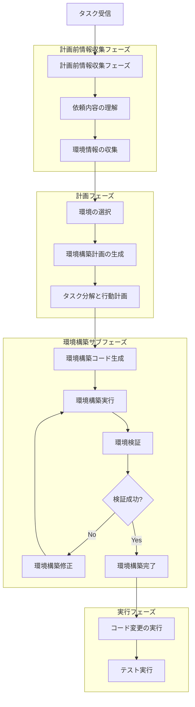
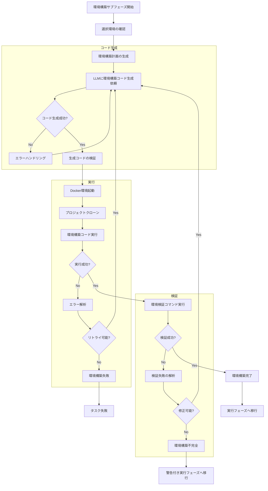

# 計画フェーズでの環境構築仕様書

## 1. 概要

### 1.1 目的

本仕様書は、コーディングエージェントが計画フェーズにおいて環境選択と環境構築を行い、実行フェーズでテストやビルドを実行できるようにする機能の詳細設計を定義します。

### 1.2 背景

現在のシステムでは、計画後にコードを修正する際に、以下の課題があります：

- 環境構築がなされておらず、テストの実行などが失敗する
- 実行フェーズに移行してから環境に関する問題が発覚し、手戻りが発生する
- 依存関係のインストール失敗などにより、コード変更以外の作業に時間を費やす

これらの課題を解決するため、計画フェーズで以下を実施します：

1. プロジェクトに必要な実行環境の選択
2. 環境構築に必要なコードの生成
3. 環境構築の実行と検証

### 1.3 要求事項

本機能の主要な要求事項は以下の通りです：

1. **環境推測**: 要求内容からプロジェクトに必要な実行環境を推測する
2. **環境情報収集**: プロジェクト内の環境構築ファイルの内容を確認する
3. **環境構築コード生成**: 環境構築に必要なスクリプトやコマンドを生成する
4. **環境構築実行**: 生成したコードを実行して環境を構築する
5. **環境検証**: 環境構築が正常に完了したことを確認する
6. **実行フェーズへの移行**: 環境構築完了後に実行フェーズに移行する

### 1.4 参照ドキュメント

- [計画前情報収集フェーズ仕様](PRE_PLANNING_INFORMATION_GATHERING_SPECIFICATION.md)
- [複数言語対応実行環境仕様](MULTI_LANGUAGE_ENVIRONMENT_SPECIFICATION.md)
- [プランニングプロセス仕様](PLANNING_SPECIFICATION.md)
- [Command Executor MCP Server連携仕様](COMMAND_EXECUTOR_MCP_SPECIFICATION.md)

---

## 2. システムアーキテクチャ

### 2.1 全体フロー図



### 2.2 フェーズ構成の変更

既存のプランニングプロセスに「環境構築サブフェーズ」を追加します。

#### 2.2.1 既存フェーズ

| フェーズ | 説明 |
|---------|------|
| 計画前情報収集 | 依頼内容の理解、情報収集計画、情報収集実行 |
| 計画 | 目標理解、タスク分解、行動計画生成 |
| 実行 | 計画に基づいたアクション実行 |
| リフレクション | 進捗確認、計画修正 |
| 検証 | タスク完了確認 |

#### 2.2.2 新規サブフェーズ

計画フェーズの後、実行フェーズの前に「環境構築サブフェーズ」を挿入します。

| サブフェーズ | 説明 | 必須/任意 |
|------------|------|----------|
| 環境構築コード生成 | 環境構築に必要なスクリプトやコマンドを生成 | 必須 |
| 環境構築実行 | 生成したコードを実行して環境を構築 | 必須 |
| 環境検証 | 環境構築が正常に完了したことを確認 | 必須 |

### 2.3 主要コンポーネント

#### 2.3.1 新規コンポーネント

以下のコンポーネントを新規作成します：

**EnvironmentSetupManager**
- 環境構築サブフェーズ全体を管理
- 環境構築コード生成、実行、検証を制御

**EnvironmentAnalyzer**
- プロジェクトの環境情報を分析
- 環境構築ファイルの検出と解析

**EnvironmentSetupCodeGenerator**
- 環境構築に必要なコードを生成
- LLMとの連携により適切なセットアップスクリプトを作成

**EnvironmentVerifier**
- 環境構築の成功を検証
- 必要なツールやライブラリの存在確認

#### 2.3.2 既存コンポーネントの拡張

**PrePlanningManager**
- 環境情報収集機能を追加
- requirements.txt、package.json、Dockerfile等のファイルを検出・読み込み

**PlanningCoordinator**
- 環境構築サブフェーズの呼び出しを追加
- 環境選択情報を環境構築サブフェーズに引き継ぎ

**ExecutionEnvironmentManager**
- 環境構築コマンドの実行機能を追加
- 環境構築結果の記録

---

## 3. 計画前情報収集フェーズでの環境情報収集

### 3.1 概要

計画前情報収集フェーズにおいて、環境構築に関する情報を収集します。

### 3.2 収集対象ファイル

以下のファイルを検出し、内容を収集します：

#### 3.2.1 Python関連

| ファイル | 用途 | 優先度 |
|---------|------|-------|
| requirements.txt | pip依存関係定義 | 高 |
| pyproject.toml | プロジェクト設定とビルドシステム | 高 |
| setup.py | パッケージインストール設定 | 中 |
| Pipfile | Pipenv依存関係定義 | 中 |
| poetry.lock | Poetry依存関係ロック | 中 |
| environment.yml / condaenv.yaml | Conda環境定義 | 高（Miniforge選択時） |

#### 3.2.2 Node.js関連

| ファイル | 用途 | 優先度 |
|---------|------|-------|
| package.json | npm依存関係定義とスクリプト | 高 |
| package-lock.json | npm依存関係ロック | 中 |
| yarn.lock | Yarn依存関係ロック | 中 |
| pnpm-lock.yaml | pnpm依存関係ロック | 中 |

#### 3.2.3 Java関連

| ファイル | 用途 | 優先度 |
|---------|------|-------|
| pom.xml | Maven依存関係定義 | 高 |
| build.gradle | Gradle依存関係定義 | 高 |
| build.gradle.kts | Gradle（Kotlin DSL）依存関係定義 | 高 |

#### 3.2.4 Go関連

| ファイル | 用途 | 優先度 |
|---------|------|-------|
| go.mod | Goモジュール定義 | 高 |
| go.sum | Go依存関係チェックサム | 中 |

#### 3.2.5 共通ファイル

| ファイル | 用途 | 優先度 |
|---------|------|-------|
| Dockerfile | Docker環境定義 | 中 |
| docker-compose.yml | Docker Compose設定 | 中 |
| Makefile | ビルドとタスク自動化 | 中 |
| README.md | セットアップ手順の記載 | 低 |

### 3.3 環境情報の解析

収集したファイルから以下の情報を抽出します：

#### 3.3.1 依存関係情報

- パッケージ名とバージョン
- 必須依存とオプション依存の区別
- 開発用依存とプロダクション用依存の区別

#### 3.3.2 ビルド・インストール手順

- パッケージマネージャのインストールコマンド
- ビルドツールの実行コマンド
- 環境変数の設定

#### 3.3.3 システム要件

- 必要なシステムライブラリ
- 最小バージョン要件
- OS固有の依存関係

### 3.4 情報収集プロセス


### 3.5 PrePlanningManagerの拡張

#### 3.5.1 環境情報収集メソッド追加

依頼内容の理解フェーズで、環境構築ファイルの情報も収集します。

処理内容:
- プロジェクトのファイル一覧からrequirements.txt、package.json等を検出
- 検出したファイルの内容を読み込み
- 環境タイプを推測（Python、Node.js、Java、Go、Miniforge）
- 依存関係リストを抽出
- セットアップコマンドの候補を生成

戻り値の形式:
```
{
    "detected_files": {
        "requirements.txt": "ファイル内容",
        "package.json": "ファイル内容",
        ...
    },
    "environment_type": "python" | "node" | "java" | "go" | "miniforge",
    "dependencies": [パッケージリスト],
    "setup_commands": [推奨コマンドリスト]
}
```

#### 3.5.2 環境情報のLLMへの引き継ぎ

依頼内容の理解プロンプトに環境情報を含めます：

```
以下のプロジェクト環境情報を確認してください：

検出されたファイル:
- requirements.txt: [内容の要約]
- package.json: [内容の要約]

この情報から、プロジェクトに必要な実行環境を推測してください。
```

---

## 4. 計画フェーズでの環境選択

### 4.1 概要

計画フェーズにおいて、LLMがプロジェクトに最適な実行環境を選択します。

### 4.2 環境選択基準

以下の基準に基づいて環境を選択します：

#### 4.2.1 主要言語の判定

| 判定基準 | 選択環境 |
|---------|---------|
| requirements.txt存在 + conda不要 | python |
| condaenv.yaml または environment.yml存在 | miniforge |
| package.json存在 | node |
| pom.xml または build.gradle存在 | java |
| go.mod存在 | go |

#### 4.2.2 複合プロジェクトの判定

複数の言語が混在する場合、以下の優先順位で選択します：

1. タスクの主要な対象言語
2. 最も多くの依存関係を持つ言語
3. ビルド構成ファイルの存在

#### 4.2.3 デフォルト環境

環境が判定できない場合、`python`をデフォルトとして選択します。

### 4.3 計画応答への環境情報追加

計画JSONに環境選択情報を追加します：

```json
{
  "phase": "planning",
  "selected_environment": {
    "name": "python",
    "reason": "requirements.txtが存在し、Pythonプロジェクトと判定",
    "detected_files": ["requirements.txt", "setup.py"]
  },
  "goal_understanding": { ... },
  "task_decomposition": { ... },
  "action_plan": { ... }
}
```

### 4.4 PlanningCoordinatorの拡張

#### 4.4.1 環境選択プロンプトの追加

計画生成プロンプトに利用可能な環境リストを追加します：

```
利用可能な実行環境:
- python: Python 3.11環境、pip利用可能
- miniforge: Miniforge環境、conda利用可能、科学計算向け
- node: Node.js環境、npm利用可能
- java: Java環境、Maven/Gradle利用可能
- go: Go環境、goコマンド利用可能

プロジェクト環境情報に基づいて、最適な環境を選択してください。
```

#### 4.4.2 環境選択結果の取得

計画応答から環境選択情報を抽出します。

処理内容:
- 計画JSONの`selected_environment`フィールドから環境名を取得
- 環境名が未指定の場合、デフォルトの"python"を使用
- 環境名のバリデーション（利用可能な環境リストに含まれるかチェック）

戻り値: 選択された環境名（文字列、デフォルト: "python"）

---

## 5. 環境構築サブフェーズ

### 5.1 概要

計画フェーズと実行フェーズの間に挿入される新しいサブフェーズで、環境構築を実施します。

### 5.2 環境構築サブフェーズの詳細フロー



### 5.3 環境構築コード生成

#### 5.3.1 生成対象コード

以下の種類のコードを生成します：

**セットアップスクリプト**
- 依存関係インストールコマンド
- 環境変数設定
- 初期化処理

**検証スクリプト**
- 必要なツールの存在確認
- バージョン確認
- 簡易的な動作確認

#### 5.3.2 言語別の生成コード例

**Python環境**
```bash
# 依存関係インストール
pip install --upgrade pip
pip install -r requirements.txt

# 検証
python --version
pip list
python -c "import 主要パッケージ; print('OK')"
```

**Miniforge環境**
```bash
# Conda環境作成
conda env create -f condaenv.yaml -n project-env
conda activate project-env

# 検証
conda list
python -c "import 主要パッケージ; print('OK')"
```

**Node.js環境**
```bash
# 依存関係インストール
npm install

# 検証
node --version
npm list
npm test -- --dry-run  # テストの存在確認
```

**Java環境**
```bash
# Maven依存関係解決
mvn clean install -DskipTests

# 検証
mvn --version
mvn dependency:tree
```

**Go環境**
```bash
# Goモジュールダウンロード
go mod download

# 検証
go version
go list -m all
go build -n  # ビルド確認（実行なし）
```

#### 5.3.3 LLMプロンプト

環境構築コード生成用のプロンプトを構築します：

```
タスク: 環境構築スクリプトの生成

選択された実行環境: {環境名}
プロジェクト情報:
{環境構築ファイルの内容}

以下の形式でJSONレスポンスを返してください:
{
  "setup_commands": [
    "コマンド1",
    "コマンド2",
    ...
  ],
  "verification_commands": [
    "検証コマンド1",
    "検証コマンド2"
  ],
  "expected_results": {
    "検証コマンド1": "期待される出力パターン",
    ...
  },
  "notes": "注意事項や補足説明"
}

要件:
1. 選択された環境に適したコマンドを生成すること
2. 依存関係ファイルの内容を正確に反映すること
3. エラーハンドリングを含めること
4. 検証コマンドで環境構築の成功を確認できること
```

### 5.4 環境構築の実行

#### 5.4.1 実行プロセス

処理の流れ:
1. Docker環境の起動（既にExecutionEnvironmentManagerで管理）
2. プロジェクトのクローン（既存機能）
3. 生成したセットアップコマンドの順次実行
4. 各コマンドの実行結果記録
5. エラー発生時のハンドリング

#### 5.4.2 エラーハンドリング

環境構築中にエラーが発生した場合の対応：

| エラー種類 | 対応 |
|-----------|------|
| ネットワークエラー | リトライ（最大3回） |
| パッケージ不存在 | LLMに修正依頼、代替パッケージ検討 |
| バージョン競合 | 依存関係の調整を試行 |
| 権限エラー | sudoやchownの追加を検討 |
| システムエラー | 環境の再構築 |

#### 5.4.3 実行結果の記録

以下の情報を記録します：

```python
{
    "setup_phase": "environment_setup",
    "environment": "python",
    "commands_executed": [
        {
            "command": "pip install -r requirements.txt",
            "exit_code": 0,
            "stdout": "...",
            "stderr": "",
            "duration_ms": 15000
        },
        ...
    ],
    "verification_results": [
        {
            "command": "python --version",
            "expected": "Python 3.11",
            "actual": "Python 3.11.5",
            "status": "success"
        },
        ...
    ],
    "overall_status": "success" | "partial_success" | "failed",
    "warnings": [...],
    "errors": [...]
}
```

### 5.5 環境検証

#### 5.5.1 検証項目

以下の項目を検証します：

**基本検証**
- 言語ランタイムのバージョン確認
- パッケージマネージャの動作確認
- 主要な依存パッケージのインポート/ロード確認

**プロジェクト固有検証**
- プロジェクトのビルドコマンド実行（dry-run）
- テストフレームワークの存在確認
- 設定ファイルの妥当性確認

#### 5.5.2 検証成功基準

以下のすべてを満たす場合、検証成功とします：

1. すべての検証コマンドが正常終了（exit code 0）
2. 期待される出力パターンとマッチ
3. 重要な警告メッセージがない

#### 5.5.3 部分成功の判定

一部の検証が失敗しても、以下の場合は部分成功として実行フェーズに移行します：

- オプション依存パッケージのみ失敗
- 警告のみでエラーなし
- タスク実行に必須でない機能の失敗

### 5.6 EnvironmentSetupManagerの実装

#### 5.6.1 クラス構造

以下のクラスを新規作成します：

**EnvironmentSetupManager**
- 環境構築サブフェーズ全体を管理するクラス

主要メソッド:
- `__init__`: 初期化（設定、LLMクライアント、環境マネージャー、環境アナライザーを受け取る）
- `execute`: 環境構築サブフェーズを実行する（選択された環境名と環境情報を受け取り、環境構築結果を返す）
- `generate_setup_code`: 環境構築コードを生成する（環境名と環境情報からセットアップコードJSONを生成）
- `execute_setup`: 環境構築を実行する（セットアップコードを実行し、実行結果を返す）
- `verify_environment`: 環境を検証する（検証コードを実行し、検証結果を返す）

#### 5.6.2 処理フロー

環境構築サブフェーズ全体の実行処理:

処理内容:
1. 環境構築コード生成を呼び出す
2. 環境構築実行をリトライ付きで呼び出す（最大3回）
   - 成功した場合はループを抜ける
   - 失敗した場合、最終試行でなければエラー解析してコードを再生成
3. 環境検証を呼び出す
4. セットアップ結果と検証結果を集約して返す

戻り値の形式:
```
{
    "overall_status": "success" | "partial_success" | "failed",
    "setup_result": {セットアップ実行結果},
    "verification_result": {検証実行結果},
    "warnings": [警告リスト],
    "errors": [エラーリスト]
}
```

---

## 6. 実行フェーズへの移行

### 6.1 環境構築完了後の処理

環境構築サブフェーズ完了後、以下の情報を実行フェーズに引き継ぎます：

#### 6.1.1 引き継ぎ情報

```python
{
    "environment_ready": True,
    "environment_name": "python",
    "setup_status": "success" | "partial_success" | "failed",
    "installed_packages": [...],
    "available_commands": [...],
    "warnings": [...],
    "setup_notes": "環境構築時の注意事項"
}
```

#### 6.1.2 実行フェーズでの活用

実行フェーズでは、環境構築情報を利用して以下を実施します：

- テストコマンドの実行
- ビルドコマンドの実行
- リントツールの実行
- コード変更の検証

### 6.2 環境構築失敗時の対応

#### 6.2.1 完全失敗の場合

環境構築が完全に失敗した場合：

1. タスクを失敗状態にマーク
2. Issue/MRにエラー詳細をコメント
3. ユーザーに手動での環境確認を依頼

#### 6.2.2 部分成功の場合

環境構築が部分的に成功した場合：

1. 警告付きで実行フェーズに移行
2. 利用可能な機能と制限をシステムプロンプトに追加
3. 実行フェーズで代替手段を検討

### 6.3 環境情報のコンテキスト保存

環境構築結果をタスクコンテキストに保存します：

```
contexts/running/{task_uuid}/
├── current.jsonl           # 会話履歴
├── planning/
│   └── {task_uuid}.jsonl  # Planning履歴
├── environment/            # 新規追加
│   ├── setup.json         # 環境構築情報
│   └── verification.json  # 検証結果
└── metadata.json
```

---

## 7. システムプロンプトの拡張

### 7.1 環境構築関連の指示追加

計画フェーズのシステムプロンプトに以下を追加します：

```
## 環境構築について

計画作成時には、プロジェクトに必要な実行環境を選択してください。
利用可能な環境: {利用可能な環境リスト}

環境選択基準:
- requirements.txt存在 → python
- condaenv.yaml存在 → miniforge
- package.json存在 → node
- pom.xml/build.gradle存在 → java
- go.mod存在 → go

計画応答のJSONに以下を含めてください:
{
  "selected_environment": {
    "name": "環境名",
    "reason": "選択理由"
  },
  ...
}

環境構築は計画フェーズ後に自動的に実行されます。
```

### 7.2 実行フェーズでの環境情報活用

実行フェーズのシステムプロンプトに環境情報を追加します：

```
## 実行環境情報

現在の環境: {環境名}
環境構築状態: {setup_status}

利用可能なコマンド:
{利用可能なコマンドリスト}

インストール済みパッケージ:
{インストール済みパッケージリスト}

注意事項:
{環境構築時の注意事項・警告}
```

---

## 8. 設定

### 8.1 config.yamlへの追加

計画フェーズ設定に環境構築関連設定を追加します：

```yaml
planning:
  enabled: true
  
  # 環境構築サブフェーズ設定
  environment_setup:
    # 環境構築の有効/無効（デフォルト: true）
    enabled: true
    
    # コード生成設定
    code_generation:
      # 生成リトライ回数
      max_retries: 3
      # タイムアウト（秒）
      timeout_seconds: 300
    
    # 実行設定
    execution:
      # セットアップコマンドのタイムアウト（秒）
      command_timeout_seconds: 1800
      # 実行リトライ回数
      max_retries: 2
    
    # 検証設定
    verification:
      # 検証の有効/無効
      enabled: true
      # 検証失敗時の動作
      # "fail": タスク失敗, "warn": 警告して継続, "ignore": 無視
      on_failure: "warn"
    
    # 環境分析設定
    analysis:
      # 検索対象ファイルパターン
      file_patterns:
        python:
          - "requirements.txt"
          - "pyproject.toml"
          - "setup.py"
          - "Pipfile"
          - "poetry.lock"
          - "environment.yml"
          - "condaenv.yaml"
        node:
          - "package.json"
          - "package-lock.json"
          - "yarn.lock"
          - "pnpm-lock.yaml"
        java:
          - "pom.xml"
          - "build.gradle"
          - "build.gradle.kts"
        go:
          - "go.mod"
          - "go.sum"
        common:
          - "Dockerfile"
          - "docker-compose.yml"
          - "Makefile"
      
      # ファイルサイズ制限（バイト）
      max_file_size: 102400  # 100KB
      
      # 検索深度制限
      max_search_depth: 5
```

### 8.2 環境変数による上書き

以下の環境変数で設定を上書き可能にします：

```bash
# 環境構築の有効/無効
ENVIRONMENT_SETUP_ENABLED=true

# コード生成タイムアウト
ENVIRONMENT_SETUP_CODE_GEN_TIMEOUT=300

# セットアップコマンドタイムアウト
ENVIRONMENT_SETUP_COMMAND_TIMEOUT=1800

# 検証失敗時の動作
ENVIRONMENT_SETUP_VERIFICATION_ON_FAILURE=warn
```

---

## 9. エラーハンドリングとリトライ戦略

### 9.1 エラー分類

環境構築で発生するエラーを以下のように分類します：

#### 9.1.1 リトライ可能エラー

| エラー種類 | 例 | 対応 |
|-----------|---|------|
| ネットワークエラー | タイムアウト、DNS解決失敗 | 指数バックオフでリトライ |
| 一時的なサーバーエラー | HTTP 503 | 待機後リトライ |
| パッケージマネージャのロック競合 | ロックファイル取得失敗 | 短時間待機後リトライ |

#### 9.1.2 修正可能エラー

| エラー種類 | 例 | 対応 |
|-----------|---|------|
| パッケージバージョン競合 | 依存関係の不整合 | LLMに修正依頼、バージョン調整 |
| パッケージ名の誤り | パッケージが見つからない | LLMに正しい名称確認 |
| 設定ファイルの構文エラー | YAMLパースエラー | ファイル内容の修正 |

#### 9.1.3 致命的エラー

| エラー種類 | 例 | 対応 |
|-----------|---|------|
| Docker環境の問題 | コンテナ起動失敗 | タスク失敗 |
| システムリソース不足 | メモリ不足、ディスク容量不足 | タスク失敗 |
| 権限エラー（解決不可） | root権限必須の操作 | タスク失敗 |

### 9.2 リトライ戦略

#### 9.2.1 指数バックオフ

ネットワークエラーなどの一時的なエラーに対して、指数バックオフを使用します。

処理内容:
- 最大リトライ回数まで繰り返す（デフォルト: 3回）
- 基本待機時間を設定（デフォルト: 5秒）
- コマンドを実行して結果を確認
- 成功した場合は結果を返す
- リトライ可能エラーでない場合は結果を返す
- 最終試行でない場合、待機時間を指数的に増加させて待機（基本待機時間 × 2^試行回数）

#### 9.2.2 LLMによる修正

修正可能なエラーの場合、LLMにエラー内容を伝えて修正コードを生成します。

処理内容:
- エラー情報と元のセットアップコードを含むプロンプトを構築
- LLMに修正を依頼
- 修正されたセットアップコードをパースして返す

プロンプト例:
```
環境構築中に以下のエラーが発生しました:
{エラー内容}

元のセットアップコード:
{元のコード}

エラーを修正したセットアップコードを生成してください。
```

### 9.3 エラーレポート

環境構築失敗時には、詳細なエラーレポートをIssue/MRにコメントします：

```markdown
## 環境構築エラーレポート

**環境**: python
**ステータス**: 失敗

### エラー詳細

コマンド: `pip install -r requirements.txt`
終了コード: 1

**標準出力**:
```
...
```

**標準エラー**:
```
ERROR: Could not find a version that satisfies the requirement ...
```

### 試行した対応

1. パッケージ名の確認
2. バージョン制約の緩和
3. 代替パッケージの検討

### 推奨される手動対応

requirements.txtの以下の行を確認してください:
- `問題のパッケージ==バージョン`

詳細はログを確認してください: [ログへのリンク]
```

---

## 10. テストとモニタリング

### 10.1 ユニットテスト

以下のコンポーネントに対してユニットテストを作成します：

#### 10.1.1 EnvironmentAnalyzer

テスト項目:
- 環境構築ファイルの検出
- ファイル内容の解析
- 環境タイプの判定

#### 10.1.2 EnvironmentSetupCodeGenerator

テスト項目:
- セットアップコードの生成
- 検証コードの生成
- エラー時の再生成

#### 10.1.3 EnvironmentVerifier

テスト項目:
- 検証結果の判定
- 期待値とのマッチング
- ステータスの決定

### 10.2 統合テスト

実際のプロジェクトを使用した統合テストを実施します：

#### 10.2.1 テストシナリオ

| シナリオ | 説明 |
|---------|------|
| Python標準プロジェクト | requirements.txtのみのシンプルなプロジェクト |
| Conda環境プロジェクト | condaenv.yamlを使用するプロジェクト |
| Node.jsプロジェクト | package.jsonを使用するプロジェクト |
| 複合プロジェクト | PythonとNode.jsが混在 |
| エラーケース | 存在しないパッケージを含む |

#### 10.2.2 検証項目

検証する内容:
- 環境構築の成功率
- 実行時間
- エラーハンドリングの適切性
- リトライの動作

### 10.3 モニタリング

環境構築の統計情報を記録します：

```python
{
    "environment_setup_stats": {
        "total_attempts": 100,
        "successful": 85,
        "partial_success": 10,
        "failed": 5,
        "average_duration_seconds": 45.2,
        "by_environment": {
            "python": {"success": 40, "failed": 2},
            "node": {"success": 30, "failed": 1},
            "miniforge": {"success": 10, "failed": 1},
            "java": {"success": 3, "failed": 1},
            "go": {"success": 2, "failed": 0}
        },
        "common_errors": [
            {"error": "NetworkTimeout", "count": 3},
            {"error": "PackageNotFound", "count": 2}
        ]
    }
}
```

---

## 11. セキュリティ考慮事項

### 11.1 コマンド実行の制限

環境構築コマンドは以下の制限下で実行します：

#### 11.1.1 許可コマンドリスト

以下のコマンドのみを許可します：

```yaml
allowed_commands:
  - pip
  - conda
  - npm
  - yarn
  - pnpm
  - mvn
  - gradle
  - go
  - make
```

#### 11.1.2 禁止パターン

以下のパターンを含むコマンドは拒否します：

- シェルメタキャラクタの不正使用（`;`, `&&`, `||`の連続など）
- システムファイルへのアクセス（`/etc`, `/sys`等）
- 権限昇格コマンド（`sudo`, `su`等）
- ネットワーク設定変更（`iptables`, `route`等）

### 11.2 リソース制限

環境構築時のリソース消費を制限します：

```yaml
resources:
  # CPU制限
  cpu_limit: 2
  # メモリ制限
  memory_limit: "4g"
  # 実行時間制限
  timeout_seconds: 1800
  # ディスク使用量制限
  disk_limit: "10g"
```

### 11.3 ネットワークアクセス制御

必要最小限のネットワークアクセスのみを許可します：

```yaml
network:
  # パッケージリポジトリのみ許可
  allowed_domains:
    - "pypi.org"
    - "files.pythonhosted.org"
    - "registry.npmjs.org"
    - "repo.maven.apache.org"
    - "pkg.go.dev"
```

---

## 12. パフォーマンス最適化

### 12.1 キャッシング戦略

環境構築の高速化のため、以下のキャッシングを実施します：

#### 12.1.1 パッケージキャッシュ

実装方法:
- Docker volumeを使用してパッケージキャッシュを永続化
- プロジェクト間でキャッシュを共有して再ダウンロードを削減

#### 12.1.2 環境構築コードキャッシュ

実装方法:
- 同一の環境構築ファイルに対する生成済みコードをキャッシュ
- ファイル内容のハッシュ値で一致判定
- キャッシュヒット時はLLM呼び出しをスキップ

### 12.2 並列化

複数のセットアップコマンドを可能な限り並列実行します：

例:
- 依存関係のないコマンドを並列実行
- `npm install --production`と`pip install -r requirements-dev.txt`を同時実行

### 12.3 早期失敗

明らかな問題を早期に検出して失敗させます：

実施内容:
- ファイル存在確認（requirements.txtなどの必須ファイル）
- 基本的な構文チェック（JSONやYAMLのパース）
- 事前条件の検証（必要なツールの存在確認）

---

## 13. 今後の拡張性

### 13.1 追加予定の機能

#### 13.1.1 言語環境の追加

将来的に以下の言語環境を追加予定：

- Rust（Cargo）
- Ruby（Bundler）
- PHP（Composer）
- .NET（NuGet）

#### 13.1.2 高度な依存関係解析

追加予定の機能:
- 依存関係グラフの可視化
- セキュリティ脆弱性のスキャン
- ライセンス互換性チェック

#### 13.1.3 環境のスナップショット

追加予定の機能:
- 構築済み環境のスナップショット保存
- 同一環境の再利用
- 環境のバージョン管理

### 13.2 プラグインシステム

カスタム環境構築ロジックを追加可能なプラグインシステムの検討：

プラグインインターフェース:
- `detect_environment`: この環境に該当するか判定する
- `generate_setup_code`: セットアップコードを生成する
- `verify_environment`: 環境を検証する

---

## 14. まとめ

### 14.1 実装の優先順位

以下の順序で実装を進めます：

| 優先度 | 機能 | 理由 |
|-------|------|------|
| 高 | 環境情報収集（PrePlanningManager拡張） | 既存機能の拡張で実装容易 |
| 高 | 環境選択（PlanningCoordinator拡張） | 環境構築の前提条件 |
| 高 | EnvironmentSetupManager基本実装 | コア機能 |
| 高 | Python環境のセットアップ | 最も一般的な環境 |
| 中 | Node.js環境のセットアップ | 次に一般的な環境 |
| 中 | 環境検証機能 | 品質保証に重要 |
| 中 | エラーハンドリングとリトライ | 安定性向上 |
| 低 | Miniforge/Java/Go環境 | 使用頻度が低い |
| 低 | 高度なキャッシング | パフォーマンス最適化 |

### 14.2 期待される効果

本機能の実装により、以下の効果が期待されます：

#### 14.2.1 品質向上

- テスト実行成功率の向上
- 実行フェーズでのエラー減少
- より正確なコード変更の検証

#### 14.2.2 効率化

- 環境問題による手戻りの削減
- タスク完了までの時間短縮
- ユーザーの手動介入減少

#### 14.2.3 ユーザビリティ向上

- 環境構築プロセスの透明性
- エラー発生時の詳細な情報提供
- 自動化による利便性向上

### 14.3 成功指標（KPI）

以下の指標で機能の効果を測定します：

| 指標 | 目標値 | 測定方法 |
|-----|-------|---------|
| 環境構築成功率 | 90%以上 | 成功/総試行回数 |
| テスト実行成功率 | 現状比20%向上 | テスト実行の成功率 |
| タスク完了時間 | 現状比15%短縮 | 平均タスク処理時間 |
| 環境起因エラー率 | 現状比50%削減 | 環境エラー/総エラー数 |

---

## 付録

### A. 用語集

| 用語 | 定義 |
|-----|------|
| 環境構築 | プロジェクトの実行に必要な依存関係やツールをインストールするプロセス |
| 環境構築ファイル | requirements.txt、package.json等、依存関係を定義するファイル |
| 環境構築コード | 環境構築を実行するためのシェルコマンドやスクリプト |
| 環境検証 | 環境構築が正常に完了したことを確認するプロセス |
| 部分成功 | 一部の環境構築が失敗したが、主要機能は動作する状態 |

### B. 参考資料

#### B.1 パッケージマネージャドキュメント

- [pip](https://pip.pypa.io/)
- [conda](https://docs.conda.io/)
- [npm](https://docs.npmjs.com/)
- [Maven](https://maven.apache.org/)
- [Go Modules](https://go.dev/ref/mod)

#### B.2 関連仕様書

- システムプロンプト（`system_prompt_planning.txt`）
- 計画前情報収集フェーズ仕様書
- 複数言語対応実行環境仕様書

---

## 変更履歴

| 日付 | バージョン | 変更内容 |
|-----|-----------|---------|
| 2025-12-06 | 1.0 | 初版作成 |
