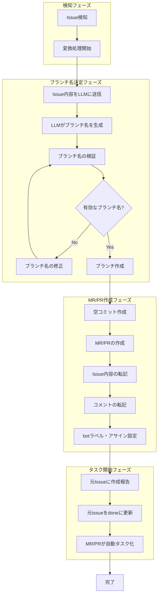
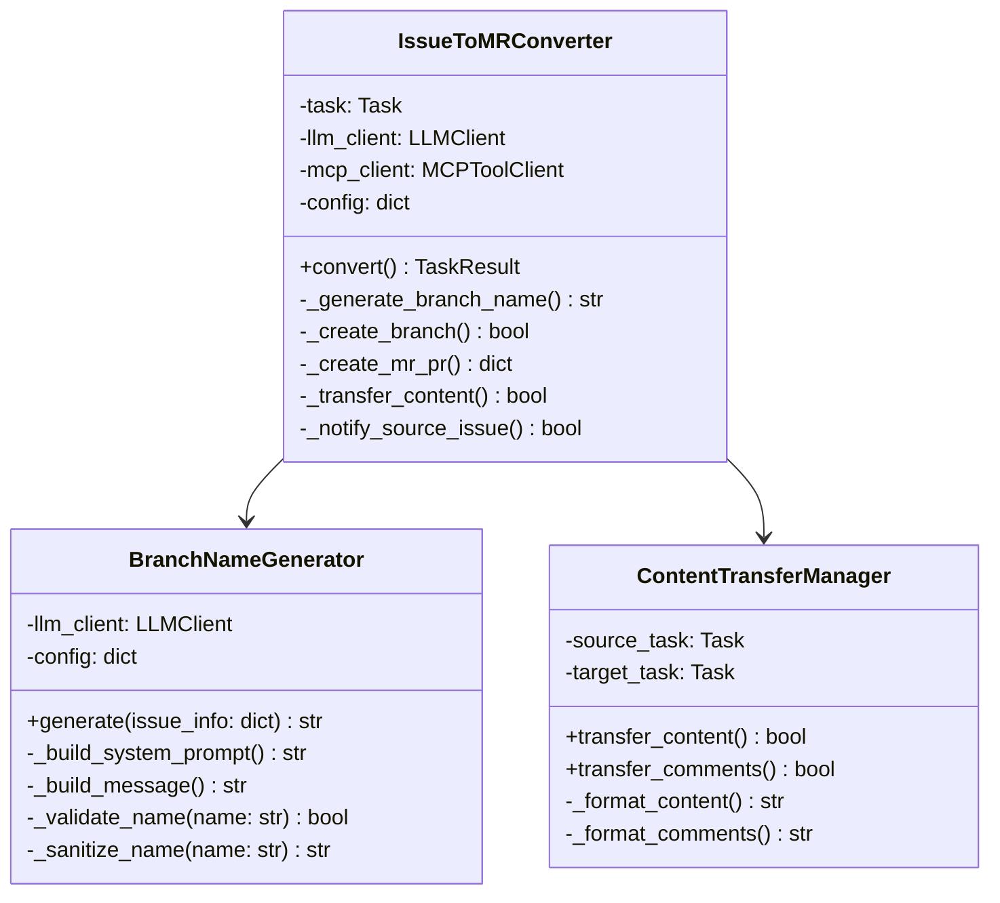
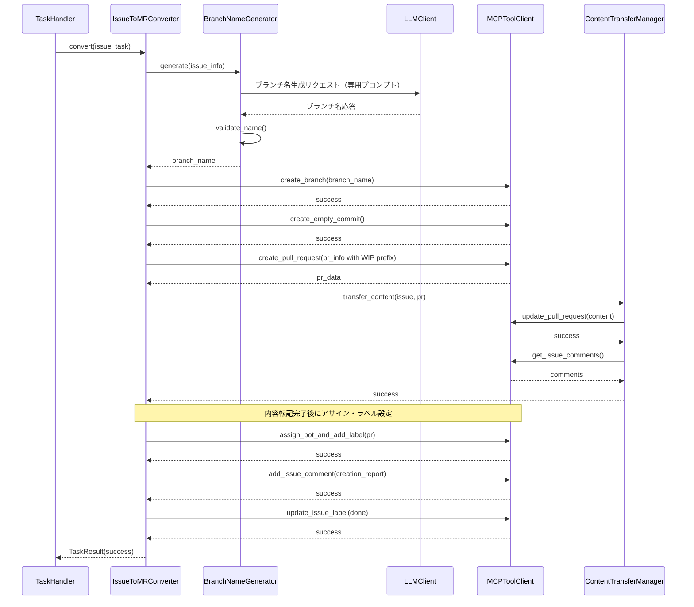

# Issue から MR/PR への変換仕様書

## 1. 概要

### 1.1 目的

本仕様書は、GitHub/GitLab の Issue で依頼された内容を自動的に Merge Request (MR) / Pull Request (PR) として作成する機能の詳細設計を定義します。この機能により、Issue の内容に基づいて LLM がブランチ名を決定し、新しいタスクとして MR/PR を作成・処理することが可能になります。

### 1.2 スコープ

本仕様は以下をカバーします：

- Issue 内容からブランチ名を LLM で自動決定する仕組み
- Issue の内容とコメントを MR/PR に転記する処理
- 新規タスクとして MR/PR 処理を開始する方法
- GitHub と GitLab の両プラットフォーム対応
- エラーハンドリングと異常系処理

### 1.3 前提条件

- coding agent のラベルが付与された Issue が存在すること
- エージェントに MR/PR 作成権限があること
- LLM クライアントが JSON 形式での応答が可能であること
- MCP サーバーが正常に稼働していること

---

## 2. 機能概要

### 2.1 処理フロー図



### 2.2 主要コンポーネント

1. **IssueToMRConverter**: Issue から MR/PR への変換を制御するメインクラス
2. **BranchNameGenerator**: LLM を使用してブランチ名を生成するクラス
3. **ContentTransferManager**: Issue の内容とコメントを MR/PR に転記するクラス

---

## 3. ブランチ名決定機能

### 3.1 概要

LLM を使用して Issue の内容からブランチ名を自動生成します。ブランチ名は Git の命名規則に従い、Issue の内容を適切に反映したものとなります。

### 3.2 入力情報

LLM に以下の情報を提供してブランチ名を生成させます：

- **Issue 番号**: Issue の識別番号
- **Issue タイトル**: Issue の題名
- **Issue 本文**: Issue の詳細説明
- **ラベル**: Issue に付与されているラベル一覧
- **リポジトリ名**: 対象リポジトリの名前
- **既存ブランチ一覧**: 重複を避けるための既存ブランチ情報
- **Bot 名**: エージェントのボット名（ブランチ名に含める）

### 3.3 ブランチ名生成ルール

LLM に以下のルールを指示してブランチ名を生成させます：

#### 3.3.1 命名規則

- プレフィックスは Issue のタイプに応じて決定する
  - 機能追加: `feature/`
  - バグ修正: `fix/`
  - ドキュメント: `docs/`
  - リファクタリング: `refactor/`
  - テスト追加: `test/`
  - その他: `task/`
- **Bot 名と Issue 番号を必ず含める**（例: `feature/codingagent-123-add-user-auth`）
- 英語の小文字とハイフンのみを使用する
- 最大長は 50 文字とする

#### 3.3.2 禁止文字

以下の文字は使用不可として処理する：

- スペース
- 特殊文字（`~`, `^`, `:`, `?`, `*`, `[`, `\`）
- 連続するスラッシュ（`//`）
- 末尾のスラッシュ

### 3.4 ブランチ名の検証

LLM が生成したブランチ名に対して以下の検証を実施します：

1. **形式チェック**: Git の命名規則に準拠しているか
2. **必須要素チェック**: Bot 名と Issue 番号が含まれているか
3. **重複チェック**: 既存のブランチ名と重複していないか
4. **長さチェック**: 最大長を超えていないか
5. **予約語チェック**: 禁止されたブランチ名（`main`, `master`, `develop` 等）でないか

### 3.5 LLM への指示形式

ブランチ名生成には専用のシステムプロンプトとメッセージを使用します。

#### 3.5.1 システムプロンプト（英語）

```
You are a branch name generator for Git repositories.
Your task is to analyze GitHub/GitLab issue content and generate an appropriate branch name.

Branch naming rules:
1. Use one of these prefixes based on issue type:
   - feature/ : for new features
   - fix/ : for bug fixes
   - docs/ : for documentation
   - refactor/ : for refactoring
   - test/ : for tests
   - task/ : for other tasks
2. MUST include bot name and issue number in format: {prefix}{bot_name}-{issue_number}-{description}
3. Use only lowercase letters, numbers, and hyphens
4. Maximum length is 50 characters
5. Do not use spaces or special characters

Output format: JSON with "branch_name" and "reasoning" fields.

Examples:
- feature/codingagent-123-add-user-auth
- fix/codingagent-456-login-bug
- docs/codingagent-789-update-readme
- refactor/codingagent-101-cleanup-api
- task/codingagent-202-misc-updates
```

#### 3.5.2 メッセージ形式（英語）

```
Generate a branch name for the following issue:

Bot Name: {bot_name}
Issue Number: {issue_number}
Issue Title: {issue_title}
Issue Body: {issue_body}
Labels: {labels}
Repository: {repository_name}
Existing Branches: {existing_branches}

Please generate an appropriate branch name following the naming rules.
```

#### 3.5.3 期待する出力形式

LLM は以下の JSON 形式で応答することを期待します：

```json
{
  "branch_name": "feature/codingagent-123-add-user-authentication",
  "reasoning": "Issue #123 requests adding user authentication feature. Using feature/ prefix with bot name and issue number as required."
}
```

---

## 4. MR/PR 作成処理

### 4.1 概要

ブランチ名が決定した後、MR/PR を作成し、Issue の内容とコメントを転記します。

### 4.2 処理ステップ

#### 4.2.1 ブランチの作成

1. 対象リポジトリのデフォルトブランチ（`main` または `master`）から新規ブランチを作成する
2. ブランチ作成が失敗した場合は、ブランチ名を修正して再試行する

#### 4.2.2 初期コミットの作成

新規ブランチに空コミットを作成する。

#### 4.2.3 MR/PR の作成

以下の情報を設定して MR/PR を作成する：

- **タイトル**: 「WIP: 」プレフィックスを必ず付与し、その後に Issue のタイトルを使用
- **本文**: Issue の内容を転記（詳細は 4.3 参照）
- **ソースブランチ**: 作成した新規ブランチ
- **ターゲットブランチ**: デフォルトブランチ

**注意**: Bot ユーザーへのアサインと `coding agent` ラベルの付与は、Issue 内容の転記が完了した後に行う（4.4 参照）。

### 4.3 内容転記の詳細

MR/PR の本文には以下の情報を含めます：

#### 4.3.1 転記内容の構造

```markdown
## 📋 元 Issue からの転記

### Issue 情報
- **Issue 番号**: #123
- **作成者**: @username
- **作成日時**: 2025-01-01 12:00:00

### Issue 内容
{Issue の本文をそのまま転記}

---

## 💬 Issue コメント

### コメント 1
- **投稿者**: @commenter1
- **投稿日時**: 2025-01-02 10:00:00

{コメント内容}

### コメント 2
- **投稿者**: @commenter2
- **投稿日時**: 2025-01-03 15:30:00

{コメント内容}

---

## 🤖 自動生成情報
このMR/PRは Issue #{issue_number} から自動生成されました。
```

#### 4.3.2 コメント転記の制限

- 最大転記コメント数は設定で制御可能とする（デフォルト: 50件）
- ボットによる自動コメントは除外するオプションを提供
- コメントが長すぎる場合は、要約または省略して転記

### 4.4 自動タスク化の設定

**Issue 内容とコメントの転記が完了した後**、MR/PR に以下の設定を行うことで、自動的にタスクとして処理されるようにする：

1. **Bot ユーザーへのアサイン**: MR/PR を Bot ユーザーにアサインする
2. **`coding agent` ラベルの付与**: エージェントによる処理対象を示すラベルを付与する

**重要**: アサインとラベル付与は必ず内容転記完了後に行う。これにより、MR/PR が不完全な状態でタスク検知されることを防ぐ。

これにより、MR/PR が作成されると、Producer の定期スキャンによって自動的にタスクとして検知され、処理が開始される。タスク検知は既存の TaskGetter の仕組み（`coding agent` ラベルでの検索）を利用する。

---

## 5. 元 Issue への報告と更新

### 5.1 MR/PR 作成報告

元の Issue に対して、MR/PR が作成されたことを通知するコメントを投稿します。

**コメント形式**:

```markdown
## 🚀 MR/PR を作成しました

この Issue の内容に基づいて、以下の MR/PR を作成しました：

- **MR/PR**: #{mr_number}
- **ブランチ**: `{branch_name}`
- **リンク**: {mr_url}

以降の処理は MR/PR 上で進めます。
```

### 5.2 元 Issue のステータス更新

MR/PR 作成後、元の Issue に対して以下の処理を行います：

1. **ラベル変更**: `coding agent` → `coding agent done` に変更

---

## 6. プラットフォーム別実装

### 6.1 GitHub 対応

#### 6.1.1 使用する API / ツール

- **ブランチ作成**: `github_create_branch` または GitHub REST API
- **PR 作成**: `github_create_pull_request` MCP ツール
- **コメント取得**: `get_issue_comments` MCP ツール
- **コメント投稿**: `add_issue_comment` MCP ツール

#### 6.1.2 GitHub 固有の処理

- Pull Request のドラフトモード設定
- Issue と PR の自動リンク（`Closes #123` 形式）

### 6.2 GitLab 対応

#### 6.2.1 使用する API / ツール

- **ブランチ作成**: GitLab API を使用
- **MR 作成**: GitLab MCP サーバーまたは REST API
- **コメント取得**: GitLab API を使用
- **コメント投稿**: GitLab API を使用

#### 6.2.2 GitLab 固有の処理

- Merge Request の WIP ステータス設定
- Issue と MR の関連付け設定

---

## 7. 設定オプション

### 7.1 config.yaml の設定項目

`issue_to_mr_conversion` セクションで以下を設定します：

| 設定項目 | 説明 | デフォルト値 |
|---------|------|-------------|
| enabled | Issue → MR/PR 変換機能の有効/無効 | true |
| auto_draft | PR/MR をドラフトとして作成するか | true |
| transfer_comments | コメントを転記するか | true |
| max_comments | 転記するコメントの最大数 | 50 |
| exclude_bot_comments | ボットコメントを除外するか | true |

### 7.2 環境変数

| 環境変数 | 説明 |
|---------|------|
| ISSUE_TO_MR_ENABLED | 機能の有効/無効 (true/false) |

---

## 8. エラーハンドリング

### 8.1 ブランチ作成エラー

#### 8.1.1 ブランチ名重複

既存のブランチ名と重複する場合：

1. ブランチ名にサフィックス（`-2`, `-3` 等）を追加して再試行
2. 最大 5 回まで再試行
3. 全て失敗した場合は処理を中断し、Issue にエラーコメントを投稿

#### 8.1.2 権限エラー

ブランチ作成権限がない場合：

1. Issue にエラーコメントを投稿
2. 処理を中断
3. ログにエラー詳細を記録

### 8.2 MR/PR 作成エラー

#### 8.2.1 作成失敗

MR/PR の作成に失敗した場合：

1. 作成したブランチを削除（クリーンアップ）
2. Issue にエラーコメントを投稿
3. ログにエラー詳細を記録

### 8.3 コメント転記エラー

コメントの転記に失敗した場合：

1. エラーをログに記録
2. 転記をスキップして処理を継続
3. MR/PR に警告コメントを追加

### 8.4 LLM ブランチ名生成エラー

LLM がブランチ名を適切に生成できない場合：

1. フォールバックとして Bot 名と Issue 番号ベースのデフォルト名を使用
2. 例: `task/codingagent-123-auto-generated`
3. Issue に警告コメントを投稿

---

## 9. アーキテクチャ

### 9.1 クラス図



### 9.2 シーケンス図



---

## 10. 関連ドキュメント

- [基本仕様](spec.md)
- [クラス設計](class_spec.md)
- [プランニングプロセス仕様](PLANNING_SPECIFICATION.md)
- [プロジェクトエージェントルール仕様](PROJECT_AGENT_RULES_SPECIFICATION.md)
- [コメント検知仕様](COMMENT_DETECTION_SPECIFICATION.md)

---

**文書バージョン:** 2.0  
**最終更新日:** 2025-11-29  
**ステータス:** 設計完了
