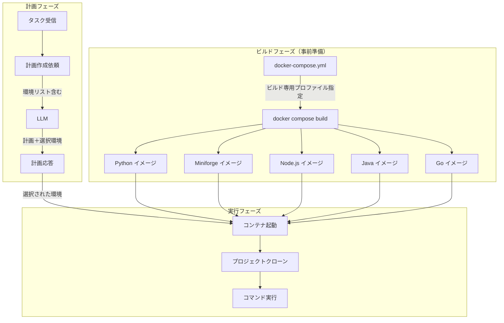
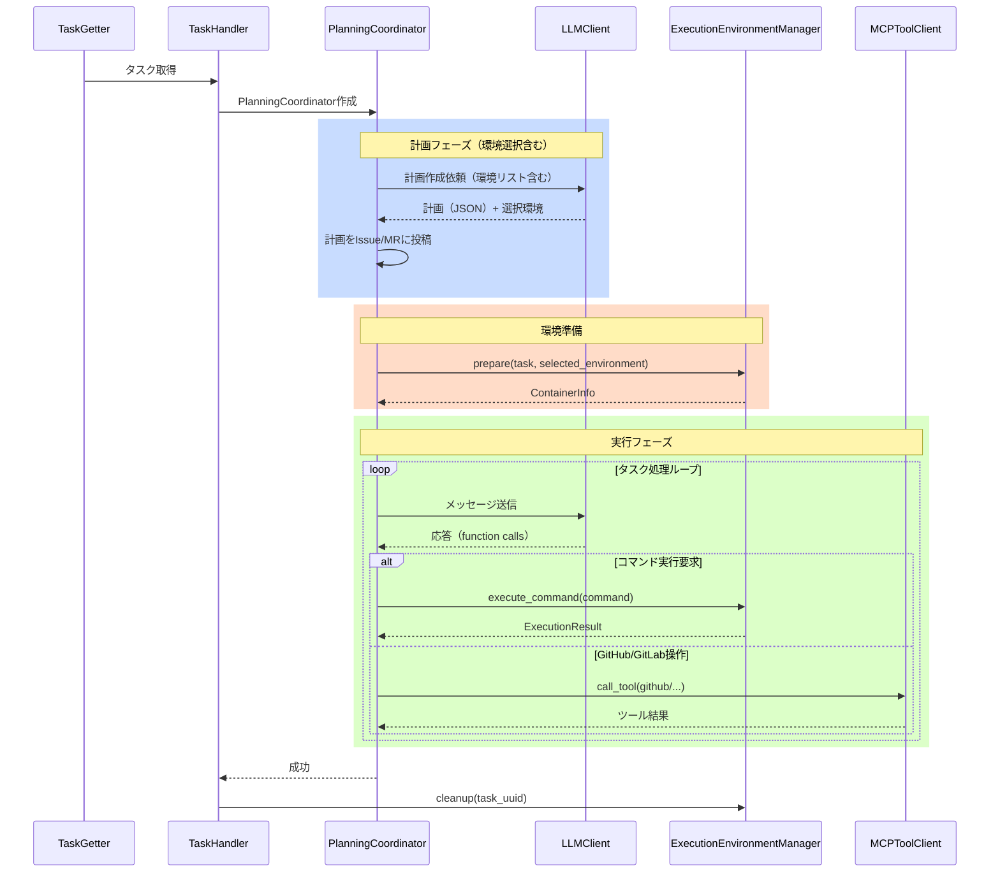
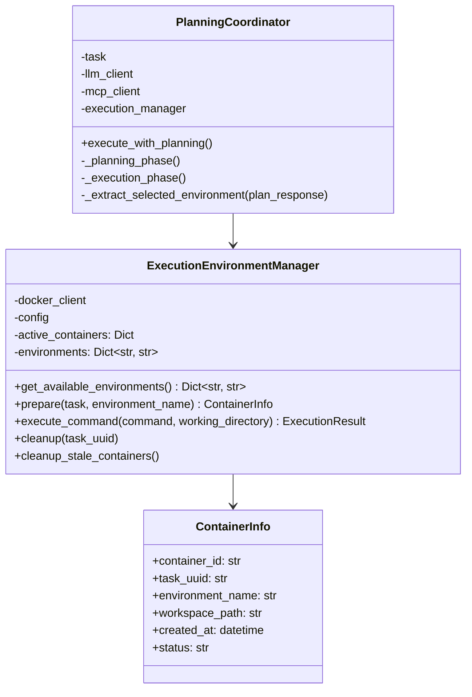

# 複数言語対応実行環境仕様書

## 1. 概要

### 1.1 目的

本仕様書は、コーディングエージェントが計画フェーズで必要な言語環境を選択し、適切なDockerイメージを使用して実行環境を起動する仕組みの詳細設計を定義します。

### 1.2 背景

現行のCommand Executor MCP Server連携では、単一の汎用イメージを使用して実行環境を構築していますが、以下の課題があります：

- タスク開始時に毎回gitなどの基本ツールをインストールする必要があり、起動に時間がかかる
- プロジェクトの言語に応じた最適な環境を選択できない
- 計画フェーズでの環境選択ができない

### 1.3 要求事項

1. Python、Miniforge（conda）、Node.js、Java、Goの各言語用Dockerイメージを事前に準備する
2. 各イメージにはgitとCommand Executor MCP Serverの基盤機能をあらかじめインストールしておく
3. 計画作成時にLLMがプロジェクトに適した実行環境を選択する
4. 環境起動後すぐにコマンド実行が可能な状態にする
5. システムプロンプトに各言語のライブラリ導入手順に関する注意事項を追加する

### 1.4 参照ドキュメント

- [Command Executor MCP Server連携仕様](COMMAND_EXECUTOR_MCP_SPECIFICATION.md)
- [プランニングプロセス仕様](PLANNING_SPECIFICATION.md)

---

## 2. システムアーキテクチャ

### 2.1 全体構成図



### 2.2 主要コンポーネント

#### 2.2.1 言語別Dockerイメージ

各言語用に最適化されたDockerイメージを提供します。すべてのイメージは以下の共通機能を含みます：

- git（バージョン管理）
- 基本的なシェルコマンド（grep、find、cat等）
- Command Executor MCP Server実行に必要な依存関係

#### 2.2.2 ExecutionEnvironmentManager（拡張）

既存のExecutionEnvironmentManagerを拡張し、以下の機能を追加します：

- 利用可能な環境リストの取得
- 計画応答から環境名を受け取り、対応するイメージでコンテナを起動

#### 2.2.3 PlanningCoordinator（拡張）

計画プロンプトに環境選択情報を追加します：

- 計画作成依頼時に利用可能な環境リストをプロンプトに含める
- LLMからの計画応答に含まれる選択環境を取得
- 選択された環境でExecutionEnvironmentManagerを呼び出し

---

## 3. 言語別Dockerイメージ仕様

### 3.1 共通仕様

すべての言語用イメージは以下の共通要件を満たします。

#### 3.1.1 ベース構成

- ベースイメージ: 各言語の公式標準イメージを使用
- 作業ディレクトリ: `/workspace`
- プロジェクト配置場所: `/workspace/project`

#### 3.1.2 共通インストール済みツール

- git: バージョン管理
- curl / wget: ファイルダウンロード
- jq: JSON処理
- tree: ディレクトリ構造表示
- その他基本的なコマンドラインツール

#### 3.1.3 コンテナ起動設定

- ENTRYPOINT: シェルを維持するためのコマンド
- 永続実行: `sleep infinity` または同等のコマンド

### 3.2 Python環境イメージ

#### 3.2.1 イメージ名

```
coding-agent-executor-python:latest
```

#### 3.2.2 構成内容

- ベースイメージ: `python:3.11-slim-bookworm`

#### 3.2.3 推奨用途

- 純粋なPythonプロジェクト
- Django、Flask等のWebフレームワーク
- データ処理スクリプト（軽量なもの）

### 3.3 Miniforge環境イメージ

#### 3.3.1 イメージ名

```
coding-agent-executor-miniforge:latest
```

#### 3.3.2 構成内容

- ベースイメージ: `condaforge/miniforge3:latest`

#### 3.3.3 推奨用途

- 科学計算・データサイエンスプロジェクト
- NumPy、pandas、scikit-learn等を使用するプロジェクト
- conda環境を使用するプロジェクト（condaenv.yaml、environment.yml）

### 3.4 Node.js環境イメージ

#### 3.4.1 イメージ名

```
coding-agent-executor-node:latest
```

#### 3.4.2 構成内容

- ベースイメージ: `node:20-slim`

#### 3.4.3 推奨用途

- フロントエンド開発（React、Vue、Angular等）
- Node.jsバックエンド（Express、NestJS等）
- TypeScriptプロジェクト

### 3.5 イメージ一覧

| 環境名 | イメージ名 | ベースイメージ |
|--------|-----------|---------------|
| python | coding-agent-executor-python:latest | python:3.11-slim-bookworm |
| miniforge | coding-agent-executor-miniforge:latest | condaforge/miniforge3:latest |
| node | coding-agent-executor-node:latest | node:20-slim |

---

## 4. Dockerfileディレクトリ構成

### 4.1 ディレクトリ構造

```
docker/
├── Dockerfile-executor-python
├── Dockerfile-executor-miniforge
└── Dockerfile-executor-node
```

### 4.2 Dockerfileの共通構造

各Dockerfileは以下の構造に従います：

1. 言語標準ベースイメージの指定
2. 共通パッケージのインストール（git、curl等）
3. 作業ディレクトリの設定
4. ENTRYPOINTの設定

---

## 5. Docker Compose設定

### 5.1 プロファイルによるビルド管理

docker-compose.ymlにビルド専用プロファイルを使用してビルド専用の設定を追加します。これにより、実行せずにイメージのビルドのみを行うことができます。

#### 5.1.1 プロファイル設計

- プロファイル名: `executor-build`
- 用途: 実行環境イメージの事前ビルド
- 特徴: サービスとして起動せず、ビルドのみを行う

#### 5.1.2 ビルドコマンド

イメージを事前にビルドするためのコマンド：

```bash
# 全ての実行環境イメージをビルド
docker compose --profile executor-build build

# 特定のイメージのみビルド
docker compose --profile executor-build build executor-python
```

### 5.2 サービス定義

各言語環境をサービスとして定義します。これらはビルド専用であり、通常は起動しません。

#### 5.2.1 サービス構成

各サービスは以下の属性を持ちます：

- build: Dockerfileの場所とコンテキスト
- image: ビルドされるイメージ名
- profiles: `executor-build`プロファイルを指定
- command: ダミーコマンド（ビルドのみのため）

---

## 6. 計画プロンプトへの環境選択統合

### 6.1 概要

環境選択は独立したフェーズではなく、計画作成プロンプトに統合します。LLMは計画作成と同時に適切な実行環境を選択します。

### 6.2 計画プロンプトへの追加内容

計画作成依頼のプロンプトに以下の情報を追加します：

#### 6.2.1 利用可能環境リスト

```
## Execution Environment Selection

You must select an appropriate execution environment for this task. The following environments are available:

| Environment | Image | Recommended For |
|------------|-------|-----------------|
| python | coding-agent-executor-python:latest | Pure Python projects, Django/Flask |
| miniforge | coding-agent-executor-miniforge:latest | Data science, conda environments |
| node | coding-agent-executor-node:latest | JavaScript/TypeScript, React/Vue/Angular |

```

### 6.3 計画応答形式の拡張

既存の計画応答形式に`selected_environment`フィールドを追加します：

```json
{
  "phase": "planning",
  "goal_understanding": {
    "main_objective": "...",
    "success_criteria": ["..."],
    "constraints": ["..."],
    "context_analysis": "..."
  },
  "task_decomposition": {
    "reasoning": "...",
    "subtasks": [...]
  },
  "action_plan": {
    "execution_order": ["..."],
    "actions": [...]
  },
  "selected_environment": {
    "name": "python",
    "reasoning": "プロジェクトにrequirements.txtが存在し、Django Webアプリケーションであるため、Python環境を選択しました。"
  },
  "comment": "計画を作成しました。Python環境を使用します。"
}
```

---

## 7. 処理シーケンス

### 7.1 タスク処理全体フロー



### 7.2 変更点サマリー

| 項目 | 変更前 | 変更後 |
|------|--------|--------|
| コンテナ作成タイミング | タスク作成時 | 計画作成後 |
| イメージ選択 | 固定（単一イメージ） | 計画フェーズでLLMが選択 |
| 環境選択方式 | なし | 計画プロンプトに統合 |
| git/ツールインストール | コンテナ起動後に実行 | イメージに事前インストール済み |
| 環境種類 | 1種類 | 5種類（Python, Miniforge, Node.js, Java, Go） |

---

## 8. システムプロンプト拡張

### 8.1 ライブラリ導入に関する注意事項

システムプロンプト（system_prompt_command_executor.txt）に以下の内容を追加します。

#### 8.1.1 追加内容

実行環境の使用前に必要なライブラリの導入に関するガイダンスを追加します：

1. 各言語環境で利用可能なパッケージマネージャーの説明
2. ライブラリインストールコマンドの例
3. 依存関係ファイルが存在する場合の自動インストールについて
4. 手動でのライブラリ追加が必要なケースの説明

#### 8.1.2 言語別ライブラリ導入ガイド

- **Python環境**: `pip install <package>` または `pip install -r requirements.txt`
- **Miniforge環境**: `mamba install <package>` または `mamba env update -f environment.yml`
- **Node.js環境**: `npm install <package>` または `npm install`（package.jsonから）
- **Java環境**: `mvn dependency:resolve` または `gradle dependencies`
- **Go環境**: `go mod download` または `go get <package>`

---

## 9. 設定ファイル仕様

### 9.1 config.yamlへの追加設定

```yaml
# Command Executor MCP Server連携設定
command_executor:
  enabled: true
  
  # 利用可能な実行環境（環境名: イメージ名）
  environments:
    python: "coding-agent-executor-python:latest"
    miniforge: "coding-agent-executor-miniforge:latest"
    node: "coding-agent-executor-node:latest"
    java: "coding-agent-executor-java:latest"
    go: "coding-agent-executor-go:latest"
  
  # デフォルト環境（環境選択に失敗した場合）
  default_environment: "python"
```

---

## 10. クラス設計（拡張）

### 10.1 クラス図



### 10.2 ExecutionEnvironmentManager変更点

既存のExecutionEnvironmentManagerクラスに以下の変更を加えます：

- `environments`属性: 環境名からイメージ名へのマッピング（Dict[str, str]）
- `get_available_environments()`: 環境名とイメージ名の辞書を返す
- `prepare(task, environment_name)`: 環境名を受け取り、対応するイメージでコンテナを作成

### 10.3 PlanningCoordinator変更点

既存のPlanningCoordinatorクラスに以下の変更を加えます：

- 計画プロンプトに環境リストと選択指示を追加
- `_extract_selected_environment(plan_response)`: 計画応答から選択された環境名を抽出
- 計画フェーズ完了後、抽出した環境名でExecutionEnvironmentManager.prepareを呼び出し

### 10.4 ContainerInfo（拡張）

既存のContainerInfoクラスに`environment_name`属性を追加し、使用された環境を記録します。

---

## 11. エラーハンドリング

### 11.1 環境選択エラー

#### 11.1.1 無効な環境名の選択

LLMが存在しない環境名を選択した場合：

1. 警告ログを記録
2. デフォルト環境を使用
3. Issue/MRにデフォルト環境を使用する旨をコメント

#### 11.1.2 イメージが存在しない場合

指定されたイメージが存在しない場合：

1. エラーログを記録
2. タスクをエラー終了
3. Issue/MRにエラーコメントを投稿

### 11.2 環境選択スキップ

以下の場合は環境選択をスキップし、デフォルト環境を使用します：

- 計画応答に`selected_environment`が含まれない場合
- LLMからの応答が不正な形式の場合

---

## 12. 関連ドキュメント

- [Command Executor MCP Server連携仕様](COMMAND_EXECUTOR_MCP_SPECIFICATION.md)
- [プランニングプロセス仕様](PLANNING_SPECIFICATION.md)
- [基本仕様](spec.md)

---

**文書バージョン:** 1.1  
**最終更新日:** 2024-11-29  
**ステータス:** 設計中
