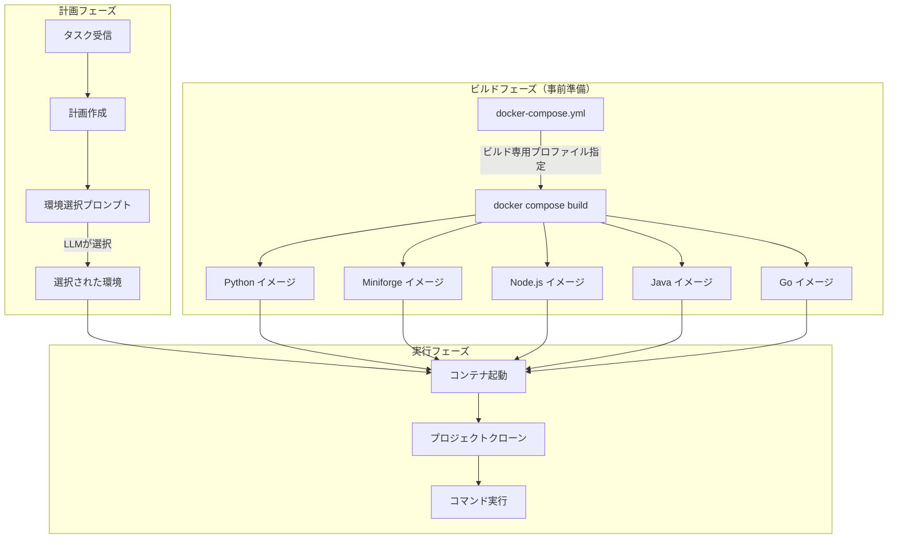
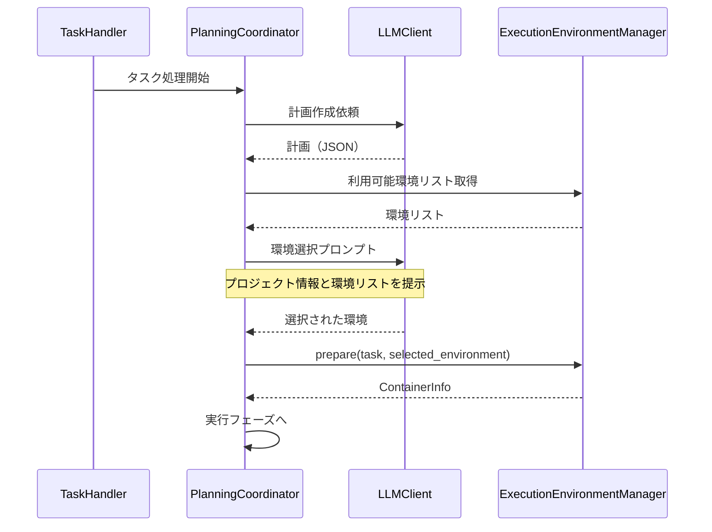
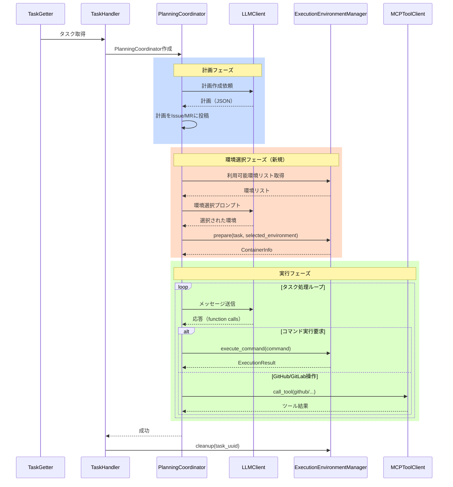
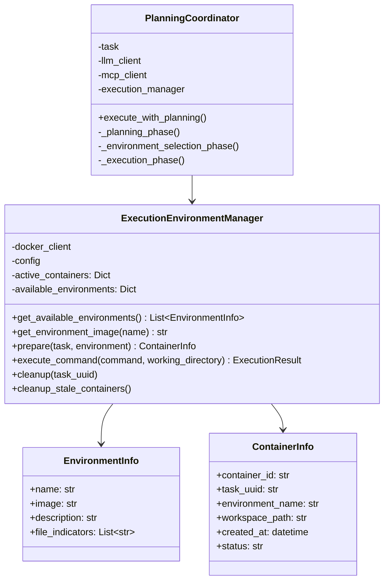

# 複数言語対応実行環境仕様書

## 1. 概要

### 1.1 目的

本仕様書は、コーディングエージェントが計画フェーズで必要な言語環境を選択し、適切なDockerイメージを使用して実行環境を起動する仕組みの詳細設計を定義します。

### 1.2 背景

現行のCommand Executor MCP Server連携では、単一の汎用イメージを使用して実行環境を構築していますが、以下の課題があります：

- タスク開始時に毎回gitなどの基本ツールをインストールする必要があり、起動に時間がかかる
- プロジェクトの言語に応じた最適な環境を選択できない
- 計画フェーズでの環境選択ができない

### 1.3 要求事項

1. Python、Miniforge（conda）、Node.js、Java、Goの各言語用Dockerイメージを事前に準備する
2. 各イメージにはgitとCommand Executor MCP Serverの基盤機能をあらかじめインストールしておく
3. 計画作成後にLLMがプロジェクトに適した実行環境を選択する
4. 環境起動後すぐにコマンド実行が可能な状態にする
5. システムプロンプトに各言語のライブラリ導入手順に関する注意事項を追加する

### 1.4 参照ドキュメント

- [Command Executor MCP Server連携仕様](COMMAND_EXECUTOR_MCP_SPECIFICATION.md)
- [プランニングプロセス仕様](PLANNING_SPECIFICATION.md)

---

## 2. システムアーキテクチャ

### 2.1 全体構成図



### 2.2 主要コンポーネント

#### 2.2.1 言語別Dockerイメージ

各言語用に最適化されたDockerイメージを提供します。すべてのイメージは以下の共通機能を含みます：

- git（バージョン管理）
- 基本的なシェルコマンド（grep、find、cat等）
- Command Executor MCP Server実行に必要な依存関係

#### 2.2.2 ExecutionEnvironmentManager（拡張）

既存のExecutionEnvironmentManagerを拡張し、以下の機能を追加します：

- 利用可能な環境リストの取得
- 計画フェーズからの環境選択受付
- 選択されたイメージを使用したコンテナ起動

#### 2.2.3 PlanningCoordinator（拡張）

計画フェーズに環境選択ステップを追加します：

- 計画作成完了後に環境選択プロンプトを生成
- LLMからの環境選択応答を処理
- 選択された環境でExecutionEnvironmentManagerを呼び出し

---

## 3. 言語別Dockerイメージ仕様

### 3.1 共通仕様

すべての言語用イメージは以下の共通要件を満たします。

#### 3.1.1 ベース構成

- ベースOS: Debian系またはAlpine（言語に応じて最適なものを選択）
- 非rootユーザーでの実行
- 作業ディレクトリ: `/workspace`
- プロジェクト配置場所: `/workspace/project`

#### 3.1.2 共通インストール済みツール

- git: バージョン管理
- curl / wget: ファイルダウンロード
- jq: JSON処理
- tree: ディレクトリ構造表示
- その他基本的なコマンドラインツール

#### 3.1.3 コンテナ起動設定

- ENTRYPOINT: シェルを維持するためのコマンド
- 永続実行: `sleep infinity` または同等のコマンド

### 3.2 Python環境イメージ

#### 3.2.1 イメージ名

```
coding-agent-executor-python:latest
```

#### 3.2.2 構成内容

- ベースイメージ: `python:3.11-slim-bookworm`
- Python: 3.11（安定版）
- pip: 最新版
- venv: 仮想環境サポート
- 追加ツール:
  - pytest: テスト実行
  - black: コードフォーマッター
  - flake8: リンター
  - mypy: 型チェッカー

#### 3.2.3 推奨用途

- 純粋なPythonプロジェクト
- Django、Flask等のWebフレームワーク
- データ処理スクリプト（軽量なもの）

### 3.3 Miniforge環境イメージ

#### 3.3.1 イメージ名

```
coding-agent-executor-miniforge:latest
```

#### 3.3.2 構成内容

- ベースイメージ: `condaforge/miniforge3:latest`
- Python: 3.11（condaで管理）
- conda / mamba: パッケージマネージャー
- 追加ツール:
  - pytest: テスト実行
  - black: コードフォーマッター
  - flake8: リンター

#### 3.3.3 推奨用途

- 科学計算・データサイエンスプロジェクト
- NumPy、pandas、scikit-learn等を使用するプロジェクト
- conda環境を使用するプロジェクト（condaenv.yaml、environment.yml）

### 3.4 Node.js環境イメージ

#### 3.4.1 イメージ名

```
coding-agent-executor-node:latest
```

#### 3.4.2 構成内容

- ベースイメージ: `node:20-slim`
- Node.js: 20 LTS
- npm: 最新版
- yarn: 最新版
- pnpm: 最新版
- 追加ツール:
  - eslint: リンター
  - prettier: コードフォーマッター
  - typescript: TypeScriptコンパイラ

#### 3.4.3 推奨用途

- フロントエンド開発（React、Vue、Angular等）
- Node.jsバックエンド（Express、NestJS等）
- TypeScriptプロジェクト

### 3.5 Java環境イメージ

#### 3.5.1 イメージ名

```
coding-agent-executor-java:latest
```

#### 3.5.2 構成内容

- ベースイメージ: `eclipse-temurin:21-jdk-jammy`
- Java: 21 LTS（Eclipse Temurin）
- Maven: 3.9.x
- Gradle: 8.x
- 追加ツール:
  - JUnit: テストフレームワーク（プロジェクト依存）

#### 3.5.3 推奨用途

- Java/Kotlinプロジェクト
- Spring Boot、Quarkus等のフレームワーク
- Androidビルド（一部対応）

### 3.6 Go環境イメージ

#### 3.6.1 イメージ名

```
coding-agent-executor-go:latest
```

#### 3.6.2 構成内容

- ベースイメージ: `golang:1.22-bookworm`
- Go: 1.22（最新安定版）
- go mod: モジュール管理
- 追加ツール:
  - golangci-lint: リンター
  - gofmt: フォーマッター

#### 3.6.3 推奨用途

- Goプロジェクト
- CLIツール開発
- マイクロサービス

### 3.7 イメージ一覧

| イメージ名 | 説明 | 主な言語/ツール | 推奨プロジェクト |
|-----------|------|----------------|-----------------|
| coding-agent-executor-python | Python開発環境 | Python 3.11, pip | 純粋Pythonプロジェクト |
| coding-agent-executor-miniforge | データサイエンス環境 | conda/mamba, Python | 科学計算、ML/AI |
| coding-agent-executor-node | JavaScript/TypeScript環境 | Node.js 20, npm/yarn | フロントエンド、Node.jsバックエンド |
| coding-agent-executor-java | Java/JVM環境 | Java 21, Maven/Gradle | Spring Boot、Java/Kotlin |
| coding-agent-executor-go | Go環境 | Go 1.22 | Goプロジェクト、CLIツール |

---

## 4. Dockerfileディレクトリ構成

### 4.1 ディレクトリ構造

```
docker/
├── executor-python/
│   └── Dockerfile
├── executor-miniforge/
│   └── Dockerfile
├── executor-node/
│   └── Dockerfile
├── executor-java/
│   └── Dockerfile
└── executor-go/
    └── Dockerfile
```

### 4.2 Dockerfileの共通構造

各Dockerfileは以下の構造に従います：

1. ベースイメージの指定
2. 共通パッケージのインストール（git、curl等）
3. 言語固有のツールインストール
4. 開発ツール（リンター、フォーマッター等）のインストール
5. 作業ディレクトリの設定
6. 非rootユーザーの設定（任意）
7. ENTRYPOINTの設定

---

## 5. Docker Compose設定

### 5.1 プロファイルによるビルド管理

docker-compose.ymlにダミープロファイルを使用してビルド専用の設定を追加します。これにより、実行せずにイメージのビルドのみを行うことができます。

#### 5.1.1 プロファイル設計

- プロファイル名: `executor-build`
- 用途: 実行環境イメージの事前ビルド
- 特徴: サービスとして起動せず、ビルドのみを行う

#### 5.1.2 ビルドコマンド

イメージを事前にビルドするためのコマンド：

```bash
# 全ての実行環境イメージをビルド
docker compose --profile executor-build build

# 特定のイメージのみビルド
docker compose --profile executor-build build executor-python
```

### 5.2 サービス定義

各言語環境をサービスとして定義します。これらはビルド専用であり、通常は起動しません。

#### 5.2.1 サービス構成

各サービスは以下の属性を持ちます：

- build: Dockerfileの場所とコンテキスト
- image: ビルドされるイメージ名
- profiles: `executor-build`プロファイルを指定
- command: ダミーコマンド（ビルドのみのため）

---

## 6. 環境選択プロセス

### 6.1 選択フロー



### 6.2 環境選択プロンプト

計画作成後、LLMに環境選択を依頼するためのプロンプトを構築します。

#### 6.2.1 プロンプト内容

プロンプトには以下の情報を含めます：

1. 利用可能な環境のリストと各環境の特徴
2. プロジェクトの情報（検出されたファイル、言語等）
3. 選択基準のガイドライン
4. 応答形式の指定

#### 6.2.2 環境選択の判断基準

LLMは以下の情報を基に環境を選択します：

- プロジェクトのルートディレクトリに存在するファイル
  - `package.json`: Node.js環境を推奨
  - `requirements.txt`: Python環境を推奨
  - `condaenv.yaml` / `environment.yml`: Miniforge環境を推奨
  - `go.mod`: Go環境を推奨
  - `pom.xml` / `build.gradle`: Java環境を推奨
- プロジェクトの説明やIssue/MRの内容
- 必要なツールやライブラリ

#### 6.2.3 応答形式

LLMは以下のJSON形式で環境を選択します：

```json
{
  "phase": "environment_selection",
  "selected_environment": "python",
  "reasoning": "プロジェクトにrequirements.txtが存在し、Django Webアプリケーションであるため、Python環境を選択しました。",
  "detected_files": ["requirements.txt", "manage.py", "setup.py"],
  "comment": "Python環境（coding-agent-executor-python）を選択しました。"
}
```

### 6.3 環境選択の実装詳細

#### 6.3.1 ExecutionEnvironmentManagerの拡張

ExecutionEnvironmentManagerクラスに以下のメソッドを追加します：

- `get_available_environments()`: 利用可能な環境リストを返す
- `get_environment_image(environment_name)`: 環境名からイメージ名を取得
- `prepare(task, environment)`: 指定された環境でコンテナを準備

#### 6.3.2 PlanningCoordinatorの拡張

PlanningCoordinatorクラスに以下の処理を追加します：

- 計画フェーズ完了後に環境選択ステップを実行
- 環境選択プロンプトの構築
- 選択結果の検証とExecutionEnvironmentManagerへの委譲

---

## 7. 処理シーケンス（変更後）

### 7.1 タスク処理全体フロー



### 7.2 変更点サマリー

| 項目 | 変更前 | 変更後 |
|------|--------|--------|
| コンテナ作成タイミング | タスク作成時 | 計画作成後（環境選択後） |
| イメージ選択 | 固定（単一イメージ） | 計画フェーズでLLMが選択 |
| git/ツールインストール | コンテナ起動後に実行 | イメージに事前インストール済み |
| 環境種類 | 1種類 | 5種類（Python, Miniforge, Node.js, Java, Go） |

---

## 8. システムプロンプト拡張

### 8.1 ライブラリ導入に関する注意事項

システムプロンプト（system_prompt_command_executor.txt）に以下の内容を追加します。

#### 8.1.1 追加内容

実行環境の使用前に必要なライブラリの導入に関するガイダンスを追加します：

1. 各言語環境で利用可能なパッケージマネージャーの説明
2. ライブラリインストールコマンドの例
3. 依存関係ファイルが存在する場合の自動インストールについて
4. 手動でのライブラリ追加が必要なケースの説明

#### 8.1.2 言語別ライブラリ導入ガイド

- **Python環境**: `pip install <package>` または `pip install -r requirements.txt`
- **Miniforge環境**: `mamba install <package>` または `mamba env update -f environment.yml`
- **Node.js環境**: `npm install <package>` または `npm install`（package.jsonから）
- **Java環境**: `mvn dependency:resolve` または `gradle dependencies`
- **Go環境**: `go mod download` または `go get <package>`

---

## 9. 設定ファイル仕様

### 9.1 config.yamlへの追加設定

```yaml
# Command Executor MCP Server連携設定
command_executor:
  enabled: true
  
  # 利用可能な実行環境
  environments:
    python:
      image: "coding-agent-executor-python:latest"
      description: "Python 3.11 development environment with pip, pytest, black, flake8"
      file_indicators:
        - "requirements.txt"
        - "setup.py"
        - "pyproject.toml"
        - "Pipfile"
      
    miniforge:
      image: "coding-agent-executor-miniforge:latest"
      description: "Data science environment with conda/mamba, Python, NumPy, pandas"
      file_indicators:
        - "environment.yml"
        - "condaenv.yaml"
        - "conda-lock.yml"
      
    node:
      image: "coding-agent-executor-node:latest"
      description: "Node.js 20 LTS with npm, yarn, pnpm, TypeScript, ESLint"
      file_indicators:
        - "package.json"
        - "yarn.lock"
        - "pnpm-lock.yaml"
      
    java:
      image: "coding-agent-executor-java:latest"
      description: "Java 21 LTS with Maven and Gradle"
      file_indicators:
        - "pom.xml"
        - "build.gradle"
        - "build.gradle.kts"
      
    go:
      image: "coding-agent-executor-go:latest"
      description: "Go 1.22 with go mod and golangci-lint"
      file_indicators:
        - "go.mod"
        - "go.sum"
  
  # デフォルト環境（環境選択に失敗した場合）
  default_environment: "python"
  
  # 環境選択を有効にするか（falseの場合はdefault_environmentを使用）
  enable_environment_selection: true
```

### 9.2 環境変数

| 環境変数名 | 説明 | デフォルト値 |
|-----------|------|-------------|
| EXECUTOR_ENV_SELECTION_ENABLED | 環境選択の有効/無効 | true |
| EXECUTOR_DEFAULT_ENVIRONMENT | デフォルト環境名 | python |
| EXECUTOR_PYTHON_IMAGE | Python環境イメージ名 | coding-agent-executor-python:latest |
| EXECUTOR_MINIFORGE_IMAGE | Miniforge環境イメージ名 | coding-agent-executor-miniforge:latest |
| EXECUTOR_NODE_IMAGE | Node.js環境イメージ名 | coding-agent-executor-node:latest |
| EXECUTOR_JAVA_IMAGE | Java環境イメージ名 | coding-agent-executor-java:latest |
| EXECUTOR_GO_IMAGE | Go環境イメージ名 | coding-agent-executor-go:latest |

---

## 10. クラス設計（拡張）

### 10.1 クラス図



### 10.2 新規データクラス

#### EnvironmentInfo

利用可能な実行環境の情報を保持するデータクラスです。

**属性:**
- `name`: 環境の識別名（python, miniforge, node, java, go）
- `image`: Dockerイメージ名
- `description`: 環境の説明
- `file_indicators`: この環境を推奨するファイルパターンのリスト

### 10.3 ContainerInfo（拡張）

既存のContainerInfoクラスに`environment_name`属性を追加し、使用された環境を記録します。

---

## 11. エラーハンドリング

### 11.1 環境選択エラー

#### 11.1.1 無効な環境名の選択

LLMが存在しない環境名を選択した場合：

1. 警告ログを記録
2. デフォルト環境を使用
3. Issue/MRにデフォルト環境を使用する旨をコメント

#### 11.1.2 イメージが存在しない場合

指定されたイメージが存在しない場合：

1. エラーログを記録
2. `docker pull`を試行
3. 失敗した場合はタスクをエラー終了
4. Issue/MRにエラーコメントを投稿

### 11.2 環境選択スキップ

以下の場合は環境選択をスキップし、デフォルト環境を使用します：

- `enable_environment_selection`が`false`の場合
- LLMからの応答が不正な形式の場合
- タイムアウトした場合

---

## 12. 運用ガイドライン

### 12.1 イメージのビルドと管理

#### 12.1.1 初回セットアップ

```bash
# 全ての実行環境イメージをビルド
docker compose --profile executor-build build

# イメージの確認
docker images | grep coding-agent-executor
```

#### 12.1.2 イメージの更新

```bash
# 特定の環境イメージを再ビルド
docker compose --profile executor-build build --no-cache executor-python

# 全イメージを再ビルド
docker compose --profile executor-build build --no-cache
```

### 12.2 監視項目

- 各環境イメージのビルド成功/失敗
- 環境選択の成功率
- 環境別のコンテナ使用率
- イメージサイズの監視

### 12.3 トラブルシューティング

#### イメージが見つからない場合

1. `docker images`でイメージの存在を確認
2. 存在しない場合は`docker compose --profile executor-build build`でビルド
3. ビルドが失敗する場合はDockerfileとベースイメージを確認

#### 環境選択が正しく動作しない場合

1. ログで環境選択プロンプトと応答を確認
2. プロジェクトのファイル構成を確認
3. 設定ファイルの`file_indicators`設定を確認

---

## 13. 今後の拡張

### 13.1 検討中の機能

- **カスタム環境の追加**: プロジェクト固有のDockerイメージを登録可能にする
- **マルチ言語環境**: 複数の言語ランタイムを含む統合環境
- **環境キャッシュ**: 同一プロジェクトでの再利用時にイメージを再利用
- **環境プリウォーム**: よく使われる環境を事前に起動しておく

### 13.2 制限事項

- GPUサポートは現時点では非対応
- Windows/macOS固有のツールは非対応
- コンテナ間の通信は非対応

---

## 14. 関連ドキュメント

- [Command Executor MCP Server連携仕様](COMMAND_EXECUTOR_MCP_SPECIFICATION.md)
- [プランニングプロセス仕様](PLANNING_SPECIFICATION.md)
- [基本仕様](spec.md)

---

**文書バージョン:** 1.0  
**最終更新日:** 2024-11-29  
**ステータス:** 設計中
