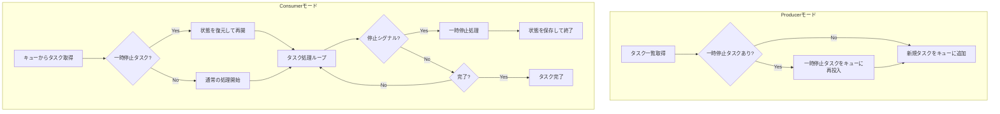
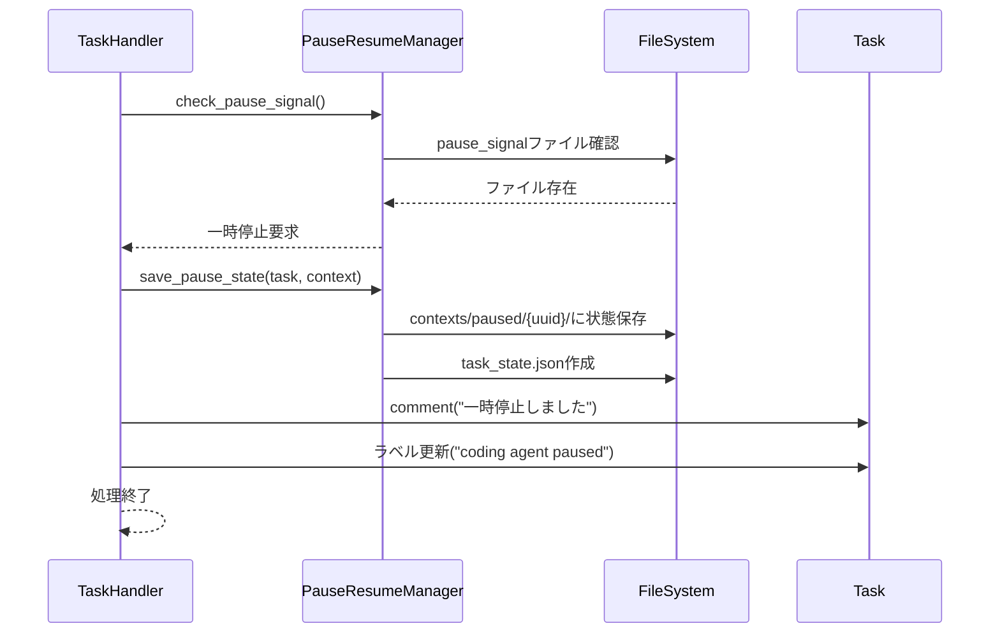
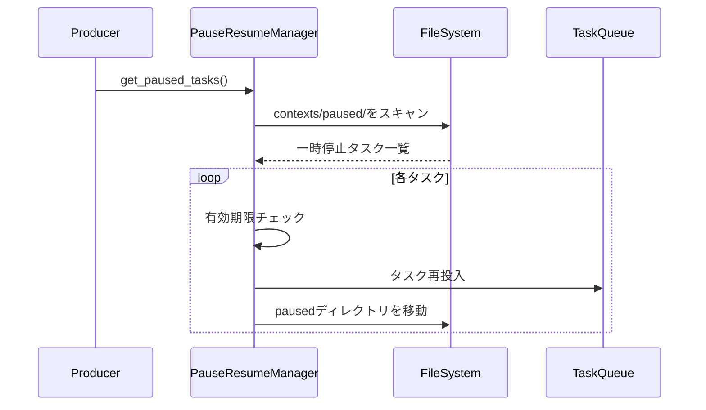
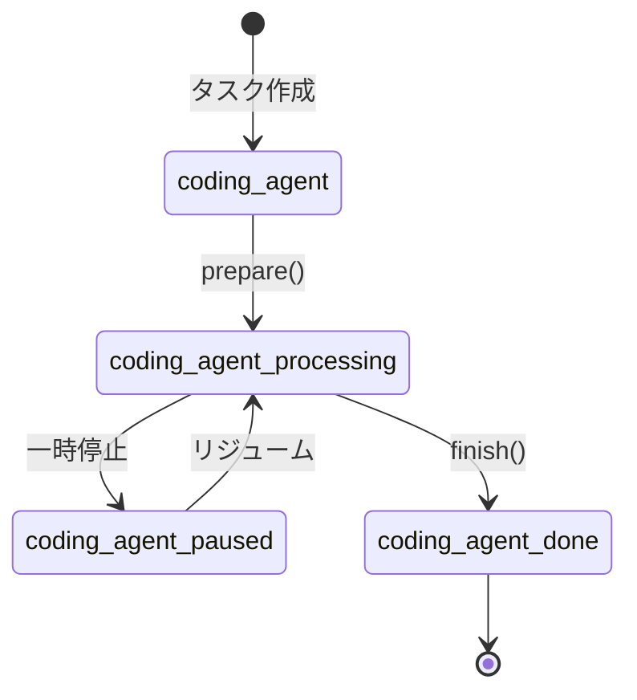

# 運用上の一時停止とリジューム仕様

## 1. 概要

### 1.1 目的

現在のcoding_agentは、consumerモードで動作を開始すると、タスクが完了するまで停止せずに実行し続けます。本仕様では、consumerモードで実行中のタスクを一時停止し、後から同じ状態からリジューム（再開）できる機能を設計します。

### 1.2 要求事項

- consumerモード実行中に外部シグナルで一時停止を指示できること
- 実行中のタスクの状態を永続化し、後から復元できること
- producerモードで一時停止されたタスクを検出し、キューに再投入できること
- consumerモードで一時停止状態のタスクを受け取り、中断した箇所から処理を再開できること

### 1.3 対象範囲

- consumerモードでのタスク一時停止機能
- タスク状態の永続化機構
- producerモードでの一時停止タスク検出と再投入機能
- consumerモードでのタスク復元と継続実行機能

---

## 2. 処理フロー

### 2.1 全体フロー図

### 2.2 通常のタスク処理フロー

#### Producerモード

1. TaskGetterがGitHub/GitLabからタスク一覧を取得
2. 各タスクに対してtask.prepare()を実行（ラベル付与等）
3. タスク情報（TaskKey + UUID + ユーザー情報）をキューに追加

#### Consumerモード

1. キューからタスク情報を取得
2. TaskGetter.from_task_key()でTaskインスタンスを復元
3. task.check()で処理可能状態を確認
4. TaskHandler.handle()でタスクを実行
5. タスク完了時にtask.finish()を実行（ラベル更新等）

---

## 3. 一時停止機能の詳細設計

### 3.1 一時停止の契機

#### 停止ファイルによる一時停止

consumerプロセスが定期的に特定のファイルの存在をチェックし、ファイルが検出された場合に一時停止処理を開始します。

**停止ファイルパス:** contexts/pause_signal

**ファイル形式:**
- 空ファイル、またはタイムスタンプを含むテキストファイル
- ファイルが存在する場合、consumerは現在のタスクを一時停止する

**チェックタイミング:**
- LLM応答を取得した後、次のアクション実行前
- ツール実行完了後、LLMへの結果送信前
- 処理ループの各イテレーション開始時

### 3.2 一時停止処理フロー

### 3.3 一時停止時の処理

1. **停止ファイル検出**: pause_signalファイルの存在を確認
2. **タスク情報取得**: 現在実行中のタスク情報を取得
3. **状態記録**: タスク状態をファイルに記録
   - タスクキー情報（TaskKey）
   - UUID
   - ユーザー情報
   - 一時停止時刻
   - 処理ステータス（paused）
4. **Context Storageディレクトリ移動**: contexts/running/{task_uuid}/をcontexts/paused/{task_uuid}/に移動
5. **コメント追加**: タスクに一時停止通知のコメントを追加
6. **ラベル更新**: 処理中ラベルをpaused状態のラベルに変更
7. **正常終了**: consumer処理を正常終了

**注意**: pause_signalファイルは自動的には削除されません。リジュームの準備ができたら手動で削除する必要があります。

---

## 4. リジューム機能の詳細設計

### 4.1 一時停止タスクの検出

Producerモードで以下の順序で一時停止タスクを検出します：

1. contexts/paused/ディレクトリをスキャン
2. 各サブディレクトリのtask_state.jsonを読み込み
3. 有効期限内のタスクをフィルタリング
4. タスクキーとUUIDを抽出

### 4.2 キューへの再投入

### 4.3 タスクの復元と継続実行

Consumerモードで一時停止タスクを受け取った場合：

1. **状態復元**: contexts/paused/{uuid}/から状態を復元
2. **Context Storage復元**: current.jsonl、summary.jsonl等を読み込み
3. **Planning状態復元**: Planning有効時はplanning履歴も復元
4. **ラベル更新**: pausedラベルからprocessingラベルに変更
5. **処理継続**: 中断した箇所から処理を再開

---

## 5. 状態の永続化

### 5.1 保存される情報

#### task_state.json

- **task_key**: タスクキー情報
- **uuid**: タスクUUID
- **user**: ユーザー情報
- **paused_at**: 一時停止時刻（ISO 8601形式）
- **status**: ステータス（paused）

#### Context Storage

contexts/paused/{uuid}/ディレクトリに以下のファイルを保存：

- **current.jsonl**: 会話履歴
- **summary.jsonl**: 要約履歴
- **tools.jsonl**: ツール呼び出し履歴
- **planning/**: Planning履歴（Planning有効時）
- **metadata.json**: タスクメタデータ

### 5.2 Planning状態の追加保存

Planning機能有効時は、task_state.jsonに以下の追加フィールドを保存：

- **current_phase**: 現在のフェーズ（planning/execution/reflection/revision）
- **executed_action_count**: 実行済みアクション数
- **plan_revision_count**: プラン修正回数
- **checklist_comment_id**: チェックリストコメントID

---

## 6. ラベル管理

### 6.1 ラベル遷移

### 6.2 ラベル一覧

| ラベル | 状態 |
|-------|------|
| coding agent | 処理待ち |
| coding agent processing | 処理中 |
| coding agent paused | 一時停止中 |
| coding agent done | 処理完了 |

---

## 7. 設定オプション

### 7.1 config.yamlの設定項目

pause_resumeセクションで以下を設定します：

- **enabled**: 一時停止機能の有効/無効（デフォルト: true）
- **signal_file**: 停止シグナルファイルのパス（デフォルト: contexts/pause_signal）
- **check_interval**: 停止チェック間隔（LLMループN回ごと、デフォルト: 1）
- **paused_task_expiry_days**: 一時停止タスクの有効期限（日数、デフォルト: 30）
- **paused_dir**: 一時停止状態ディレクトリ（デフォルト: contexts/paused）

### 7.2 プラットフォーム別設定

GitHubおよびGitLabの設定セクションで、一時停止ラベルを設定できます：

- **github.paused_label**: GitHub用の一時停止ラベル（デフォルト: coding agent paused）
- **gitlab.paused_label**: GitLab用の一時停止ラベル（デフォルト: coding agent paused）

---

## 8. エラーハンドリング

### 8.1 一時停止時のエラー

- **状態保存失敗**: ログ出力後、処理を継続（データ損失回避のため）
- **ラベル更新失敗**: ログ出力後、処理を継続

### 8.2 リジューム時のエラー

- **状態復元失敗**: 新規タスクとして処理
- **Context Storage復元失敗**: 新規タスクとして処理
- **有効期限切れ**: タスクをスキップ、ログ出力

---

## 9. 関連ドキュメント

- [一時停止・再開の使い方](../setup/PAUSE_RESUME_USAGE.md)
- [タスク停止機能仕様](TASK_STOP_SPECIFICATION.md)
- [コンテキストファイル化仕様](context_file_spec.md)

---

**文書バージョン:** 2.0  
**最終更新日:** 2024-11-28  
**ステータス:** 実装済み
