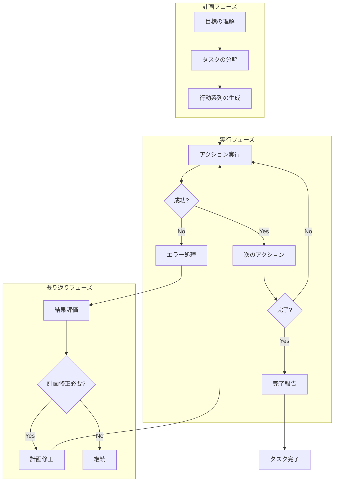
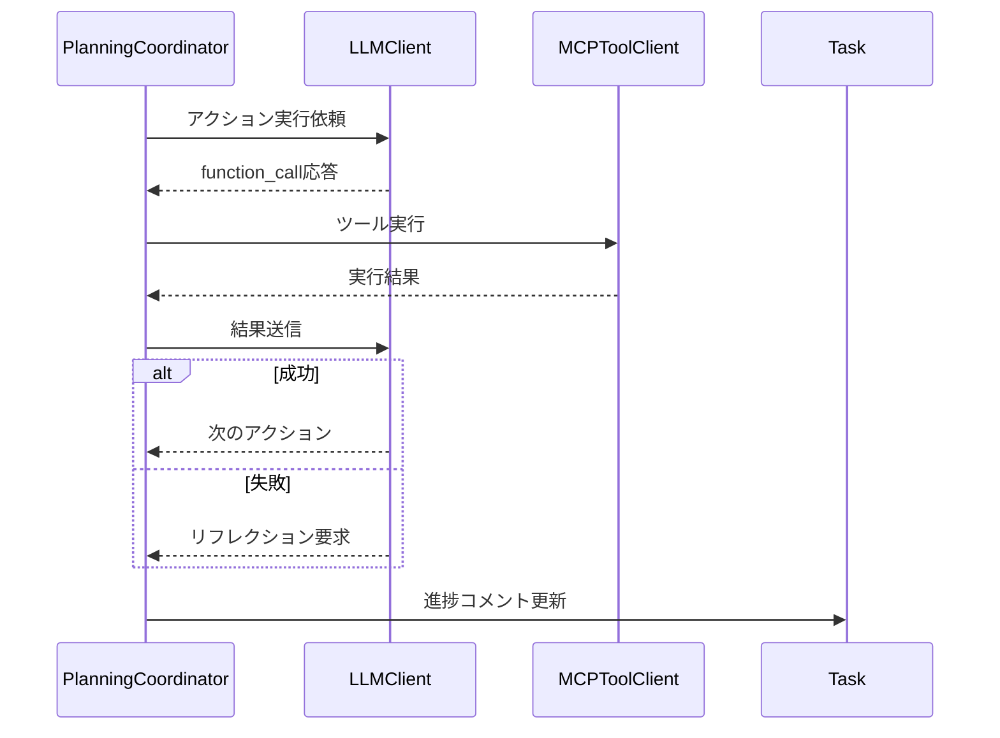
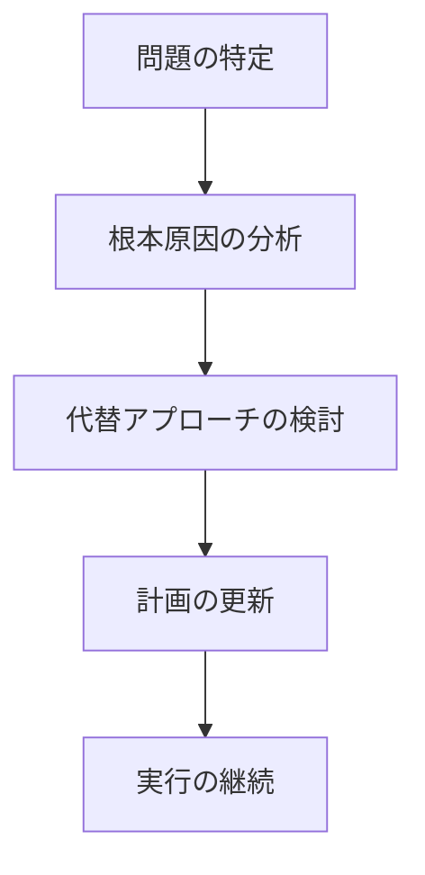
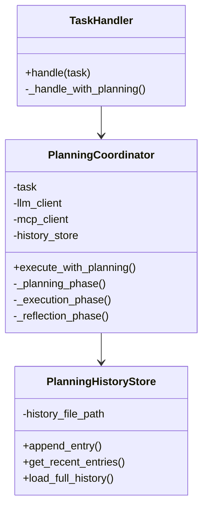

# プランニングプロセス仕様書

## 1. 概要

### 1.1 目的

本仕様書は、LLMエージェントが複雑なタスクを効果的に処理するためのプランニングプロセスを定義します。

### 1.2 スコープ

本仕様は以下をカバーします：

- プランニングプロセスの5つのフェーズの詳細
- 各フェーズの入出力形式
- アーキテクチャ設計と実装詳細設計
- システムプロンプト拡張仕様
- 設定オプションと環境変数
- エラーハンドリング戦略

### 1.3 前提条件

- LLMエージェントは既存のMCPサーバーと連携可能
- タスクはGitHub IssueまたはGitLab Issue/MRとして提供される
- LLMはJSON形式での応答が可能
- システムプロンプトによる動作制御が可能
- システムプロンプトは必ず英語で記述する

---

## 2. プランニングプロセス概要

### 2.1 プロセスフロー図

### 2.2 5つのフェーズ

1. **目標の理解（Goal Understanding）**: ユーザーからの指示や達成すべき目標を理解
2. **タスクの分解（Task Decomposition）**: 複雑な目標を実行可能な小さなサブタスクに分割
3. **行動系列の生成（Action Sequence Generation）**: 実行順序とツール使用計画を策定
4. **実行（Execution）**: 計画された行動を順番に実行
5. **監視と修正（Monitoring and Reflection）**: 実行結果を評価し、必要に応じて計画を修正

---

## 3. 目標の理解（Goal Understanding）

### 3.1 概要

エージェントはまず、ユーザーからの指示や達成すべき目標を理解します。

### 3.2 入力

- Issue/PR/MRの内容
- ユーザーコメント
- リポジトリコンテキスト
- 同じIssue/MRで過去に実行した計画と実行履歴（JSONLファイルから取得）

### 3.3 処理内容

- 要求の意図を分析
- 成功基準の特定
- 制約条件の識別
- 過去の計画・実行内容を参照し、継続性を保つ

### 3.4 出力

以下の情報を含むJSONオブジェクトを出力します：

- **main_objective**: メインの目標を明確に記述
- **success_criteria**: 成功条件のリスト
- **constraints**: 制約条件のリスト
- **context**: タスクの背景情報

---

## 4. タスクの分解（Task Decomposition）

### 4.1 概要

複雑な目標を実行可能な小さなサブタスク（ステップ）に分割します。

### 4.2 使用手法

- **Chain-of-Thought (CoT)**: 思考プロセスを段階的に展開
- **Hierarchical Task Network**: 階層的なタスク構造
- **Dependency Analysis**: 依存関係の分析

### 4.3 出力

以下の情報を含むJSONオブジェクトを出力します：

- **reasoning**: タスク分解の理由と考え方（Chain-of-Thought）
- **subtasks**: サブタスクの配列
  - id: サブタスクの識別子
  - description: サブタスクの説明
  - dependencies: 依存するサブタスクのリスト
  - estimated_complexity: 推定複雑度（low/medium/high）
  - required_tools: 必要なツールのリスト

---

## 5. 行動系列の生成（Action Sequence Generation）

### 5.1 概要

分解されたサブタスクに基づき、実行順序とツール使用計画を策定します。

### 5.2 考慮事項

- タスク間の依存関係
- ツールの利用可能性
- 実行効率
- エラー回復戦略

### 5.3 出力

以下の情報を含むJSONオブジェクトを出力します：

- **execution_order**: 実行順序のリスト
- **actions**: アクションの配列
  - task_id: 対応するタスクID
  - action_type: アクションタイプ
  - tool: 使用するツール
  - purpose: このアクションの目的
  - expected_outcome: 期待される結果
  - fallback_strategy: 失敗時の代替手段

---

## 6. 実行（Execution）

### 6.1 実行フロー図

### 6.2 実行フロー

実行ループ内で以下の処理を繰り返します：

1. **シグナルチェック**: 各アクション実行前に以下をチェック
   - 一時停止シグナル（pause_signal）の存在確認
   - アサイン解除（タスク停止）の確認
   - 新規コメントの検出とコンテキストへの追加
2. **アクションの選択**: 次に実行するアクションを選択
3. **前提条件の確認**: アクション実行の前提条件を確認
4. **ツールの実行**: MCPサーバーを通じてツールを実行
5. **結果の記録**: 実行結果をコンテキストに記録
6. **リフレクション判定**: 設定に応じてリフレクションを実行
7. **進捗更新**: Issue/MRのチェックリストコメントを更新
8. **次のアクションへ**: 次のアクションを選択して繰り返し

---

## 7. 監視と修正（Monitoring and Reflection）

### 7.1 監視対象

- アクションの成功/失敗
- 期待される結果との差異
- 副作用や予期しない影響

### 7.2 リフレクションタイプ

#### 自動リフレクション（Automatic Reflection）

実行結果を評価し、以下の情報を出力します：

- **action_id**: 評価対象のアクションID
- **status**: 成功/失敗/部分成功
- **evaluation**: 結果の評価
- **alignment_with_plan**: 計画との整合性
- **issues_identified**: 特定された問題
- **plan_revision_needed**: 計画修正が必要かどうか

#### 人間フィードバック（Human Reflection）

- Issueコメントでの指摘
- PRレビューでのフィードバック
- 明示的な修正要求

### 7.3 計画修正プロセス

1. 問題の特定
2. 根本原因の分析
3. 代替アプローチの検討
4. 計画の更新
5. 実行の継続

---

## 8. アーキテクチャ

### 8.1 クラス図

### 8.2 主要コンポーネント

#### PlanningCoordinator

プランニングプロセス全体を調整するコーディネータークラスです。

**責務:**
- 5つのフェーズの制御
- LLMとの対話管理
- 履歴の管理
- Issue/MRへの進捗コメント投稿

#### PlanningHistoryStore

計画と実行の履歴を永続化するストアクラスです。

**責務:**
- 履歴のJSONL形式での保存
- 履歴の読み込みと参照
- 古い履歴の管理

---

## 9. チェックリスト機能

### 9.1 概要

計画のサブタスク一覧をMarkdownチェックリスト形式でIssue/MRにコメントします。

### 9.2 フォーマット

計画完了時に以下のフォーマットでコメントを投稿します：

- タイトル（絵文字付き）
- 目標の説明
- チェックリスト項目（未完了状態）
- フッター

### 9.3 更新タイミング

- 計画完了時: チェックリストを新規投稿
- 各サブタスク完了時: チェックリストを更新（チェック済みに変更）
- 計画修正時: チェックリストを再投稿

---

## 10. 設定オプション

### 10.1 config.yamlの設定項目

planningセクションで以下を設定します：

- **enabled**: プランニングモードの有効/無効（デフォルト: false）
- **max_reflection_count**: 最大リフレクション回数（デフォルト: 3）
- **max_plan_revision_count**: 最大計画修正回数（デフォルト: 2）
- **reflection_interval**: リフレクション間隔（アクション数、デフォルト: 5）

### 10.2 環境変数

- **PLANNING_ENABLED**: プランニングモードの有効/無効（true/false）

---

## 11. エラーハンドリング

### 11.1 ツール実行エラー

ツール実行が失敗した場合：
1. エラー内容をLLMに通知
2. リフレクションを実行
3. 代替アプローチを検討
4. 必要に応じて計画を修正

### 11.2 計画生成エラー

計画生成が失敗した場合：
1. エラーログを記録
2. Issue/MRにエラーコメントを投稿
3. 処理を中断

### 11.3 最大修正回数超過

計画修正が最大回数を超えた場合：
1. 警告ログを記録
2. Issue/MRに警告コメントを投稿
3. 現在の計画で実行を継続

---

## 12. 関連ドキュメント

- [基本仕様](spec.md)
- [クラス設計](class_spec.md)
- [コンテキストファイル化仕様](context_file_spec.md)

---

**文書バージョン:** 2.0  
**最終更新日:** 2024-11-28  
**ステータス:** 実装済み
