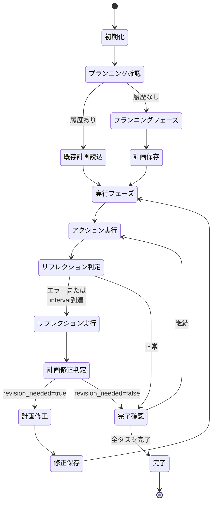
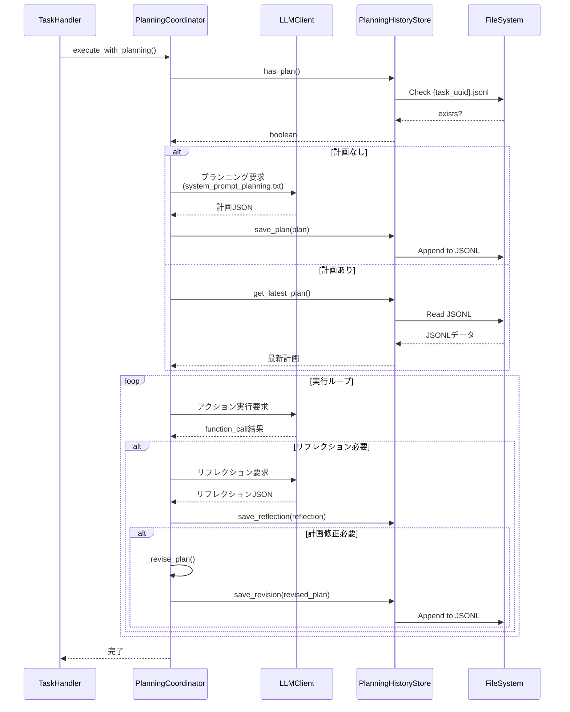
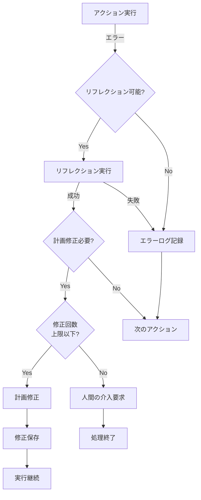

# プランニングプロセス仕様書

## 1. 概要

### 1.1 目的

本仕様書は、LLMエージェントが複雑なタスクを効果的に処理するためのプランニングプロセスを定義します。

### 1.2 スコープ

本仕様は以下をカバーします：

- プランニングプロセスの5つのフェーズの詳細
- 各フェーズの入出力形式とJSON応答フォーマット
- アーキテクチャ設計と実装詳細設計
- システムプロンプト拡張仕様
- 設定オプションと環境変数
- エラーハンドリング戦略
- テスト戦略

### 1.3 前提条件

- LLMエージェントは既存のMCPサーバーと連携可能
- タスクはGitHub IssueまたはGitLab Issue/MRとして提供される
- LLMはJSON形式での応答が可能
- システムプロンプトによる動作制御が可能
- **システムプロンプトは必ず英語で記述する**（LLMへの指示は英語で行う）

## 2. プランニングプロセスの5つのフェーズ

### 2.1 目標の理解 (Goal Understanding)

エージェントはまず、ユーザーからの指示や達成すべき目標を理解します。

**入力：**
- Issue/PR/MRの内容
- ユーザーコメント
- リポジトリコンテキスト
- **同じIssue/MRで過去に実行した計画と実行履歴**（JSONLファイルから取得）

**処理：**
- 要求の意図を分析
- 成功基準の特定
- 制約条件の識別
- 過去の計画・実行内容を参照し、継続性を保つ

**出力：**
```json
{
  "goal_understanding": {
    "main_objective": "メインの目標を明確に記述",
    "success_criteria": ["成功条件1", "成功条件2"],
    "constraints": ["制約条件1", "制約条件2"],
    "context": "タスクの背景情報"
  }
}
```

### 2.2 タスクの分解 (Task Decomposition)

複雑な目標を実行可能な小さなサブタスク（ステップ）に分割します。Chain-of-Thought (CoT) などの技術を使用します。

**手法：**
- Chain-of-Thought (CoT): 思考プロセスを段階的に展開
- Hierarchical Task Network: 階層的なタスク構造
- Dependency Analysis: 依存関係の分析

**出力：**
```json
{
  "task_decomposition": {
    "reasoning": "タスク分解の理由と考え方（Chain-of-Thought）",
    "subtasks": [
      {
        "id": "task_1",
        "description": "サブタスクの説明",
        "dependencies": [],
        "estimated_complexity": "low|medium|high",
        "required_tools": ["tool_1", "tool_2"]
      }
    ]
  }
}
```

### 2.3 行動系列の生成 (Action Sequence Generation)

分解されたサブタスクに基づき、実行順序とツール使用計画を策定します。

**考慮事項：**
- タスク間の依存関係
- ツールの利用可能性
- 実行効率
- エラー回復戦略

**出力：**
```json
{
  "action_plan": {
    "execution_order": ["task_1", "task_2", "task_3"],
    "actions": [
      {
        "task_id": "task_1",
        "action_type": "tool_call",
        "tool": "github_get_file_contents",
        "purpose": "このアクションの目的",
        "expected_outcome": "期待される結果",
        "fallback_strategy": "失敗時の代替手段"
      }
    ]
  }
}
```

### 2.4 実行 (Execution)

計画された行動を順番に実行します。

**実行フロー：**
1. アクションの選択
2. 前提条件の確認
3. ツールの実行
4. 結果の記録
5. 次のアクションへ

### 2.5 監視と修正 (Monitoring and Reflection)

実行結果を評価し、予期せぬ結果やエラーが発生した場合は計画を見直します。

**監視対象：**
- アクションの成功/失敗
- 期待される結果との差異
- 副作用や予期しない影響

**リフレクションタイプ：**

#### 自動リフレクション (Automatic Reflection)
```json
{
  "reflection": {
    "action_id": "task_1_action_1",
    "status": "success|failure|partial",
    "evaluation": "結果の評価",
    "alignment_with_plan": "計画との整合性",
    "issues_identified": ["問題1", "問題2"],
    "plan_revision_needed": true|false
  }
}
```

#### 人間フィードバック (Human Reflection)
- Issueコメントでの指摘
- PRレビューでのフィードバック
- 明示的な修正要求

**計画修正プロセス：**
1. 問題の特定
2. 根本原因の分析
3. 代替アプローチの検討
4. 計画の更新
5. 実行の継続

## JSON応答フォーマット

### プランニングフェーズ

```json
{
  "phase": "planning",
  "goal_understanding": { },
  "task_decomposition": { },
  "action_plan": { },
  "comment": "プランニング完了。実行を開始します。"
}
```

### 実行フェーズ

```json
{
  "phase": "execution",
  "current_task": "task_1",
  "function_call": {
    "name": "github_get_file_contents",
    "arguments": { }
  },
  "comment": "ファイル内容を取得しています"
}
```

### リフレクションフェーズ

```json
{
  "phase": "reflection",
  "reflection": { },
  "plan_revision": {
    "reason": "修正の理由",
    "changes": ["変更内容1", "変更内容2"],
    "updated_action_plan": { }
  },
  "comment": "計画を修正しました"
}
```

### 完了

```json
{
  "phase": "completion",
  "summary": {
    "goal_achieved": true|false,
    "tasks_completed": 5,
    "tasks_failed": 0,
    "key_outcomes": ["成果1", "成果2"]
  },
  "done": true,
  "comment": "すべてのタスクが完了しました"
}
```

## 設定オプション

```yaml
# プランニング機能の設定（全てデフォルト値）
planning:
  # プランニング機能の有効/無効（デフォルト: true）
  enabled: true
  
  # プランニング戦略（デフォルト: chain_of_thought）
  # 選択肢: "chain_of_thought", "hierarchical", "simple"
  strategy: "chain_of_thought"
  
  # 最大サブタスク数（デフォルト: 100）
  max_subtasks: 100
  
  # タスク分解の詳細度（デフォルト: moderate）
  # 選択肢: "detailed", "moderate", "minimal"
  decomposition_level: "moderate"
  
  # リフレクション設定
  reflection:
    # リフレクション機能の有効/無効（デフォルト: true）
    enabled: true
    
    # エラー発生時に自動的にリフレクション実行
    trigger_on_error: true
    
    # N回のアクション毎に定期的にリフレクション実行
    trigger_interval: 3
  
  # 計画修正設定
  revision:
    # 最大計画修正回数
    max_revisions: 3
  
  # 履歴管理（JSONLファイルベース）
  history:
    storage_type: "jsonl"
    directory: "planning_history"
```

## 7. アーキテクチャ設計と実装詳細

### 7.1 実装方式の結論

**システムプロンプトの変更のみでは実装不可能。コード変更が必要。**

**理由：**
1. **状態管理が必要**: プランニング、実行、リフレクションの各フェーズ間の遷移管理
2. **JSONLファイルベースの履歴管理**: 計画修正の履歴をファイルに永続化
3. **複雑なフロー制御**: 計画作成→実行→評価→修正のループ処理
4. **設定による動的制御**: config.yamlでプランニング機能の有効/無効切り替え

### 7.2 全体アーキテクチャ

```mermaid
graph TB
    subgraph "既存コンポーネント"
        TH[TaskHandler]
        LLM[LLMClient]
        MCP[MCPClients]
    end
    
    subgraph "新規コンポーネント"
        PC[PlanningCoordinator]
        PHS[PlanningHistoryStore]
        SPP[system_prompt_planning.txt]
    end
    
    subgraph "ストレージ"
        JSONL[(planning_history/<br/>{task_uuid}.jsonl)]
    end
    
    TH -->|planning.enabled=true| PC
    TH -->|planning.enabled=false| LLM
    PC --> PHS
    PC --> LLM
    PC --> MCP
    PC --> SPP
    PHS --> JSONL
    
    style PC fill:#e1f5fe
    style PHS fill:#e1f5fe
    style SPP fill:#e1f5fe
    style JSONL fill:#fff3e0
```

### 7.3 プランニングフロー



### 7.4 コンポーネント詳細設計

#### 7.4.1 PlanningCoordinator

**ファイル**: `handlers/planning_coordinator.py`

**責務：**
- プランニング機能の全体制御
- フェーズ遷移の管理
- TaskHandlerとの統合
- LLMとの対話制御

**主要属性：**
```
- config: プランニング設定
- llm_client: LLMクライアント
- mcp_clients: MCPクライアント群
- task: 処理対象タスク
- history_store: PlanningHistoryStore インスタンス
- current_phase: 現在のフェーズ ("planning"|"execution"|"reflection")
- current_plan: 現在の実行計画
- action_counter: 実行したアクション数
```

**主要メソッド：**

**`__init__(config, llm_client, mcp_clients, task)`**
- プランニングコーディネーターを初期化
- PlanningHistoryStoreを生成
- タスクUUIDを取得

**`execute_with_planning() -> bool`**
- プランニング機能付き実行のメインループ
- 戻り値: タスクが完了したかどうか

処理フロー:
```
1. 既存計画の確認
   - history_store.has_plan() をチェック
   - あれば history_store.get_latest_plan() で読み込み
   - 同じIssue/MRの過去の計画・実行履歴も取得
   - なければプランニングフェーズへ

2. プランニングフェーズ（初回のみ）
   - _execute_planning_phase() を実行
   - 過去の履歴をLLMに渡して計画を生成
   - 計画をhistory_storeに保存
   - Issue/MRにmarkdownチェックボックスで進捗を投稿

3. 実行ループ
   while not self._is_complete():
       - _execute_action() でアクション実行
       - Issue/MRのチェックボックスを更新
       - _should_reflect() でリフレクション判定
       - 必要なら _execute_reflection_phase()
       - 計画修正が必要なら _revise_plan()

4. 完了
   - done=true を返す
   - Issue/MRのチェックボックスを全て完了に更新
```

**`_execute_planning_phase() -> dict`**
- プランニングフェーズを実行
- システムプロンプトを使用（プランニング指示を含む）
- 同じIssue/MRの過去の計画・実行履歴をLLMに渡す
- LLMに計画を生成させる
- 生成された計画をIssue/MRにmarkdownチェックボックス形式で投稿
- JSON応答をパースして返す

**`_execute_action() -> dict`**
- 現在の計画から次のアクションを取得
- LLMにfunction_callで実行させる
- 結果を記録
- action_counterをインクリメント

**`_should_reflect(result) -> bool`**
- リフレクションが必要かを判定
- 判定条件:
  - result["status"] が "error" の場合: True
  - action_counter % reflection_interval == 0 の場合: True
  - その他: False

**`_execute_reflection_phase(result) -> dict`**
- リフレクションフェーズを実行
- LLMに結果評価を依頼
- リフレクション結果をhistory_storeに保存

**`_revise_plan(reflection) -> dict`**
- 計画を修正
- reflectionの内容に基づいて計画を更新
- 修正をhistory_storeに保存
- 修正回数をチェック（max_revisionsを超えたらエラー）

**`_is_complete() -> bool`**
- タスクが完了したかを判定
- LLMの応答に "done": true があるかチェック

**`_has_existing_plan() -> bool`**
- 既存の計画があるかをhistory_storeに問い合わせ

#### 7.4.2 PlanningHistoryStore

**ファイル**: `handlers/planning_history_store.py`

**責務：**
- 計画と修正履歴のJSONL形式での永続化
- 履歴の読み込みと検索
- タスクUUID毎のファイル管理
- **同じIssue/MRの過去の計画・実行履歴の取得**

**主要属性：**
```
- task_uuid: タスクの一意識別子
- filepath: JSONLファイルのパス (planning_history/{task_uuid}.jsonl)
- directory: 履歴ディレクトリ (config.planning.history.directory)
```

**JSONLデータ形式：**
```jsonl
{"type":"plan","timestamp":"2024-11-23T10:30:00Z","plan":{...}}
{"type":"revision","timestamp":"2024-11-23T10:35:00Z","reason":"エラー回復","changes":[...],"updated_plan":{...}}
{"type":"reflection","timestamp":"2024-11-23T10:35:01Z","evaluation":{...}}
```

**主要メソッド：**

**`__init__(task_uuid, config)`**
- タスクUUIDに基づいてJSONLファイルパスを設定
- ディレクトリが存在しない場合は作成

**`save_plan(plan: dict) -> None`**
- 初期計画をJSONL形式で保存
- タイムスタンプを付与
- ファイルに追記

**`save_revision(revised_plan: dict, reflection: dict) -> None`**
- 計画修正をJSONL形式で保存
- 修正理由と変更内容を記録
- ファイルに追記

**`save_reflection(reflection: dict) -> None`**
- リフレクション結果をJSONL形式で保存
- ファイルに追記

**`get_latest_plan() -> dict | None`**
- 最新の有効な計画を取得
- JSONLファイルを逆順に読み込み
- type="plan" または type="revision" の最新エントリを返す

**`has_plan() -> bool`**
- 計画が存在するかチェック
- ファイルの存在と内容を確認

**`get_revision_history() -> list[dict]`**
- 全ての修正履歴を取得
- type="revision" のエントリをリストで返す

**`get_all_reflections() -> list[dict]`**
- 全てのリフレクション履歴を取得
- type="reflection" のエントリをリストで返す

**`get_past_executions_for_issue(issue_id: str) -> list[dict]`** 🆕
- 同じIssue/MRの過去の実行履歴を取得
- planning_historyディレクトリ内の全JSONLファイルを検索
- issue_idが一致するエントリを時系列順に返す
- 計画、実行、リフレクション、修正の全履歴を含む

**`_append_to_file(entry: dict) -> None`**
- JSONLファイルにエントリを追記
- エントリにタイムスタンプを自動付与

**`_read_jsonl() -> list[dict]`**
- JSONLファイルを読み込んでリストとして返す
- ファイルが存在しない場合は空リストを返す

#### 7.4.3 system_prompt_planning.txt

**ファイル**: `system_prompt_planning.txt` (新規作成)

**内容：**
プランニング機能有効時に使用する専用システムプロンプト。**既存のシステムプロンプトを置き換える形で使用**。

**重要:** システムプロンプトは**必ず英語で記述**する。以下は仕様上の参考として日本語で記載しているが、実装時には英語に翻訳すること。

```
## Planning Process

You will process tasks in the following phases:

### Phase 1: Planning (Initial response only)

Review any past planning and execution history from the same Issue/MR to maintain continuity.

In your first response, present a complete plan in the following format:

{
  "phase": "planning",
  "goal_understanding": {
    "main_objective": "Clear description of the main goal",
    "success_criteria": ["Success criterion 1", "Success criterion 2"],
    "constraints": ["Constraint 1"]
  },
  "task_decomposition": {
    "reasoning": "Step-by-step thought process using Chain-of-Thought. Explain why you decompose the task this way and the rationale for each step.",
    "subtasks": [
      {
        "id": "task_1",
        "description": "Description of the subtask",
        "dependencies": [],
        "estimated_complexity": "low",
        "required_tools": ["tool_name"]
      }
    ]
  },
  "action_plan": {
    "execution_order": ["task_1", "task_2"],
    "actions": [
      {
        "task_id": "task_1",
        "action_type": "tool_call",
        "tool": "github_get_file_contents",
        "purpose": "Purpose of this action",
        "expected_outcome": "Expected result"
      }
    ]
  },
  "comment": "Plan completed. Starting execution."
}

After creating the plan, post it to the Issue/MR as a markdown checklist for progress tracking.

### Phase 2: Execution

Execute each action according to the plan using function_call.
Respond in the normal function_call format.
Update the markdown checklist in the Issue/MR as tasks are completed.

### Phase 3: Reflection

When an error occurs, or at specified intervals (every {{reflection_interval}} actions), evaluate using the following format:

{
  "phase": "reflection",
  "reflection": {
    "action_evaluated": "Action being evaluated",
    "status": "success|failure|partial",
    "evaluation": "Analysis and evaluation of the result",
    "issues_identified": ["Issue 1", "Issue 2"],
    "plan_revision_needed": true|false
  },
  "plan_revision": {
    "reason": "Reason for plan revision",
    "changes": [
      {
        "type": "add_action|remove_action|modify_action",
        "details": "Details of the change"
      }
    ],
    "updated_action_plan": {
      // Revised action plan
    }
  },
  "comment": "Plan has been revised"
}

### Completion

When all tasks are complete:

{
  "done": true,
  "phase": "completion",
  "summary": {
    "goal_achieved": true,
    "tasks_completed": 5,
    "key_outcomes": ["Outcome 1", "Outcome 2"]
  },
  "comment": "All tasks completed"
}

Update all checkboxes in the Issue/MR to completed.
```

### 7.5 TaskHandlerへの統合

**ファイル**: `handlers/task_handler.py` (既存ファイルを修正)

**変更内容：**

**1. プランニング設定の取得**
```
def _get_planning_config(self, task, base_config):
    """タスクのプランニング設定を取得"""
    # user_config_apiから設定を取得（有効な場合）
    config = fetch_user_config(task, base_config)
    
    # planning設定を抽出
    planning_config = config.get("planning", {})
    
    # デフォルト値を設定
    planning_config.setdefault("enabled", True)
    planning_config.setdefault("strategy", "chain_of_thought")
    planning_config.setdefault("max_subtasks", 100)
    
    return planning_config
```

**2. handle()メソッドの修正**
```
def handle(self, task: Task) -> None:
    """タスクを処理する"""
    # 設定取得
    base_config = self.config
    planning_config = self._get_planning_config(task, base_config)
    
    # プランニング機能の有効/無効判定
    if planning_config.get("enabled", True):
        # プランニング機能を使用
        from handlers.planning_coordinator import PlanningCoordinator
        
        coordinator = PlanningCoordinator(
            config=planning_config,
            llm_client=self.llm_client,
            mcp_clients=self.mcp_clients,
            task=task
        )
        coordinator.execute_with_planning()
    else:
        # 既存のロジック（レガシーモード）
        self._handle_without_planning(task)
```

**3. システムプロンプトの読み込み**
```
def _load_system_prompt(self, use_planning=False):
    """システムプロンプトを読み込む"""
    if use_planning:
        # プランニング用プロンプトを読み込み（置き換え）
        # 注意: プロンプトは英語で記述されている必要がある
        with open("system_prompt_planning.txt") as f:
            return f.read()
    else:
        return self._load_base_system_prompt()
```

### 7.6 ディレクトリ構成

```
coding_agent/
├── handlers/
│   ├── task_handler.py           (修正)
│   ├── planning_coordinator.py   (新規)
│   └── planning_history_store.py (新規)
├── planning_history/              (新規ディレクトリ)
│   ├── {task_uuid_1}.jsonl
│   ├── {task_uuid_2}.jsonl
│   └── ...
├── system_prompt.txt              (既存)
├── system_prompt_function_call.txt (既存)
├── system_prompt_planning.txt     (新規)
└── config.yaml                    (修正)
```

### 7.7 データフロー詳細



### 7.8 エラーハンドリング設計

**階層的エラーハンドリング：**

**レベル1: アクション実行エラー**
- try-catchでツール実行エラーをキャッチ
- リフレクションフェーズに遷移
- 計画修正を試行

**レベル2: リフレクションエラー**
- リフレクション自体が失敗した場合
- シンプルなエラーメッセージをログ
- 次のアクションへ継続を試みる

**レベル3: 計画修正上限超過**
- max_revisionsを超えた場合
- タスクにコメントを追加
- 人間の介入を要求
- 処理を終了

**レベル4: 致命的エラー**
- JSONパースエラー
- ファイルI/Oエラー
- 例外をログに記録
- タスクにエラーコメント
- 処理を終了



## 8. システムプロンプト仕様

### 8.1 プランニング対応システムプロンプト

プランニング機能を有効にする場合、**既存のシステムプロンプトを置き換える**専用のシステムプロンプトを使用します。

**重要:** システムプロンプトは**必ず英語で記述**すること。以下は仕様上の参考として日本語で記載しているが、実装時には英語で記述する。

### 8.2 プランニングプロセスの指示

```
## Planning Process

When you receive a task, execute the following planning process:

### 1. Goal Understanding
- Identify the main objectives of the task
- Clarify success criteria
- Identify constraints
- Gather necessary context information
- Review past planning and execution history from the same Issue/MR

### 2. Task Decomposition (Chain-of-Thought)
- Develop thought process step by step
- Break down complex tasks into executable units
- Analyze dependencies between subtasks
- Evaluate complexity of each subtask

### 3. Action Plan Generation
- Determine execution order
- Select tools to use for each step
- Define expected results
- Prepare fallback strategies for errors

### 4. Present the Plan
Present a complete plan in JSON format in your first response.
Post the plan to the Issue/MR as a markdown checklist for progress tracking.
```

### 8.3 実行ルール

```
## Execution Rules

When executing based on the plan:

1. Execute in order according to the plan
2. Evaluate results after each action
3. Report if results differ from expectations
4. Revise the plan as needed
5. Update markdown checklist in Issue/MR as tasks are completed
```

### 8.4 リフレクションルール

```
## Reflection Rules

After executing each action:

1. Compare results with expected values
2. Identify problems or unexpected behavior
3. Verify alignment with the plan
4. Propose plan revisions as needed

Always perform reflection in the following cases:
- When tool execution results in an error
- When results differ from expectations
- At configured intervals (e.g., every 3 actions)
```

## 9. 設定仕様

### 9.1 config.yamlへの追加項目

```yaml
# プランニング機能の設定
planning:
  # プランニング機能の有効/無効（デフォルト: true）
  enabled: true
  
  # プランニング戦略（デフォルト: chain_of_thought）
  # 選択肢: "chain_of_thought", "hierarchical", "simple"
  strategy: "chain_of_thought"
  
  # 最大サブタスク数（デフォルト: 100）
  max_subtasks: 100
  
  # タスク分解の詳細度（デフォルト: moderate）
  # 選択肢: "detailed", "moderate", "minimal"
  decomposition_level: "moderate"
  
  # リフレクション設定
  reflection:
    # リフレクション機能の有効/無効（デフォルト: true）
    enabled: true
    
    # エラー発生時に自動的にリフレクション実行
    trigger_on_error: true
    
    # N回のアクション毎に定期的にリフレクション実行
    # 0の場合は定期リフレクション無効
    trigger_interval: 3
    
    # リフレクションの深さ
    # 選択肢: "deep", "moderate", "shallow"
    depth: "moderate"
  
  # 計画修正設定
  revision:
    # 最大計画修正回数
    max_revisions: 3
  
  # 履歴管理
  history:
    # ストレージタイプ（JSONLファイルベース）
    storage_type: "jsonl"
    
    # 履歴ディレクトリ
    directory: "planning_history"
```

### 9.2 環境変数による設定上書き

以下の環境変数で設定を上書き可能：

- `PLANNING_ENABLED`: プランニング機能の有効/無効（true/false）
- `PLANNING_STRATEGY`: プランニング戦略
- `PLANNING_MAX_SUBTASKS`: 最大サブタスク数
- `REFLECTION_ENABLED`: リフレクション機能の有効/無効
- `REFLECTION_INTERVAL`: リフレクション実行間隔
- `MAX_PLAN_REVISIONS`: 最大計画修正回数

### 9.3 user_config_apiによる設定上書き

既存のuser_config_api機能を使用してユーザー別にプランニング設定を上書き可能。

**API応答例：**
```json
{
  "status": "success",
  "data": {
    "llm": {...},
    "planning": {
      "enabled": true,
      "strategy": "chain_of_thought",
      "max_subtasks": 100,
      "reflection": {
        "enabled": true,
        "trigger_interval": 5
      }
    }
  }
}
```

## 10. エラーハンドリング仕様

### 10.1 プランニングフェーズのエラー

#### 10.1.1 目標理解エラー

**エラー状況：**
- タスクの内容が不明確
- 必要な情報が不足
- 矛盾する要求が含まれる

**対処方法：**
1. ユーザーに明確化を要求するコメントを投稿
2. 推測可能な範囲で計画を作成し、確認を求める
3. エラーをログに記録

**JSON応答例：**
```json
{
  "phase": "planning",
  "error": {
    "type": "unclear_goal",
    "message": "タスクの目標が明確ではありません",
    "clarification_needed": [
      "具体的な実装範囲を教えてください",
      "期待される動作を明確にしてください"
    ]
  },
  "comment": "タスクの内容について確認が必要です。上記の点を明確にしていただけますか？"
}
```

#### 10.1.2 タスク分解エラー

**エラー状況：**
- タスクが複雑すぎて分解できない
- 利用可能なツールでは実現不可能
- 依存関係の解決ができない

**対処方法：**
1. より粗い粒度での分解を試行
2. 実現可能な部分と不可能な部分を明示
3. 代替アプローチを提案

### 10.2 実行フェーズのエラー

#### 10.2.1 ツール実行エラー

**エラー状況：**
- MCPツールの呼び出しが失敗
- 期待と異なる結果が返される
- タイムアウトが発生

**対処方法：**
1. リフレクションを実行して原因を分析
2. 代替ツールまたは方法を試行
3. 計画を修正して再試行
4. max_revisions回連続失敗で人間に報告

#### 10.2.2 予期しない結果

**エラー状況：**
- ツール実行は成功したが結果が期待と異なる
- 副作用が発生
- 前提条件が満たされていなかった

**対処方法：**
1. 結果の詳細な分析
2. 前提条件の再確認
3. 計画の修正または中断
4. 状況をユーザーに報告

### 10.3 リフレクションフェーズのエラー

#### 10.3.1 評価不能エラー

**エラー状況：**
- 結果の良し悪しが判断できない
- 必要な情報が不足
- 評価基準が不明確

**対処方法：**
1. 追加情報の収集
2. ユーザーへの確認要求
3. 保守的な判断（問題ありと見なす）

### 10.4 計画修正の上限超過

**エラー状況：**
- 最大計画修正回数（max_revisions）を超過
- 同じエラーが繰り返し発生
- 収束しない修正ループ

**対処方法：**
1. 処理を一時停止
2. 状況の詳細をユーザーに報告
3. 人間の介入を要求

**JSON応答例：**
```json
{
  "phase": "completion",
  "status": "requires_human_intervention",
  "summary": {
    "goal_achieved": false,
    "tasks_completed": 3,
    "tasks_failed": 2,
    "revision_attempts": 3,
    "reason": "計画修正の上限に達しました",
    "current_state": "...",
    "recommendations": [
      "手動でファイルパスを確認してください",
      "必要な権限が付与されているか確認してください"
    ]
  },
  "comment": "自動処理が困難なため、人間の介入が必要です。"
}
```

## 11. ストレージ管理

### 11.1 JSONLファイルベースの履歴管理

**実装方針：**
- 計画修正履歴はメモリに保持せず、JSONLファイルに永続化
- タスクUUID毎にファイルを分割
- 軽量で読み書き効率の良いJSONL形式を使用

**ファイル構造：**
```
planning_history/
├── {task_uuid_1}.jsonl
├── {task_uuid_2}.jsonl
└── {task_uuid_3}.jsonl
```

**JSONLフォーマット：**
```jsonl
{"type":"plan","timestamp":"2024-11-23T10:30:00Z","plan":{...}}
{"type":"revision","timestamp":"2024-11-23T10:35:00Z","reason":"エラー回復","changes":[...],"updated_plan":{...}}
{"type":"reflection","timestamp":"2024-11-23T10:35:01Z","evaluation":{...}}
```

**メリット：**
- メモリ使用量の削減
- 履歴の永続化と追跡可能性
- 必要に応じて過去の履歴を参照可能
- シンプルで読み書きが高速

**ファイルローテーション：**
- 古いタスクの履歴ファイルは定期的にアーカイブ
- 完了したタスクの履歴は90日後に削除（設定可能）

## 13. テスト戦略

### 13.1 ユニットテスト

#### 13.1.1 PlanningCoordinatorのテスト

**テストケース：**
1. 基本的なプランニングフロー
   - プランニング → 実行 → 完了
   - 計画が正しく生成される
   - アクションが順次実行される

2. リフレクション機能
   - エラー時の自動リフレクション
   - 定期リフレクションのトリガー
   - リフレクション結果の保存

3. 計画修正機能
   - 計画修正の実行
   - 修正回数の制限
   - 上限超過時のエラーハンドリング

**テストファイル：** `tests/unit/test_planning_coordinator.py`

```python
def test_planning_coordinator_basic_flow():
    """基本的なプランニングフローのテスト"""
    # Mock LLM, MCP clients
    # プランニング実行
    # アクション実行を確認
    # 完了を確認
    
def test_reflection_on_error():
    """エラー時のリフレクションテスト"""
    # エラーを発生させる
    # リフレクションが実行されることを確認
    # 計画修正が提案されることを確認
```

#### 13.1.2 PlanningHistoryStoreのテスト

**テストケース：**
1. 計画の保存と読み込み
   - save_plan()の動作確認
   - get_latest_plan()の動作確認
   - JSONLフォーマットの検証

2. 修正履歴の管理
   - save_revision()の動作確認
   - 複数回の修正記録
   - 履歴の取得

3. ファイルI/O
   - ディレクトリ作成
   - ファイルの追記
   - エラーハンドリング

**テストファイル：** `tests/unit/test_planning_history_store.py`

```python
def test_save_and_load_plan():
    """計画の保存と読み込みテスト"""
    store = PlanningHistoryStore("test-uuid")
    plan = {"goal": "test", "subtasks": []}
    store.save_plan(plan)
    loaded = store.get_latest_plan()
    assert loaded["plan"] == plan

def test_revision_history():
    """修正履歴のテスト"""
    store = PlanningHistoryStore("test-uuid")
    # 計画保存
    # 修正保存
    # 履歴取得と検証
```

### 13.2 インテグレーションテスト

#### 13.2.1 完全なプランニングサイクル

**テストシナリオ：**
1. シンプルなタスク（README更新）
   - プランニング → 実行 → 完了
   - エラーなし
   - 期待される結果が得られる

2. エラーリカバリー
   - ファイルが見つからないエラー
   - リフレクション → 計画修正 → 再試行
   - 最終的に成功

3. 複数回の計画修正
   - 初回実行失敗
   - 1回目の修正
   - 2回目の修正
   - 成功

**テストファイル：** `tests/integration/test_planning_workflow.py`

### 13.3 エンドツーエンドテスト

#### 13.3.1 実際のGitHub/GitLab環境

**テスト環境：**
- テスト用リポジトリ
- 自動生成されたIssue
- 実際のMCPサーバー

**テストケース：**
1. 実際のコーディングタスク
   - バグ修正
   - 機能追加
   - ドキュメント更新

2. 複雑なタスク
   - 複数ファイルの変更
   - テストコード追加
   - PR作成

**成功基準：**
- タスクが正しく完了する
- 生成されたコードが動作する
- 適切なコメントが投稿される

### 13.4 パフォーマンステスト

**測定項目：**
1. プランニング時間
   - 目標理解: < 5秒
   - タスク分解: < 10秒
   - 行動計画生成: < 5秒

2. トークン使用量
   - プランニング: < 2000トークン
   - リフレクション: < 500トークン/回

3. 処理時間
   - シンプルなタスク: < 1分
   - 中程度のタスク: < 5分
   - 複雑なタスク: < 15分

## 14. まとめ

### プランニングプロセスの利点

1. **タスク理解の向上** - ユーザーの意図を正確に把握、成功基準の明確化
2. **実行効率の改善** - 計画的なツール使用、依存関係の適切な解決
3. **エラー対応の強化** - 問題の早期発見、効果的な計画修正
4. **透明性の向上** - 実行計画の可視化、進捗状況の追跡可能性

### 主要な設計原則

1. **段階的な処理** - 理解 → 分解 → 計画 → 実行 → 評価のサイクル
2. **適応性** - フィードバックに基づく計画修正、エラーからの自動回復
3. **効率性** - トークン使用量の最適化、JSONLファイルベースの履歴管理
4. **安全性** - ツール使用の制限、危険操作の検出

### 実装の要点

1. **新規コンポーネント**
   - PlanningCoordinator: 全体制御
   - PlanningHistoryStore: 履歴管理
   - system_prompt_planning.txt: プランニング指示

2. **既存コンポーネントの修正**
   - TaskHandler: プランニング有効/無効の分岐
   - config.yaml: プランニング設定の追加

3. **実装工数**
   - Phase 1 (基本実装): 2週間
   - Phase 2 (リフレクション): 2週間
   - Phase 3 (最適化): 1週間
   - **合計: 約5週間**

### 参考文献

**Chain-of-Thought:**
- Wei et al. (2022): "Chain-of-Thought Prompting Elicits Reasoning in Large Language Models"
- Yao et al. (2023): "Tree of Thoughts: Deliberate Problem Solving with Large Language Models"

**LLMエージェント設計:**
- Model Context Protocol (MCP) specification
- ReAct: Reasoning and Acting pattern
- Reflexion: Language Agents with Verbal Reinforcement Learning

---

**文書バージョン:** 2.0  
**最終更新日:** 2024-11-23  
**ステータス:** 詳細設計完了
