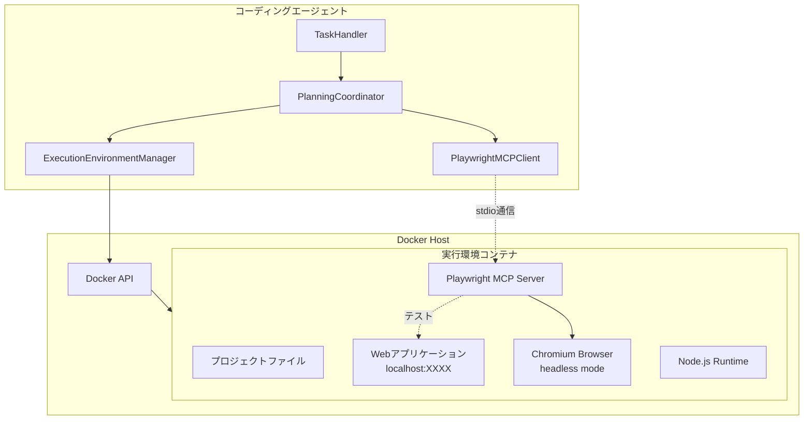
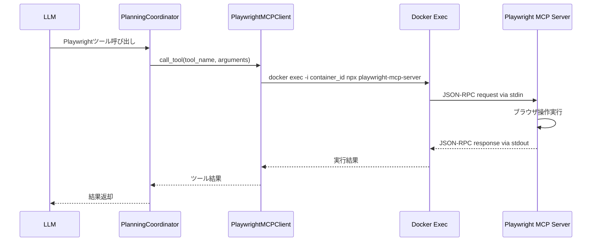
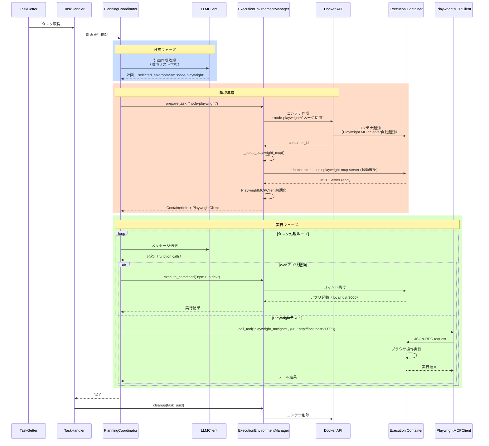

# Playwright統合仕様書

## 1. 概要

### 1.1 目的

本仕様書は、コーディングエージェントの実行環境にPlaywrightを統合し、LLMがWebアプリケーションの自動テストやブラウザ操作を実行できるようにする機能の詳細設計を定義します。

### 1.2 背景

現在の実行環境では、コマンド実行やファイル編集は可能ですが、Webアプリケーションの動作確認やUIテストを自動化する手段がありません。Playwright MCP Serverを統合することで、以下のような作業をLLMが実行できるようになります：

- Webアプリケーションの動作確認
- UIの自動テスト
- スクリーンショット撮影による視覚的検証
- フォーム入力やボタンクリックなどのユーザー操作シミュレーション
- ブラウザコンソールログの確認

### 1.3 要求事項

1. 実行環境Docker内にPlaywrightとブラウザ（Chromium）をインストールする
2. Playwright MCP Serverを実行環境Docker内でバックグラウンドプロセスとして起動する
3. ブラウザのサイズが大きいため、ブラウザ入り環境を計画時に選択可能にする
4. headlessモードでブラウザを実行する（GUIは不要）
5. LLMがPlaywright MCPツールを使用してブラウザ操作を実行できるようにする
6. 実行環境Docker内で起動したWebアプリケーションをlocalhostでテストできるようにする
7. 外部URLへのアクセスも可能にする

### 1.4 参照ドキュメント

- [複数言語対応実行環境仕様](MULTI_LANGUAGE_ENVIRONMENT_SPECIFICATION.md)
- [Command Executor MCP Server連携仕様](COMMAND_EXECUTOR_MCP_SPECIFICATION.md)
- [Text Editor MCP仕様](TEXT_EDITOR_MCP_SPECIFICATION.md)

---

## 2. システムアーキテクチャ

### 2.1 全体構成図



### 2.2 主要コンポーネント

#### 2.2.1 Playwright対応実行環境イメージ

各言語環境に対して、Playwrightとブラウザを含むバリアントイメージを提供します。

**イメージ命名規則:**
- 基本イメージ: `coding-agent-executor-{language}:latest`
- Playwrightバリアント: `coding-agent-executor-{language}-playwright:latest`

**例:**
- `coding-agent-executor-python-playwright:latest`
- `coding-agent-executor-node-playwright:latest`

#### 2.2.2 Playwright MCP Server

実行環境Docker内でバックグラウンドプロセスとして起動し、stdio経由でLLMと通信します。

**起動方法:**
- コンテナENTRYPOINTで`playwright-mcp-server`をバックグラウンド起動
- プロセス管理用のスクリプトを使用してサーバーの起動を保証

#### 2.2.3 ExecutionEnvironmentManager（拡張）

Playwright環境の起動とMCP Serverとの通信を管理します。

**追加機能:**
- Playwright対応環境の検出と起動
- Playwright MCP Serverプロセスの管理
- stdio通信の確立

---

## 3. Docker環境設計

### 3.1 Playwright対応イメージの構成

#### 3.1.1 追加インストールパッケージ

すべてのPlaywrightバリアントイメージに以下を追加インストールします：

**システムパッケージ:**
```dockerfile
# Chromiumとその依存ライブラリ
RUN apt-get update && apt-get install -y --no-install-recommends \
    # Chromium依存ライブラリ
    libnss3 \
    libnspr4 \
    libatk1.0-0 \
    libatk-bridge2.0-0 \
    libcups2 \
    libdrm2 \
    libdbus-1-3 \
    libxkbcommon0 \
    libxcomposite1 \
    libxdamage1 \
    libxfixes3 \
    libxrandr2 \
    libgbm1 \
    libpango-1.0-0 \
    libcairo2 \
    libasound2 \
    libatspi2.0-0 \
    # フォント
    fonts-liberation \
    fonts-noto-color-emoji \
    # その他
    xvfb \
    && rm -rf /var/lib/apt/lists/*
```

**Playwright関連:**
```dockerfile
# Playwright本体とブラウザのインストール
RUN npm install -g playwright@1.49.0 && \
    npx playwright install chromium --with-deps
```

**Playwright MCP Server:**
```dockerfile
# Playwright MCP Serverのインストール
RUN npm install -g @executeautomation/playwright-mcp-server
```

#### 3.1.2 ディレクトリ構造

```
/workspace/
├── project/           # プロジェクトファイル
└── .playwright/       # Playwrightデータディレクトリ
```

### 3.2 Dockerfileディレクトリ構成

```
docker/
├── executor-python/
│   └── Dockerfile                    # 通常版
├── executor-python-playwright/
│   └── Dockerfile                    # Playwright版
├── executor-node/
│   └── Dockerfile                    # 通常版
├── executor-node-playwright/
│   └── Dockerfile                    # Playwright版
├── executor-miniforge/
│   └── Dockerfile                    # 通常版
├── executor-miniforge-playwright/
│   └── Dockerfile                    # Playwright版
├── executor-java/
│   └── Dockerfile                    # 通常版
├── executor-java-playwright/
│   └── Dockerfile                    # Playwright版
├── executor-go/
│   └── Dockerfile                    # 通常版
└── executor-go-playwright/
    └── Dockerfile                    # Playwright版
```

---

## 4. ネットワーク構成設計

### 4.1 ネットワーク要件

#### 4.1.1 同一コンテナ内通信

実行環境Docker内で起動したWebアプリケーションに対してPlaywrightでアクセスするケース。

**アクセス方法:**
- `http://localhost:{port}`でアクセス可能
- 同一コンテナ内のため、追加のネットワーク設定は不要

**ユースケース:**
```
1. LLMがWebアプリケーションを起動（例: npm run dev）
2. アプリケーションがlocalhost:3000で起動
3. LLMがPlaywrightで http://localhost:3000 にアクセス
4. UIテストやスクリーンショット撮影を実行
```

#### 4.1.2 外部URL通信

外部のWebサイトや公開されたステージング環境にアクセスするケース。

**アクセス方法:**
- 実行環境DockerはDocker Hostのネットワークを経由してインターネットにアクセス可能
- `coding-agent-network`に接続済みのため、外部通信が可能

**ユースケース:**
```
1. LLMが公開URLにアクセス（例: https://example.com）
2. Playwrightでページを開く
3. スクリーンショット撮影や要素検証を実行
```

### 4.2 セキュリティ考慮事項

#### 4.2.1 外部アクセス制限

config.yamlの既存設定を活用：

```yaml
command_executor:
  docker:
    network:
      external_access: true
      whitelist_mode: false
      allowed_domains: []
```

- `external_access: true`: 外部ネットワークへのアクセスを許可
- `whitelist_mode: true`に設定すると、`allowed_domains`に記載されたドメインのみアクセス可能

#### 4.2.2 リソース制限

既存のリソース制限設定をPlaywright環境にも適用：

```yaml
command_executor:
  docker:
    resources:
      cpu_limit: 2
      memory_limit: "4g"  # Playwright使用時は最低4GB推奨
      disk_limit: "10g"
```

---

## 5. MCP統合設計

### 5.1 動的なMCP追加

**重要**: Playwright MCP Serverは、計画フェーズでPlaywright対応環境が選択された場合にのみ、実行フェーズでLLMのfunction callingとシステムプロンプトに追加されます。

**動作フロー:**
1. 計画フェーズでLLMが環境を選択（例: `node-playwright`）
2. 選択された環境名に`-playwright`が含まれるかをチェック
3. Playwright環境の場合のみ、以下を実行：
   - Playwright MCP Clientを初期化
   - LLMのfunction calling定義にPlaywrightツールを追加
   - システムプロンプトにPlaywright機能の説明を追加
4. 通常環境の場合は、Playwright関連の機能は一切追加されない

この設計により、不要な環境でPlaywrightツールが表示されることを防ぎ、LLMの混乱を避けます。

### 5.2 Playwright MCP Server通信方式

#### 5.2.1 stdio通信の実装

実行環境Docker内で起動したPlaywright MCP Serverとstdio（標準入出力）で通信します。

**通信フロー:**


#### 5.2.2 通信プロトコル

Playwright MCP ServerはJSON-RPC 2.0プロトコルを使用します。

**リクエスト例:**
```json
{
  "jsonrpc": "2.0",
  "id": 1,
  "method": "tools/call",
  "params": {
    "name": "playwright_navigate",
    "arguments": {
      "url": "http://localhost:3000"
    }
  }
}
```

**レスポンス例:**
```json
{
  "jsonrpc": "2.0",
  "id": 1,
  "result": {
    "content": [
      {
        "type": "text",
        "text": "Navigated to http://localhost:3000"
      }
    ]
  }
}
```

### 5.3 Playwright MCPツール一覧

Playwright MCP Serverが提供する主要ツール（@executeautomation/playwright-mcp-server）:

| ツール名 | 説明 | 主要パラメータ |
|---------|------|---------------|
| playwright_navigate | URLに移動 | url |
| playwright_screenshot | スクリーンショット撮影 | name, width, height |
| playwright_click | 要素をクリック | selector |
| playwright_fill | フォームに入力 | selector, value |
| playwright_select | セレクトボックスから選択 | selector, value |
| playwright_hover | 要素にホバー | selector |
| playwright_evaluate | JavaScriptを実行 | script |
| playwright_get_content | ページのHTMLを取得 | - |
| playwright_get_console_logs | コンソールログを取得 | - |

### 5.4 MCPクライアント実装

#### 5.4.1 PlaywrightMCPClient クラス

既存のMCPクライアント（TextEditorMCPClient等）と同様の構造で実装します。

**主要メソッド:**
- `__init__(container_id: str, docker_client)`: 初期化
- `call_tool(tool_name: str, arguments: dict) -> dict`: ツール呼び出し
- `_send_json_rpc(method: str, params: dict) -> dict`: JSON-RPC通信
- `list_tools() -> list`: 利用可能なツールリストを取得

#### 5.4.2 ExecutionEnvironmentManagerとの連携

ExecutionEnvironmentManagerにPlaywright MCP Clientのインスタンス管理機能を追加します。

**追加メソッド:**
- `get_playwright_client() -> PlaywrightMCPClient | None`: Playwright MCP Clientを取得
- `_setup_playwright_mcp() -> bool`: Playwright MCP Serverの起動確認とクライアント初期化
- `is_playwright_environment(env_name: str) -> bool`: 環境名がPlaywright対応かをチェック

**動作:**
1. `prepare()`メソッドで環境名をチェック
2. Playwright環境の場合のみ`_setup_playwright_mcp()`を実行
3. Playwright MCP Clientを初期化してコンテナ情報に保持
4. PlanningCoordinatorはコンテナ情報からPlaywright対応状況を判断

### 5.5 config.yamlへの設定追加

```yaml
# Playwright MCP Server連携設定
playwright_mcp:
  # 機能の有効/無効（デフォルト: false）
  # 環境変数 PLAYWRIGHT_MCP_ENABLED で上書き可能
  enabled: true
  
  # MCP Server設定
  mcp_server:
    # サーバー名
    name: "playwright"
    # コマンド（コンテナ内で実行）
    command:
      - "npx"
      - "@executeautomation/playwright-mcp-server"
    # サーバー起動待機時間（秒）
    startup_wait_seconds: 5
  
  # Playwright設定
  playwright:
    # デフォルトブラウザ
    browser: "chromium"  # chromium, firefox, webkit
    # headlessモード
    headless: true
    # デフォルトビューポートサイズ
    viewport:
      width: 1280
      height: 720
    # スクリーンショット保存先
    screenshot_dir: "/workspace/project/screenshots"
    # タイムアウト設定（ミリ秒）
    timeout: 30000
```

---

## 6. 計画フェーズでの環境選択

### 6.1 環境リストの拡張

現在の環境リストにPlaywrightバリアントを追加します。

#### 6.1.1 利用可能環境の定義

```python
# handlers/execution_environment_manager.py

DEFAULT_ENVIRONMENTS: dict[str, str] = {
    # 通常版
    "python": "coding-agent-executor-python:latest",
    "miniforge": "coding-agent-executor-miniforge:latest",
    "node": "coding-agent-executor-node:latest",
    "java": "coding-agent-executor-java:latest",
    "go": "coding-agent-executor-go:latest",
    
    # Playwrightバリアント
    "python-playwright": "coding-agent-executor-python-playwright:latest",
    "node-playwright": "coding-agent-executor-node-playwright:latest",
    "miniforge-playwright": "coding-agent-executor-miniforge-playwright:latest",
    "java-playwright": "coding-agent-executor-java-playwright:latest",
    "go-playwright": "coding-agent-executor-go-playwright:latest",
}
```

#### 6.1.2 config.yamlでの環境定義

```yaml
command_executor:
  environments:
    # 通常版
    python: "coding-agent-executor-python:latest"
    miniforge: "coding-agent-executor-miniforge:latest"
    node: "coding-agent-executor-node:latest"
    java: "coding-agent-executor-java:latest"
    go: "coding-agent-executor-go:latest"
    
    # Playwrightバリアント
    python-playwright: "coding-agent-executor-python-playwright:latest"
    node-playwright: "coding-agent-executor-node-playwright:latest"
    miniforge-playwright: "coding-agent-executor-miniforge-playwright:latest"
    java-playwright: "coding-agent-executor-java-playwright:latest"
    go-playwright: "coding-agent-executor-go-playwright:latest"
  
  default_environment: "python"
```

### 6.2 計画プロンプトへの追加情報

#### 6.2.1 環境選択ガイド

システムプロンプト（planning段階）に以下の情報を追加：

```markdown
## Execution Environment Selection

You must select an appropriate execution environment for this task. The following environments are available:

### Standard Environments (without Playwright)

| Environment | Image | Recommended For |
|------------|-------|-----------------|
| python | coding-agent-executor-python:latest | Pure Python projects, Django/Flask |
| miniforge | coding-agent-executor-miniforge:latest | Data science, conda environments |
| node | coding-agent-executor-node:latest | JavaScript/TypeScript, React/Vue/Angular |
| java | coding-agent-executor-java:latest | Java/Kotlin, Spring Boot |
| go | coding-agent-executor-go:latest | Go projects, CLI tools |

### Playwright-enabled Environments (with Browser Testing)

| Environment | Image | Recommended For |
|------------|-------|-----------------|
| python-playwright | coding-agent-executor-python-playwright:latest | Python web apps requiring UI testing |
| node-playwright | coding-agent-executor-node-playwright:latest | JavaScript/TypeScript web apps requiring UI testing |
| miniforge-playwright | coding-agent-executor-miniforge-playwright:latest | Data science web dashboards requiring UI testing |
| java-playwright | coding-agent-executor-java-playwright:latest | Java/Kotlin web apps requiring UI testing |
| go-playwright | coding-agent-executor-go-playwright:latest | Go web apps requiring UI testing |

**When to use Playwright-enabled environments:**
- The task requires browser-based UI testing
- Need to verify web application rendering
- Need to capture screenshots for visual verification
- Need to simulate user interactions (clicks, form inputs, etc.)
- Need to test web applications running on localhost

**Important notes:**
- Playwright environments are larger (~300MB more) and take longer to start
- Only use Playwright environments when browser testing is actually needed
- All Playwright environments run Chromium in headless mode
```

### 6.3 選択ロジック

#### 6.3.1 環境選択の判断基準

LLMが以下の条件でPlaywright環境を選択すべきか判断します：

**Playwright環境を選択すべきケース:**
1. タスク説明に「UIテスト」「ブラウザテスト」「スクリーンショット」などのキーワードが含まれる
2. Webアプリケーションの動作確認が必要
3. E2Eテストの実装や実行が必要
4. ビジュアルリグレッションテストが必要

**通常環境で十分なケース:**
1. バックエンドAPIのみの開発
2. CLIツールの開発
3. データ処理スクリプトの開発
4. ユニットテストのみ実行

#### 6.3.2 計画応答での環境指定

```json
{
  "phase": "planning",
  "selected_environment": {
    "name": "node-playwright",
    "reasoning": "タスクはReactアプリケーションのUIテストを含むため、Node.js環境にPlaywrightを含むnode-playwright環境を選択しました。ブラウザでのレンダリング確認とスクリーンショット撮影が必要です。"
  }
}
```

---

## 7. システムプロンプト拡張

### 7.1 Command Executor用プロンプトの拡張

`system_prompt_command_executor.txt`に以下を追加します。

#### 7.1.1 Playwright機能の説明

```markdown
## Playwright Browser Testing (Available in Playwright-enabled environments only)

If your selected execution environment includes "playwright" in its name (e.g., python-playwright, node-playwright), you have access to browser automation tools through the `playwright` MCP server.

**Important:** Playwright tools are only available when you selected a Playwright-enabled environment during planning. If you need browser testing but selected a standard environment, you'll need to create a new task with the correct environment.

### Available Playwright Tools

Use tool name prefix `playwright_` when calling Playwright tools:

- `playwright_navigate`: Navigate to a URL
- `playwright_screenshot`: Take a screenshot of the current page
- `playwright_click`: Click an element
- `playwright_fill`: Fill a form input
- `playwright_select`: Select from a dropdown
- `playwright_hover`: Hover over an element
- `playwright_evaluate`: Execute JavaScript in the page context
- `playwright_get_content`: Get the HTML content of the page
- `playwright_get_console_logs`: Get browser console logs

### Testing Local Web Applications

When testing web applications running in the execution environment:

1. Start your web application using command-executor (e.g., `npm run dev`, `python manage.py runserver`)
2. Note the port number the application is running on (e.g., 3000, 8000)
3. Use Playwright to navigate to `http://localhost:{port}`
4. Perform your tests (clicks, screenshots, verifications)

**Example workflow:**
```
1. Execute: npm run dev (starts app on localhost:3000)
2. Wait a few seconds for the app to start
3. Navigate: playwright_navigate to http://localhost:3000
4. Take screenshot: playwright_screenshot
5. Perform tests: playwright_click, playwright_fill, etc.
```

### Testing External URLs

You can also test external URLs or staging environments:

```
playwright_navigate to https://example.com
```

### Screenshot Management

Screenshots are saved to `/workspace/project/screenshots/` with timestamps.
After taking screenshots, you can:
- View them using command-executor file operations
- Include them in test reports
- Compare them for visual regression testing
```

### 7.2 Planning用プロンプトの拡張

`system_prompt_planning.txt`に環境選択ガイドを追加（6.2.1で記載した内容）。

---

## 8. 処理シーケンス

### 8.1 Playwright環境での処理フロー



### 8.2 主要な処理ステップ

#### 8.2.1 環境準備（prepare）

1. LLMが計画フェーズでPlaywright環境（例: `node-playwright`）を選択
2. ExecutionEnvironmentManagerが対応するイメージでコンテナを作成
3. コンテナ起動時にENTRYPOINTスクリプトがPlaywright MCP Serverを自動起動
4. ExecutionEnvironmentManagerがPlaywright MCP Serverの起動を確認
5. PlaywrightMCPClientを初期化し、準備完了

#### 8.2.2 Webアプリケーション起動

1. LLMがコマンド実行でWebアプリケーションを起動（例: `npm run dev`）
2. アプリケーションがlocalhost上の特定ポートで起動
3. LLMが起動ログからポート番号を確認

#### 8.2.3 ブラウザテスト実行

1. LLMがPlaywright navigateツールでlocalhostにアクセス
2. Playwright MCP Serverがブラウザを起動してページを開く
3. LLMが必要に応じてスクリーンショット撮影や要素操作を実行
4. 結果を確認して次のアクションを決定

---

## 9. エラーハンドリング

### 9.1 Playwright MCP Server起動失敗

**発生条件:**
- Playwright MCP Serverのインストールが不完全
- 起動スクリプトのエラー
- Node.jsの問題

**対応:**
1. エラーログを記録
2. PlaywrightMCPClientの初期化をスキップ
3. LLMにPlaywrightツールが利用不可であることを通知
4. コマンド実行のみで処理を継続

### 9.2 ブラウザ起動失敗

**発生条件:**
- Chromiumのインストールが不完全
- 依存ライブラリの不足
- メモリ不足

**対応:**
1. Playwright MCP Serverがエラーを返す
2. LLMにエラー内容を通知
3. 代替手段（curlでのHTTP確認等）を試行
4. 必要に応じて依存ライブラリを追加インストール

### 9.3 タイムアウト

**発生条件:**
- ページ読み込みが遅い
- JavaScript実行に時間がかかる
- ネットワーク問題

**対応:**
1. config.yamlのtimeout設定を確認
2. LLMにタイムアウトエラーを通知
3. タイムアウト時間を延長して再試行
4. 軽量なページで動作確認

### 9.4 環境選択ミス

**発生条件:**
- LLMが通常環境を選択したが、後でPlaywrightが必要になった

**対応方法:**
1. **現在のタスク内では対応不可**: Playwrightツールは利用できない旨をLLMに通知
2. **代替手段の提案**: curlやwgetでHTMLを取得して内容確認
3. **新規タスク作成の提案**: Playwright環境で新しいタスクを作成するよう提案

---

## 10. Docker Compose設定

### 10.1 ビルドプロファイルの追加

`docker-compose.yml`にPlaywright環境のビルド定義を追加します。

```yaml
# Playwright対応実行環境イメージ
executor-python-playwright:
  profiles:
    - executor-build
  build:
    context: ./docker/executor-python-playwright
    dockerfile: Dockerfile
    args:
      BOT_NAME: ${BOT_NAME:-bot}
      BOT_EMAIL: ${BOT_EMAIL:-}
  image: coding-agent-executor-python-playwright:latest
  command: echo "Build only"

executor-node-playwright:
  profiles:
    - executor-build
  build:
    context: ./docker/executor-node-playwright
    dockerfile: Dockerfile
    args:
      BOT_NAME: ${BOT_NAME:-bot}
      BOT_EMAIL: ${BOT_EMAIL:-}
  image: coding-agent-executor-node-playwright:latest
  command: echo "Build only"

executor-miniforge-playwright:
  profiles:
    - executor-build
  build:
    context: ./docker/executor-miniforge-playwright
    dockerfile: Dockerfile
    args:
      BOT_NAME: ${BOT_NAME:-bot}
      BOT_EMAIL: ${BOT_EMAIL:-}
  image: coding-agent-executor-miniforge-playwright:latest
  command: echo "Build only"
```

### 10.2 ビルドコマンド

```bash
# すべての実行環境イメージをビルド（Playwrightを含む）
docker compose --profile executor-build build

# Playwright環境のみビルド
docker compose --profile executor-build build executor-python-playwright executor-node-playwright executor-miniforge-playwright

# 特定のイメージのみビルド
docker compose --profile executor-build build executor-node-playwright
```

---

## 11. セキュリティ考慮事項

### 11.1 ブラウザアクセス制限

#### 11.1.1 外部サイトアクセス制御

config.yamlの既存設定を活用：

```yaml
command_executor:
  docker:
    network:
      external_access: true
      whitelist_mode: true  # 許可リストモードを有効化
      allowed_domains:
        - "localhost"
        - "127.0.0.1"
        - "example.com"  # テスト対象ドメイン
```

#### 11.1.2 Playwright実行時の制限

Playwright MCP Server側でアクセス制限を実装（将来拡張）：
- URLパターンによるフィルタリング
- プライベートIPアドレスへのアクセス制限
- ファイルプロトコル（file://）の禁止

### 11.2 リソース制限

#### 11.2.1 ブラウザプロセスの制限

Chromiumプロセスのリソース制限：
- メモリ制限: コンテナ全体のメモリ制限内で動作
- CPU制限: Docker側のCPU制限が適用される
- プロセス数制限: 同時に1ブラウザインスタンスのみ起動

#### 11.2.2 タイムアウト設定

```yaml
playwright_mcp:
  playwright:
    timeout: 30000  # 30秒
```

長時間実行を防止し、リソースの無駄遣いを回避。

### 11.3 スクリーンショット管理

#### 11.3.1 保存先の制限

スクリーンショットは`/workspace/project/screenshots/`配下に保存：
- プロジェクトディレクトリ内に限定
- ファイル名にタイムスタンプを含めて衝突を防止

#### 11.3.2 サイズ制限

- 個別スクリーンショットの最大サイズ: 10MB
- スクリーンショット総数制限: 100枚
- 古いスクリーンショットの自動削除（オプション）

---

## 12. テストシナリオ

### 12.1 基本動作確認

#### 13.1.1 環境起動テスト

**手順:**
1. Playwright環境を選択する計画を作成
2. コンテナが正常に起動することを確認
3. Playwright MCP Serverが起動していることを確認

**期待結果:**
- コンテナが起動
- Playwright MCP Serverプロセスが実行中
- PlaywrightMCPClientが正常に初期化される

#### 13.1.2 localhost Webアプリテスト

**手順:**
1. Node-Playwright環境を起動
2. `npm run dev`でサンプルアプリを起動（localhost:3000）
3. `playwright_navigate`で`http://localhost:3000`にアクセス
4. `playwright_screenshot`でスクリーンショット撮影

**期待結果:**
- アプリが正常に起動
- Playwrightでページにアクセス可能
- スクリーンショットが保存される

#### 13.1.3 外部URLアクセステスト

**手順:**
1. Playwright環境を起動
2. `playwright_navigate`で`https://example.com`にアクセス
3. `playwright_get_content`でHTML取得

**期待結果:**
- 外部サイトにアクセス可能
- HTMLコンテンツが取得できる

### 13.2 エラーケーステスト

#### 13.2.1 存在しないURLへのアクセス

**手順:**
1. `playwright_navigate`で`http://localhost:9999`（起動していないポート）にアクセス

**期待結果:**
- タイムアウトエラーまたは接続エラーが返される
- エラーメッセージがLLMに返される

#### 13.2.2 通常環境でのPlaywrightツール呼び出し

**手順:**
1. 通常のPython環境を選択
2. Playwrightツールを呼び出し

**期待結果:**
- ツールが見つからないエラーが返される
- LLMに代替手段が提案される

---

## 13. URLアクセス設計の詳細

### 13.1 URL指定方針

#### 13.1.1 localhost Webアプリケーション

**推奨URL形式:**
- `http://localhost:{port}`
- `http://127.0.0.1:{port}`

**理由:**
- 同一コンテナ内で起動したアプリケーションに直接アクセス可能
- ネットワーク設定が不要でシンプル
- セキュリティリスクが低い

**プロンプトでの指示:**
```markdown
When testing web applications started in the execution environment, always use:
- http://localhost:{port} or
- http://127.0.0.1:{port}

Example:
1. Start app: npm run dev (listen on port 3000)
2. Test: playwright_navigate to http://localhost:3000
```

#### 13.1.2 外部公開URL

**推奨URL形式:**
- `https://example.com`
- `http://staging.example.com`

**用途:**
- 公開されたステージング環境のテスト
- 外部サービスのUIテスト
- 本番環境の軽量な動作確認

**セキュリティ注意:**
- ホワイトリストモードの使用を推奨
- プロダクション環境へのアクセスは慎重に

---

## 14. プロンプト設計詳細

### 14.1 Planning用プロンプトの追加内容

`system_prompt_planning.txt`に追加する環境選択ガイド（全文）：

```markdown
## Execution Environment Selection Guide

### When to Choose Playwright-enabled Environments

Select a Playwright-enabled environment (python-playwright, node-playwright, miniforge-playwright, java-playwright, go-playwright) when the task requires:

1. **Browser-based UI Testing**
   - Automated testing of web application user interfaces
   - Verification of page rendering and visual elements
   - Testing user interactions (clicks, form submissions, navigation)

2. **Screenshot Capture**
   - Taking screenshots for visual verification
   - Creating documentation with UI screenshots
   - Visual regression testing

3. **Web Application Behavior Testing**
   - Testing JavaScript functionality in a real browser
   - Verifying dynamic content loading
   - Testing responsive design at different viewport sizes

4. **Console Log Analysis**
   - Capturing browser console errors
   - Debugging client-side JavaScript issues
   - Monitoring network requests in the browser

### When NOT to Choose Playwright-enabled Environments

Use standard environments when:

1. **No UI Testing Required**
   - Backend API development and testing
   - CLI tool development
   - Data processing scripts
   - Unit testing only

2. **Performance Considerations**
   - Playwright images are ~300MB larger
   - Longer container startup time
   - Higher memory usage

### Environment Selection Best Practices

1. **Analyze Task Requirements**: Carefully read the issue description to identify if browser testing is needed
2. **Be Conservative**: Only select Playwright environments when truly necessary
3. **Consider Alternatives**: Some tasks can use curl/wget for HTTP testing instead of full browser automation
4. **Future-proof**: If the task might evolve to need UI testing, consider Playwright environment from the start

### Example Selection Reasoning

**Good Reasoning (Select Playwright):**
"タスクはReactアプリケーションのログイン機能のE2Eテストを含むため、node-playwright環境を選択します。ブラウザでフォーム入力とナビゲーションをテストする必要があります。"

**Good Reasoning (Don't Select Playwright):**
"タスクはREST APIのエンドポイント追加のため、標準python環境で十分です。pytestでのユニットテストとcurlでのAPIテストのみ必要です。"

**Poor Reasoning:**
"Webプロジェクトなので念のためPlaywright環境を選択します。" ❌
→ 具体的な必要性がない場合は標準環境を選択すべき
```

### 14.2 Command Executor用プロンプトの追加内容

`system_prompt_command_executor.txt`に追加するPlaywright使用ガイド（全文）：

```markdown
## Playwright Browser Automation

### Prerequisites

Playwright tools are **only available** in Playwright-enabled environments:
- python-playwright
- node-playwright  
- miniforge-playwright

If you selected a standard environment during planning, Playwright tools will not be available. You would need to create a new task with a Playwright environment.

### Available Playwright Tools

| Tool | Purpose | Key Parameters |
|------|---------|----------------|
| playwright_navigate | Navigate to URL | url |
| playwright_screenshot | Capture screenshot | name, width, height |
| playwright_click | Click element | selector |
| playwright_fill | Fill form input | selector, value |
| playwright_select | Select dropdown option | selector, value |
| playwright_hover | Hover over element | selector |
| playwright_evaluate | Execute JavaScript | script |
| playwright_get_content | Get page HTML | - |
| playwright_get_console_logs | Get console logs | - |

### Common Workflows

#### Testing a Local Web Application

```
Step 1: Start the application
  tool: command-executor_execute_command
  command: "npm run dev"
  
Step 2: Wait for startup (observe output for port number)
  Example output: "Local: http://localhost:5173/"
  
Step 3: Navigate to the application  
  tool: playwright_navigate
  arguments: {"url": "http://localhost:5173"}
  
Step 4: Take screenshot to verify rendering
  tool: playwright_screenshot
  arguments: {"name": "homepage"}
  
Step 5: Interact with UI elements
  tool: playwright_click
  arguments: {"selector": "button#submit"}
```

#### Testing Form Submission

```
Step 1: Navigate to page
  playwright_navigate: "http://localhost:3000/login"
  
Step 2: Fill username
  playwright_fill: {"selector": "input[name='username']", "value": "testuser"}
  
Step 3: Fill password
  playwright_fill: {"selector": "input[name='password']", "value": "testpass"}
  
Step 4: Click submit
  playwright_click: {"selector": "button[type='submit']"}
  
Step 5: Verify redirect or success message
  playwright_get_content or playwright_screenshot
```

#### Capturing Visual Evidence

```
# Take screenshot of specific viewport size
playwright_screenshot: {
  "name": "desktop-view",
  "width": 1920,
  "height": 1080
}

playwright_screenshot: {
  "name": "mobile-view", 
  "width": 375,
  "height": 667
}
```

### Best Practices

1. **Wait for Application Startup**
   - After starting a dev server, wait 5-10 seconds
   - Look for "ready" or "listening" messages in output
   - Verify the port number from the startup logs

2. **Use Specific Selectors**
   - Prefer ID selectors: `#submit-button`
   - Use data attributes: `[data-testid="login-form"]`
   - Avoid fragile selectors that might change

3. **Handle Errors Gracefully**
   - If navigation fails, check if app is running
   - If selector not found, take screenshot to debug
   - Check console logs for JavaScript errors

4. **Screenshot Strategy**
   - Take screenshots at key points for documentation
   - Use descriptive names with timestamps
   - Capture both success and error states

5. **Performance Considerations**
   - Playwright operations have a 30-second timeout by default
   - Complex JavaScript may take time to load
   - Wait for network idle before taking screenshots if needed

### Troubleshooting

**Problem:** "Cannot navigate to URL"
- **Solution:** Verify the web app is running, check port number

**Problem:** "Selector not found"
- **Solution:** Take screenshot to see actual page, inspect HTML with get_content

**Problem:** "Timeout waiting for element"
- **Solution:** Check if page loaded correctly, increase wait time if needed

**Problem:** "Playwright tools not available"
- **Solution:** You're in a standard environment, create new task with Playwright environment

### Integration with Other Tools

Playwright works alongside other tools:

- **command-executor**: Start/stop web servers, install dependencies
- **text-editor**: Modify test files, update configurations
- **Git operations**: Commit test results, screenshots

Example combined workflow:
1. Edit test file with text-editor
2. Install dependencies with command-executor
3. Run dev server with command-executor
4. Execute tests with playwright tools
5. Take screenshots of results
6. Commit changes with Git operations
```

---

## 15. 関連ドキュメント

- [複数言語対応実行環境仕様](MULTI_LANGUAGE_ENVIRONMENT_SPECIFICATION.md)
- [Command Executor MCP Server連携仕様](COMMAND_EXECUTOR_MCP_SPECIFICATION.md)
- [Text Editor MCP仕様](TEXT_EDITOR_MCP_SPECIFICATION.md)
- [プランニングプロセス仕様](PLANNING_SPECIFICATION.md)

---

## 16. 補足事項

### 16.1 Playwright MCP Serverの選定理由

複数のPlaywright MCP Server実装が存在しますが、本仕様では`@executeautomation/playwright-mcp-server`を採用します。

**選定理由:**
1. **豊富なツールセット**: navigate, click, fill, screenshot等の基本ツールが充実
2. **アクティブなメンテナンス**: 定期的な更新とバグ修正
3. **ドキュメント**: 使用例とAPIドキュメントが整備されている
4. **MCP準拠**: Model Context Protocolの仕様に準拠した実装

**代替候補:**
- `@modelcontextprotocol/server-playwright`: 公式実装だが機能が限定的
- カスタム実装: プロジェクト固有の要件に応じて将来検討可能

### 16.2 ブラウザの選択

初期実装ではChromiumのみをサポートします。

**Chromiumを選んだ理由:**
1. **軽量**: FirefoxやWebKitと比較してインストールサイズが小さい
2. **互換性**: 多くのWebアプリケーションで動作確認されている
3. **Headlessサポート**: headlessモードが安定している
4. **普及率**: Chrome/Chromiumベースのブラウザが広く使用されている

**将来の拡張:**
- 必要に応じてFirefoxやWebKitのサポートを追加可能
- config.yamlで選択可能にする設計

### 16.3 既存機能との関係

#### 16.3.1 Text Editor MCPとの統合

Text Editor MCPとPlaywright MCPは独立して動作しますが、組み合わせて使用することで効果的なワークフローが実現できます。

**統合例:**
1. Text Editorでテストファイルを編集
2. Command Executorでテストサーバーを起動
3. Playwrightでブラウザテストを実行
4. 結果をText Editorでレポートファイルに記録

#### 16.3.2 Command Executorとの関係

Command ExecutorとPlaywrightは補完関係にあります。

- **Command Executor**: サーバー起動、依存関係インストール、ログ確認
- **Playwright**: ブラウザ操作、UI検証、スクリーンショット撮影

両方を組み合わせることで、完全なE2Eテストワークフローが実現できます。

### 16.4 パフォーマンス最適化

#### 16.4.1 イメージビルドの最適化

Dockerfileのレイヤーキャッシュを活用してビルド時間を短縮：

1. 変更頻度の低い依存関係（Chromium等）を先にインストール
2. アプリケーションコードを最後にコピー
3. マルチステージビルドの活用（将来検討）

#### 16.4.2 ブラウザ起動の高速化

- `--disable-dev-shm-usage`: 共有メモリの代わりに/tmpを使用
- `--disable-gpu`: GPU機能を無効化（headlessでは不要）
- `--no-sandbox`: サンドボックスを無効化（コンテナ内では安全）

これらのオプションは既にPlaywright内部で適用されているため、追加設定は不要です。

---

**文書バージョン:** 1.0  
**最終更新日:** 2025-12-07  
**ステータス:** 設計完了
