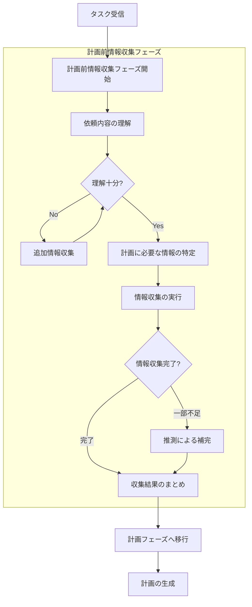
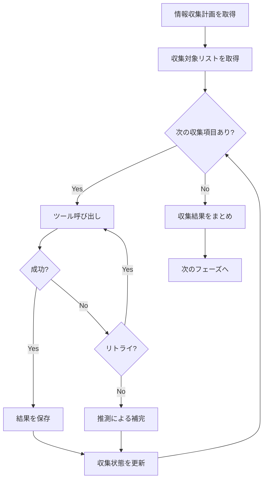
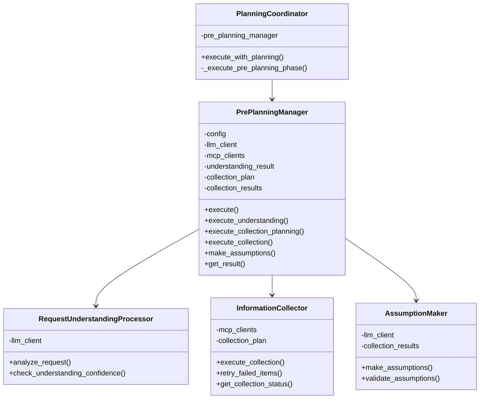

# 計画前情報収集フェーズ仕様書

## 1. 概要

### 1.1 目的

本仕様書は、プランニングモードにおいて計画を立てる前に依頼内容を理解し、必要な情報を収集するための「計画前情報収集フェーズ」を定義します。

### 1.2 背景

現在のプランニングモードでは、タスクを受け取るといきなり計画フェーズに入りますが、これには以下の課題があります：

- 依頼内容の理解が不十分なまま計画を立ててしまう可能性がある
- 計画に必要な情報（コードベースの構造、既存実装、依存関係など）が収集されないまま計画される
- 不完全な計画により、実行フェーズで頻繁な再計画が発生する

本仕様により、計画の質を向上させ、実行フェーズでの手戻りを削減します。

### 1.3 設計方針

1. **理解優先**: 計画を立てる前に、まず依頼内容を正確に理解する
2. **情報収集**: 計画に必要な情報を可能な限り収集する
3. **推測によるフォールバック**: 情報が収集できない場合は、合理的な推測で補う
4. **透明性**: 収集した情報と推測した内容を明確に区別して記録する

### 1.4 スコープ

本仕様は以下をカバーします：

- 計画前情報収集フェーズの全体設計
- 依頼内容の理解プロセス
- 情報収集プロセス
- 情報不足時の推測処理
- LLMとの連携方式
- 状態管理とエラーハンドリング

---

## 2. プロセス概要

### 2.1 全体フロー図



### 2.2 新しいフェーズ構成

計画前情報収集フェーズは、既存のプランニングプロセスの「目標の理解」フェーズを拡張し、以下の3つのサブフェーズで構成されます：

| サブフェーズ | 説明 | 必須/任意 |
|------------|------|----------|
| 依頼内容の理解 | タスクの意図と目標を正確に把握 | 必須 |
| 情報収集計画 | 計画に必要な情報を特定し収集方法を決定 | 必須 |
| 情報収集の実行 | 実際にツールを使用して情報を収集 | 任意（情報不要の場合スキップ） |

---

## 3. 依頼内容の理解サブフェーズ

### 3.1 概要

タスクの依頼内容を分析し、何が求められているかを正確に理解するサブフェーズです。

### 3.2 処理内容

#### 3.2.1 入力情報の分析

以下の情報を分析対象とします：

- Issue/MR/PRの本文（タイトル、説明文）
- 関連するコメント・ディスカッション
- ラベル情報
- 同一Issue/MRに対する過去の実行履歴

#### 3.2.2 理解すべき項目

LLMに以下の項目を理解させます：

| 項目 | 説明 | 例 |
|------|------|-----|
| タスクの種類 | 新機能開発、バグ修正、リファクタリング等 | 「新機能の追加」 |
| 主な目標 | 達成すべき最終的な状態 | 「ユーザー認証機能の実装」 |
| 期待される成果物 | 具体的な出力物 | 「認証APIの実装、テストコード、ドキュメント」 |
| 制約条件 | 技術的・時間的な制約 | 「既存のOAuth2ライブラリを使用」 |
| スコープ | タスクの範囲と境界 | 「バックエンドのみ、UIは対象外」 |

#### 3.2.3 曖昧な点の特定と推測

依頼内容に曖昧さや不明点がある場合、それを特定し、合理的に推測します：

- 技術的に複数の解釈が可能な要件 → 最も妥当な解釈を選択
- 省略されている前提条件 → 一般的な前提を適用
- 矛盾する要件 → 優先すべき要件を判断
- 不完全な仕様 → 既存のパターンから推測

### 3.3 LLMへの依頼プロンプト構成

依頼内容の理解を求めるプロンプトには以下を含めます：

- タスク情報（Issue/MR/PRの全文）
- コメント履歴
- 過去の実行履歴（存在する場合）
- 理解すべき項目のリスト
- 応答フォーマットの指定

### 3.4 LLM応答フォーマット

LLMは以下のJSON形式で応答します：

```json
{
  "phase": "request_understanding",
  "request_understanding": {
    "task_type": "タスクの種類を分類",
    "primary_goal": "主な目標の説明",
    "expected_deliverables": [
      "期待される成果物1",
      "期待される成果物2"
    ],
    "constraints": [
      "制約条件1",
      "制約条件2"
    ],
    "scope": {
      "in_scope": ["スコープ内の項目"],
      "out_of_scope": ["スコープ外の項目"]
    },
    "understanding_confidence": 0.85,
    "ambiguities": [
      {
        "item": "曖昧な点の説明",
        "possible_interpretations": ["解釈1", "解釈2"],
        "selected_interpretation": "選択した解釈",
        "reasoning": "選択理由"
      }
    ]
  }
}
```

### 3.5 理解の十分性判定

以下の条件を全て満たす場合、理解が十分と判定します：

1. `understanding_confidence` が設定された閾値（デフォルト0.7）以上
2. 主要な項目（task_type, primary_goal）が特定されている

確信度が閾値未満の場合でも、低確信度のまま計画フェーズに進みます。

---

## 4. 情報収集計画サブフェーズ

### 4.1 概要

計画を立てるために必要な情報を特定し、それらを収集するための計画を立てるサブフェーズです。

### 4.2 収集対象となる情報カテゴリ

#### 4.2.1 コードベース情報

| 情報項目 | 説明 | 収集方法 |
|---------|------|---------|
| プロジェクト構造 | ディレクトリ構成、主要ファイル | ファイル一覧取得ツール |
| 関連コード | 変更対象となるコード | コード検索、ファイル読み取り |
| 依存関係 | 使用ライブラリ、モジュール間依存 | 設定ファイル読み取り |
| テスト構造 | 既存テストの配置と形式 | テストファイル検索 |
| 設定ファイル | 各種設定の現状 | 設定ファイル読み取り |

#### 4.2.2 コンテキスト情報

| 情報項目 | 説明 | 収集方法 |
|---------|------|---------|
| 既存実装パターン | プロジェクトで使用されているパターン | 類似コード検索 |
| コーディング規約 | プロジェクトのスタイルガイド | 規約ファイル読み取り |
| APIドキュメント | 既存APIの仕様 | ドキュメント検索 |

#### 4.2.3 外部情報

| 情報項目 | 説明 | 収集方法 |
|---------|------|---------|
| 関連Issue/PR | 参照されている他のタスク | Issue/PR検索 |
| 外部ドキュメント | 外部ライブラリのドキュメント | Web検索 |

### 4.3 情報収集計画の生成

LLMに情報収集計画の生成を依頼します。以下の観点で計画を立てます：

1. **必要性の評価**: タスク完遂に本当に必要な情報か
2. **優先順位付け**: 重要度と収集コストのバランス
3. **収集方法の選択**: 最適なツールと手順
4. **代替手段の検討**: 収集できない場合の対処

### 4.4 LLM応答フォーマット

```json
{
  "phase": "information_planning",
  "information_needs": {
    "required_information": [
      {
        "id": "info_1",
        "category": "codebase|context|external",
        "description": "収集する情報の説明",
        "purpose": "この情報が必要な理由",
        "collection_method": {
          "tool": "使用するツール名",
          "parameters": {
            "param1": "value1"
          }
        },
        "fallback_strategy": "収集できない場合の対処",
        "can_assume": true,
        "default_assumption": "推測する場合のデフォルト値"
      }
    ],
    "collection_order": ["info_1", "info_2"],
    "skip_collection": false,
    "skip_reason": ""
  }
}
```

### 4.5 収集スキップの判断

以下の場合、情報収集をスキップすることができます：

- タスクが非常にシンプルで追加情報が不要な場合
- 過去の実行履歴から必要な情報が既に得られている場合
- タスクの内容が明確で推測の余地がない場合

---

## 5. 情報収集実行サブフェーズ

### 5.1 概要

情報収集計画に基づいて実際にツールを呼び出し、情報を収集するサブフェーズです。

### 5.2 収集実行フロー



### 5.3 ツール呼び出しの制御

#### 5.3.1 リトライ処理

ツール呼び出しが失敗した場合、最大2回までリトライを行います。リトライ後も失敗した場合は推測による補完に移行します。

### 5.4 収集結果の記録

各収集項目の結果を以下の形式で記録します：

```json
{
  "collection_results": [
    {
      "info_id": "info_1",
      "status": "collected|failed|assumed",
      "collected_data": {
        "summary": "収集データの要約",
        "details": "詳細データ"
      },
      "assumption_made": null,
      "tool_calls_used": 1,
      "timestamp": "2024-11-28T10:00:00Z"
    }
  ],
  "total_tool_calls": 5,
  "collection_success_rate": 0.9
}
```

---

## 6. 情報不足時の推測処理

### 6.1 概要

情報収集ができなかった項目について、合理的な推測で補完するプロセスです。

### 6.2 推測のトリガー条件

以下の場合に推測処理が実行されます：

1. ツール呼び出しがエラーで失敗した場合
2. 最大リトライ回数を超えた場合
3. 期待した情報が見つからなかった場合

### 6.3 推測の方法

#### 6.3.1 LLMによる推測

LLMに以下の情報を提供し、推測を依頼します：

- 収集しようとした情報の説明
- 失敗の理由
- 関連する収集済み情報
- 一般的なパターンやベストプラクティス

#### 6.3.2 推測の記録

推測した内容は明確に記録し、計画フェーズに引き継ぎます：

```json
{
  "assumption": {
    "info_id": "info_1",
    "assumed_value": "推測した値",
    "reasoning": "推測の根拠",
    "confidence": 0.6
  }
}
```

### 6.4 推測の制約

#### 6.4.1 推測可能な項目の制限

以下の項目は推測を許可しません：

- セキュリティに関わる設定
- 認証情報（APIキー、パスワード、トークン等）
- データベース接続文字列
- 環境固有の設定
- 個人を特定できる情報（PII）

#### 6.4.2 低確信度の推測の扱い

推測の確信度が閾値（デフォルト0.5）未満の場合：

- その情報なしで計画を立てる
- 情報ギャップとして記録する
- 計画フェーズで代替アプローチを検討する

---

## 7. 計画フェーズへの引き継ぎ

### 7.1 引き継ぎデータ構造

計画前情報収集フェーズの結果を以下の形式で計画フェーズに引き継ぎます：

```json
{
  "pre_planning_result": {
    "request_understanding": {
      "task_type": "feature_development",
      "primary_goal": "...",
      "understanding_confidence": 0.85
    },
    "collected_information": {
      "codebase": {
        "project_structure": "...",
        "related_files": ["..."]
      },
      "context": {
        "coding_style": "...",
        "existing_patterns": ["..."]
      }
    },
    "assumptions": [
      {
        "info_id": "info_1",
        "assumed_value": "...",
        "confidence": 0.7
      }
    ],
    "information_gaps": [
      {
        "description": "取得できなかった情報",
        "impact": "計画への影響"
      }
    ],
    "recommendations_for_planning": [
      "計画時の推奨事項1",
      "計画時の推奨事項2"
    ]
  }
}
```

### 7.2 計画プロンプトへの統合

計画フェーズのプロンプトに以下を追加します：

1. 理解した依頼内容のサマリー
2. 収集した情報の一覧
3. 推測した内容と確信度
4. 情報ギャップと影響

---

## 8. Issue/MRへの通知

### 8.1 通知タイミング

以下のタイミングでIssue/MRに通知します：

| タイミング | 通知内容 |
|-----------|---------|
| フェーズ開始時 | 「タスク内容を分析中...」 |
| 理解完了時 | 理解した内容のサマリー |
| 情報収集開始時 | 収集予定の情報一覧 |
| 推測発生時 | 推測した内容と理由（任意） |
| フェーズ完了時 | 収集結果のサマリーと計画開始の通知 |

### 8.2 通知フォーマット

#### 8.2.1 フェーズ開始通知

```markdown
## 🔍 タスク分析を開始します

タスク内容を理解し、計画に必要な情報を収集しています...

*開始時刻: [タイムスタンプ]*
```

#### 8.2.2 理解完了通知

```markdown
## 📋 タスク内容の理解が完了しました

**タスク種別**: [新機能開発/バグ修正/等]

**主な目標**:
[目標の説明]

**期待される成果物**:
- [成果物1]
- [成果物2]

**スコープ**:
- 対象: [スコープ内の項目]
- 対象外: [スコープ外の項目]

*理解の確信度: [XX]%*
```

#### 8.2.3 情報収集完了通知

```markdown
## 📚 情報収集が完了しました

**収集した情報**:
- ✅ [収集項目1]
- ✅ [収集項目2]
- ⚠️ [推測項目1] (推測)

**推測事項**:
以下の情報は収集できなかったため、推測で補完しました：
- [推測内容1]: [推測値] (理由: [根拠])

計画フェーズに移行します...

*完了時刻: [タイムスタンプ]*
```

---

## 9. 設定オプション

### 9.1 config.yamlへの追加

planningセクションにpre_planningサブセクションを追加します：

```yaml
planning:
  enabled: true
  pre_planning:
    enabled: true
    
    # 依頼内容の理解設定
    understanding:
      # 理解の確信度閾値
      confidence_threshold: 0.7
      
    # 情報収集設定
    collection:
      # 情報収集の有効/無効
      enabled: true
      # ツールあたりの最大リトライ回数
      max_retries_per_tool: 2
      
    # 推測設定
    assumption:
      # 推測の有効/無効
      enabled: true
      # 推測の確信度閾値（これ未満は情報なしで計画）
      confidence_threshold: 0.5
      
    # 通知設定
    notification:
      # 開始通知
      notify_on_start: true
      # 理解完了通知
      notify_on_understanding_complete: true
      # 収集完了通知
      notify_on_collection_complete: true
      # 推測発生通知
      notify_on_assumption: false
```

### 9.2 環境変数

環境変数でオーバーライド可能な設定：

| 環境変数 | 説明 | デフォルト |
|---------|------|----------|
| PRE_PLANNING_ENABLED | 計画前情報収集の有効/無効 | true |
| PRE_PLANNING_CONFIDENCE_THRESHOLD | 理解の確信度閾値 | 0.7 |

---

## 10. アーキテクチャ

### 10.1 クラス図



### 10.2 主要クラスの責務

#### 10.2.1 PrePlanningManager

計画前情報収集フェーズ全体を管理するマネージャークラスです。

**責務:**
- 3つのサブフェーズの制御と調整
- 各サブフェーズ間のデータ受け渡し
- 状態管理と進捗追跡
- Issue/MRへの通知

**主要メソッド:**
- **execute**: 計画前情報収集フェーズ全体を実行
- **execute_understanding**: 依頼内容の理解サブフェーズを実行
- **execute_collection_planning**: 情報収集計画サブフェーズを実行
- **execute_collection**: 情報収集実行サブフェーズを実行
- **make_assumptions**: 情報不足時の推測処理を実行
- **get_result**: 計画フェーズへの引き継ぎデータを取得

#### 10.2.2 RequestUnderstandingProcessor

依頼内容の理解処理を担当するプロセッサクラスです。

**責務:**
- タスク情報の分析
- LLMへの理解依頼
- 理解結果の検証

#### 10.2.3 InformationCollector

情報収集の実行を担当するコレクタークラスです。

**責務:**
- 収集計画に基づくツール呼び出し
- リトライ処理
- 収集結果の管理

#### 10.2.4 AssumptionMaker

推測処理を担当するクラスです。

**責務:**
- 収集失敗項目の推測
- 推測の根拠と確信度の記録
- 推測結果の検証

---

## 11. エラーハンドリング

### 11.1 理解フェーズのエラー

| エラー種別 | 対処 |
|-----------|------|
| LLM応答パースエラー | 再試行（最大3回）後、最小限の理解で継続 |
| 確信度閾値未達 | 低確信度で継続 |

### 11.2 情報収集フェーズのエラー

| エラー種別 | 対処 |
|-----------|------|
| ツール呼び出しエラー | リトライ後、推測で補完 |

### 11.3 推測フェーズのエラー

| エラー種別 | 対処 |
|-----------|------|
| 推測不可能 | 情報ギャップとして記録し、計画で対処 |
| 推測確信度が極端に低い | その情報なしで計画を立てる |

---

## 12. 一時停止・再開時の対応

### 12.1 状態の保存

計画前情報収集フェーズ中にタスクが一時停止された場合、以下の状態を保存します：

- 現在のサブフェーズ
- 依頼内容の理解結果
- 情報収集計画
- 収集済み情報
- 推測結果

### 12.2 再開時の処理

再開時は保存された状態から処理を継続します：

1. 保存された状態を復元
2. 中断されたサブフェーズから再開
3. 時間経過による状態の更新を検討（新規コメント等）

---

## 13. 関連ドキュメント

- [プランニングプロセス仕様書](PLANNING_SPECIFICATION.md)
- [再計画機能仕様書](REPLANNING_SPECIFICATION.md)
- [基本仕様](spec.md)
- [一時停止・再開機能仕様](PAUSE_RESUME_SPECIFICATION.md)

---

**文書バージョン:** 1.0  
**最終更新日:** 2024-11-28  
**ステータス:** 設計完了
