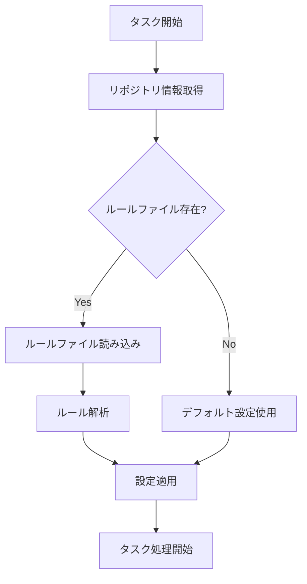
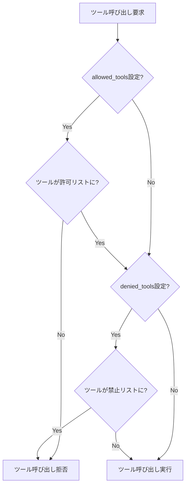

# プロジェクトエージェントルール仕様書

## 1. 概要

### 1.1 目的

プロジェクトごとの個別設定やルールを定義し、エージェントの動作をカスタマイズする機能を設計します。これにより、プロジェクト固有の要件に対応したエージェント動作が可能になります。

### 1.2 要求事項

- プロジェクトルートにルールファイルを配置できること
- ルールファイルによりシステムプロンプトを拡張できること
- ルールファイルにより使用可能なツールを制限できること
- ルールファイルにより操作対象ファイルを制限できること

---

## 2. ルールファイル

### 2.1 ファイル配置

プロジェクトルートに以下のいずれかのファイルを配置します：

- **.coding-agent-rules.md**: Markdown形式のルールファイル
- **.coding-agent-rules.yaml**: YAML形式のルールファイル
- **.github/AGENTS.md**: GitHub形式のエージェントルール（GitHub互換）

### 2.2 優先順位

複数のファイルが存在する場合の優先順位：

1. .coding-agent-rules.yaml
2. .coding-agent-rules.md
3. .github/AGENTS.md

---

## 3. ルールファイル形式

### 3.1 YAML形式

YAML形式のルールファイルでは以下の項目を設定できます：

#### system_prompt_extension

システムプロンプトに追加するテキストです。LLMへの追加指示を記述します。

#### allowed_tools

使用を許可するツールのリストです。指定しない場合はすべてのツールが使用可能です。

#### denied_tools

使用を禁止するツールのリストです。allowed_toolsより優先されます。

#### file_patterns

操作対象ファイルのパターンを指定します。

- **include**: 操作を許可するファイルパターン（glob形式）
- **exclude**: 操作を禁止するファイルパターン（glob形式）

### 3.2 Markdown形式

Markdown形式のルールファイルは、内容全体がシステムプロンプト拡張として扱われます。特定のセクション見出しを使用することで、追加の設定が可能です。

#### 設定セクション

- **Allowed Tools**: 許可ツールのリスト
- **Denied Tools**: 禁止ツールのリスト
- **File Patterns**: ファイルパターン設定

---

## 4. 処理フロー

### 4.1 ルールロードフロー

### 4.2 ツール制限の適用

---

## 5. システムプロンプト拡張

### 5.1 拡張方法

ルールファイルのsystem_prompt_extension（YAML）またはMarkdown本文がシステムプロンプトに追加されます。

### 5.2 追加位置

基本システムプロンプトの後、MCPツール説明の前に追加されます。

### 5.3 追加内容の例

- コーディング規約
- 使用言語の制限
- テスト要件
- ドキュメント要件

---

## 6. ツール制限

### 6.1 許可リスト（allowed_tools）

指定した場合、リストに含まれるツールのみが使用可能になります。

### 6.2 禁止リスト（denied_tools）

指定した場合、リストに含まれるツールの使用が禁止されます。allowed_toolsより優先されます。

### 6.3 ツール名の形式

ツール名は「MCPサーバー名/ツール名」形式で指定します。

---

## 7. ファイルパターン制限

### 7.1 includeパターン

操作を許可するファイルパターンをglob形式で指定します。

### 7.2 excludeパターン

操作を禁止するファイルパターンをglob形式で指定します。includeより優先されます。

### 7.3 制限の適用

ファイル操作ツール（create_or_update_file、push_files等）の実行時にパターンチェックを行います。

---

## 8. ProjectAgentRulesLoaderクラス

### 8.1 責務

- ルールファイルの検索と読み込み
- ルールの解析
- 設定の適用

### 8.2 主要メソッド

- **load_rules**: ルールファイルを読み込み、解析結果を返す
- **get_system_prompt_extension**: システムプロンプト拡張を取得
- **is_tool_allowed**: 指定ツールが許可されているかを判定
- **is_file_allowed**: 指定ファイルが操作可能かを判定

---

## 9. 設定オプション

### 9.1 config.yamlの設定項目

project_agent_rulesセクションで以下を設定します：

- **enabled**: プロジェクトルール機能の有効/無効（デフォルト: true）
- **rule_files**: 検索するルールファイル名のリスト
- **default_rules**: デフォルトルール（ルールファイルがない場合に使用）

---

## 10. エラーハンドリング

### 10.1 ルールファイル読み込みエラー

- **ファイル不存在**: デフォルト設定を使用
- **パースエラー**: ログ出力後、デフォルト設定を使用

### 10.2 ルール適用エラー

- **ツール制限違反**: ツール呼び出しを拒否し、LLMにエラーを通知
- **ファイルパターン違反**: ファイル操作を拒否し、LLMにエラーを通知

---

## 11. 関連ドキュメント

- [基本仕様](spec.md)
- [クラス設計](class_spec.md)

---

**文書バージョン:** 2.0  
**最終更新日:** 2024-11-28  
**ステータス:** 実装済み
