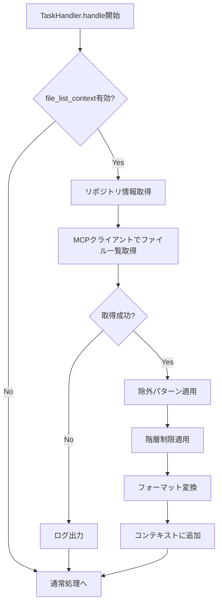
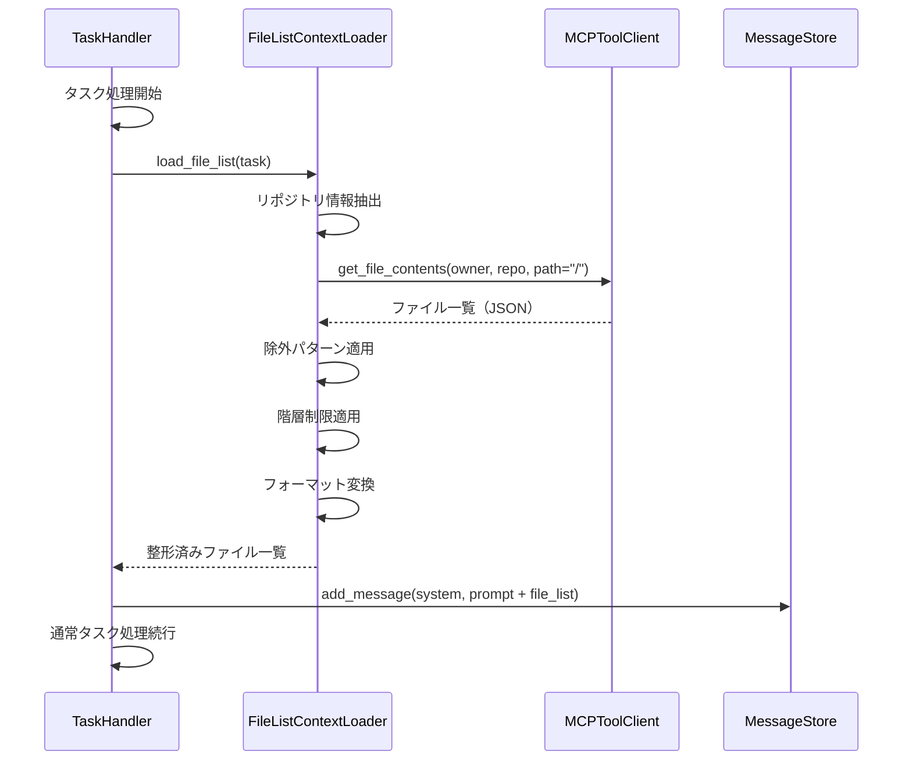

# プロジェクトファイル一覧の初期コンテキスト化仕様書

## 1. 概要

### 1.1 目的

IssueやMerge Request/Pull Requestの処理を行う際、対象プロジェクト（リポジトリ）のファイル一覧を初期コンテキストに含めることで、エージェントがプロジェクト構造を把握しやすくし、より適切な処理を実現します。

### 1.2 背景

現状、エージェントはタスクの内容（Issue/MR/PRの本文やコメント）のみを初期コンテキストとして受け取っています。プロジェクトの構造を知るためには、エージェントが自らファイル一覧を取得するツール呼び出しを行う必要があり、以下の問題があります：

- **処理ステップの増加**: ファイル構造把握のために追加のツール呼び出しが必要
- **トークン消費の増加**: ファイル一覧取得のためのリクエスト・レスポンスでトークンを消費
- **判断の遅延**: プロジェクト構造を把握してから適切な処理を開始するまでに時間がかかる

### 1.3 期待される効果

- **処理効率の向上**: 初期段階でプロジェクト構造を把握できるため、適切な処理をすぐに開始可能
- **コンテキスト品質の向上**: プロジェクトの全体像を持った状態で判断可能
- **ツール呼び出しの削減**: ファイル一覧取得のためのMCPツール呼び出しが不要

---

## 2. 要求事項

### 2.1 機能要件

- タスク処理開始時に、対象プロジェクトのファイル一覧を自動取得する
- 取得したファイル一覧を初期コンテキスト（システムプロンプトまたは最初のユーザーメッセージ）に含める
- ファイル一覧の取得深度（ディレクトリ階層）を設定可能にする
- 除外パターン（node_modules、.git等）を設定可能にする
- ファイル一覧のフォーマット（ツリー形式、リスト形式等）を設定可能にする
- ファイル一覧取得に失敗した場合でもタスク処理を継続可能にする

### 2.2 非機能要件

- **パフォーマンス**: ファイル一覧取得はタスク処理開始時のオーバーヘッドを最小限に抑える
- **トークン効率**: ファイル一覧はコンパクトに表現し、コンテキスト長の消費を最小化する
- **設定可能性**: プロジェクトや要件に応じて動作をカスタマイズ可能にする
- **堅牢性**: API制限やネットワークエラーでもタスク処理に影響を与えない

---

## 3. ファイル一覧取得処理

### 3.1 取得タイミング

ファイル一覧の取得は、TaskHandler.handle()メソッドの処理開始時、システムプロンプト送信前に実行します。

### 3.2 取得フロー図

### 3.3 取得処理の詳細

#### リポジトリ情報の取得

タスクオブジェクトから以下の情報を取得します：

- **owner**: リポジトリオーナー（組織名またはユーザー名）
- **repo**: リポジトリ名
- **default_branch**: デフォルトブランチ名（オプション、指定がなければmainまたはmasterを使用）

#### MCPクライアントによるファイル一覧取得

GitHub MCPサーバーまたはGitLab MCPサーバーのファイル一覧取得機能を使用します。

**GitHub MCPサーバーの場合:**
- get_file_contentsツールを使用し、ルートディレクトリ（path="/"）を指定
- 再帰的に取得するか、設定に応じて階層を制限

**GitLab MCPサーバーの場合:**
- mr_changesツールまたはrepository_treeツールを使用
- プロジェクトIDとパスを指定して取得

#### 除外パターンの適用

設定ファイルで定義された除外パターンに一致するファイル・ディレクトリを除外します。デフォルトの除外パターンは以下の通りです：

- .git/
- node_modules/
- __pycache__/
- .venv/
- venv/
- dist/
- build/
- *.pyc
- *.pyo
- .DS_Store

#### 階層制限の適用

設定で指定された最大深度までのファイル・ディレクトリのみを含めます。深度を超えるディレクトリは省略記号（...）で表示します。

---

## 4. コンテキストへの格納

### 4.1 格納位置

ファイル一覧は以下のいずれかの位置に格納します（設定で選択可能）：

- **システムプロンプト末尾**: 他のプロジェクト固有情報と共にシステムプロンプトに追加
- **最初のユーザーメッセージ前**: タスク内容の前にファイル一覧を含める

### 4.2 フォーマット

#### ツリー形式（デフォルト）

ディレクトリ構造を視覚的に表現する形式です。

出力例（実際のコードではなく概念的な説明）：

- プロジェクトルートからの相対パスを階層的に表示
- ディレクトリは末尾にスラッシュを付与
- インデントで階層を表現
- 深度制限を超えた場合は省略記号を表示

#### フラットリスト形式

全ファイルパスをリスト形式で列挙する形式です。

出力例（実際のコードではなく概念的な説明）：

- プロジェクトルートからの相対パスを1行1ファイルで表示
- ディレクトリパスも含める
- アルファベット順でソート

#### コンパクト形式

主要なファイル・ディレクトリのみを表示する形式です。

出力例（実際のコードではなく概念的な説明）：

- 設定ファイル、READMEなど重要なファイルを優先表示
- ディレクトリ構成の概要のみ表示
- 詳細ファイルは省略

### 4.3 ヘッダー・フッター

ファイル一覧の前後に識別用のヘッダーとフッターを付与します。

**ヘッダー内容:**
- セクション開始の識別子
- プロジェクト情報（オーナー/リポジトリ名）
- 取得日時

**フッター内容:**
- セクション終了の識別子
- ファイル数・ディレクトリ数の統計情報

---

## 5. 処理フロー詳細

### 5.1 シーケンス図

### 5.2 FileListContextLoaderクラス

#### 責務

- リポジトリのファイル一覧を取得
- 除外パターンの適用
- 階層制限の適用
- 指定フォーマットへの変換

#### 主要メソッド

- **load_file_list**: タスクオブジェクトを受け取り、整形済みファイル一覧文字列を返す
- **fetch_repository_tree**: MCPクライアントを使用してファイルツリーを取得
- **apply_exclusion_patterns**: 除外パターンを適用
- **apply_depth_limit**: 階層制限を適用
- **format_tree**: 指定形式に変換

---

## 6. 設定オプション

### 6.1 config.yamlへの追加

file_list_contextセクションで以下を設定します：

- **enabled**: ファイル一覧コンテキスト機能の有効/無効（デフォルト: true）
- **max_depth**: 取得する最大階層深度（デフォルト: 3）
- **format**: 出力フォーマット（tree/flat/compact、デフォルト: tree）
- **position**: 格納位置（system_prompt/user_message、デフォルト: system_prompt）
- **max_files**: 表示する最大ファイル数（デフォルト: 500）
- **exclude_patterns**: 除外パターンのリスト
- **include_file_sizes**: ファイルサイズを含めるか（デフォルト: false）
- **include_last_modified**: 最終更新日を含めるか（デフォルト: false）

### 6.2 デフォルト除外パターン

以下のパターンがデフォルトで除外されます：

- バージョン管理: .git/、.svn/、.hg/
- 依存関係: node_modules/、vendor/、packages/
- ビルド成果物: dist/、build/、target/、out/
- Python: __pycache__/、*.pyc、*.pyo、.venv/、venv/、.egg-info/
- IDE設定: .idea/、.vscode/（設定ファイル以外）、*.iml
- OS固有: .DS_Store、Thumbs.db
- ログ・一時: *.log、*.tmp、*.temp、.cache/

### 6.3 プロジェクト固有設定との連携

プロジェクトルールファイル（.coding-agent-rules.yaml）でファイル一覧設定を上書き可能にします。

設定可能な項目：
- exclude_patterns: プロジェクト固有の除外パターンを追加
- include_patterns: 特定のパターンのみを含める
- max_depth: プロジェクト固有の階層制限
- format: プロジェクト固有のフォーマット

---

## 7. エラーハンドリング

### 7.1 取得失敗時の動作

ファイル一覧の取得に失敗した場合：

1. エラー内容をログに記録
2. ファイル一覧なしでタスク処理を継続
3. エージェントには取得失敗を通知しない（通常通り処理を開始）

### 7.2 想定されるエラー

#### API制限エラー

- **原因**: GitHub/GitLab APIのレート制限に到達
- **対応**: ログ出力後、ファイル一覧なしで継続

#### 認証エラー

- **原因**: トークンの期限切れや権限不足
- **対応**: ログ出力後、ファイル一覧なしで継続

#### タイムアウト

- **原因**: 大規模リポジトリでの取得に時間がかかる
- **対応**: タイムアウト後、ファイル一覧なしで継続

#### リポジトリ不存在

- **原因**: リポジトリが削除された、またはプライベート化された
- **対応**: ログ出力後、ファイル一覧なしで継続

### 7.3 部分取得時の動作

ファイル一覧が部分的にしか取得できなかった場合：

1. 取得できた範囲のファイル一覧を使用
2. ヘッダーに「部分取得」であることを明記
3. 取得できなかった原因をログに記録

---

## 8. トークン効率の最適化

### 8.1 トークン消費の見積もり

ファイル一覧のトークン消費は以下の要因で決まります：

- ファイル・ディレクトリ数
- パスの平均長
- フォーマット形式

### 8.2 最適化戦略

#### 圧縮表現の使用

- 共通プレフィックスの省略
- 類似パターンのグループ化
- 省略記号による詳細省略

#### 優先度に基づくフィルタリング

重要度の高いファイル・ディレクトリを優先表示し、トークン制限に達した場合は低優先度を省略します。

**高優先度:**
- README.md、CONTRIBUTING.md
- package.json、pyproject.toml、pom.xml等のプロジェクト設定
- src/、lib/、app/等のメインソースディレクトリ
- tests/、spec/等のテストディレクトリ

**低優先度:**
- ドキュメントディレクトリ（docs/）の詳細
- 設定ファイルの詳細
- アセットディレクトリ（images/、assets/）の詳細

### 8.3 動的調整

コンテキスト長の設定に応じてファイル一覧の詳細度を動的に調整します：

- コンテキスト長が大きい場合: より詳細なファイル一覧を提供
- コンテキスト長が小さい場合: コンパクト形式に自動切り替え

---

## 9. 実装上の考慮事項

### 9.1 キャッシュ戦略

同一リポジトリに対する複数タスクでファイル一覧を再取得しないよう、キャッシュを検討します。

**キャッシュの粒度:**
- リポジトリ単位（owner/repo）
- ブランチ単位（オプション）

**キャッシュの有効期限:**
- 設定可能（デフォルト: 1時間）
- コミットイベント検知時に無効化（オプション）

### 9.2 大規模リポジトリ対応

ファイル数が非常に多いリポジトリでは：

- max_files設定により上限を設定
- 重要ディレクトリのみを詳細表示し、その他は概要のみ
- 取得タイムアウトを設定（デフォルト: 30秒）

### 9.3 プラットフォーム間の差異吸収

GitHub MCPサーバーとGitLab MCPサーバーでAPIレスポンス形式が異なるため、共通のファイル一覧形式に変換する処理を実装します。

---

## 10. 関連ドキュメント

- [基本仕様](spec.md)
- [クラス設計](class_spec.md)
- [コンテキストファイル化仕様](context_file_spec.md)
- [プロジェクトエージェントルール仕様](PROJECT_AGENT_RULES_SPECIFICATION.md)

---

**文書バージョン:** 1.0  
**最終更新日:** 2024-11-28  
**ステータス:** 設計中
