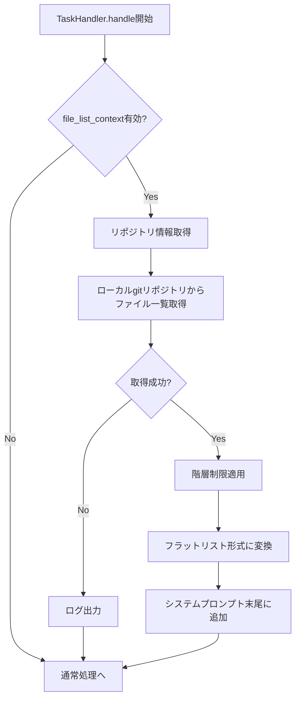
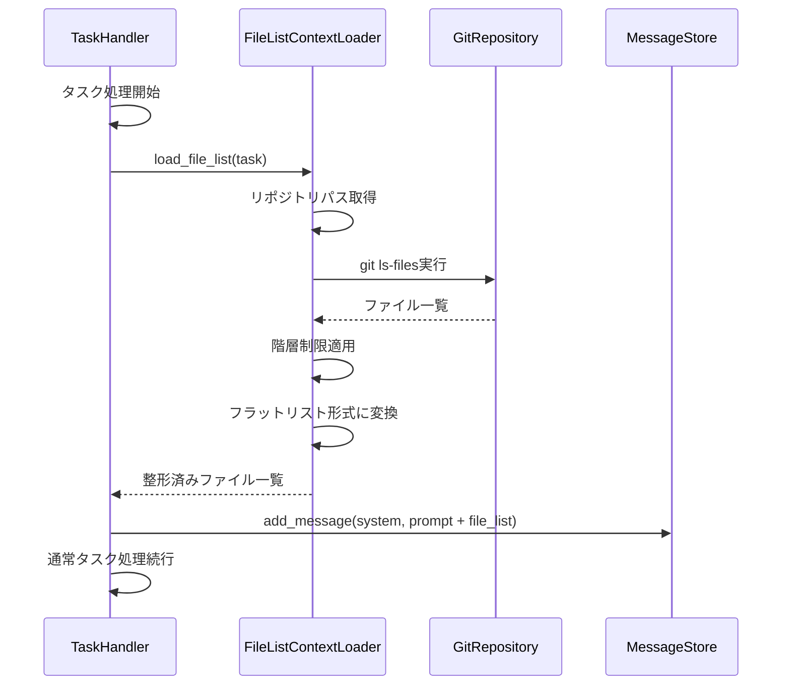

# プロジェクトファイル一覧の初期コンテキスト化仕様書

## 1. 概要

### 1.1 目的

IssueやMerge Request/Pull Requestの処理を行う際、対象プロジェクト（リポジトリ）のファイル一覧を初期コンテキストに含めることで、エージェントがプロジェクト構造を把握しやすくし、より適切な処理を実現します。

### 1.2 背景

現状、エージェントはタスクの内容（Issue/MR/PRの本文やコメント）のみを初期コンテキストとして受け取っています。プロジェクトの構造を知るためには、エージェントが自らファイル一覧を取得するツール呼び出しを行う必要があり、以下の問題があります：

- **処理ステップの増加**: ファイル構造把握のために追加のツール呼び出しが必要
- **トークン消費の増加**: ファイル一覧取得のためのリクエスト・レスポンスでトークンを消費
- **判断の遅延**: プロジェクト構造を把握してから適切な処理を開始するまでに時間がかかる

### 1.3 期待される効果

- **処理効率の向上**: 初期段階でプロジェクト構造を把握できるため、適切な処理をすぐに開始可能
- **コンテキスト品質の向上**: プロジェクトの全体像を持った状態で判断可能
- **ツール呼び出しの削減**: ファイル一覧取得のためのMCPツール呼び出しが不要

---

## 2. 要求事項

### 2.1 機能要件

- タスク処理開始時に、対象プロジェクトのファイル一覧を自動取得する
- 取得したファイル一覧をシステムプロンプト末尾に含める
- ファイル一覧の取得深度（ディレクトリ階層）を設定可能にする
- ファイル一覧取得に失敗した場合でもタスク処理を継続可能にする

### 2.2 非機能要件

- **パフォーマンス**: ファイル一覧取得はタスク処理開始時のオーバーヘッドを最小限に抑える
- **堅牢性**: API制限やネットワークエラーでもタスク処理に影響を与えない

---

## 3. ファイル一覧取得処理

### 3.1 取得タイミング

ファイル一覧の取得は、TaskHandler.handle()メソッドの処理開始時、システムプロンプト送信前に実行します。

### 3.2 取得フロー図

### 3.3 取得処理の詳細

#### リポジトリ情報の取得

タスクオブジェクトから以下の情報を取得します：

- **owner**: リポジトリオーナー（組織名またはユーザー名）
- **repo**: リポジトリ名
- **local_repo_path**: ローカルにクローンされたリポジトリのパス

#### ローカルgitリポジトリからのファイル一覧取得

gitリポジトリを直接参照してファイル一覧を取得します。gitが管理しているファイルのみが対象となるため、.gitignoreで除外されているファイルは自動的に除外されます。

取得方法：
- `git ls-files`コマンドを使用してgitが追跡しているファイル一覧を取得

#### 階層制限の適用

設定で指定された最大深度（max_depth）までのファイル・ディレクトリのみを含めます。max_depthが-1の場合は無制限とします。

---

## 4. コンテキストへの格納

### 4.1 格納位置

ファイル一覧はシステムプロンプト末尾に追加します。他のプロジェクト固有情報（プロジェクトエージェントルール等）と共にシステムプロンプトに含めます。

### 4.2 フォーマット

フラットリスト形式で出力します。

- プロジェクトルートからの相対パスを1行1ファイルで表示
- アルファベット順でソート
- ディレクトリは含めず、ファイルのみを列挙

### 4.3 ヘッダー・フッター

ファイル一覧の前後に識別用のヘッダーとフッターを付与します。

**ヘッダー内容:**
- セクション開始の識別子
- プロジェクト情報（オーナー/リポジトリ名）

**フッター内容:**
- セクション終了の識別子
- ファイル数の統計情報

---

## 5. 処理フロー詳細

### 5.1 シーケンス図

---

## 6. 詳細設計

### 6.1 実装ファイル構成

| ファイルパス | 説明 |
|-------------|------|
| handlers/file_list_context_loader.py | ファイル一覧取得・整形を担当するモジュール |
| handlers/task_handler.py | 既存ファイル。FileListContextLoaderの呼び出しを追加 |

### 6.2 FileListContextLoaderクラス

#### ファイルパス

handlers/file_list_context_loader.py

#### クラス定義

FileListContextLoaderクラスを新規作成します。

#### コンストラクタ

**__init__メソッド**

引数：
- config: dict型。設定情報を含む辞書

処理内容：
- 設定からfile_list_contextセクションを読み込み、インスタンス変数に保持
- enabled、max_depthの値を取得

#### メソッド一覧

**load_file_listメソッド**

引数：
- task: Task型。タスクオブジェクト
- repo_path: str型。ローカルリポジトリのパス

戻り値：
- str型。整形済みファイル一覧文字列。取得失敗時は空文字列

処理内容：
- 設定でenabledがFalseの場合は空文字列を返す
- _fetch_file_listメソッドを呼び出してファイル一覧を取得
- 取得に失敗した場合はログ出力して空文字列を返す
- _apply_depth_limitメソッドを呼び出して階層制限を適用
- _format_file_listメソッドを呼び出してフラットリスト形式に整形
- ヘッダーとフッターを付与して返す

**_fetch_file_listメソッド**

引数：
- repo_path: str型。ローカルリポジトリのパス

戻り値：
- list[str]型。ファイルパスのリスト

処理内容：
- subprocessモジュールを使用して`git ls-files`コマンドを実行
- コマンドの標準出力を改行で分割してリストに変換
- コマンド実行に失敗した場合はエラー内容をログ出力して空リストを返す

**_apply_depth_limitメソッド**

引数：
- file_list: list[str]型。ファイルパスのリスト
- max_depth: int型。最大深度。-1の場合は無制限

戻り値：
- list[str]型。深度制限適用後のファイルパスのリスト

処理内容：
- max_depthが-1の場合はそのまま返す
- 各ファイルパスのディレクトリ深度を計算（スラッシュの数をカウント）
- max_depthを超えるファイルは除外
- フィルタリング後のリストを返す

**_format_file_listメソッド**

引数：
- file_list: list[str]型。ファイルパスのリスト
- owner: str型。リポジトリオーナー
- repo: str型。リポジトリ名

戻り値：
- str型。整形済みファイル一覧文字列

処理内容：
- ファイルリストをアルファベット順にソート
- ヘッダー行を生成（プロジェクト情報を含む）
- 各ファイルパスを1行ずつ追加
- フッター行を生成（ファイル数を含む）
- 全体を改行で連結して返す

### 6.3 TaskHandlerクラスの修正

#### ファイルパス

handlers/task_handler.py

#### 修正内容

**コンストラクタの修正**

処理内容の追加：
- FileListContextLoaderのインスタンスを生成し、インスタンス変数として保持

**handleメソッドの修正**

処理内容の追加：
- メソッド冒頭で保持しているFileListContextLoaderインスタンスのload_file_listメソッドを呼び出してファイル一覧を取得
- 取得したファイル一覧をシステムプロンプトの末尾に追加
- システムプロンプト送信処理へ継続

---

## 7. 設定オプション

### 7.1 config.yamlへの追加

file_list_contextセクションで以下を設定します：

- **enabled**: ファイル一覧コンテキスト機能の有効/無効（デフォルト: true）
- **max_depth**: 取得する最大階層深度（デフォルト: -1、無制限）

---

## 8. エラーハンドリング

### 8.1 取得失敗時の動作

ファイル一覧の取得に失敗した場合：

1. エラー内容をログに記録
2. ファイル一覧なしでタスク処理を継続
3. エージェントには取得失敗を通知しない（通常通り処理を開始）

### 8.2 想定されるエラー

#### gitコマンド実行エラー

- **原因**: gitがインストールされていない、またはリポジトリが存在しない
- **対応**: ログ出力後、ファイル一覧なしで継続

#### リポジトリパス不正

- **原因**: 指定されたパスにリポジトリが存在しない
- **対応**: ログ出力後、ファイル一覧なしで継続

---

## 9. 関連ドキュメント

- [基本仕様](spec.md)
- [クラス設計](class_spec.md)
- [コンテキストファイル化仕様](context_file_spec.md)
- [プロジェクトエージェントルール仕様](PROJECT_AGENT_RULES_SPECIFICATION.md)

---

**文書バージョン:** 2.0  
**最終更新日:** 2024-11-28  
**ステータス:** 設計中
