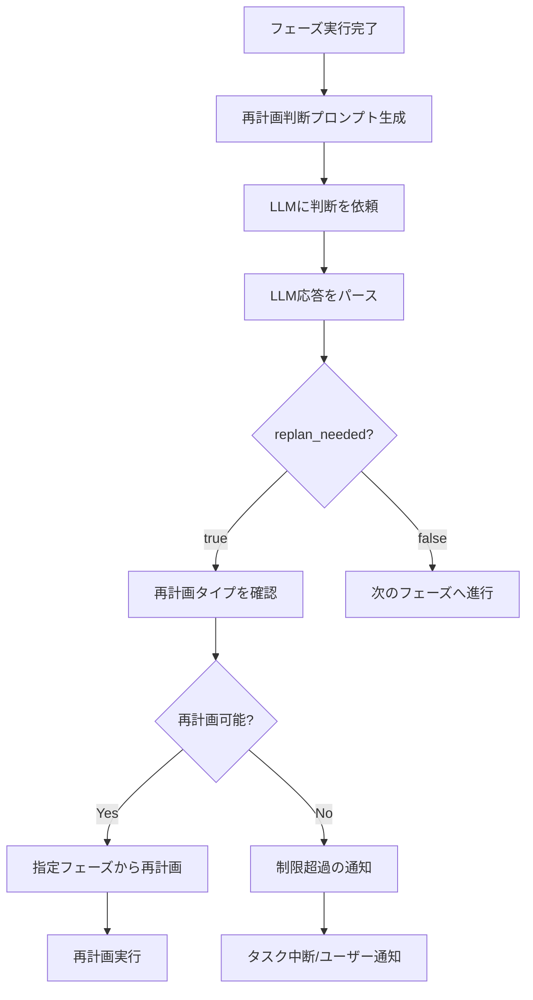
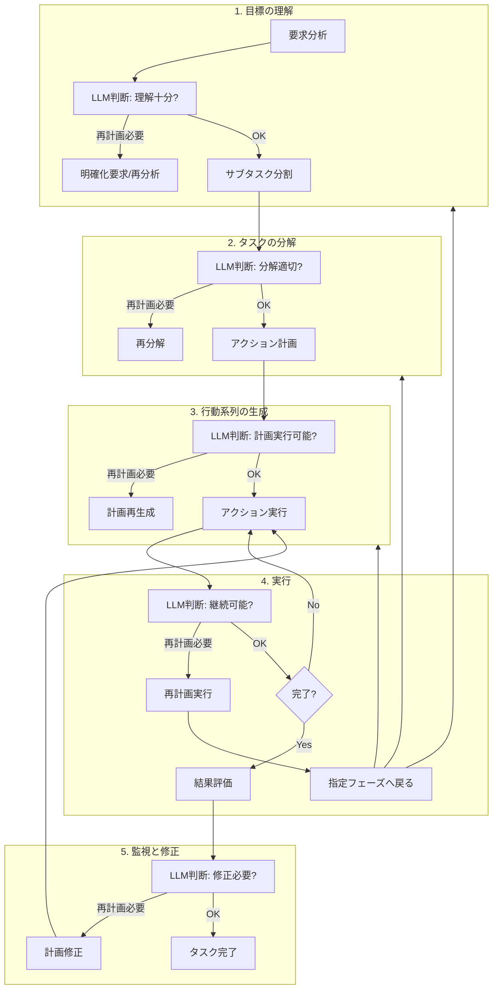
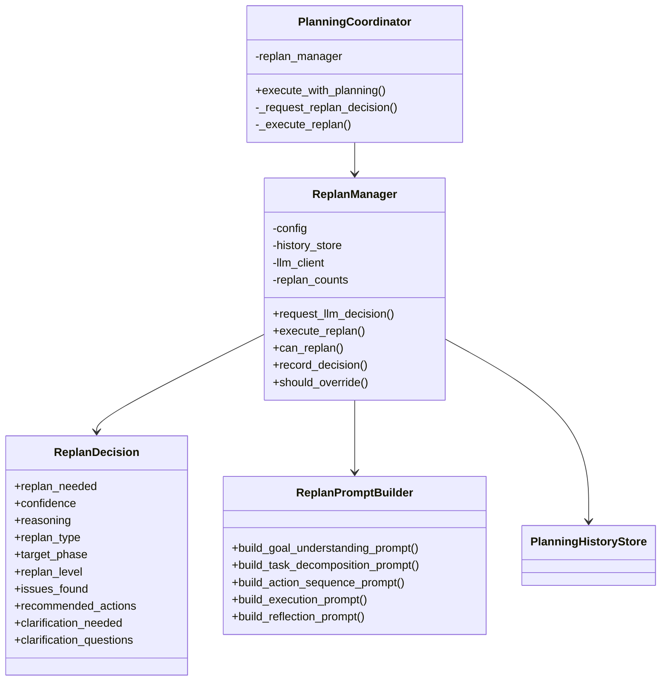

# 再計画機能仕様書

## 1. 概要

### 1.1 目的

本仕様書は、プランニングモードにおける5つのフェーズそれぞれで再計画が必要になった際に、適切に再計画を実行し処理を継続するための機能を定義します。

### 1.2 背景

現在のプランニングモードでは、監視と修正（Monitoring and Reflection）フェーズでのみ計画修正が可能です。しかし、実際のタスク処理では、各フェーズで予期しない状況が発生し、再計画が必要になることがあります。本機能は、各フェーズで発生する問題に適切に対応し、より堅牢なタスク処理を実現します。

### 1.3 設計方針

**再計画の必要性判断はLLMが行います。** システムは各フェーズの結果をLLMに提示し、LLMが状況を分析して再計画が必要かどうかを判断します。これにより、より柔軟で文脈に応じた判断が可能になります。

### 1.4 スコープ

本仕様は以下をカバーします：

- LLMによる再計画必要性の判断プロセス
- 各フェーズでの再計画判断プロンプト
- 再計画の実行プロセス
- 再計画の制限と制御メカニズム
- 状態管理とエラーハンドリング

---

## 2. LLMによる再計画判断の基本設計

### 2.1 概要

各フェーズの終了時に、LLMが現在の状況を評価し、再計画の必要性を判断します。システムはLLMに必要な情報を提供し、LLMの判断結果に基づいて処理を分岐します。

### 2.2 再計画判断フロー



### 2.3 LLM判断のための情報提供

LLMに再計画判断を依頼する際、以下の情報を提供します：

- **現在のフェーズ**: どのフェーズで判断しているか
- **フェーズの結果**: 実行結果、エラー情報
- **現在の計画**: 現在有効な計画の内容
- **実行履歴**: これまでの実行履歴
- **コンテキスト**: タスクの背景情報、制約条件
- **再計画履歴**: 過去の再計画回数と内容

### 2.4 LLM応答フォーマット

LLMは以下のJSON形式で再計画判断を返します：

```json
{
  "replan_decision": {
    "replan_needed": true,
    "confidence": 0.85,
    "reasoning": "判断の理由を説明",
    "replan_type": "partial_replan",
    "target_phase": "task_decomposition",
    "replan_level": 2,
    "issues_found": [
      "問題点1",
      "問題点2"
    ],
    "recommended_actions": [
      "推奨アクション1",
      "推奨アクション2"
    ],
    "clarification_needed": false,
    "clarification_questions": []
  }
}
```

### 2.5 判断フィールドの説明

| フィールド | 型 | 説明 |
|-----------|-----|------|
| replan_needed | boolean | 再計画が必要かどうか |
| confidence | number | 判断の確信度（0.0-1.0） |
| reasoning | string | 判断の理由説明 |
| replan_type | string | 再計画タイプ（後述） |
| target_phase | string | 再計画開始フェーズ |
| replan_level | number | 再計画レベル（1-5） |
| issues_found | array | 発見された問題のリスト |
| recommended_actions | array | 推奨アクションのリスト |
| clarification_needed | boolean | ユーザーへの確認が必要か |
| clarification_questions | array | 確認が必要な質問リスト |

### 2.6 再計画タイプ

| タイプ | 説明 | 対象フェーズ |
|-------|------|------------|
| clarification_request | ユーザーへの明確化要求 | 目標の理解 |
| goal_revision | 目標の再定義 | 目標の理解 |
| task_redecomposition | タスクの再分解 | タスクの分解 |
| action_regeneration | アクション計画の再生成 | 行動系列の生成 |
| partial_replan | 部分的な再計画 | 実行 |
| full_replan | 完全な再計画 | 実行 |
| plan_revision | 計画の修正 | 監視と修正 |

---

## 3. 5つのフェーズと再計画の関係

### 3.1 フェーズ一覧と再計画判断ポイント



### 3.2 各フェーズの再計画判断ポイント

| フェーズ | 判断タイミング | LLMへの主な質問 |
|---------|---------------|----------------|
| 目標の理解 | 目標分析完了後 | 目標は十分に理解できたか？不明点はあるか？ |
| タスクの分解 | サブタスク生成後 | 分解は適切か？実行可能か？漏れはないか？ |
| 行動系列の生成 | 計画生成後 | 計画は実行可能か？ツールは利用可能か？ |
| 実行 | 各アクション実行後 | 継続可能か？前提条件は維持されているか？ |
| 監視と修正 | 評価完了後 | 目標は達成できたか？修正は必要か？ |

---

## 4. 目標の理解フェーズでの再計画判断

### 4.1 概要

目標の理解フェーズでは、ユーザーの要求を分析し、明確な目標を設定します。このフェーズの完了後、LLMが目標理解の十分性を判断し、必要に応じて再計画を提案します。

### 4.2 LLMへの判断依頼プロンプト

目標の理解フェーズ完了後、以下のプロンプトでLLMに判断を依頼します：

```
You have completed the goal understanding phase. Now evaluate whether the understanding is sufficient to proceed.

**Current Goal Understanding:**
{goal_understanding_result}

**Original Task Request:**
{task_request}

**Available Context:**
{context_info}

**Evaluation Criteria:**
1. Is the main objective clearly defined?
2. Are all success criteria identifiable?
3. Are there any ambiguities or contradictions in the requirements?
4. Is there sufficient context to proceed with task decomposition?
5. Are there any questions that need clarification from the user?

Based on your evaluation, provide a replan decision in the following JSON format:
{replan_decision_format}

Consider carefully whether replanning is truly necessary. Only recommend replanning if:
- Critical information is missing that would prevent successful task completion
- There are significant ambiguities that could lead to incorrect implementation
- User clarification is essential before proceeding
```

### 4.3 LLMの判断観点

LLMは以下の観点で再計画の必要性を判断します：

1. **要求の明確性**
   - 主目標が明確に特定できているか
   - 成功基準が定義可能か
   - 制約条件が識別できているか

2. **情報の十分性**
   - タスク完遂に必要な情報が揃っているか
   - 技術的な背景情報が十分か
   - コンテキストが理解できているか

3. **矛盾の有無**
   - 要件間に矛盾がないか
   - 過去の履歴との整合性があるか

### 4.4 出力

LLMは再計画判断として以下の情報を返します：

- **replan_needed**: 再計画が必要かどうか
- **replan_type**: clarification_request / goal_revision / none
- **confidence**: 判断の確信度
- **reasoning**: 判断の理由
- **issues_found**: 発見された問題のリスト
- **clarification_questions**: ユーザーへの質問リスト（明確化要求の場合）
- **assumptions_to_make**: 仮定として進める場合の仮定リスト

---

## 5. タスクの分解フェーズでの再計画判断

### 5.1 概要

タスクの分解フェーズでは、目標を実行可能なサブタスクに分割します。分解完了後、LLMが分解の適切性を評価し、必要に応じて再分解を提案します。

### 5.2 LLMへの判断依頼プロンプト

タスクの分解フェーズ完了後、以下のプロンプトでLLMに判断を依頼します：

```
You have completed the task decomposition phase. Now evaluate whether the decomposition is appropriate and executable.

**Task Decomposition Result:**
{task_decomposition_result}

**Original Goal:**
{goal_understanding}

**Available Tools:**
{available_tools}

**Evaluation Criteria:**
1. Are all subtasks clearly defined and actionable?
2. Are the dependencies between subtasks correctly identified?
3. Is the complexity estimation reasonable?
4. Are the required tools available for each subtask?
5. Is the decomposition granularity appropriate (not too fine or too coarse)?
6. Are there any missing steps that should be included?

Based on your evaluation, provide a replan decision in the following JSON format:
{replan_decision_format}

Consider carefully whether replanning is truly necessary. Only recommend replanning if:
- Subtasks are not executable with available tools
- Critical steps are missing
- The decomposition has fundamental issues that would cause execution failures
```

### 5.3 LLMの判断観点

LLMは以下の観点で再計画の必要性を判断します：

1. **分解の品質**
   - サブタスクが実行可能レベルに分解されているか
   - 抜け漏れがないか
   - 重複がないか

2. **実行可能性**
   - 必要なツールが利用可能か
   - 権限やリソースの制約を満たせるか
   - 依存関係が正しく定義されているか

3. **粒度の適切性**
   - 過度に細かい分解になっていないか
   - 粗すぎて実行困難になっていないか

### 5.4 出力

LLMは再計画判断として以下の情報を返します：

- **replan_needed**: 再分解が必要かどうか
- **replan_type**: task_redecomposition / none
- **confidence**: 判断の確信度
- **reasoning**: 判断の理由
- **issues_found**: 発見された問題のリスト
- **missing_steps**: 不足しているステップ
- **recommended_granularity**: 推奨する分解粒度
- **scope_adjustment**: スコープ調整の提案

---

## 6. 行動系列の生成フェーズでの再計画判断

### 6.1 概要

行動系列の生成フェーズでは、サブタスクに基づいて実行順序とツール使用計画を策定します。計画生成完了後、LLMが計画の実行可能性を評価し、必要に応じて再生成を提案します。

### 6.2 LLMへの判断依頼プロンプト

行動系列の生成フェーズ完了後、以下のプロンプトでLLMに判断を依頼します：

```
You have completed the action sequence generation phase. Now evaluate whether the plan is executable.

**Action Plan:**
{action_plan}

**Subtasks:**
{subtasks}

**Available Tools and Their Status:**
{tool_availability}

**Evaluation Criteria:**
1. Can all specified tools be executed with the given parameters?
2. Are the action dependencies correctly ordered?
3. Are fallback strategies defined for potential failures?
4. Are the expected outcomes realistic and verifiable?
5. Is the execution order optimal?

Based on your evaluation, provide a replan decision in the following JSON format:
{replan_decision_format}

Consider carefully whether replanning is truly necessary. Only recommend replanning if:
- Required tools are unavailable or parameters are invalid
- Action dependencies would cause execution deadlocks
- Critical fallback strategies are missing
```

### 6.3 LLMの判断観点

LLMは以下の観点で再計画の必要性を判断します：

1. **ツールの利用可能性**
   - 指定されたツールが存在するか
   - パラメータが有効か
   - MCPサーバーが利用可能か

2. **実行順序の妥当性**
   - 依存関係が正しく反映されているか
   - デッドロックが発生しないか
   - 効率的な順序か

3. **エラー対策**
   - フォールバック戦略が定義されているか
   - エラー回復が可能か

### 6.4 出力

LLMは再計画判断として以下の情報を返します：

- **replan_needed**: 計画再生成が必要かどうか
- **replan_type**: action_regeneration / none
- **confidence**: 判断の確信度
- **reasoning**: 判断の理由
- **unavailable_tools**: 利用不可のツールリスト
- **alternative_tools**: 代替ツールの提案
- **dependency_issues**: 依存関係の問題点
- **plan_adjustments**: 計画調整の提案

---

## 7. 実行フェーズでの再計画判断

### 7.1 概要

実行フェーズでは、計画されたアクションを順番に実行します。各アクション実行後、LLMが実行結果を評価し、継続可能か、再計画が必要かを判断します。

### 7.2 LLMへの判断依頼プロンプト

アクション実行後、以下のプロンプトでLLMに判断を依頼します：

```
You have executed an action. Evaluate whether execution can continue or replanning is needed.

**Executed Action:**
{executed_action}

**Execution Result:**
{execution_result}

**Error Information (if any):**
{error_info}

**Current Plan Progress:**
- Completed actions: {completed_count}/{total_count}
- Error count: {error_count}
- Consecutive errors: {consecutive_errors}

**Remaining Actions:**
{remaining_actions}

**Evaluation Criteria:**
1. Was the action successful? If not, is it recoverable?
2. Are the preconditions for remaining actions still valid?
3. Has the execution context changed in a way that affects the plan?
4. Should execution continue, retry, or replan?

Based on your evaluation, provide a replan decision in the following JSON format:
{replan_decision_format}

Consider carefully whether replanning is truly necessary. Prefer:
1. Continue if action succeeded or error is minor
2. Retry if error is transient (network, timeout)
3. Partial replan if only remaining actions need adjustment
4. Full replan only if fundamental assumptions are invalid
```

### 7.3 LLMの判断観点

LLMは以下の観点で再計画の必要性を判断します：

1. **実行結果の評価**
   - アクションが成功したか
   - エラーは回復可能か
   - 期待される結果と一致しているか

2. **継続可能性**
   - 後続アクションの前提条件は維持されているか
   - リソース状態に問題はないか
   - コンテキストに変化があったか

3. **エラーの深刻度**
   - 一時的なエラーか永続的なエラーか
   - 影響範囲は限定的か広範か
   - リトライで解決可能か

### 7.4 再計画レベルの判定

LLMは状況に応じて適切な再計画レベルを提案します：

| レベル | 名称 | 説明 | 適用状況 |
|--------|------|------|---------|
| 1 | リトライ | 同一アクションを再試行 | 一時的エラー |
| 2 | 部分再計画 | 失敗以降のアクションを再計画 | アクション固有の問題 |
| 3 | 行動系列再生成 | アクション計画全体を再生成 | ツール利用不可 |
| 4 | タスク再分解 | サブタスクから再分解 | 前提条件の崩壊 |
| 5 | 目標再確認 | 目標の理解から再実行 | 要件の誤解判明 |

### 7.5 出力

LLMは再計画判断として以下の情報を返します：

- **replan_needed**: 再計画が必要かどうか
- **replan_type**: partial_replan / full_replan / retry / none
- **replan_level**: 再計画レベル（1-5）
- **target_phase**: 再計画開始フェーズ
- **confidence**: 判断の確信度
- **reasoning**: 判断の理由
- **error_classification**: エラーの分類（transient / persistent / fatal）
- **recovery_strategy**: 回復戦略の提案
- **affected_actions**: 影響を受けるアクションのリスト

---

## 8. 監視と修正フェーズでの再計画判断

### 8.1 概要

監視と修正フェーズでは、実行結果を評価し、必要に応じて計画を修正します。LLMが総合的な評価を行い、目標達成度と修正の必要性を判断します。

### 8.2 LLMへの判断依頼プロンプト

監視と修正フェーズで、以下のプロンプトでLLMに判断を依頼します：

```
You have completed the execution of planned actions. Now evaluate the overall results and determine if any revision is needed.

**Original Goal:**
{goal_understanding}

**Success Criteria:**
{success_criteria}

**Execution Summary:**
{execution_summary}

**Actions Completed:**
{completed_actions}

**Current State:**
{current_state}

**Evaluation Criteria:**
1. Have all success criteria been met?
2. Are there any unintended side effects?
3. Is the implementation quality acceptable?
4. Are there any issues that need to be addressed?
5. Would additional actions improve the outcome?

Based on your evaluation, provide a replan decision in the following JSON format:
{replan_decision_format}

Consider carefully whether replanning is truly necessary. Only recommend replanning if:
- Critical success criteria are not met
- There are significant quality issues
- Important functionality is missing
- User feedback indicates problems
```

### 8.3 LLMの判断観点

LLMは以下の観点で再計画の必要性を判断します：

1. **目標達成度**
   - 成功基準が満たされているか
   - 部分的な達成の場合、追加対応が必要か
   - 目標と結果の乖離

2. **品質評価**
   - コードの品質
   - テストの成功/失敗
   - ドキュメントの完全性

3. **副作用の確認**
   - 予期しない変更がないか
   - 既存機能への影響
   - 回帰の有無

### 8.4 出力

LLMは再計画判断として以下の情報を返します：

- **replan_needed**: 計画修正が必要かどうか
- **replan_type**: plan_revision / none
- **confidence**: 判断の確信度
- **reasoning**: 判断の理由
- **evaluation_result**: success / partial_success / failure
- **achievement_rate**: 目標達成率（0-100）
- **issues_identified**: 特定された問題のリスト
- **additional_actions**: 追加が必要なアクションのリスト
- **revision_scope**: minor / moderate / major

---

## 9. 再計画の制御メカニズム

### 9.1 再計画回数の制限

LLMの判断により再計画が実行される場合でも、回数制限を設けます：

| フェーズ | 制限項目 | デフォルト値 |
|---------|---------|------------|
| 目標の理解 | 明確化要求回数 | 2回 |
| タスクの分解 | 再分解回数 | 3回 |
| 行動系列の生成 | 計画再生成回数 | 3回 |
| 実行 | アクションリトライ回数 | 3回 |
| 実行 | 部分再計画回数 | 2回 |
| 監視と修正 | 計画修正回数 | 2回 |
| 全体 | 総再計画回数 | 10回 |

### 9.2 LLM判断のオーバーライド

システムは以下の条件でLLMの再計画判断をオーバーライドします：

1. **制限超過時**: 再計画回数が制限に達した場合、LLMが再計画を提案しても実行しない
2. **確信度不足時**: LLMの確信度が閾値（デフォルト0.5）未満の場合、再計画を実行しない
3. **無限ループ検出時**: 同一トリガーで繰り返し再計画される場合、強制的に中断

### 9.3 確信度による判断

LLMの確信度に基づく処理分岐：

| 確信度範囲 | 処理 |
|-----------|------|
| 0.8以上 | 即座に再計画を実行 |
| 0.5-0.8 | 再計画を実行（警告ログ付き） |
| 0.3-0.5 | ユーザー確認を要求 |
| 0.3未満 | 再計画をスキップ（現計画を継続） |

### 9.4 エスカレーション

LLMが再計画を提案したが実行できない場合のエスカレーション：

1. 制限到達の旨をLLMに通知
2. LLMに代替手段の検討を依頼
3. 代替手段がない場合、ユーザーに通知
4. ユーザーの指示を待機または仮定で継続

---

## 10. 状態管理

### 10.1 再計画状態の記録

LLMの再計画判断と実行履歴を記録します：

- **replan_id**: 再計画の識別子
- **phase**: 再計画判断が行われたフェーズ
- **llm_decision**: LLMの判断内容（JSON全体）
- **confidence**: LLMの確信度
- **executed**: 実際に再計画が実行されたか
- **override_reason**: オーバーライドされた場合の理由
- **timestamp**: 判断日時
- **result**: 再計画の結果（success / failure / skipped）
- **duration**: 再計画に要した時間

### 10.2 一時停止・再開時の状態保持

再計画中にタスクが一時停止された場合、以下の情報を保持します：

- 再計画の進行状態
- 再計画前の計画
- LLMの最新判断結果
- 再計画の試行回数
- 各フェーズの再計画カウント

### 10.3 履歴ストアへの記録

再計画の履歴をPlanningHistoryStoreに記録します：

- エントリタイプとして「replan_decision」を追加
- LLMの判断内容を完全に保存
- 再計画前後の計画を保存
- オーバーライド情報も記録

---

## 11. Issue/MRへの通知

### 11.1 通知タイミング

以下のタイミングでIssue/MRに通知します：

- LLMが再計画を判断した時
- 再計画の開始時
- 明確化が必要な場合（ユーザーへの質問）
- 再計画の完了時
- 再計画の失敗時
- 制限超過でオーバーライドされた時

### 11.2 通知フォーマット

LLMによる再計画判断の通知フォーマット：

```markdown
## 🔄 Plan Revision Decided by AI

**Phase**: [フェーズ名]
**Confidence**: [確信度]%

**Reasoning**:
[LLMの判断理由]

**Issues Found**:
- [問題点1]
- [問題点2]

**Recommended Actions**:
- [推奨アクション1]
- [推奨アクション2]

*[タイムスタンプ]*
```

### 11.3 明確化要求のフォーマット

LLMがユーザーへの明確化が必要と判断した場合のフォーマット：

```markdown
## ❓ Clarification Needed (AI Decision)

I've analyzed the task and need some clarification to proceed effectively:

**Questions**:
1. [質問1]
2. [質問2]

**Context**:
[なぜこの質問が必要かの説明]

**If no response**:
I will proceed with the following assumptions:
- [仮定1]
- [仮定2]

Please reply to this comment with your answers.
```

### 11.4 再計画時のチェックリスト更新

再計画が実行された場合、新しい計画に基づいてチェックリストを更新し、進捗状況を明確に表示します。

#### 11.4.1 チェックリスト更新のタイミング

以下のタイミングでチェックリストを更新します：

1. **部分再計画時**: 残りのタスクのみ更新し、完了済みタスクは維持
2. **完全再計画時**: 新しいチェックリストを生成し、以前のチェックリストを置換
3. **目標再確認時**: 全く新しいチェックリストを生成

#### 11.4.2 チェックリスト更新フォーマット

再計画後のチェックリストは、再計画であることを明示します：

```markdown
## 📋 Execution Plan (Revised #[revision_number])

**Revision Reason**: [再計画の理由]

**Previous Progress**: [完了したタスク数]/[旧計画の総タスク数]

### New Plan:
- [x] **task_1**: [完了済みタスク - 維持]
- [x] **task_2**: [完了済みタスク - 維持]
- [ ] **task_3_revised**: [修正されたタスク]
- [ ] **task_4_new**: [新規追加タスク]

*Progress: 2/4 (50%) complete | Revision: #[revision_number] at [タイムスタンプ]*
```

#### 11.4.3 進捗の引き継ぎ

再計画時の進捗引き継ぎルール：

| 再計画タイプ | 完了済みタスクの扱い | 新規タスクの扱い |
|-------------|---------------------|-----------------|
| 部分再計画 | チェック状態を維持 | 未チェックで追加 |
| 行動系列再生成 | チェック状態を維持 | 未チェックで追加 |
| タスク再分解 | クリア（新規計画） | 未チェックで追加 |
| 目標再確認 | クリア（新規計画） | 未チェックで追加 |

#### 11.4.4 旧チェックリストの処理

再計画時の旧チェックリスト処理方法：

1. **既存コメントの更新**: 同一コメントを編集して新しいチェックリストに置換
2. **履歴の保持**: 旧計画の情報を折りたたみセクションで保持

```markdown
## 📋 Execution Plan (Revised #2)

[新しいチェックリスト内容]

<details>
<summary>📜 Previous Plan History</summary>

### Revision #1 (2024-11-28 10:00:00)
- [x] task_1: 完了したタスク
- [x] task_2: 完了したタスク
- [ ] task_3: 再計画により変更

**Revision Reason**: ツール利用不可のため計画を修正

</details>
```

#### 11.4.5 進捗追跡の視覚化

複数回の再計画を経た場合の進捗表示：

```markdown
*Progress: 3/5 (60%) complete*
*Plan Revisions: 2 times*
*Current Plan: #3 (started at [タイムスタンプ])*
```

---

## 12. 設定オプション

### 12.1 config.yamlへの追加

planningセクションにreplanningサブセクションを追加します：

```yaml
planning:
  enabled: true
  replanning:
    enabled: true
    
    # LLM判断の設定
    llm_decision:
      # 確信度の閾値
      min_confidence_threshold: 0.5
      # 低確信度時のユーザー確認を有効化
      require_user_confirmation_on_low_confidence: true
      # ユーザー確認を要求する確信度の閾値
      user_confirmation_threshold: 0.3
      
    # 各フェーズの再計画設定
    goal_understanding:
      max_clarification_requests: 2
      auto_assume_on_no_response: true
      auto_assume_timeout_minutes: 30
      
    task_decomposition:
      max_redecomposition_attempts: 3
      
    action_sequence:
      max_regeneration_attempts: 3
      
    execution:
      max_action_retries: 3
      max_partial_replans: 2
      
    reflection:
      max_plan_revisions: 2
      
    # 全体制限
    global:
      max_total_replans: 10
      infinite_loop_detection: true
      same_trigger_max_count: 2
```

### 12.2 環境変数

環境変数でオーバーライド可能な設定：

- **REPLANNING_ENABLED**: 再計画機能の有効/無効（true/false、デフォルト: true）
- **REPLANNING_MIN_CONFIDENCE**: LLM判断の最小確信度（デフォルト: 0.5）
- **MAX_TOTAL_REPLANS**: 総再計画回数の上限（デフォルト: 10）

---

## 13. エラーハンドリング

### 13.1 LLM応答パースエラー

LLMの再計画判断応答がパースできない場合：

1. JSONパースを試行
2. マークダウンコードブロックからJSON抽出を試行
3. 失敗した場合、再計画なしとして処理を継続
4. エラーログを記録

### 13.2 再計画失敗時の処理

LLMが提案した再計画が実行できない場合：

1. 失敗理由をLLMに通知
2. LLMに代替手段の検討を依頼
3. 代替手段がない場合はユーザーに通知
4. 設定に応じて仮定で継続またはタスク中断

### 13.3 無限ループの防止

LLMが同じ再計画を繰り返し提案する場合：

- 同一トリガーでの再計画を検出
- 設定回数（デフォルト2回）を超えた場合は強制的にスキップ
- LLMに状況を通知し、異なるアプローチを依頼

### 13.4 確信度が極端に低い場合

LLMの確信度が極端に低い場合（0.3未満）：

- 再計画判断を信頼せず、現状維持
- ログに記録して監視
- 必要に応じてユーザーに状況を通知

---

## 14. アーキテクチャ拡張

### 14.1 クラス図（拡張）



### 14.2 ReplanManagerクラス

LLMによる再計画判断を管理する新規クラスです。

**責務:**
- LLMへの再計画判断依頼
- LLM応答のパースと検証
- 再計画の実行制御
- 再計画回数の管理
- オーバーライド判定
- 再計画履歴の記録

**主要メソッド:**
- **request_llm_decision**: LLMに再計画判断を依頼
- **parse_decision_response**: LLM応答をパース
- **execute_replan**: 再計画を実行
- **can_replan**: 再計画可能かを判定（制限チェック）
- **should_override**: LLM判断をオーバーライドすべきかを判定
- **record_decision**: 再計画判断履歴を記録
- **get_replan_statistics**: 再計画統計を取得

### 14.3 ReplanPromptBuilderクラス

各フェーズ用の再計画判断プロンプトを生成するクラスです。

**責務:**
- フェーズごとのプロンプトテンプレート管理
- コンテキスト情報の埋め込み
- 応答フォーマットの指定

**主要メソッド:**
- **build_goal_understanding_prompt**: 目標の理解フェーズ用プロンプト生成
- **build_task_decomposition_prompt**: タスクの分解フェーズ用プロンプト生成
- **build_action_sequence_prompt**: 行動系列の生成フェーズ用プロンプト生成
- **build_execution_prompt**: 実行フェーズ用プロンプト生成
- **build_reflection_prompt**: 監視と修正フェーズ用プロンプト生成

---

## 15. 関連ドキュメント

- [プランニングプロセス仕様書](PLANNING_SPECIFICATION.md)
- [基本仕様](spec.md)
- [クラス設計](class_spec.md)
- [コンテキストファイル化仕様](context_file_spec.md)
- [一時停止・再開機能仕様](PAUSE_RESUME_SPECIFICATION.md)

---

**文書バージョン:** 1.0  
**最終更新日:** 2024-11-28  
**ステータス:** 設計完了
