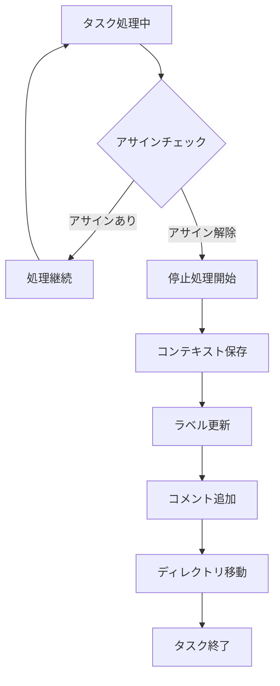
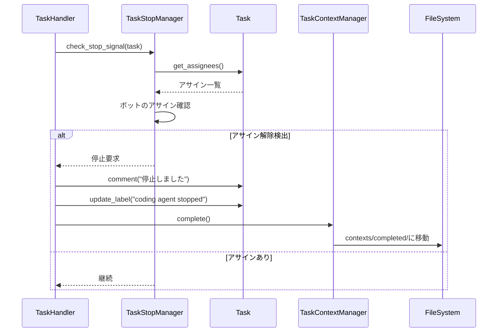
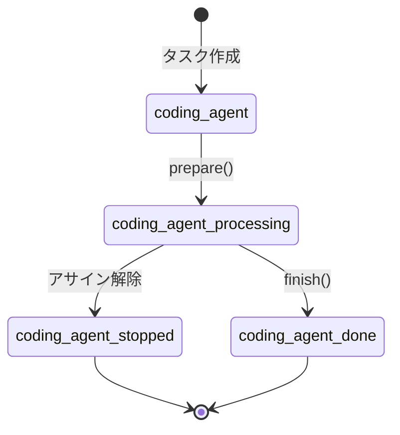

# タスク停止機能仕様書

## 1. 概要

### 1.1 目的

本仕様では、Issue/PR/MRからコーディングエージェントのアサインを解除することで、タスクを停止する機能を設計します。これにより、ユーザーはタスク処理を明示的に中止できます。

### 1.2 一時停止との違い

| 項目 | 一時停止 | 停止 |
|------|---------|------|
| トリガー | pause_signalファイル | アサイン解除 |
| 再開可能性 | 可能（自動再開） | 不可（新規タスクとして開始） |
| 状態保存先 | contexts/paused/ | contexts/completed/ |
| ラベル | coding agent paused | coding agent stopped |
| 用途 | システムメンテナンス等 | ユーザーによる明示的な中止 |

### 1.3 要求事項

- Issue/PR/MRからボットのアサイン解除を検知できること
- アサイン解除検出時にタスク処理を停止すること
- 停止時にコンテキストをcompletedディレクトリに移動すること
- 停止状態をラベルで可視化すること

---

## 2. 処理フロー

### 2.1 全体フロー図

### 2.2 アサインチェックのタイミング

- LLM応答を取得した後、次のアクション実行前
- ツール実行完了後、LLMへの結果送信前
- 処理ループの各イテレーション開始時
- 一時停止チェックと同じタイミング

---

## 3. 停止検知

### 3.1 GitHub連携

GitHub APIを使用してIssue/PRのassignees情報を取得し、ボットがアサインされているかを確認します。

**チェック対象:**
- Issueのassignees
- Pull Requestのassignees

### 3.2 GitLab連携

GitLab APIを使用してIssue/MRのassignees情報を取得し、ボットがアサインされているかを確認します。

**チェック対象:**
- Issueのassignees
- Merge Requestのassignees

### 3.3 ボット識別

config.yamlで設定されたbot_name（GitHub）またはbot_name（GitLab）とアサインされたユーザー名を比較してボットを識別します。

---

## 4. 停止処理

### 4.1 処理シーケンス

### 4.2 停止時の処理

1. **アサイン解除検出**: ボットがアサインから外れていることを検出
2. **コンテキスト保存**: 現在のコンテキストを保存
3. **コメント追加**: タスクに停止通知のコメントを追加
4. **ラベル更新**: 処理中ラベルを停止ラベルに変更
5. **ディレクトリ移動**: contexts/running/からcontexts/completed/に移動
6. **タスク終了**: 処理を正常終了

---

## 5. ラベル管理

### 5.1 ラベル遷移

### 5.2 ラベル一覧

| ラベル | 状態 |
|-------|------|
| coding agent | 処理待ち |
| coding agent processing | 処理中 |
| coding agent stopped | 停止（ユーザーによる中止） |
| coding agent done | 処理完了 |

---

## 6. 設定オプション

### 6.1 config.yamlの設定項目

task_stopセクションで以下を設定します：

- **enabled**: 停止機能の有効/無効（デフォルト: true）
- **check_interval**: アサインチェック間隔（LLMループN回ごと、デフォルト: 1）

### 6.2 プラットフォーム別設定

GitHubおよびGitLabの設定セクションで、停止ラベルを設定できます：

- **github.stopped_label**: GitHub用の停止ラベル（デフォルト: coding agent stopped）
- **gitlab.stopped_label**: GitLab用の停止ラベル（デフォルト: coding agent stopped）

---

## 7. TaskStopManagerクラス

### 7.1 責務

- アサイン状態のチェック
- 停止シグナルの判定
- 停止処理の実行

### 7.2 主要メソッド

- **check_stop_signal**: アサイン解除を検出し、停止が必要かを判定
- **execute_stop**: 停止処理を実行（コメント追加、ラベル更新、コンテキスト移動）

---

## 8. エラーハンドリング

### 8.1 アサイン確認エラー

- **API通信エラー**: ログ出力後、処理を継続（停止検知をスキップ）
- **パース エラー**: ログ出力後、処理を継続

### 8.2 停止処理エラー

- **ラベル更新失敗**: ログ出力後、処理を継続
- **コメント追加失敗**: ログ出力後、処理を継続
- **ディレクトリ移動失敗**: ログ出力後、例外を上位に伝播

---

## 9. 関連ドキュメント

- [一時停止・再開機能仕様](PAUSE_RESUME_SPECIFICATION.md)
- [コンテキストファイル化仕様](context_file_spec.md)

---

**文書バージョン:** 2.0  
**最終更新日:** 2024-11-28  
**ステータス:** 実装済み
