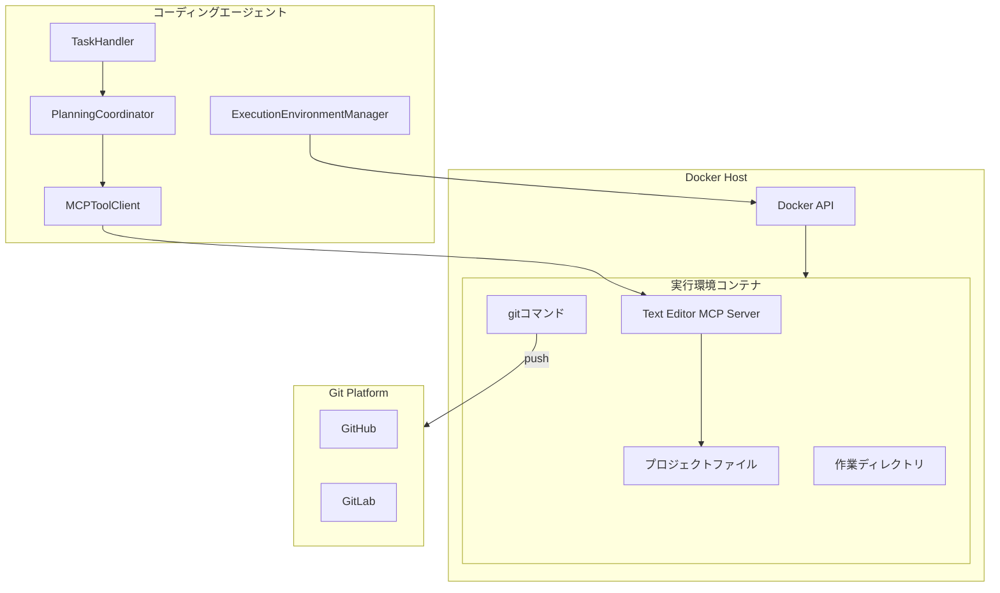
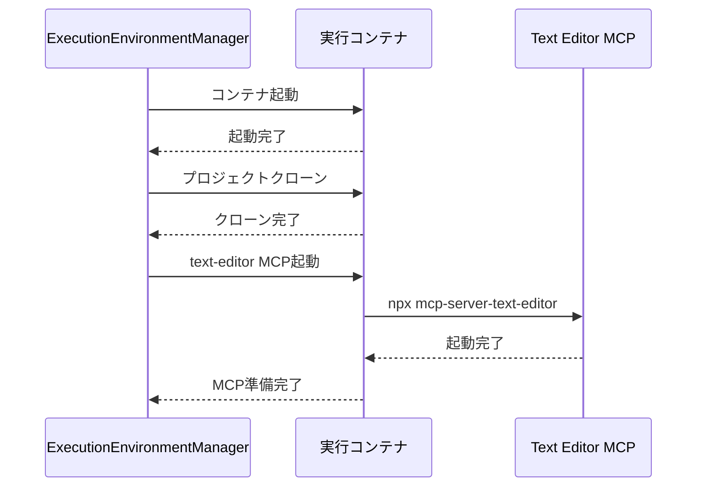
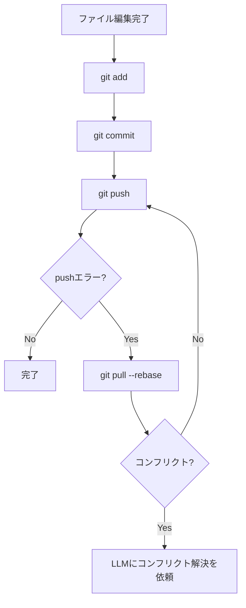
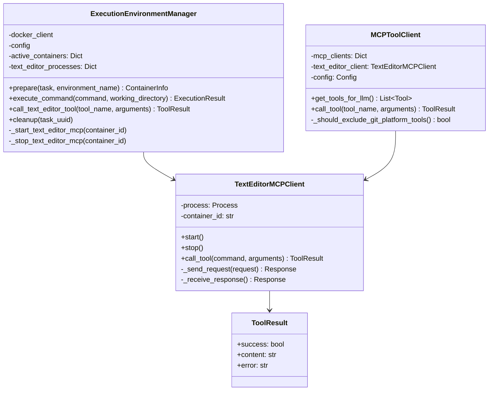
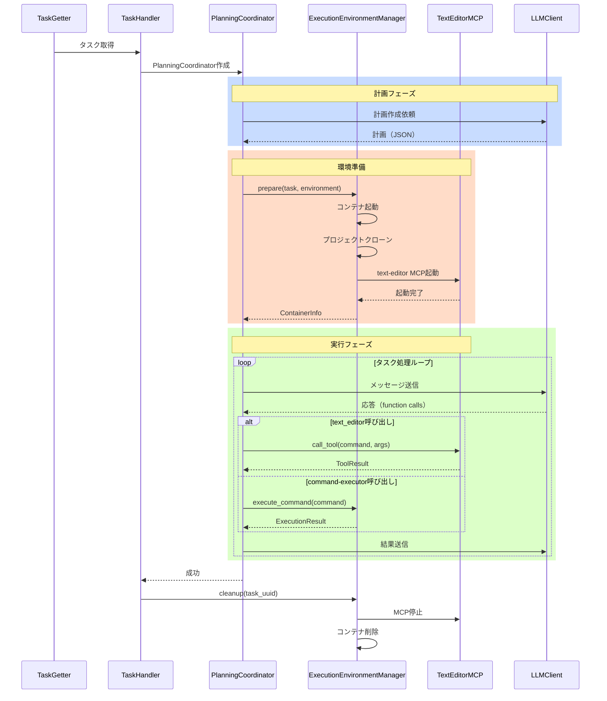
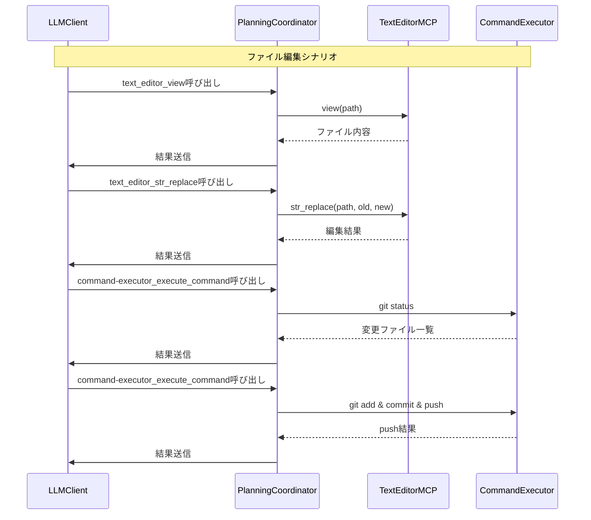

# テキスト編集MCP Server連携仕様書

## 1. 概要

### 1.1 目的

本仕様書は、コーディングエージェントにおいてテキストファイルの生成・編集を`bhouston/mcp-server-text-editor`を使用して行うための詳細設計を定義します。このMCPサーバーはClaude APIのテキストエディタツールと同一のAPIを提供し、コマンド実行Docker環境内でファイル操作を統一的に行うことを可能にします。

### 1.2 背景

現行のコーディングエージェントでは、ファイル操作を以下の方法で行っています：

- **GitHub MCP Server**: `github_create_or_update_file`などのAPIでファイルを直接リポジトリに反映
- **GitLab MCP Server**: 同様のAPIでMerge Requestにファイルを反映

この方式には以下の課題があります：

- ファイル編集がリポジトリAPIに依存し、ローカルファイルの柔軟な編集が困難
- 編集の単位がファイル全体となり、部分的な置換が非効率
- gitコマンドによる履歴管理やブランチ操作ができない
- Command Executor環境とGitHub/GitLab MCPの間でファイル状態の不整合が発生しうる

### 1.3 要求事項

1. `bhouston/mcp-server-text-editor`をコマンド実行Docker環境内で動作させる
2. テキスト編集MCP有効時は、GitHub/GitLab MCPをLLMに提供しない
3. ファイル生成・編集はtext-editor MCPで行い、gitコマンドでcommit/pushする
4. 既存のCommand Executor環境と統合して動作する
5. デフォルトで有効化する
6. Claudeのテキストエディタツールと同様のプロンプトを使用する

### 1.4 参照ドキュメント

- [bhouston/mcp-server-text-editor GitHub](https://github.com/bhouston/mcp-server-text-editor)
- [Claude テキストエディタツール](https://docs.claude.com/ja/docs/agents-and-tools/tool-use/text-editor-tool)
- [Command Executor MCP Server連携仕様](COMMAND_EXECUTOR_MCP_SPECIFICATION.md)
- [複数言語対応実行環境仕様](MULTI_LANGUAGE_ENVIRONMENT_SPECIFICATION.md)

---

## 2. システムアーキテクチャ

### 2.1 全体構成図



### 2.2 変更後のMCP構成

テキスト編集MCP機能が有効な場合、以下のMCP構成となります：

| MCP Server | 提供元 | 提供先 | 状態 |
|------------|--------|--------|------|
| text-editor | コマンド実行コンテナ内 | LLM | 有効（新規追加） |
| command-executor | ExecutionEnvironmentManager | LLM | 有効（既存） |
| github | 外部プロセス | LLM | **無効化** |
| gitlab | 外部プロセス | LLM | **無効化** |

### 2.3 主要コンポーネント

#### Text Editor MCP Server

`bhouston/mcp-server-text-editor`をコマンド実行コンテナ内で動作させます。

**責務:**
- ファイルの表示（view）
- ファイルの新規作成（create）
- 文字列置換による編集（str_replace）
- 行挿入（insert）
- 編集の取り消し（undo_edit）

#### ExecutionEnvironmentManager（拡張）

既存のExecutionEnvironmentManagerを拡張し、text-editor MCPの管理機能を追加します。

**追加責務:**
- コンテナ起動時にtext-editor MCPサーバーを開始
- text-editor MCPへのツール呼び出し中継
- git操作の実行（commit, push）

---

## 3. bhouston/mcp-server-text-editor仕様

### 3.1 提供ツール

`bhouston/mcp-server-text-editor`は以下のツールを提供します。ツール名は`text_editor`です。

#### 3.1.1 view（ファイル/ディレクトリの表示）

ファイルの内容またはディレクトリ構造を表示します。

**パラメータ:**
| パラメータ | 型 | 必須 | 説明 |
|-----------|-----|------|------|
| command | string | Yes | "view" |
| path | string | Yes | 表示対象のファイルまたはディレクトリパス |
| view_range | [number, number] | No | 表示する行範囲 [開始行, 終了行]。ファイルの場合のみ有効 |

**使用例:**
```json
{
  "command": "view",
  "path": "/workspace/project/src/main.py",
  "view_range": [1, 50]
}
```

#### 3.1.2 create（ファイルの新規作成）

新しいファイルを作成します。

**パラメータ:**
| パラメータ | 型 | 必須 | 説明 |
|-----------|-----|------|------|
| command | string | Yes | "create" |
| path | string | Yes | 作成するファイルのパス |
| file_text | string | Yes | ファイルの内容 |

**使用例:**
```json
{
  "command": "create",
  "path": "/workspace/project/src/utils.py",
  "file_text": "def helper_function():\n    pass\n"
}
```

#### 3.1.3 str_replace（文字列置換）

ファイル内の文字列を置換します。

**パラメータ:**
| パラメータ | 型 | 必須 | 説明 |
|-----------|-----|------|------|
| command | string | Yes | "str_replace" |
| path | string | Yes | 編集対象のファイルパス |
| old_str | string | Yes | 置換対象の文字列（完全一致） |
| new_str | string | Yes | 置換後の文字列 |

**使用例:**
```json
{
  "command": "str_replace",
  "path": "/workspace/project/src/main.py",
  "old_str": "def old_function():\n    pass",
  "new_str": "def new_function():\n    return True"
}
```

#### 3.1.4 insert（行挿入）

指定した行に新しいテキストを挿入します。

**パラメータ:**
| パラメータ | 型 | 必須 | 説明 |
|-----------|-----|------|------|
| command | string | Yes | "insert" |
| path | string | Yes | 編集対象のファイルパス |
| insert_line | number | Yes | 挿入位置の行番号 |
| new_str | string | Yes | 挿入するテキスト |

**使用例:**
```json
{
  "command": "insert",
  "path": "/workspace/project/src/main.py",
  "insert_line": 5,
  "new_str": "# 新しいコメント\n"
}
```

#### 3.1.5 undo_edit（編集の取り消し）

直前のファイル編集を取り消します。

**パラメータ:**
| パラメータ | 型 | 必須 | 説明 |
|-----------|-----|------|------|
| command | string | Yes | "undo_edit" |
| path | string | Yes | 取り消し対象のファイルパス |

**使用例:**
```json
{
  "command": "undo_edit",
  "path": "/workspace/project/src/main.py"
}
```

### 3.2 ツール登録名

MCPクライアントに登録されるツール名は`text_editor`です。function callingでは以下の形式で呼び出します：

```
text_editor_<command>
```

例：`text_editor_view`, `text_editor_str_replace`

---

## 4. Docker環境への統合

### 4.1 イメージ構成の変更

すべての言語別実行環境イメージに`mcp-server-text-editor`をプリインストールします。

#### 4.1.1 追加インストール内容

各Dockerfileに以下を追加します：

- Node.js（text-editor MCPサーバー実行用）
- `mcp-server-text-editor`パッケージ（バージョン固定）

#### 4.1.2 Dockerfile変更例（Python環境）

```dockerfile
# 既存のベース構成に追加
# Node.js インストール（text-editor MCP用）
# セキュリティ向上のため、GPG署名付きの公式リポジトリを使用
ENV NODE_MAJOR=20
RUN apt-get update && \
    apt-get install -y ca-certificates curl gnupg && \
    mkdir -p /etc/apt/keyrings && \
    curl -fsSL https://deb.nodesource.com/gpgkey/nodesource-repo.gpg.key | \
        gpg --dearmor -o /etc/apt/keyrings/nodesource.gpg && \
    echo "deb [signed-by=/etc/apt/keyrings/nodesource.gpg] https://deb.nodesource.com/node_$NODE_MAJOR.x nodistro main" | \
        tee /etc/apt/sources.list.d/nodesource.list && \
    apt-get update && \
    apt-get install -y nodejs && \
    rm -rf /var/lib/apt/lists/*

# mcp-server-text-editorのプリインストール（バージョン固定）
ARG TEXT_EDITOR_MCP_VERSION=1.0.0
RUN npm install -g mcp-server-text-editor@${TEXT_EDITOR_MCP_VERSION}
```

### 4.2 MCPサーバー起動方式

text-editor MCPサーバーはコンテナ内で常駐プロセスとして起動します。

#### 4.2.1 起動コマンド

```bash
npx -y mcp-server-text-editor
```

#### 4.2.2 起動タイミング

コンテナ起動後、プロジェクトクローン完了後に起動します。

#### 4.2.3 通信方式

- **プロトコル**: stdio（標準入出力）
- **フォーマット**: JSON-RPC 2.0（MCP標準）

### 4.3 プロセス管理

#### 4.3.1 起動シーケンス



---

## 5. GitHub/GitLab MCP無効化

### 5.1 無効化条件

テキスト編集MCP機能が有効な場合（デフォルト）、以下のMCPサーバーをLLMに提供しません：

- `github` MCPサーバー
- `gitlab` MCPサーバー

### 5.2 無効化方式

テキスト編集MCP機能が有効な場合、GitHub/GitLab MCPのツールはシステムプロンプトおよびLLMに提供するツール一覧から自動的に除外されます。

### 5.3 代替機能の提供

GitHub/GitLab MCPの主要機能は以下で代替します：

| GitHub/GitLab MCP機能 | 代替手段 |
|----------------------|---------|
| ファイル作成・更新 | text_editor（create, str_replace） |
| ファイル取得 | text_editor（view） |
| ブランチ操作 | gitコマンド（command-executor経由） |
| コミット | gitコマンド（command-executor経由） |
| プッシュ | gitコマンド（command-executor経由） |
| Issue/PR操作 | **引き続きMCP経由**（別途対応） |

### 5.4 Issue/PR/MR操作の扱い

ファイル操作以外のGitHub/GitLab機能（Issue操作、PR/MRの作成・更新、ラベル操作等）は、コーディングエージェントのTaskHandler内部で直接API呼び出しにより行います。LLMからのツール呼び出しは不要です。

---

## 6. gitコマンドによるバージョン管理

### 6.1 概要

テキスト編集後のファイルは、gitコマンドを使用してバージョン管理・リモートリポジトリへの反映を行います。

### 6.2 基本フロー



### 6.3 推奨gitコマンド

システムプロンプトでLLMに以下のgitコマンドの使用を推奨します：

#### 6.3.1 変更の確認

```bash
git status
git diff
git diff --staged
```

#### 6.3.2 変更のステージング

```bash
git add <file>
git add .
```

#### 6.3.3 コミット

```bash
git commit -m "コミットメッセージ"
```

#### 6.3.4 プッシュ

```bash
git push origin <branch>
```

#### 6.3.5 コンフリクト解決

```bash
git pull --rebase origin <branch>
# コンフリクトがある場合はtext_editorで解決後
git add <resolved_files>
git rebase --continue
```

### 6.4 認証情報の扱い

gitコマンドでのpushに必要な認証情報は、コンテナ起動時に設定済みです（Command Executor MCP仕様参照）。

---

## 7. システムプロンプト

### 7.1 追加するプロンプト内容

テキスト編集MCP機能が有効な場合、システムプロンプトに以下を追加します。

#### 7.1.1 テキストエディタツール説明

```
## Text Editor Tool

You have access to a text editor tool (`text_editor`) for viewing, creating, and editing files in the project workspace.

### Available Commands

#### 1. view - View file or directory contents
View the content of a file or list directory contents.

**Parameters:**
- `command`: "view" (required)
- `path`: File or directory path (required)
- `view_range`: [start_line, end_line] - Optional line range for files

**Example:**
```json
{"command": "view", "path": "/workspace/project/src/main.py", "view_range": [1, 50]}
```

#### 2. create - Create a new file
Create a new file with specified content. The file must not already exist.

**Parameters:**
- `command`: "create" (required)
- `path`: Path for the new file (required)
- `file_text`: Content for the new file (required)

**Example:**
```json
{"command": "create", "path": "/workspace/project/src/utils.py", "file_text": "def helper():\n    pass\n"}
```

#### 3. str_replace - Replace text in a file
Replace a specific string in a file. The old_str must match exactly one location in the file.

**Parameters:**
- `command`: "str_replace" (required)
- `path`: File path (required)
- `old_str`: Exact string to replace (required)
- `new_str`: Replacement string (required)

**Important:** 
- The `old_str` must match EXACTLY one or more consecutive lines
- Include enough context to make the match unique
- Preserve leading/trailing whitespace exactly

**Example:**
```json
{"command": "str_replace", "path": "/workspace/project/src/main.py", "old_str": "def old():\n    pass", "new_str": "def new():\n    return True"}
```

#### 4. insert - Insert text at a specific line
Insert new text at the specified line number.

**Parameters:**
- `command`: "insert" (required)
- `path`: File path (required)
- `insert_line`: Line number to insert at (required)
- `new_str`: Text to insert (required)

**Example:**
```json
{"command": "insert", "path": "/workspace/project/src/main.py", "insert_line": 5, "new_str": "# New comment\n"}
```

#### 5. undo_edit - Undo the last edit
Revert the most recent edit to a file.

**Parameters:**
- `command`: "undo_edit" (required)
- `path`: File path (required)

**Example:**
```json
{"command": "undo_edit", "path": "/workspace/project/src/main.py"}
```

### Best Practices

1. **Before editing**: Always use `view` to understand the current file structure
2. **Precise matching**: For `str_replace`, include enough surrounding context to ensure unique matching
3. **Incremental edits**: Make small, focused changes rather than replacing large blocks
4. **Verify changes**: After editing, use `view` to confirm the changes were applied correctly
```

#### 7.1.2 gitワークフロー説明

```
## Git Workflow for File Changes

After making file changes with the text editor, you **must** commit and push your changes using git commands.

### Required Workflow

1. **Check status**: Review what files have been modified
   ```bash
   git status
   git diff
   ```

2. **Stage changes**: Add modified files to staging
   ```bash
   git add <modified_files>
   # or for all changes
   git add .
   ```

3. **Commit changes**: Create a commit with a descriptive message
   ```bash
   git commit -m "feat: description of changes"
   ```

4. **Push changes**: Push to the remote branch
   ```bash
   git push origin <branch_name>
   ```

### Handling Push Conflicts

If push fails due to remote changes:

1. Pull with rebase:
   ```bash
   git pull --rebase origin <branch_name>
   ```

2. If conflicts occur, resolve them using the text editor, then:
   ```bash
   git add <resolved_files>
   git rebase --continue
   ```

3. Push again:
   ```bash
   git push origin <branch_name>
   ```

### Important Notes

- Always commit and push your changes before completing the task
- Use meaningful commit messages that describe the changes
- If you encounter authentication errors, report them in your response
- The working directory is `/workspace/project/`
```

### 7.2 プロンプトテンプレートファイル

新規ファイル`system_prompt_text_editor.txt`を作成し、上記内容を配置します。

### 7.3 プロンプト挿入位置

- Command Executor機能説明セクションの直後
- Behavior Rulesセクションの直前

---

## 8. 設定ファイル仕様

### 8.1 config.yamlへの追加設定

```yaml
# テキスト編集MCP Server連携設定
text_editor_mcp:
  # 機能の有効/無効（デフォルト: true）
  # 環境変数 TEXT_EDITOR_MCP_ENABLED で上書き可能
  # 有効時はGitHub/GitLab MCPが自動的に無効化され、
  # ファイル操作はtext_editorとgitコマンドで行う
  enabled: true
  
  # MCP Server設定
  mcp_server:
    # サーバー名
    name: "text-editor"
    # コマンド
    command:
      - "npx"
      - "-y"
      - "mcp-server-text-editor"
```

### 8.2 環境変数

| 環境変数名 | 説明 | デフォルト値 |
|-----------|------|-------------|
| TEXT_EDITOR_MCP_ENABLED | テキスト編集MCP機能の有効/無効 | true |

---

## 9. クラス設計

### 9.1 クラス図



### 9.2 クラスの責務

#### ExecutionEnvironmentManager（拡張）

**追加メソッド:**
- `_start_text_editor_mcp(container_id)`: コンテナ内でtext-editor MCPサーバーを起動
- `_stop_text_editor_mcp(container_id)`: text-editor MCPサーバーを停止
- `call_text_editor_tool(tool_name, arguments)`: text-editorツールを呼び出し

#### TextEditorMCPClient

text-editor MCPサーバーとの通信を管理するクラスです。

**メソッド:**
- `start()`: MCPサーバープロセスを起動
- `stop()`: MCPサーバープロセスを停止
- `call_tool(command, arguments)`: ツールを呼び出し
- `_send_request(request)`: JSON-RPCリクエストを送信
- `_receive_response()`: JSON-RPCレスポンスを受信

#### MCPToolClient（拡張）

**追加メソッド:**
- `_should_exclude_git_platform_tools()`: GitHub/GitLabツールを除外すべきか判定
- `get_tools_for_llm()`: 設定に応じてフィルタリングされたツール一覧を返す

---

## 10. 処理シーケンス

### 10.1 タスク処理全体フロー



### 10.2 ファイル編集フロー



---

## 11. Docker環境の変更

### 11.1 Dockerfile変更

すべての言語別実行環境イメージに以下を追加します。

#### 11.1.1 共通追加内容

```dockerfile
# Node.js インストール（text-editor MCP用）
# セキュリティ向上のため、GPG署名付きの公式リポジトリを使用
ENV NODE_MAJOR=20
RUN apt-get update && \
    apt-get install -y ca-certificates curl gnupg && \
    mkdir -p /etc/apt/keyrings && \
    curl -fsSL https://deb.nodesource.com/gpgkey/nodesource-repo.gpg.key | \
        gpg --dearmor -o /etc/apt/keyrings/nodesource.gpg && \
    echo "deb [signed-by=/etc/apt/keyrings/nodesource.gpg] https://deb.nodesource.com/node_$NODE_MAJOR.x nodistro main" | \
        tee /etc/apt/sources.list.d/nodesource.list && \
    apt-get update && \
    apt-get install -y --no-install-recommends nodejs && \
    rm -rf /var/lib/apt/lists/*

# mcp-server-text-editorのプリインストール（バージョン固定）
ARG TEXT_EDITOR_MCP_VERSION=1.0.0
RUN npm install -g mcp-server-text-editor@${TEXT_EDITOR_MCP_VERSION}
```

#### 11.1.2 Node.js環境の場合

Node.js環境イメージでは既にNode.jsがインストールされているため、mcp-server-text-editorのインストールのみ追加します。

```dockerfile
# mcp-server-text-editorのプリインストール（バージョン固定）
ARG TEXT_EDITOR_MCP_VERSION=1.0.0
RUN npm install -g mcp-server-text-editor@${TEXT_EDITOR_MCP_VERSION}
```

### 11.2 docker-compose.yml変更

特別な変更は不要です。各言語別Dockerfileで直接`docker build`を実行します。

---

## 12. エラーハンドリング

### 12.1 text-editor MCPエラー

#### 12.1.1 サーバー起動エラー

**原因:**
- Node.jsが正しくインストールされていない
- mcp-server-text-editorパッケージが見つからない

**対応:**
1. エラーログを記録
2. text-editor機能なしで処理を継続（フォールバック）
3. Issue/MRにエラーコメントを投稿

#### 12.1.2 ツール実行エラー

**原因:**
- ファイルが存在しない（view, str_replace）
- ファイルが既に存在する（create）
- 置換対象が見つからない/複数見つかる（str_replace）

**対応:**
1. エラー内容をLLMに通知
2. LLMが代替手段を検討
3. 必要に応じてリフレクション実行

### 12.2 git操作エラー

#### 12.2.1 認証エラー

**原因:**
- トークンの期限切れ
- 権限不足

**対応:**
1. エラー内容をLLMに通知
2. タスクをエラー状態で終了
3. Issue/MRにエラーコメントを投稿

#### 12.2.2 コンフリクトエラー

**原因:**
- リモートブランチに他のコミットがある

**対応:**
1. LLMにコンフリクト解決を依頼
2. text_editorでコンフリクトマーカーを解決
3. rebase継続またはmerge完了

---

## 13. セキュリティ考慮事項

### 13.1 ファイルアクセス制限

text-editor MCPはコンテナ内で動作するため、コンテナ外のファイルにはアクセスできません。

**制限範囲:**
- `/workspace/project/`配下のみアクセス可能
- コンテナ外のファイルシステムは保護される

### 13.2 認証情報の保護

gitの認証情報はCommand Executor MCP仕様と同様に一時的に使用され、永続化されません。

---

## 14. 関連ドキュメント

- [Command Executor MCP Server連携仕様](COMMAND_EXECUTOR_MCP_SPECIFICATION.md)
- [複数言語対応実行環境仕様](MULTI_LANGUAGE_ENVIRONMENT_SPECIFICATION.md)
- [プランニングプロセス仕様](PLANNING_SPECIFICATION.md)
- [基本仕様](SPEC.md)

---

**文書バージョン:** 1.0  
**最終更新日:** 2024-11-30  
**ステータス:** 設計中
