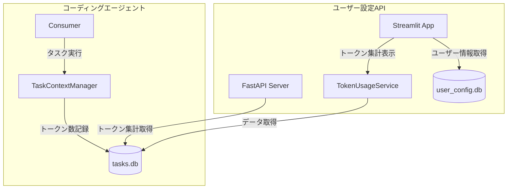

# ユーザー毎トークン使用量追跡機能 詳細設計仕様書

## 1. 概要

### 1.1 目的

本仕様書は、ユーザー毎の概算トークン数を追跡・表示する機能の詳細設計を定義します。contexts/tasks.dbに記録された各タスクの概算トークン数を集計し、ユーザーごとの今日・今週・今月のトークン使用量をダッシュボードに表示します。また、トークン数の履歴をグラフとして可視化します。

### 1.2 主要機能

- **トークン数の記録**: 各タスク実行時のトークン使用量をデータベースに記録
- **期間別集計**: 今日・今週・今月のトークン使用量を集計
- **ダッシュボード表示**: ユーザーごとのトークン使用状況をメトリクスとして表示
- **履歴グラフ表示**: トークン使用量の時系列推移をグラフで可視化

### 1.3 対象ユーザー

- 一般ユーザー: 自身のトークン使用量を確認
- 管理者: 全ユーザーのトークン使用量を確認・管理

---

## 2. システムアーキテクチャ

### 2.1 構成図



### 2.2 データフロー

1. コーディングエージェントがタスク実行時にトークン数を計算
2. TaskContextManagerがtasks.dbにトークン数を記録
3. user_config_apiのTokenUsageServiceがtasks.dbからデータを集計
4. Streamlitダッシュボードが集計結果を表示

---

## 3. データベース設計

### 3.1 既存テーブル（tasks.db - tasksテーブル）

既存のtasksテーブルには以下のトークン関連フィールドが存在します：

- **uuid**: タスクの一意識別子（主キー）
- **user**: タスクを実行したユーザー名
- **total_tokens**: タスク全体の累計トークン数
- **created_at**: タスク作成日時
- **completed_at**: タスク完了日時
- **status**: タスクの状態

これらの既存フィールドを活用してトークン集計を行います。

### 3.2 新規テーブル（tasks.db - daily_token_summaryテーブル）

日次でのトークン集計を高速化するために、集計サマリーテーブルを新規作成します。

| カラム名 | 型 | 説明 |
|---------|------|------|
| id | INTEGER | 主キー、自動採番 |
| user | TEXT | ユーザー名 |
| date | TEXT | 集計日（YYYY-MM-DD形式） |
| total_tokens | INTEGER | 当日の合計トークン数 |
| task_count | INTEGER | 当日のタスク数 |
| created_at | TEXT | レコード作成日時 |
| updated_at | TEXT | レコード更新日時 |

#### インデックス

- idx_daily_summary_user_date: (user, date)の複合インデックス
- idx_daily_summary_date: (date)の単一インデックス

### 3.3 テーブル作成SQL

daily_token_summaryテーブル作成時に以下の処理を実行します：

1. テーブルが存在しない場合のみ作成
2. user, dateカラムの組み合わせに一意制約を設定（UNIQUE(user, date)）
3. 必要なインデックスを作成

テーブル作成時は以下の制約を適用します：
- NOT NULL制約: user, date, total_tokens, task_count, created_at, updated_at
- UNIQUE制約: (user, date)の組み合わせ
- DEFAULT値: total_tokens=0, task_count=0

---

## 4. サービス層設計

### 4.1 TokenUsageService クラス

トークン使用量の集計・取得を担当するサービスクラスを新規作成します。

#### 4.1.1 クラス配置

user_config_api/app/services/token_usage_service.py に配置します。

#### 4.1.2 主要メソッド

##### get_user_token_usage

指定ユーザーの期間別トークン使用量を取得します。

- 入力: ユーザー名
- 出力: 今日・今週・今月のトークン使用量を含む辞書
- 処理内容:
  1. tasks.dbに接続
  2. 今日の日付を基準に各期間の開始日を計算
  3. 各期間のトークン合計をSQLで集計
  4. 結果を辞書形式で返却

##### get_user_daily_history

指定ユーザーの日別トークン使用履歴を取得します。

- 入力: ユーザー名、取得日数（デフォルト30日）
- 出力: 日付とトークン数のリスト
- 処理内容:
  1. tasks.dbに接続
  2. 指定日数分の日別集計データを取得
  3. 欠損日を0で補完
  4. 日付順にソートして返却

##### get_all_users_token_usage

全ユーザーのトークン使用量を取得します（管理者用）。

- 入力: なし
- 出力: ユーザー毎の今日・今週・今月のトークン使用量リスト
- 処理内容:
  1. tasks.dbに接続
  2. 全ユーザーの期間別トークン使用量を集計
  3. ユーザー名でソートして返却

##### update_daily_summary

日次サマリーテーブルを更新します。

- 入力: なし
- 出力: 更新件数
- 処理内容:
  1. 前日以前の未集計データを特定
  2. tasksテーブルから日次集計を計算
  3. daily_token_summaryテーブルに挿入または更新

---

## 5. API設計

### 5.1 FastAPI エンドポイント

#### 5.1.1 ユーザートークン使用量取得

指定ユーザーのトークン使用量を取得します。

- **メソッド**: GET
- **パス**: /api/v1/token-usage/{username}
- **認証**: APIキー認証
- **レスポンス**: ユーザーの期間別トークン使用量

レスポンスには以下の情報を含みます：
- username: ユーザー名
- today: 今日のトークン使用量
- this_week: 今週のトークン使用量
- this_month: 今月のトークン使用量
- last_updated: 最終更新日時

#### 5.1.2 トークン使用履歴取得

指定ユーザーの日別トークン使用履歴を取得します。

- **メソッド**: GET
- **パス**: /api/v1/token-usage/{username}/history
- **パラメータ**: days（取得日数、デフォルト30）
- **認証**: APIキー認証
- **レスポンス**: 日別トークン使用量のリスト

レスポンスには以下の情報を含みます：
- username: ユーザー名
- history: 日付とトークン数のペアのリスト
- period_start: 期間開始日
- period_end: 期間終了日

#### 5.1.3 全ユーザートークン使用量取得（管理者用）

全ユーザーのトークン使用量サマリーを取得します。

- **メソッド**: GET
- **パス**: /api/v1/token-usage/summary
- **認証**: APIキー認証（管理者権限必要）
- **レスポンス**: 全ユーザーのトークン使用量リスト

---

## 6. UI設計

### 6.1 ダッシュボード表示

既存のダッシュボードページ（01_dashboard.py）にトークン使用量セクションを追加します。

#### 6.1.1 表示レイアウト

ダッシュボードの既存統計情報セクションの下に新しいセクションを追加します。

```
### トークン使用量

[今日]        [今週]        [今月]
  1,234        8,765        45,678
  トークン      トークン      トークン
```

#### 6.1.2 表示コンポーネント

Streamlitのst.metricコンポーネントを使用して以下を表示します：

1. 今日のトークン使用量
   - ラベル: 「今日のトークン」
   - 値: カンマ区切りの数値
   - delta: 前日比（オプション）

2. 今週のトークン使用量
   - ラベル: 「今週のトークン」
   - 値: カンマ区切りの数値
   - delta: 先週比（オプション）

3. 今月のトークン使用量
   - ラベル: 「今月のトークン」
   - 値: カンマ区切りの数値
   - delta: 先月比（オプション）

### 6.2 トークン使用履歴グラフ

ダッシュボードにトークン使用量の時系列グラフを追加します。

#### 6.2.1 グラフ仕様

- **グラフタイプ**: 折れ線グラフまたは棒グラフ（ユーザー選択可能）
- **X軸**: 日付
- **Y軸**: トークン数
- **表示期間**: 7日・30日・90日から選択可能
- **ライブラリ**: Streamlit標準のst.line_chartまたはst.bar_chart

#### 6.2.2 グラフ表示エリア

トークン使用量メトリクスの下にグラフ表示エリアを配置します。

```
### トークン使用量推移

[期間選択: 7日 | 30日 | 90日]  [グラフタイプ: 折れ線 | 棒]

[=====================グラフ表示エリア=====================]
```

#### 6.2.3 インタラクション

1. 期間選択ボタンでグラフの表示期間を切り替え
2. グラフタイプ選択でグラフの種類を切り替え
3. ホバー時にツールチップで詳細情報を表示

### 6.3 管理者向け機能

管理者ユーザー向けに全ユーザーのトークン使用状況を表示するセクションを追加します。

#### 6.3.1 ユーザー別トークン使用量テーブル

管理者がアクセスした場合、全ユーザーのトークン使用量を一覧表示します。

```
### 全ユーザートークン使用状況

| ユーザー名 | 今日 | 今週 | 今月 | 累計 |
|-----------|------|------|------|------|
| user1     | 1,234| 5,678| 23,456| 100,000|
| user2     | 567  | 2,345| 12,345| 50,000 |
```

#### 6.3.2 ユーザー選択によるグラフ表示

管理者は特定ユーザーを選択して、そのユーザーのトークン使用履歴グラフを表示できます。

---

## 7. トークン数計算ロジック

### 7.1 概算トークン数の計算方法

既存のMessageStoreで実装されているトークン推定ロジックを使用します。

#### 7.1.1 計算式

- 英語テキスト（ASCII文字のみ）: 文字数 ÷ 4
- 日本語テキスト（非ASCII文字）: 文字数 ÷ 2
- 混合テキスト: 以下のアルゴリズムで計算
  1. テキストを文字単位で走査
  2. ASCII文字（コードポイント0x00-0x7F）はASCIIカウントに加算
  3. 非ASCII文字（コードポイント0x80以上）は非ASCIIカウントに加算
  4. 推定トークン数 = (ASCIIカウント ÷ 4) + (非ASCIIカウント ÷ 2)
  5. 結果は小数点以下を切り上げて整数で返却

#### 7.1.2 トークン計上タイミング

以下のタイミングでトークン数を計上します：

1. ユーザーメッセージ送信時
2. LLM応答受信時
3. ツール実行結果受信時
4. システムプロンプト送信時（初回のみ）

### 7.2 TaskContextManagerでの記録

TaskContextManager.update_statisticsメソッドが呼び出された際に、tokensパラメータの値をtasks.dbのtotal_tokensフィールドに加算します。

---

## 8. 日次集計処理

### 8.1 集計バッチ処理

日次でトークン使用量を集計し、daily_token_summaryテーブルを更新するバッチ処理を実装します。

#### 8.1.1 実行タイミング

以下のいずれかで実行します：

1. ダッシュボードアクセス時（差分更新）
2. 定期バッチ実行（cronなど）
3. APIエンドポイント経由での手動実行

#### 8.1.2 集計ロジック

1. tasksテーブルからcompleted_atが指定日のレコードを抽出
2. ユーザー毎にtotal_tokensを合計
3. daily_token_summaryテーブルにUPSERT（存在すれば更新、なければ挿入）

#### 8.1.3 エッジケースの処理

- **未完了タスク（completed_at=NULL）**: 集計対象外とする。当日のリアルタイム集計時のみtasksテーブルから直接取得
- **日をまたぐタスク**: completed_atの日付を基準として集計する（開始日ではなく完了日で計上）
- **タスク失敗（status='failed'）**: 集計対象に含める（トークンは消費されているため）
- **ユーザー未設定（user=NULL）**: 'unknown'ユーザーとして集計

### 8.2 リアルタイム集計

ダッシュボード表示時には、当日分はtasksテーブルから直接集計し、過去分はdaily_token_summaryテーブルから取得します。これにより、当日の最新データとパフォーマンスの両立を実現します。

---

## 9. セキュリティ考慮事項

### 9.1 アクセス制御

- 一般ユーザーは自身のトークン使用量のみ閲覧可能
- 管理者は全ユーザーのトークン使用量を閲覧可能
- APIアクセス時は認証トークンでユーザーを識別

### 9.2 データベースアクセス

- tasks.dbは読み取り専用でアクセス
- daily_token_summaryへの書き込みは集計処理のみ
- SQLインジェクション対策としてパラメータ化クエリを使用

---

## 10. エラーハンドリング

### 10.1 データベース接続エラー

tasks.dbへの接続に失敗した場合の処理：

1. エラーをログに記録
2. ダッシュボードに「データ取得エラー」を表示
3. 3回までリトライを実行

### 10.2 データ不整合

トークン数が負の値になるなどの不整合が発生した場合：

1. 警告をログに記録
2. 不整合データを0として扱う
3. 管理者に通知（オプション）

---

## 11. パフォーマンス考慮事項

### 11.1 クエリ最適化

- 日次サマリーテーブルを活用して過去データのクエリを高速化
- 適切なインデックスを作成して検索性能を向上
- 不要なカラムの取得を避けてデータ転送量を削減

### 11.2 キャッシュ

- ダッシュボード表示データを短期キャッシュ（5分程度）
- 日次サマリーは日が変わるまでキャッシュ可能

---

## 12. テスト計画

### 12.1 単体テスト

- TokenUsageServiceの各メソッドのテスト
- 日付計算ロジックのテスト（週跨ぎ、月跨ぎ）
- SQLクエリの正確性テスト

### 12.2 結合テスト

- TaskContextManagerとtasks.dbの連携テスト
- APIエンドポイントのレスポンステスト
- Streamlit UIの表示テスト

### 12.3 負荷テスト

- 大量のタスクデータがある場合の集計性能
- 同時アクセス時のデータベース負荷

---

## 13. 関連ドキュメント

- [ユーザー設定Web仕様書（USER_CONFIG_WEB_SPECIFICATION.md）](USER_CONFIG_WEB_SPECIFICATION.md)
- [コンテキストストレージ実装仕様書（CONTEXT_STORAGE_IMPLEMENTATION.md）](CONTEXT_STORAGE_IMPLEMENTATION.md)
- [基本仕様（spec.md）](spec.md)

---

**文書バージョン:** 1.0  
**作成日:** 2024-11-28  
**ステータス:** 設計中
