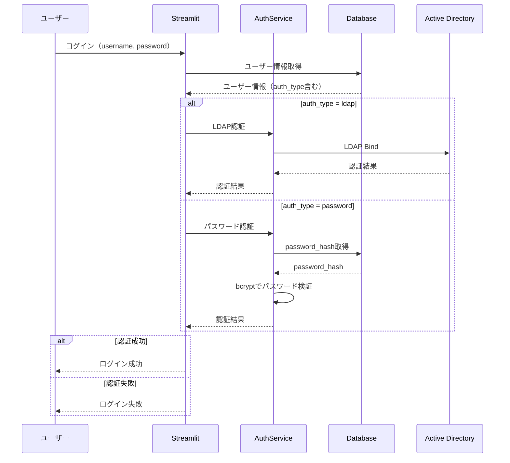
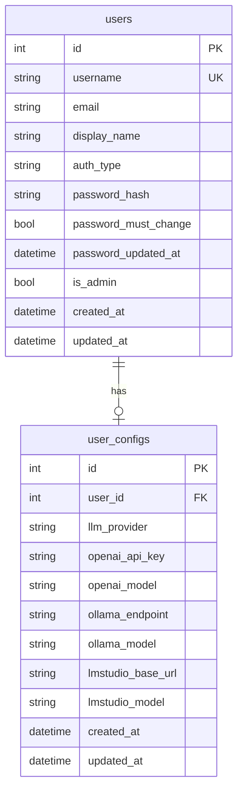
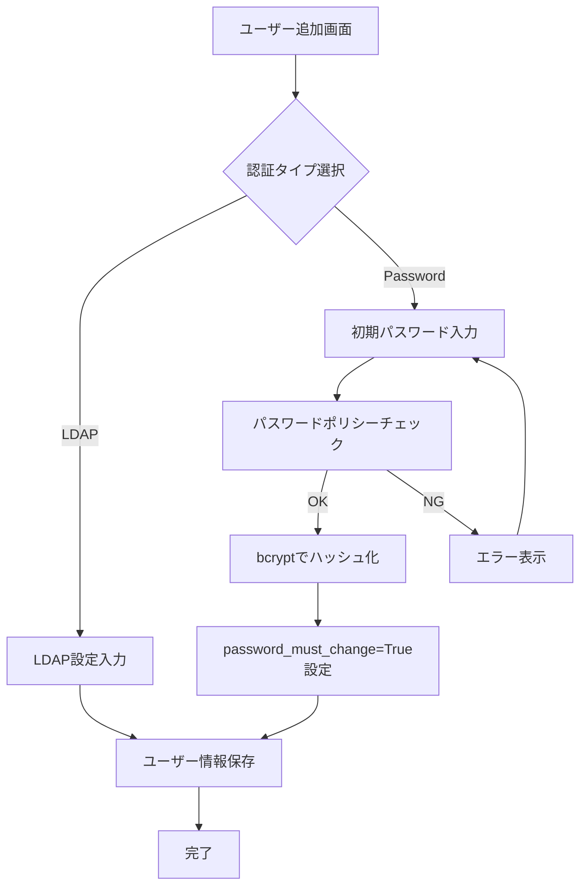
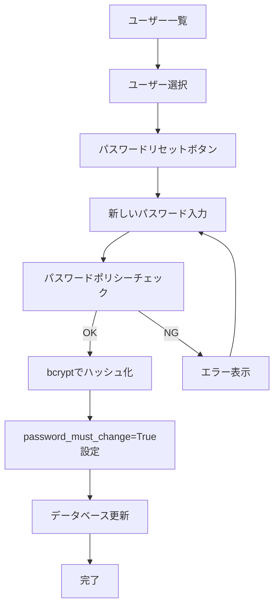
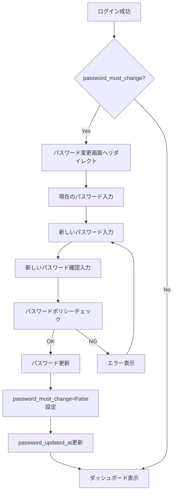
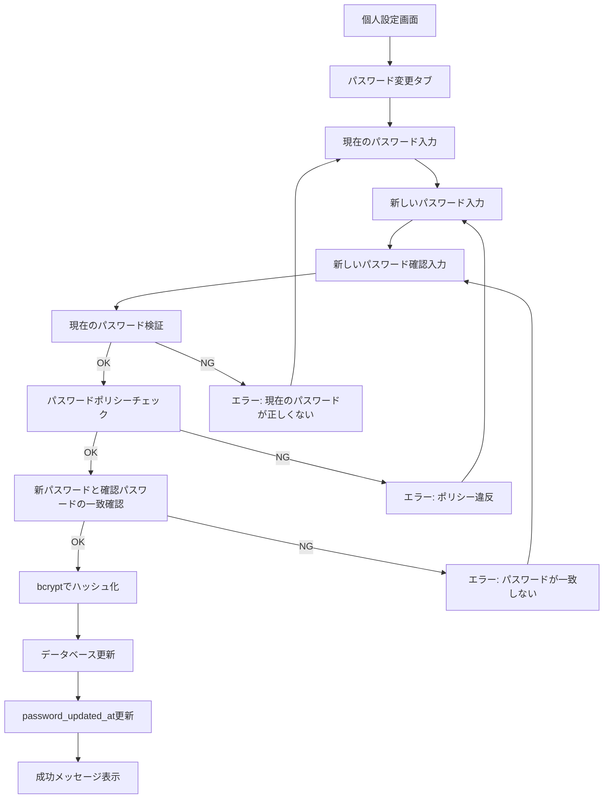
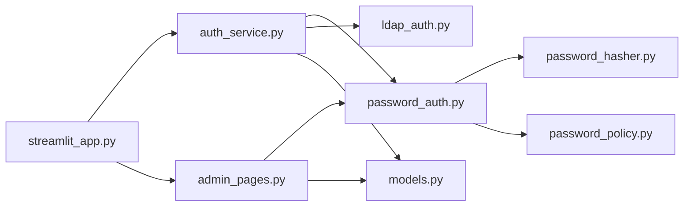

# ユーザー設定Web パスワード認証仕様書

## 1. 概要

### 1.1 目的

既存のLDAP認証に加えて、パスワードベースの認証機能を追加します。これにより、Active Directory環境がない場合でも、管理者が初期パスワードを設定し、ユーザーが後からパスワードを変更できるようになります。

### 1.2 追加機能

- **パスワード認証**: LDAP認証と並行して利用可能なパスワードベース認証
- **初期パスワード設定**: 管理者がユーザー作成時に初期パスワードを設定
- **パスワード変更**: ユーザーが自身のパスワードを変更
- **パスワードリセット**: 管理者がユーザーのパスワードを再設定
- **パスワードポリシー**: パスワードの複雑性要件の設定

---

## 2. 認証方式の選択

### 2.1 認証タイプ

各ユーザーに認証タイプを指定します：

- **ldap**: Active Directory / LDAP認証を使用
- **password**: パスワードハッシュによる認証を使用

### 2.2 認証フロー



### 2.3 認証方式の決定

ログイン時にユーザー名でユーザーを検索し、データベースに登録されている認証タイプに基づいて認証方法を決定します。

---

## 3. データベース拡張

### 3.1 テーブル構成



### 3.2 usersテーブルの追加カラム

既存のusersテーブルに以下のカラムを追加します：

- **auth_type**: 認証タイプ（"ldap"または"password"）
- **password_hash**: パスワードハッシュ（bcrypt形式、auth_typeがpasswordの場合のみ使用）
- **password_must_change**: 初回ログイン時のパスワード変更要求フラグ
- **password_updated_at**: パスワード最終更新日時

---

## 4. パスワード管理

### 4.1 パスワードハッシュ化

パスワードはbcryptアルゴリズムを使用してハッシュ化して保存します。

- **ハッシュアルゴリズム**: bcrypt
- **ワークファクター**: 12（設定可能）
- **ソルト**: bcryptが自動生成

### 4.2 パスワードポリシー

config.yamlで以下のポリシーを設定可能にします：

- **最小文字数**: デフォルト8文字
- **英大文字要求**: デフォルト有効
- **英小文字要求**: デフォルト有効
- **数字要求**: デフォルト有効
- **特殊文字要求**: デフォルト任意

### 4.3 パスワード検証

パスワード設定・変更時に以下をチェックします：

- パスワードポリシーへの準拠
- 既存パスワードとの一致確認（変更時）
- 新パスワードと確認パスワードの一致

---

## 5. 管理者機能

### 5.1 ユーザー追加時のパスワード設定

管理者がユーザーを追加する際の処理フロー：



管理者は以下を設定します：

- ユーザー名
- メールアドレス
- 表示名
- 認証タイプ（LDAPまたはPassword）
- 初期パスワード（認証タイプがPasswordの場合）
- 管理者権限フラグ

初期パスワード設定時の動作：

- パスワードポリシーに準拠しているか検証
- bcryptでハッシュ化して保存
- password_must_changeフラグをTrueに設定（初回ログイン時に変更を促す）

### 5.2 パスワードリセット

管理者がユーザーのパスワードをリセットする処理フロー：



パスワードリセット機能：

- 管理者のみが実行可能
- 対象ユーザーの認証タイプがpasswordである必要がある
- 新しいパスワードを設定してハッシュ化
- password_must_changeフラグをTrueに設定
- password_updated_atを更新

---

## 6. ユーザー機能

### 6.1 初回ログイン時のパスワード変更

password_must_changeフラグがTrueの場合の処理フロー：



初回ログイン時の動作：

- password_must_changeフラグをチェック
- Trueの場合、強制的にパスワード変更画面を表示
- パスワード変更が完了するまで他の画面にアクセス不可
- 変更完了後、フラグをFalseに更新

### 6.2 パスワード変更

ユーザーが任意にパスワードを変更する処理フロー：



パスワード変更機能：

- 個人設定画面のパスワード変更タブで実施
- 認証タイプがpasswordのユーザーのみ利用可能
- 現在のパスワードを正しく入力する必要がある
- 新しいパスワードはポリシーに準拠する必要がある
- 新しいパスワードと確認用パスワードが一致する必要がある
- 変更成功後、password_updated_atを更新

---

## 7. Streamlit画面設計

### 7.1 ログイン画面

既存のログイン画面に変更はありません。ユーザー名とパスワードを入力してログインします。
認証方式の判定は内部で自動的に行われます。

### 7.2 ユーザー管理画面（管理者用）

#### 7.2.1 ユーザー追加画面

追加される入力項目：

- **認証タイプ**: ラジオボタン（LDAP / Password）
- **初期パスワード**: パスワード入力フィールド（認証タイプがPasswordの場合のみ表示）
- **初期パスワード確認**: パスワード入力フィールド（認証タイプがPasswordの場合のみ表示）

表示される情報：

- パスワードポリシーの説明（最小文字数、要求される文字種など）

#### 7.2.2 ユーザー編集画面

追加される機能：

- **パスワードリセット**: ボタン（認証タイプがPasswordの場合のみ表示）
  - クリックすると、新しいパスワード入力ダイアログを表示
  - パスワードリセット実行後、password_must_changeがTrueに設定される旨を通知

#### 7.2.3 ユーザー一覧画面

表示カラムに追加：

- **認証タイプ**: ldapまたはpasswordを表示
- **パスワード更新日**: password_updated_at（認証タイプがPasswordの場合のみ）

### 7.3 個人設定画面（全ユーザー用）

#### 7.3.1 パスワード変更タブ

認証タイプがpasswordのユーザーにのみ表示される新しいタブ：

入力項目：

- **現在のパスワード**: パスワード入力フィールド
- **新しいパスワード**: パスワード入力フィールド
- **新しいパスワード（確認）**: パスワード入力フィールド
- **変更ボタン**: パスワード変更を実行

表示される情報：

- パスワードポリシーの説明
- 最終パスワード更新日時

#### 7.3.2 強制パスワード変更画面

password_must_changeがTrueの場合に表示される画面：

- ダッシュボードや他の画面へのアクセスをブロック
- パスワード変更フォームを表示
- 警告メッセージ「初回ログインのため、パスワードを変更してください」
- 変更完了まで他の画面に遷移できない

---

## 8. FastAPI拡張

### 8.1 新規エンドポイント

既存のFastAPIサーバーに以下のエンドポイントは追加しません。
FastAPIサーバーは設定取得のみを担当し、認証機能はStreamlitサーバーが担当します。

---

## 9. 設定ファイル拡張

### 9.1 config.yamlの追加項目

user_config_apiセクションに以下を追加します：

#### password_auth

- **enabled**: パスワード認証機能の有効/無効（デフォルト: true）
- **min_length**: パスワード最小文字数（デフォルト: 8）
- **require_uppercase**: 英大文字を必須とするか（デフォルト: true）
- **require_lowercase**: 英小文字を必須とするか（デフォルト: true）
- **require_digit**: 数字を必須とするか（デフォルト: true）
- **require_special**: 特殊文字を必須とするか（デフォルト: false）
- **bcrypt_rounds**: bcryptのワークファクター（デフォルト: 12）

### 9.2 設定例

```yaml
user_config_api:
  enabled: true
  fastapi_port: 8080
  streamlit_port: 8501
  database_url: "sqlite:///./user_config.db"
  encryption_key: "your-encryption-key"
  
  ad_auth:
    enabled: true
    server: "ldap://ad.example.com"
    domain: "EXAMPLE"
    base_dn: "DC=example,DC=com"
    user_filter: "(sAMAccountName={username})"
  
  password_auth:
    enabled: true
    min_length: 8
    require_uppercase: true
    require_lowercase: true
    require_digit: true
    require_special: false
    bcrypt_rounds: 12
```

---

## 10. セキュリティ考慮事項

### 10.1 パスワードストレージ

- パスワードは必ずbcryptでハッシュ化して保存
- 平文パスワードをログに出力しない
- データベースバックアップ時もハッシュ化されたまま

---

## 11. データマイグレーション

### 11.1 既存データベースの更新

既存のusersテーブルに新しいカラムを追加するマイグレーション処理：

1. auth_typeカラムを追加（デフォルト値: "ldap"）
2. password_hashカラムを追加（NULL許可）
3. password_must_changeカラムを追加（デフォルト値: False）
4. password_updated_atカラムを追加（NULL許可）

### 11.2 既存ユーザーの扱い

既存のユーザーは自動的にauth_type="ldap"として扱われます。
管理者が必要に応じて認証タイプをpasswordに変更し、初期パスワードを設定できます。

---

## 12. 実装モジュール構成

### 12.1 新規・修正ファイル

#### 新規モジュール

- **user_config_api/auth/password_auth.py**: パスワード認証ロジック
- **user_config_api/auth/password_policy.py**: パスワードポリシー検証
- **user_config_api/auth/password_hasher.py**: パスワードハッシュ化ユーティリティ

#### 修正モジュール

- **user_config_api/models.py**: usersテーブルにカラム追加
- **user_config_api/auth_service.py**: 認証タイプに応じた認証処理の分岐
- **user_config_api/streamlit_app.py**: UI拡張（パスワード設定・変更画面）
- **user_config_api/admin_pages.py**: 管理画面でのパスワード機能追加
- **user_config_api/migrations/**: データベースマイグレーションスクリプト

### 12.2 モジュール依存関係



---

## 13. テスト項目

### 13.1 パスワード認証テスト

- 正しいユーザー名とパスワードでログイン成功
- 間違ったパスワードでログイン失敗
- 存在しないユーザー名でログイン失敗
- auth_type="ldap"のユーザーでパスワード認証できないこと

### 13.2 パスワードポリシーテスト

- 最小文字数未満のパスワードが拒否される
- 大文字が含まれないパスワードが拒否される（require_uppercase=trueの場合）
- 小文字が含まれないパスワードが拒否される（require_lowercase=trueの場合）
- 数字が含まれないパスワードが拒否される（require_digit=trueの場合）
- ポリシーを満たすパスワードが受け入れられる

### 13.3 初期パスワード設定テスト

- 管理者がauth_type="password"のユーザーを追加できる
- 初期パスワード設定時にpassword_must_changeがTrueになる
- 設定したパスワードでログインできる

### 13.4 パスワード変更テスト

- ユーザーが自分のパスワードを変更できる
- 現在のパスワードが間違っている場合は変更できない
- 新パスワードと確認パスワードが一致しない場合は変更できない
- 変更後、新しいパスワードでログインできる
- 変更後、password_updated_atが更新される

### 13.5 強制パスワード変更テスト

- password_must_change=Trueの場合、ログイン後にパスワード変更画面が表示される
- パスワード変更が完了するまで他の画面にアクセスできない
- パスワード変更後、password_must_changeがFalseになる

### 13.6 パスワードリセットテスト

- 管理者がユーザーのパスワードをリセットできる
- リセット後、password_must_changeがTrueになる
- リセットされたパスワードでログインできる

---

## 14. 関連ドキュメント

- [USER_CONFIG_WEB_SPECIFICATION.md](USER_CONFIG_WEB_SPECIFICATION.md): 基本仕様
- [ユーザー管理API仕様](user_management_api_spec.md)

---

**文書バージョン:** 1.0  
**最終更新日:** 2026-03-07  
**ステータス:** 設計中
