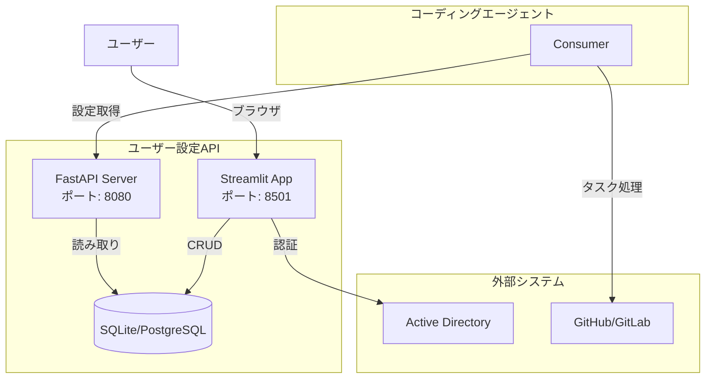
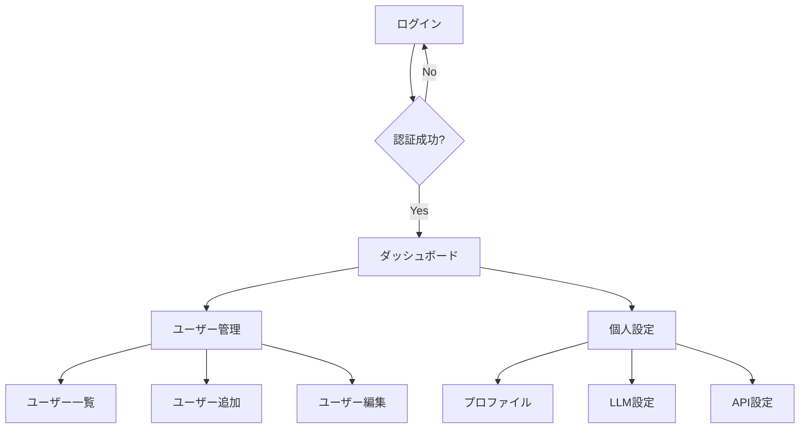
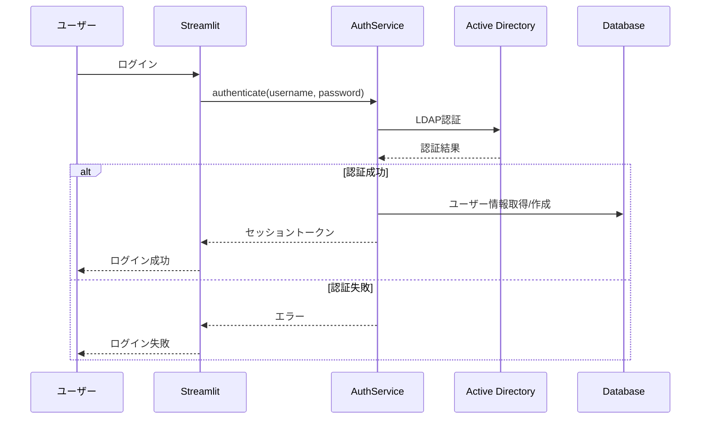
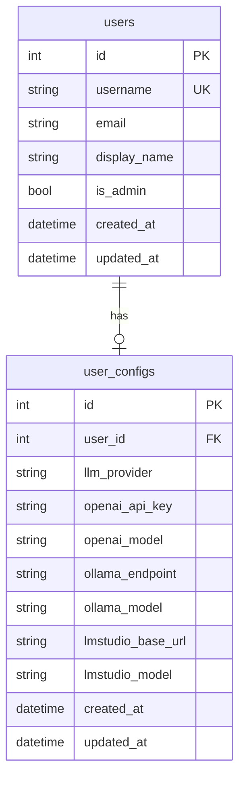
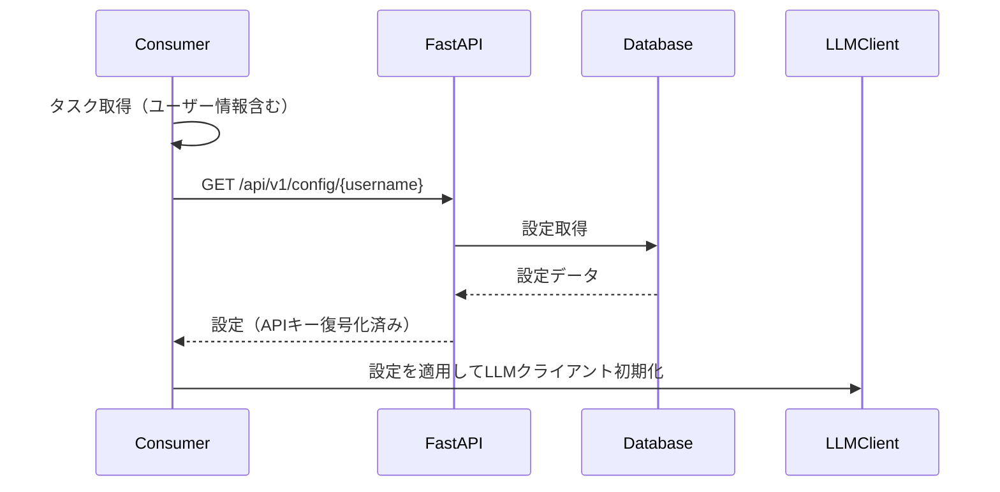

# ユーザー設定Web仕様書

## 1. 概要

### 1.1 目的

ユーザーごとにLLMのAPIキーやモデル設定を管理する機能を設計します。これにより、複数ユーザーが同一のコーディングエージェントを使用する際に、各ユーザーの設定を個別に管理できます。

### 1.2 主要機能

- **REST API**: コーディングエージェントからの設定取得
- **Streamlit管理画面**: ブラウザからの設定管理
- **Active Directory認証**: 企業環境での認証連携
- **データベース管理**: SQLAlchemyによる設定の永続化

---

## 2. システムアーキテクチャ

### 2.1 構成図

### 2.2 サービス構成

- **FastAPIサーバー（ポート8080）**: 設定取得API
- **Streamlitサーバー（ポート8501）**: 管理画面
- **データベース**: SQLite（開発）またはPostgreSQL（本番）

---

## 3. FastAPI サーバー

### 3.1 エンドポイント

#### 設定取得

ユーザー名を指定して設定を取得します。

- **メソッド**: GET
- **パス**: /api/v1/config/{username}
- **認証**: APIキー認証

#### ヘルスチェック

サーバーの状態を確認します。

- **メソッド**: GET
- **パス**: /health

### 3.2 レスポンス形式

設定取得APIは以下の情報を返します：

- **llm_provider**: LLMプロバイダー
- **openai_api_key**: OpenAI APIキー（暗号化解除済み）
- **openai_model**: OpenAIモデル
- **ollama_endpoint**: Ollamaエンドポイント
- **ollama_model**: Ollamaモデル
- **lmstudio_base_url**: LM StudioベースURL
- **lmstudio_model**: LM Studioモデル

---

## 4. Streamlit 管理画面

### 4.1 ページ構成

### 4.2 ダッシュボード

システムの概要情報を表示します：

- 登録ユーザー数
- アクティブセッション数
- システム状態

### 4.3 ユーザー管理

管理者がユーザーを管理する画面です：

- ユーザー一覧表示
- ユーザー追加
- ユーザー編集
- ユーザー削除

### 4.4 個人設定

ユーザーが自身の設定を管理する画面です：

- プロファイル編集
- LLM設定（プロバイダー、モデル選択）
- APIキー設定（暗号化保存）

---

## 5. Active Directory 認証

### 5.1 認証フロー

### 5.2 設定項目

config.yamlのad_authセクションで以下を設定します：

- **enabled**: AD認証の有効/無効
- **server**: ADサーバーアドレス
- **domain**: ADドメイン
- **base_dn**: ベースDN
- **user_filter**: ユーザー検索フィルター

---

## 6. データベース

### 6.1 テーブル構成

### 6.2 テーブル説明

#### usersテーブル

ユーザー情報を管理します：

- **id**: 主キー
- **username**: ユーザー名（一意）
- **email**: メールアドレス
- **display_name**: 表示名
- **is_admin**: 管理者フラグ
- **created_at**: 作成日時
- **updated_at**: 更新日時

#### user_configsテーブル

ユーザーごとの設定を管理します：

- **id**: 主キー
- **user_id**: ユーザーID（外部キー）
- **llm_provider**: LLMプロバイダー
- **openai_api_key**: OpenAI APIキー（暗号化）
- **openai_model**: OpenAIモデル
- **ollama_endpoint**: Ollamaエンドポイント
- **ollama_model**: Ollamaモデル
- **lmstudio_base_url**: LM StudioベースURL
- **lmstudio_model**: LM Studioモデル

---

## 7. セキュリティ

### 7.1 APIキー暗号化

APIキーはFernetを使用して暗号化して保存します。暗号化キーは環境変数または設定ファイルで管理します。

### 7.2 セッション管理

Streamlitのセッション管理機能を使用してユーザーセッションを管理します。セッションタイムアウトは設定可能です。

### 7.3 アクセス制御

- **FastAPI**: APIキー認証
- **Streamlit**: Active Directory認証またはローカル認証
- **管理機能**: 管理者ロールによるアクセス制御

---

## 8. 設定オプション

### 8.1 config.yamlの設定項目

user_config_apiセクションで以下を設定します：

- **enabled**: ユーザー設定API機能の有効/無効
- **fastapi_port**: FastAPIサーバーポート（デフォルト: 8080）
- **streamlit_port**: Streamlitサーバーポート（デフォルト: 8501）
- **database_url**: データベース接続URL
- **encryption_key**: APIキー暗号化キー

---

## 9. Docker Compose設定

### 9.1 サービス定義

docker-compose.ymlに以下のサービスを追加します：

#### user-config-api

- **イメージ**: プロジェクトのDockerfile
- **コマンド**: uvicornでFastAPIサーバーを起動
- **ポート**: 8080
- **ボリューム**: データベースファイル

#### user-config-web

- **イメージ**: プロジェクトのDockerfile
- **コマンド**: streamlit runでStreamlitアプリを起動
- **ポート**: 8501
- **ボリューム**: データベースファイル

---

## 10. コーディングエージェントとの連携

### 10.1 設定取得フロー

### 10.2 フォールバック

ユーザー設定が取得できない場合は、config.yamlのデフォルト設定を使用します。

---

## 11. 関連ドキュメント

- [ユーザー管理API仕様](user_management_api_spec.md)
- [基本仕様](spec.md)

---

**文書バージョン:** 2.0  
**最終更新日:** 2024-11-28  
**ステータス:** 実装済み
