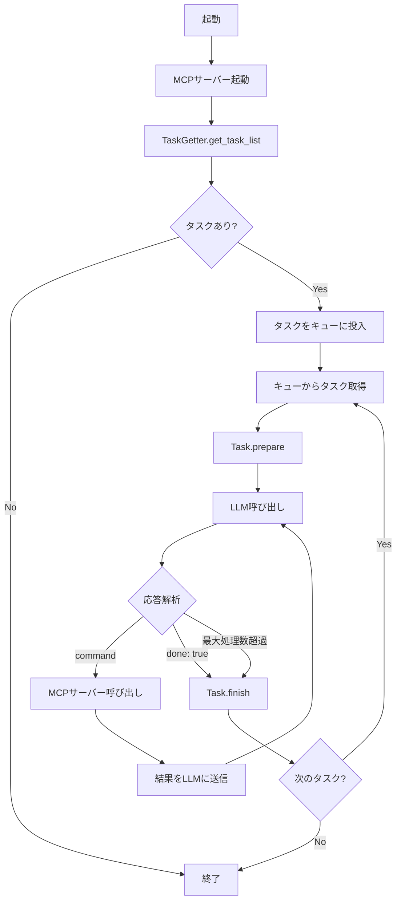
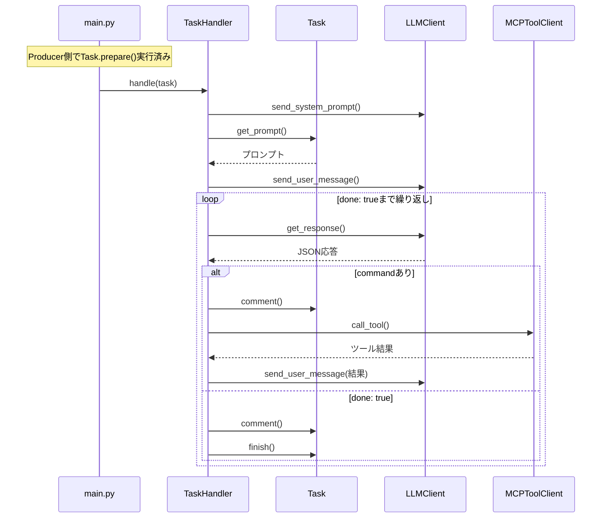

# ローカルコーディングエージェント仕様書

## 1. 概要

### 1.1 目的

GitHub Copilot Coding Agentのようなコーディングエージェントを作成します。将来的にはシステムプロンプトを変更することで、メール振り分けなど様々なタスクソースからタスクを取得してLLMで自動処理する汎用的なLLMエージェントを目指しています。

本バージョンでは、GitHubおよびGitLabにラベル付けされたIssue、Pull Request、Merge Requestをタスクとして処理するコーディングエージェントを作成します。

### 1.2 対応プラットフォーム

- **GitHub**: Issue、Pull Requestの処理
- **GitLab**: Issue、Merge Requestの処理

---

## 2. 動作環境

### 2.1 システム要件

- **OS**: macOS、Linux（Docker使用時はWindowsも対応）
- **言語**: Python 3.13以上
- **起動方法**: cron（定期実行）またはDocker Compose（継続動作）

### 2.2 依存関係

- Python標準ロガーを使用
- ログはファイルにのみ出力し、デイリーでローテーションして圧縮
- MCPサーバーはDockerでstdioモードで起動

---

## 3. 設定要件

### 3.1 LLMプロバイダー設定

設定ファイルのllm.providerで使用するプロバイダーを指定します。対応プロバイダーは以下の通りです：

- **lmstudio**: ローカルLLMサーバー
- **ollama**: ローカルLLM実行環境
- **openai**: OpenAI API

各プロバイダー固有の設定項目はllm.<provider>セクションに定義します。

### 3.2 MCPサーバー設定

任意のMCPサーバー（Model Context Protocol準拠）を対象とします。設定ファイルのmcp_servers配列でサーバーを定義します。

---

## 4. MCPクライアントの使用パターン

### 4.1 タスク取得用クライアント

TaskGetterクラスおよびその具象クラスで使用します。GitHub/GitLabからタスクを取得するために使用されます。

### 4.2 ツール実行用クライアント

MCPToolClientクラスでLLMからのcommand要求に応えるために使用します。設定ファイルからオブジェクトを生成し、LLMの応答に従って利用します。

MCPToolClientクラスはmcpライブラリのクライアントのラッパーとして実装し、非同期を同期に変換します。設定ファイルのmcp_servers配列のcommandに定義されたコマンドを起動して使用します。

---

## 5. 処理フロー

### 5.1 全体フロー図

### 5.2 基本フロー

1. **MCPサーバー起動**: 複数のMCPクライアントを起動し、辞書で管理
2. **タスク一覧取得**: TaskGetter.get_task_listでタスク一覧を取得
3. **タスクループ**: 各タスクに対して以下を実行

### 5.3 タスク処理フロー

**注意**: Task.prepare()はProducerモード（produce_tasks関数）でタスクをキューに追加する前に呼び出されます。TaskHandler.handle()内では呼び出されません。

1. **タスク準備（Producer側）**: produce_tasks関数内でTask.prepare()を呼び出してラベル付与などの準備処理を実行
2. **LLM呼び出し（Consumer側）**: システムプロンプトとTask.get_prompt()の内容でLLMを呼び出し
3. **応答処理ループ**: 以下をdone: trueが返るまで繰り返し
   - LLM応答のcommentフィールドでTask.comment()を呼び出し
   - command要求があればMCPサーバーを呼び出して応答を取得
   - MCPサーバーの応答をLLMに渡して次の応答を取得
4. **終了処理**: done: trueまたは最大処理数超過でTask.finish()を呼び出し

### 5.4 ツール呼び出しの形式

commandのtoolフィールドは「MCPサーバー名/ツール名」形式です。システムは設定ファイルのmcp_server_nameとマッチングして適切なサーバーにリクエストを送信します。

---

## 6. GitHub連携（TaskGetterFromGitHub）

### 6.1 タスク取得

get_task_listメソッドで、coding agentラベルが付いたIssue/Pull Requestを検索し、TaskGitHubIssueまたはTaskGitHubPullRequestオブジェクトのリストを作成します。

### 6.2 タスク準備

prepareメソッドで、タスクのcoding agentラベルを削除し、coding agent processingラベルを付与します。

### 6.3 プロンプト取得

get_promptメソッドで、Issue/Pull Requestの内容とコメントを取得してプロンプトとして提示します。

### 6.4 コメント記録

commentメソッドで、Issue/Pull Requestにコメントを記録します。

### 6.5 タスク終了

finishメソッドで、coding agent processingラベルを削除し、coding agent doneラベルを付与します。

---

## 7. GitLab連携（TaskGetterFromGitLab）

### 7.1 タスク取得

get_task_listメソッドで、coding agentラベルが付いたIssue/Merge Requestを検索し、TaskGitLabIssueまたはTaskGitLabMergeRequestオブジェクトのリストを作成します。

### 7.2 タスク準備

prepareメソッドで、タスクのcoding agentラベルを削除し、coding agent processingラベルを付与します。

### 7.3 プロンプト取得

get_promptメソッドで、Issue/Merge Requestの内容とコメントを取得してプロンプトとして提示します。

### 7.4 コメント記録

commentメソッドで、Issue/Merge Requestにコメントを記録します。

### 7.5 タスク終了

finishメソッドで、coding agent processingラベルを削除し、coding agent doneラベルを付与します。

---

## 8. LLM応答スキーマ

### 8.1 コマンド応答

LLMがツールを呼び出す場合の応答形式です。以下のフィールドを含みます：

- **command.comment**: コマンド実行の理由説明
- **command.tool**: 「MCPサーバー名/ツール名」形式のツール指定
- **command.args**: ツール固有のパラメータ

### 8.2 完了応答

タスク完了時の応答形式です。以下のフィールドを含みます：

- **done**: 真偽値でtrueを指定
- **comment**: 終了時のコメント

---

## 9. LLM応答のパース仕様

### 9.1 JSONパース

LLMからのレスポンスからJSON部分を探して処理します。JSON部分が見つからない場合はログを記録し、制御プログラムが再試行またはスキップを判断します。5回再試行してもエラーになる場合はIssueにエラーをコメントしてcoding agentラベルを削除します。

### 9.2 コマンド検出

レスポンスにcommandキーが存在すればツール呼び出し要求とみなします。commentフィールドの内容でTask.commentメソッドを呼び出し、command.toolとcommand.argsを抽出してMCPサーバーに送信します。

### 9.3 ツール出力受け渡し

MCPサーバーのoutputフィールドを取得し、次のLLM呼び出し時にprevious_outputとしてプロンプトに含めます。

### 9.4 完了判定

レスポンスにdone: trueが含まれる場合、処理を終了します。commentフィールドの内容をIssue/MRのコメントに追加します。

### 9.5 ループ継続

doneがtrueになるまで上記手順を繰り返します。

---

## 10. LLMアダプター

### 10.1 抽象クラス

LLMClient抽象クラスを定義し、以下のメソッドを必ず実装します：

- **send_system_prompt**: システムプロンプトを送信
- **send_user_message**: ユーザーメッセージを送信
- **get_response**: LLMからの応答を取得

### 10.2 呼び出しシーケンス

1. send_system_promptを呼び出し
2. 毎ターン：send_user_message → get_response
3. get_responseは内部で履歴にアシスタント応答を追加

### 10.3 プロバイダー別実装

- **LMStudioClient**: LM Studio APIを使用
- **OpenAIClient**: OpenAI Python SDKを使用
- **OllamaClient**: Ollama APIを使用

エージェントのLLM呼び出し部は、LLMClientの上記3メソッドのみを呼び出すことでプロバイダー差異を完全に吸収します。

---

## 11. LLMへの要求方法

各LLM呼び出し時には、以下の情報を連結してプロンプトに含めます：

- 直前に実行されたMCPコマンドとその引数
- MCPサーバーからの出力（整形済み）

---

## 12. システムプロンプト

### 12.1 概要

system_prompt.txtファイルにシステムプロンプトを定義します。MCPサーバーのsystem_promptフィールドの内容を統合して、テンプレート変数として埋め込みます。

### 12.2 動作ルール

LLMには以下のルールを伝えます：

1. 制御プログラムがJSONのcommandを解析し、MCPサーバーを呼び出す
2. ツール出力を受け取ったら、次のJSONコマンドを生成
3. タスク完了時はdone: trueを含むJSONを返す
4. ファイル拡張子からプロジェクト言語を推測し、適切にファイルを生成・修正

---

## 13. エラーハンドリング

### 13.1 再試行ポリシー

HTTP 5xxエラーなどの一時的なエラーに対しては3回リトライします。

### 13.2 エラー通知

失敗時はログに出力します。重大なエラーの場合はIssue/MRにエラーコメントを追加します。

---

## 14. 関連ドキュメント

- [クラス設計](class_spec.md)
- [コンテキストファイル化仕様](context_file_spec.md)
- [計画実行モード仕様](PLANNING_SPECIFICATION.md)
- [一時停止・再開機能仕様](PAUSE_RESUME_SPECIFICATION.md)

---

**文書バージョン:** 2.0  
**最終更新日:** 2024-11-28  
**ステータス:** 実装済み
